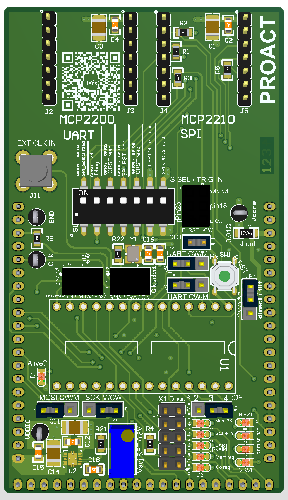

*Part of the PROACT board docs — start at [Home](Home.md).*

# PROACT ASIC — Evaluation & Side‑Channel Target Board

A ChipWhisperer **CW308 UFO** target board for the **PROACT** secure ASIC, hosting the chip in a
DIP‑28 socket (**U1**). Its UART / SPI / GPIO interfaces can be driven either from two on‑board
**USB bridge modules** (MCP2200 for UART, MCP2210 for SPI + GPIO) or from the ChipWhisperer CW308
platform for power / EM **side‑channel analysis** and fault injection — the routing is selected
entirely with jumpers. The chip clock can come from an **on‑board 50 MHz oscillator**, an
**external SMA input**, or the **ChipWhisperer**, and the 0.8 V core rail is **trimmable
(0.80 – 0.90 V)** and measured through a 0.01 Ω sense shunt.

> ⚠️ **Read [Getting-Started](Getting-Started.md) first — set Vcore to 0.8 V BEFORE inserting the
> chip.** The core rail is trimmable (0.80 – 0.90 V); trim it with the chip **out** of socket `U1`
> using the full procedure on that page.

## At a glance

| | |
|---|---|
| **Target device** | PROACT ASIC, 28‑pin DIP (socketed at **U1**) |
| **Host platform** | ChipWhisperer **CW308 UFO** (edge connectors **J7 / J8 / J9**) |
| **On‑board bridges** | **MCP2200** USB↔UART · **MCP2210** USB↔SPI+GPIO (plug‑in modules) |
| **Interfaces** | UART, SPI (`SIn`/`sck`/`SSel_n`), debug outputs, 4 reset lines, 3 trigger outputs + 1 trigger input |
| **Clock** | **J12** select: on‑board **Y1 50 MHz** (3‑4) · external **SMA J11** (1‑2) · **ChipWhisperer** (5‑6); the chip clock is **always echoed to the scope on `J7.5`** for synchronous sampling |
| **Core supply** | **TPS74801** LDO, **trimmable 0.80 – 0.90 V** (`R20`) — *set 0.8 V before inserting the chip*; delivered through **R7** 0.01 Ω sense shunt, optionally via the CW308 L‑C filter (**JP7**) |
| **I/O supply** | **VDDIO** 3.3 V from the CW308 rail |
| **Live monitoring** | **10 LEDs in 4 color groups** (alive · debug · spare‑in · resets) + `J1` monitor header + CW308 status LEDs |
| **Board size** | 53.9 mm × 93.3 mm |

The unifying idea of the board: **every PROACT interface signal can be sourced from the USB bridge
module _or_ from the ChipWhisperer**, chosen by a 3‑pin jumper whose **centre pin is always the
PROACT chip**. Silkscreen tags such as `Mosi M/CW` and `SCK M/CW` spell this out — **M** = module,
**CW** = ChipWhisperer.

## Documentation map

| Page | What's on it |
|------|--------------|
| [Getting-Started](Getting-Started.md) | Prerequisites, the **Vcore 0.8 V trim procedure** (do this first), inserting the chip, first sign of life, first UART contact |
| [Chip-Pinout](Chip-Pinout.md) | Full DIP‑28 pin table with routing destinations, the internal pull‑up map and the silkscreen‑name translation table |
| [Clock-System](Clock-System.md) | **J12** clock select (on‑board `Y1` 50 MHz · external SMA `J11` · ChipWhisperer) and the permanent clock echo on `J7.5` for synchronous sampling |
| [Power-and-SCA](Power-and-SCA.md) | Vcore generation and trim, **JP7** filtered‑vs‑direct routing, the **R7** 0.01 Ω shunt and the side‑channel measurement chain |
| [Jumpers-Switches-LEDs](Jumpers-Switches-LEDs.md) | Every jumper with its position table and card image, the **S1** DIP switch, all 10 LEDs with polarity notes |
| [CW308-Setup](CW308-Setup.md) | CW308 motherboard settings, board‑side settings for capture, typical configurations A / B / C |
| [USB-Bridge-Modules](USB-Bridge-Modules.md) | MCP2200 and MCP2210 pin‑mapping tables, `S1` GPIO read‑back, module powering rules |
| [BOM-and-Fab](BOM-and-Fab.md) | The full 27‑line bill of materials (JLCPCB part numbers) with purchase notes |
