<p align="center">
  
</p>

<h1 align="center">PROACT ASIC — Evaluation &amp; Side‑Channel Target Board</h1>

A ChipWhisperer **CW308 UFO** target board for the **PROACT** secure ASIC. The board hosts the
PROACT chip in a DIP‑28 socket and lets you drive its UART / SPI / GPIO interfaces either from
two on‑board **USB bridge modules** (MCP2200 for UART, MCP2210 for SPI + GPIO) **or** from the
ChipWhisperer CW308 platform for power / EM **side‑channel analysis** and fault injection — the
routing is selected entirely with jumpers. The chip clock can come from an **on‑board 50 MHz
oscillator**, an **external SMA input**, or the **ChipWhisperer**, and the 0.8 V core rail is
**trimmable (0.80 – 0.90 V)** and measured through a 0.01 Ω sense shunt.

<p align="center">
<sub>🔎 <a href="https://abolfazlsajadi.github.io/PROACT/PCB/">Interactive board wiki</a> — clickable board map with a live jumper simulator · 📖 <a href="Doc/wiki/Home.md">wiki pages</a> · 📄 <a href="Doc/PROACT_Board_Reference.pdf">PDF reference</a></sub></p>

<p align="center">
  
  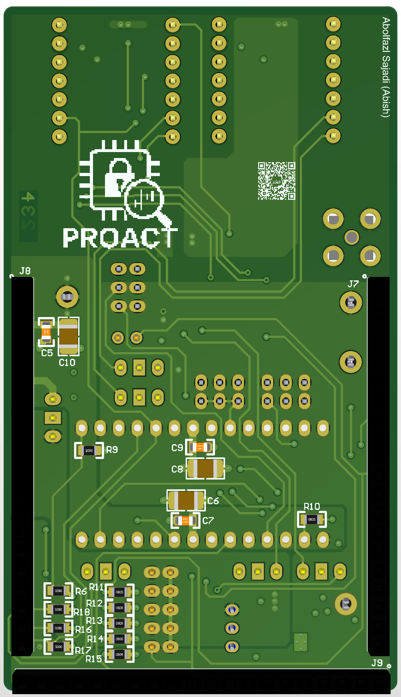
</p>

---

## The board as manufactured

Automated optical inspection (AOI) scans of an assembled board, **serial 0010**, taken at the
assembly house on 13 August 2026. These are the boards in service on the bench — the green cast
and the panel rails at the edges are artefacts of the AOI scanner, not of the board itself.

<table align="center">
<tr>
<td width="50%" align="center">
  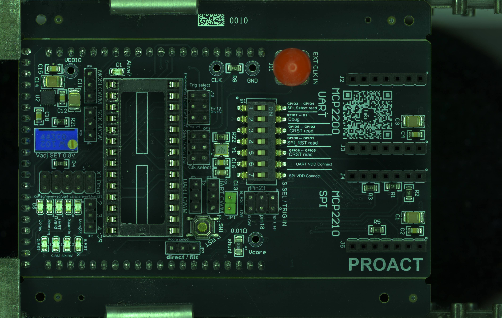
  <br><em><b>Top</b> — DIP‑28 socket for the ASIC (centre), <code>S1</code> read‑back DIP switch and the
  MCP2200 / MCP2210 module headers (right), <code>R20</code> Vcore trimmer and <code>R7</code> 0.01&nbsp;Ω sense
  shunt (left and bottom), <code>J11</code> external‑clock SMA (top right)</em>
</td>
<td width="50%" align="center">
  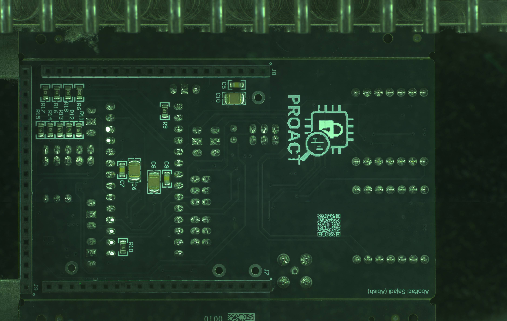
  <br><em><b>Bottom</b> — CW308 edge connectors <code>J7</code>/<code>J8</code>/<code>J9</code>, the LED series
  resistors <code>R11</code>–<code>R18</code> and the supply decoupling <code>C5</code>–<code>C10</code>.
  <code>J8</code> carries the <code>SHUNTH</code>/<code>SHUNTL</code> current‑sense pair</em>
</td>
</tr>
</table>

---

## Table of contents

- [The board as manufactured](#the-board-as-manufactured)
- [At a glance](#at-a-glance)
- [Board tour](#board-tour)
- [System architecture &amp; signal routing](#system-architecture--signal-routing)
- [PROACT chip pinout (DIP‑28)](#proact-chip-pinout-dip-28)
- [Configuration jumpers](#configuration-jumpers)
- [Clock system](#clock-system)
- [Core voltage (Vcore): set 0.8 V before inserting the chip](#core-voltage-vcore-set-08v-before-inserting-the-chip)
- [S1 DIP switch (read‑back &amp; power enables)](#s1-dip-switch-read-back--power-enables)
- [Connectors &amp; headers](#connectors--headers)
- [LEDs](#leds)
- [Test points](#test-points)
- [Power &amp; current‑sense architecture](#power--current-sense-architecture)
- [ChipWhisperer CW308 setup](#chipwhisperer-cw308-setup)
- [USB bridge modules](#usb-bridge-modules)
- [Typical configurations](#typical-configurations)
- [Bill of materials](#bill-of-materials)
- [How this document was produced](#how-this-document-was-produced)

---

## At a glance

| | |
|---|---|
| **Target device** | PROACT ASIC, 28‑pin DIP (socketed at **U1**) |
| **Host platform** | ChipWhisperer **CW308 UFO** (edge connectors **J7 / J8 / J9**) |
| **On‑board bridges** | **MCP2200** USB↔UART · **MCP2210** USB↔SPI+GPIO (plug‑in modules) |
| **Interfaces** | UART, SPI (`SIn`/`sck`/`SSel_n`), debug outputs, 4 reset lines, 3 trigger outputs + 1 trigger input |
| **Clock** | **J12** select: on‑board **Y1 50 MHz** (3‑4) · external **SMA J11** (1‑2) · **ChipWhisperer** (5‑6); the chip clock is **always echoed to the scope on `J7.5`** for synchronous sampling |
| **Core supply** | **TPS74801** LDO, **trimmable 0.80 – 0.90 V** (`R20`) — *set 0.8 V before inserting the chip*; delivered through **R7** 0.01 Ω sense shunt, optionally via the CW308 L‑C filter (**JP7**) |
| **I/O supply** | **VDDIO** 3.3 V from the CW308 rail |
| **Live monitoring** | **10 LEDs in 4 color groups** (alive · debug · spare‑in · resets) + `J1` monitor header + CW308 status LEDs |
| **Board size** | 53.9 mm × 93.3 mm |

The unifying idea of the board: **every PROACT interface signal can be sourced from the USB bridge
module _or_ from the ChipWhisperer**, chosen by a 3‑pin jumper whose **centre pin is always the
PROACT chip**. Silkscreen tags such as `Mosi M/CW` and `SCK M/CW` spell this out — **M** = module,
**CW** = ChipWhisperer.

---

## Board tour

**Placement view** — every component located on the board outline, straight from the final
`PCB1.PcbDoc` placement data.

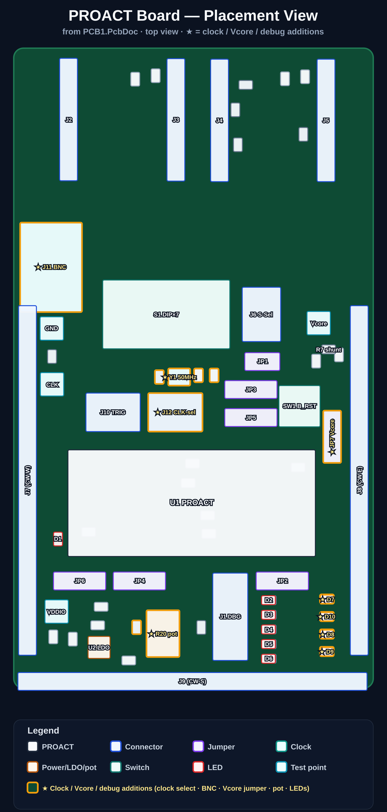

<details>
<summary>Silkscreen labelling mockup (what the white print means)</summary>

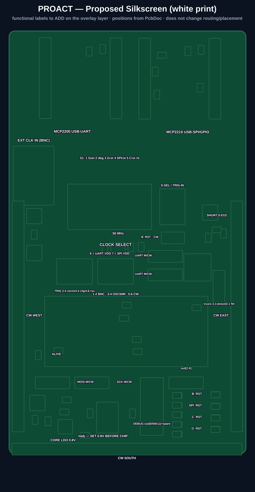
</details>

<table>
<tr>
<td width="50%"><br><em>Top side — final board (CAD render, full silkscreen)</em></td>
<td width="50%"><br><em>Bottom side — PROACT logo &amp; CW308 edge connectors (CAD render)</em></td>
</tr>
</table>

---

## System architecture &amp; signal routing

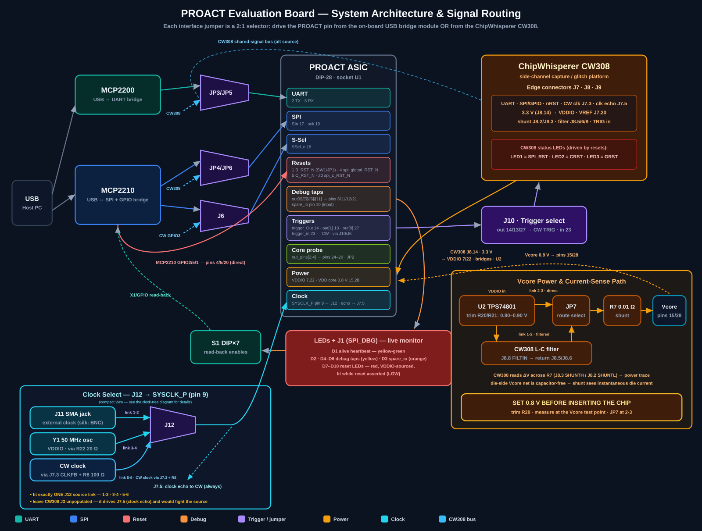

**Reading the diagram**

- **Two masters, one target.** The PROACT chip in the centre can be talked to by the USB bridge
  modules (left) or by the ChipWhisperer CW308 (right). The purple **jumper "muxes"** pick which.
- **UART** (`JP3` / `JP5`) routes PROACT `TX` (pin 2) and `RX` (pin 3) to the MCP2200 module or the
  CW308 (`J7.8` / `J7.7`).
- **SPI** (`JP4` = `sck` pin 19, `JP6` = `SIn` pin 17) and **S‑Sel** (`J6` = `SSel_n` pin 18) route
  to the MCP2210 module or the CW308.
- **Resets** come from MCP2210 GPIO or the button: `B_RST_N` (pin 1, `SW1`/`JP1`),
  `spi_global_RST_N` (pin 4, GPIO2), `C_RST_N` (pin 5, GPIO5), `spi_c_RST_N` (pin 20, GPIO1).
  The three GPIO resets also drive the CW308's status LEDs, and all four light a **red LED
  (D7–D10) while asserted**.
- **Debug outputs** `out_pins[0]/[5]/[6]/[11]` (pins 6, 11, 12, 21) light the yellow LEDs
  **D2/D4/D5/D6**, appear on header **J1** and the CW308 south header, and can be read back into
  the MCP2210 through the **S1** DIP switch. `spare_io` (pin 10) is a user‑drivable input with the
  orange LED **D3**.
- **Triggers** (`trigger_Out` 14, `out_pins[1]` 13, `out_pins[8]` 27) are selected on **J10** and
  fed to the CW308 `TRIG` input; `trigger_in` (pin 23) can be driven from CW308 GPIO3 via `J6`.
- **Clock**: `SYSCLK_P` (pin 9) is fed from the **J12** clock select — on‑board 50 MHz `Y1`,
  external SMA `J11`, or the ChipWhisperer (link 5‑6) — and is always echoed to the scope on
  `J7.5` for **synchronous sampling**.
- **Power / measurement**: CW308 3.3 V → `VDDIO`; the **U2** LDO makes the trimmable 0.8 V core
  rail, which reaches the chip through **JP7** (direct or via the CW308 filter) and the **R7**
  shunt; the CW308 measures the drop across R7 to capture the power trace.

---

## PROACT chip pinout (DIP‑28)

Socket **U1**. Pin 1 is top‑left with the package notch up. Colours group pins by function.
`IN·PU` = input with internal pull‑up.

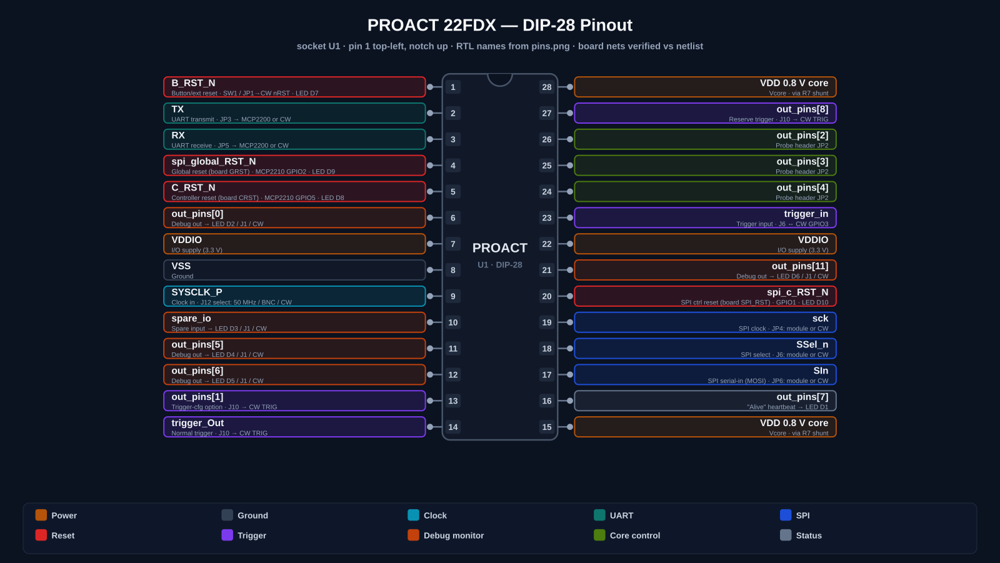

| Pin | Signal | Dir | Function | Routing / destination |
|:---:|--------|:---:|----------|-----------------------|
| 1  | `B_RST_N`     | IN·PU | Button / external reset (active low) | `SW1`; `R9` 10 k pull‑up; `JP1` → CW308 `nRST`; red LED **D7** |
| 2  | `TX`          | OUT | UART transmit | `JP3` → MCP2200 `RX` **or** CW308 (`J7.8`) |
| 3  | `RX`          | IN  | UART receive  | `JP5` → MCP2200 `TX` **or** CW308 (`J7.7`) |
| 4  | `spi_global_RST_N` | IN·PU | Global reset (board net `GRST`) | MCP2210 GPIO2; CW308 LED3; red LED **D9** |
| 5  | `C_RST_N`     | IN·PU | Controller reset (board net `CRST`) | MCP2210 GPIO5; CW308 LED2; red LED **D8** |
| 6  | `out_pins[0]` | OUT | Debug output | yellow LED **D2** · `J1.9` · `J9.20` |
| 7  | `VDDIO`       | PWR | I/O supply | 3.3 V |
| 8  | `VSS`         | GND | Ground | — |
| 9  | `SYSCLK_P`    | IN  | Chip clock | from **J12** clock select · `CLK` test point · `J7.5` |
| 10 | `spare_io`    | IN  | Spare input (user‑driven) | orange LED **D3** · `J1.7` · `J9.19` |
| 11 | `out_pins[5]` | OUT | Debug output | yellow LED **D4** · `J1.5` · `J9.18` |
| 12 | `out_pins[6]` | OUT | Debug output | yellow LED **D5** · `J1.3` · `J9.17` |
| 13 | `out_pins[1]` | OUT | Trigger (config) | `J10` (3‑4) → CW308 `TRIG` |
| 14 | `trigger_Out` | OUT | Trigger (normal) | `J10` (2‑4) → CW308 `TRIG` |
| 15 | **`VDD` 0.8 V core** | PWR | Core supply | via **R7** shunt (with pin 28) |
| 16 | `out_pins[7]` | OUT | **Alive** heartbeat | yellow‑green LED **D1** (blinks = alive) |
| 17 | `SIn`         | IN  | SPI data in (MOSI) | `JP6` → MCP2210 **or** CW308 |
| 18 | `SSel_n`      | IN  | SPI select (active low) | `J6` → MCP2210 GPIO4 **or** CW308 GPIO3 |
| 19 | `sck`         | IN  | SPI clock | `JP4` → MCP2210 **or** CW308 |
| 20 | **`spi_c_RST_N`** | IN·PU | SPI‑controller reset (board net `SPI_RST`) | MCP2210 GPIO1; CW308 LED1; red LED **D10** |
| 21 | `out_pins[11]`| OUT | Debug output | yellow LED **D6** · `J1.1` · `J9.11` |
| 22 | `VDDIO`       | PWR | I/O supply | 3.3 V |
| 23 | `trigger_in`  | IN  | Trigger input | `J6.6` ← CW308 GPIO3 (link `J6` 5‑6) |
| 24 | `out_pins[4]` | OUT | IBEX PC probe (bit 4) | `JP2.3` |
| 25 | `out_pins[3]` | OUT | IBEX PC probe (bit 3) | `JP2.2` |
| 26 | `out_pins[2]` | OUT | IBEX PC probe (bit 2) | `JP2.1` |
| 27 | `out_pins[8]` | OUT | Trigger (reserve / software) | `J10` (4‑6) → CW308 `TRIG` |
| 28 | **`VDD` 0.8 V core** | PWR | Core supply | via **R7** shunt (with pin 15) |

> `out_pins[2]/[3]/[4]` on `JP2` expose bits 2–4 of the program counter of the **IBEX** RISC‑V
> soft‑core for probing. Note the index order is **reversed** with respect to the pin order
> (pin 24 = bit 4 … pin 26 = bit 2), matching the board silk `out[2:4]`.

---

## Configuration jumpers

Every 3‑pin routing jumper follows the same rule — **the centre pin is the PROACT chip**; jumper it
toward the module (**M**) to use the USB bridge, or toward **CW** to use the ChipWhisperer.

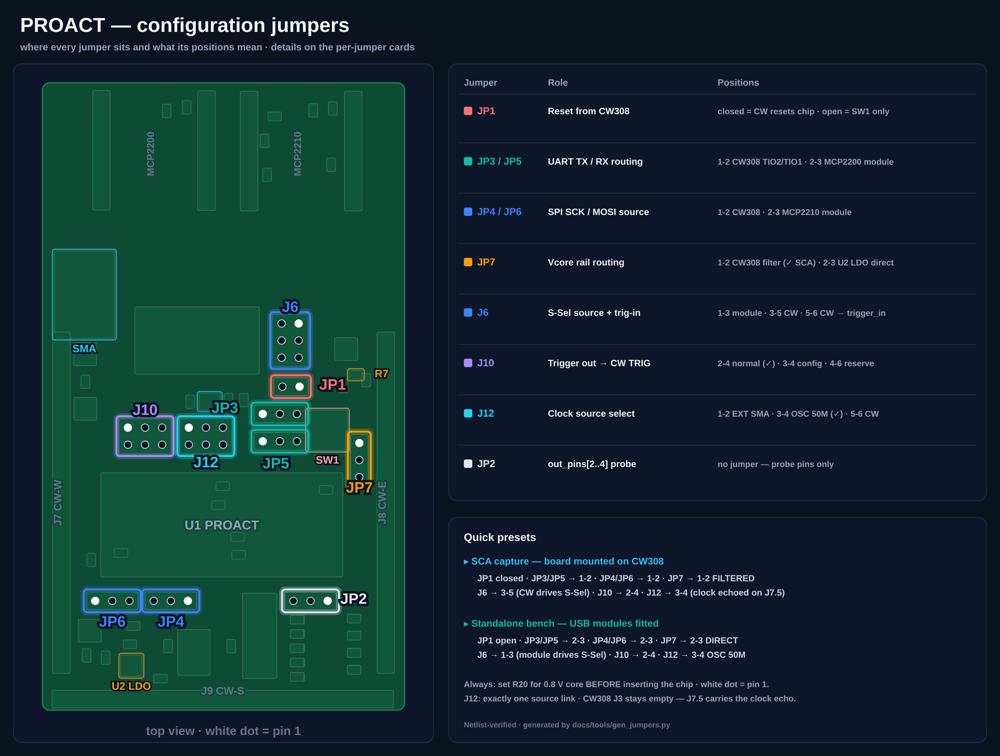

| Jumper | Centre = PROACT | Position **M** (module) | Position **CW** (ChipWhisperer) |
|--------|-----------------|-------------------------|---------------------------------|
| **JP3** | `TX` (pin 2)  | 2‑3 → MCP2200 `RX` | 1‑2 → CW308 `J7.8` |
| **JP5** | `RX` (pin 3)  | 2‑3 → MCP2200 `TX` | 1‑2 → CW308 `J7.7` |
| **JP4** | `sck` (pin 19) | 2‑3 → MCP2210 `SCK` | 1‑2 → CW308 `J7.12` |
| **JP6** | `SIn` (pin 17) | 2‑3 → MCP2210 `MOSI` | 1‑2 → CW308 `J7.14` |

<p align="center">
  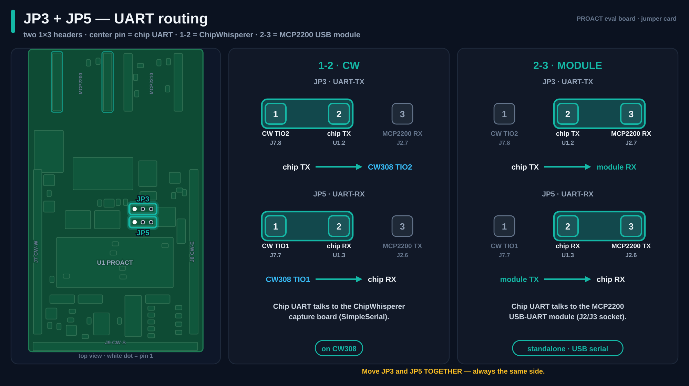
  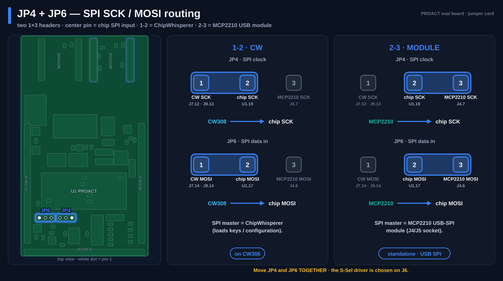
</p>

**Two‑pin, probe and special jumpers**

| Jumper | Type | Function |
|--------|------|----------|
| **JP1** | 1×2 | Close to tie PROACT `B_RST_N` (pin 1) to the CW308 `nRST` line. Leave open to reset only from `SW1`. |
| **JP2** | 1×3 | Probe header for IBEX PC bits — `out_pins[2]/[3]/[4]` (chip pins 26/25/24). No jumper fitted. |
| **JP7** | 1×3 | **Vcore route**: `1‑2` = core rail through the **CW308 L‑C filter** · `2‑3` = **direct** from the LDO. See [Core voltage](#core-voltage-vcore-set-08v-before-inserting-the-chip). |
| **J12** | 2×3 | **Clock source select** (`1‑2` SMA · `3‑4` osc · `5‑6` ChipWhisperer). See [Clock system](#clock-system). |

<p align="center">
  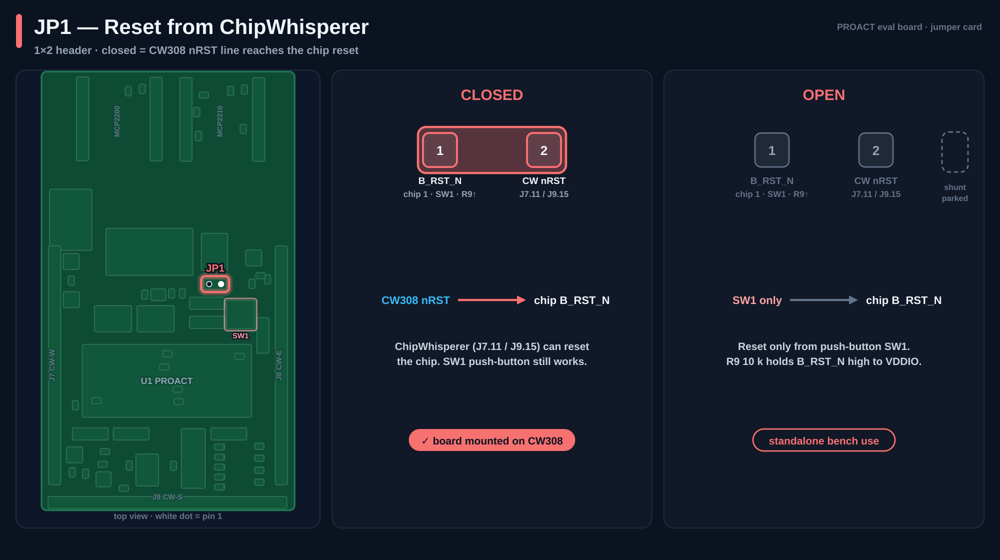
  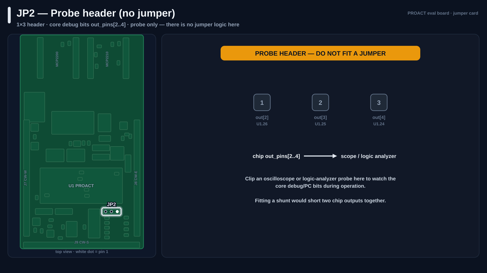
</p>

**`J6` — S‑Sel &amp; trigger‑input block (2×3):** selects the source of PROACT `SSel_n` (pin 18) and
can route the PROACT trigger input (pin 23) to the CW308.

| Link on `J6` | Effect |
|--------------|--------|
| **1‑3** | MCP2210 GPIO4 drives `SSel_n` (pin 18) — SPI select from the bridge module |
| **3‑5** | CW308 GPIO3 (`J7.9`) drives `SSel_n` (pin 18) — SPI select from the ChipWhisperer |
| **5‑6** | CW308 GPIO3 drives `trigger_in` (pin 23) |

**`J10` — trigger select (2×3):** pin 4 is the CW308 `GPIO4/TRIG` line (`J7.10`); jumper it to one
PROACT trigger source.

| Link on `J10` | Trigger source → CW308 `TRIG` |
|---------------|-------------------------------|
| **2‑4** | `trigger_Out` — normal trigger (pin 14) |
| **3‑4** | `out_pins[1]` — config trigger (pin 13) |
| **4‑6** | `out_pins[8]` — reserve / software trigger (pin 27) |

<p align="center">
  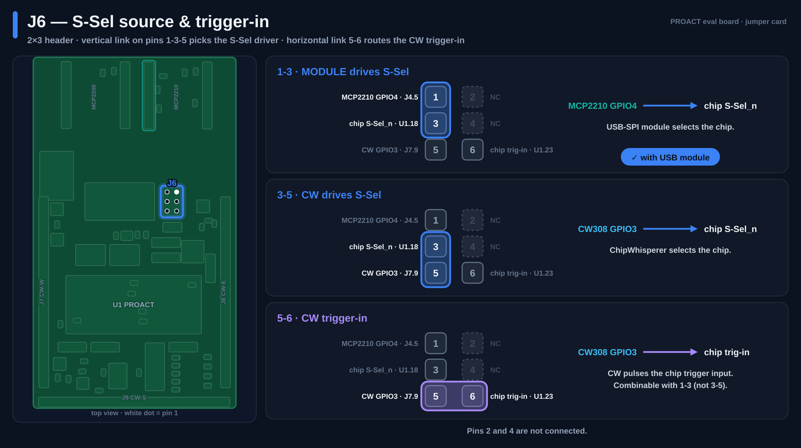
  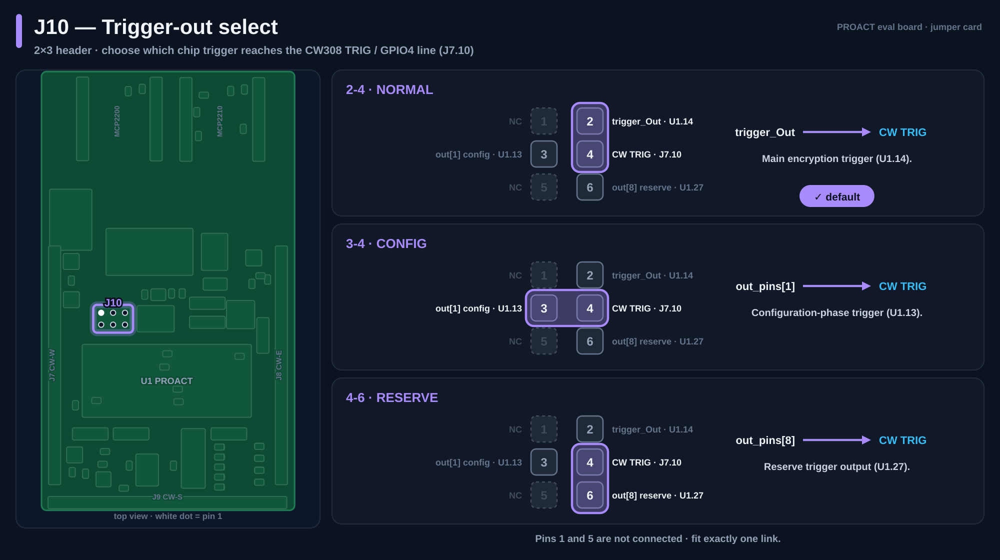
</p>

---

## Clock system

The chip clock `SYSCLK_P` (pin 9) can come from **three sources, selected on `J12`** (board silk:
`Clk select — SMA / Osc / Cw`), and is **always echoed to the ChipWhisperer on `J7.5`** so the
scope can sample synchronously with the target clock.

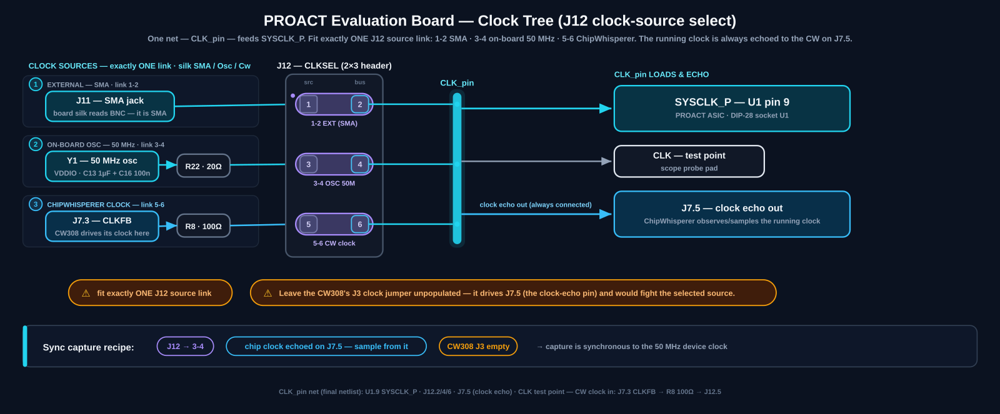

| Source | J12 link | Path |
|--------|:--------:|------|
| **On‑board 50 MHz** | **3‑4** | `Y1` oscillator → `R22` 20 Ω → chip clock |
| **External input** | **1‑2** | `J11` coaxial jack → chip clock. *The fitted connector is **SMA** (the board silk reads "BNC").* |
| **ChipWhisperer** | **5‑6** | CW clock arriving on `J7.3` (CW308 `CLKFB` line) → `R8` 100 Ω → chip clock |

**Clock echo — synchronous sampling.** The chip clock is **permanently wired to `J7.5`**, so the
ChipWhisperer side can always observe the running clock and lock its sampling to it — whatever the
selected source, with no extra jumper.

<p align="center">
  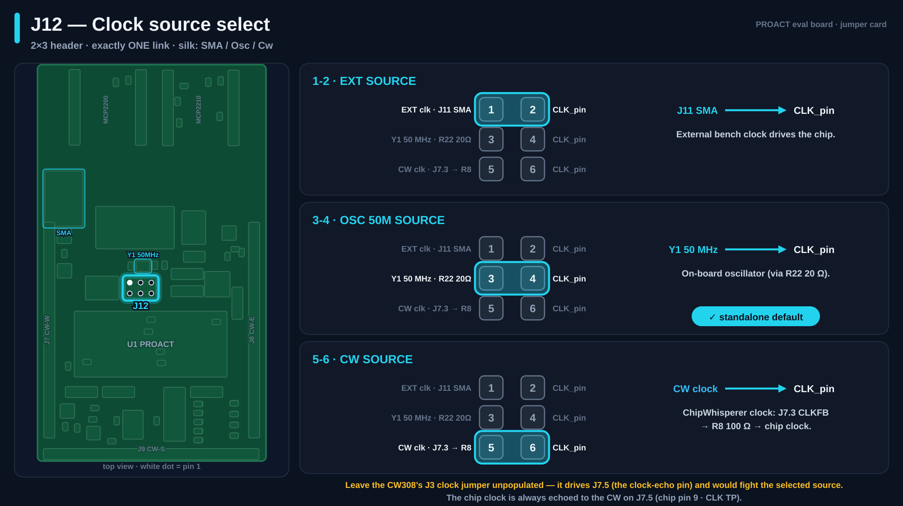
</p>

> ⚠️ **Rules**
> - Fit **exactly one** source link on `J12` (`1‑2`, `3‑4` *or* `5‑6`).
> - Leave the **CW308's `J3` clock jumper unpopulated** — it drives `J7.5` (the clock‑echo pin)
>   and would fight the selected source.
> - The `CLK` test point sits directly on the chip clock net for probing.

---

## Core voltage (Vcore): set 0.8 V before inserting the chip

The 0.8 V core rail is generated on‑board by the **U2 TPS74801** LDO and trimmed with the
multi‑turn potentiometer **R20**:

**V<sub>core</sub> = 0.8 V × (1 + R20 / 8.2 kΩ) → adjustable 0.80 – 0.90 V**

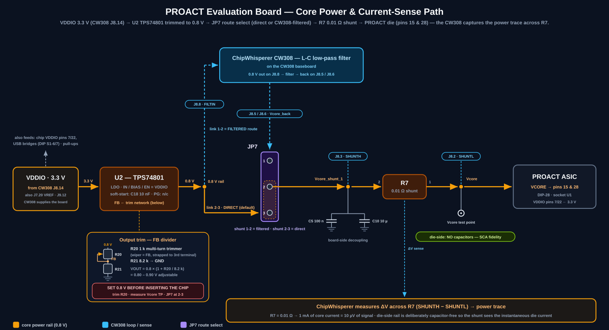

> ⚠️ **Do this before the chip ever meets the board:**
> 1. Leave the PROACT chip **out** of socket `U1`.
> 2. Set `JP7` to **2‑3** (direct).
> 3. Apply 3.3 V `VDDIO` (mount on the CW308, or feed the `VDDIO` test point on the bench).
> 4. Meter between the **`Vcore` test point** and `GND` (no load → no shunt drop).
> 5. Turn `R20` (multi‑turn) until the meter reads **0.800 V**.
> 6. Power down, insert the chip (notch up), power up and re‑check under load.

**`JP7` — core‑rail route**

| Link | Route | When to use |
|:----:|-------|-------------|
| **1‑2** | 0.8 V → `J8.8` (**FILTIN**) → **CW308 L‑C low‑pass filter** → back on `J8.5/6` → shunt | Side‑channel capture on the CW308 — the filter cleans the rail so the shunt sees the die, not supply noise |
| **2‑3** | 0.8 V → shunt, **direct** | Bench use off the CW308, or when you want the shortest supply path |

<p align="center">
  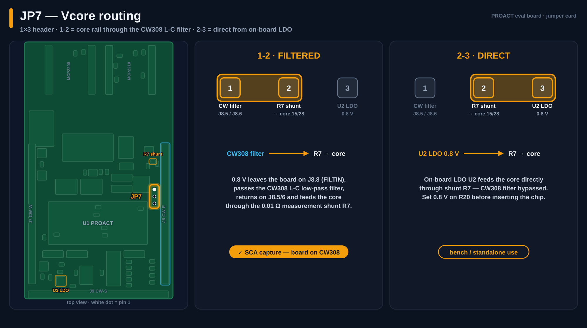
</p>

The die side of the shunt (net `Vcore`, chip pins **15** and **28**) is **deliberately
capacitor‑free**: decoupling sits *before* the shunt (`C5`/`C10`), so the instantaneous die current
flows through `R7` and appears in the power trace.

---

## S1 DIP switch (read‑back &amp; power enables)

`S1` is a 7‑position DIP switch. Switches **1–5** enable GPIO **read‑back** loops (so the USB host
can read the state of a signal it — or the chip — is driving); switches **6–7** power the two USB
bridge modules.

| Switch | Enables | Purpose |
|:------:|---------|---------|
| **1** | MCP2210 GPIO3 reads GPIO4 | Read back the **`SSel_n`** state |
| **2** | MCP2210 GPIO7 reads `X1` | Read back the **debug signal** selected on `J1` |
| **3** | MCP2210 GPIO8 reads GPIO2 | Read back the **global reset** (`spi_global_RST_N`) |
| **4** | MCP2210 GPIO0 reads GPIO1 | Read back the **SPI reset** (`spi_c_RST_N`) |
| **5** | MCP2210 GPIO6 reads GPIO5 | Read back the **controller reset** (`C_RST_N`) |
| **6** | MCP2200 `VDD` → 3.3 V | Power the **UART** bridge module |
| **7** | MCP2210 `VDD` → 3.3 V | Power the **SPI** bridge module |

---

## Connectors &amp; headers

| Ref | Type | Role |
|-----|------|------|
| **U1** | DIP‑28 socket | PROACT ASIC |
| **J1** | 2×5 male (`SPI_DBG`) | Debug‑signal monitor (see below) |
| **J2 / J3** | 1×7 male ×2 | **MCP2200** USB‑UART module socket |
| **J4 / J5** | 1×7 male ×2 | **MCP2210** USB‑SPI module socket |
| **J6** | 2×3 female | S‑Sel / trigger‑input routing |
| **J10** | 2×3 female | Trigger select |
| **J11** | coaxial jack | External clock input — **SMA** fitted (silk reads "BNC") |
| **J12** | 2×3 female | Clock source select (SMA / osc / CW) |
| **J7** | 1×20 female | CW308 **West** edge connector (clock · UART · SPI · GPIO · nRST) |
| **J8** | 1×20 female | CW308 **East** edge connector (power rails · shunt sense · filter loop · status LEDs) |
| **J9** | 1×20 female | CW308 **South** edge connector (debug taps · SPI · nRST) |

### `J1` — SPI_DBG signal monitor (2×5)

Each **odd** pin is a live PROACT debug signal; the adjacent **even** pin is the common `X1` line.
Fit a jumper across a row to route that signal onto `X1`, which the MCP2210 reads via **GPIO7**
(enable `S1‑2`). You can equally probe the odd pins directly.

| `J1` pin | Signal | PROACT pin | LED |
|:--------:|--------|:----------:|:---:|
| 9 | `out_pins[0]`  | 6  | D2 |
| 7 | `spare_io`     | 10 | D3 |
| 5 | `out_pins[5]`  | 11 | D4 |
| 3 | `out_pins[6]`  | 12 | D5 |
| 1 | `out_pins[11]` | 21 | D6 |
| 2,4,6,8,10 | `X1` common (→ MCP2210 GPIO7) | — | — |

### `J7` — CW308 West connector (clock &amp; control)

| `J7` pin | Net | Meaning |
|:--------:|-----|---------|
| 3  | `CLKFB` | ChipWhisperer clock **in** — selected by `J12` 5‑6, through `R8` 100 Ω |
| 5  | `CLKIN` | Chip clock **echo out** to the ChipWhisperer (always connected — keep CW308 `J3` unpopulated) |
| 7  | `TIO1` | UART toward chip `RX` (via `JP5` 1‑2) |
| 8  | `TIO2` | Chip `TX` toward the scope (via `JP3` 1‑2) |
| 9  | `GPIO3` | S‑Sel / trigger‑in source (via `J6`) |
| 10 | `GPIO4 / TRIG` | Trigger line (via `J10`) |
| 11 | `nRST` | Reset line (via `JP1`) |
| 12 / 14 | `SCK` / `MOSI` | SPI from the ChipWhisperer (via `JP4` / `JP6` 1‑2) |
| 20 | `VREF` | Level reference = board `VDDIO` |

### `J8` — CW308 East connector (power &amp; measurement)

| `J8` pin | Net | Meaning |
|:--------:|-----|---------|
| 2  | `Vcore` (SHUNT‑L) | Die side of the R7 sense shunt |
| 3  | `Vcore_shunt_1` (SHUNT‑H) | Supply side of the shunt |
| 5, 6 | `Vcore_back` | Filtered 0.8 V **returning** from the CW308 L‑C filter (used when `JP7` = 1‑2) |
| 8  | 0.8 V (FILTIN) | Core rail from the U2 LDO **into** the CW308 filter (used when `JP7` = 1‑2) |
| 11 | 1.2 V | CW308 rail (unused) |
| 12 | 1.8 V | CW308 rail (unused) |
| 13 | 2.5 V | CW308 rail (unused) |
| 14 | `VDDIO` (3.3 V) | I/O supply into the board |
| 15 | 5 V | CW308 rail (unused) |
| 18 | `SPI_RST` → **LED1** | CW308 status LED |
| 19 | `CRST` → **LED2** | CW308 status LED |
| 20 | `GRST` → **LED3** | CW308 status LED |

### `J9` — CW308 South connector (debug taps)

| `J9` pin | Net |
|:--------:|-----|
| 11 | `out_pins[11]` (pin 21) |
| 12 | `VDDIO` |
| 13 | `sck` — CW side of `JP4` |
| 14 | `SIn` — CW side of `JP6` |
| 15 | `nRST` (with `JP1`) |
| 17 | `out_pins[6]` (pin 12) |
| 18 | `out_pins[5]` (pin 11) |
| 19 | `spare_io` (pin 10) |
| 20 | `out_pins[0]` (pin 6) |

---

## LEDs

Ten on‑board LEDs in **four color groups**:

| LED(s) | Color | Signal (chip pin) | Lights when |
|:------:|-------|-------------------|-------------|
| **D1** | 🟢 yellow‑green | `out_pins[7]` — alive (16) | the heartbeat output is high — **blinking = chip alive** |
| **D2 / D4 / D5 / D6** | 🟡 yellow | `out_pins[0]/[5]/[6]/[11]` (6 / 11 / 12 / 21) | the debug output is **high** |
| **D3** | 🟠 orange | `spare_io` (10) | **you** drive the spare input high (it is an input — the chip never lights it) |
| **D7 / D8 / D9 / D10** | 🔴 red | `B_RST_N` (1) / `C_RST_N` (5) / `spi_global_RST_N` (4) / `spi_c_RST_N` (20) | the reset is **asserted** (line low) |

> 💡 **All four red LEDs on at once is normal during reset — it is not a fault.** They are wired
> from `VDDIO` through the LED into the reset line, so a low (active) reset lights them.

> 🏷️ **Matching the board print:** the silkscreen labels the LEDs as `D1` "Alive?",
> `D2` "Mem[23]", `D3` "Spare In", `D4` "UART Rvalid", `D5` "Mem req", `D6` "Co req";
> the reset LED block reads `B RST` · `SPI RST` · `C RST` · `G RST`.

**CW308 motherboard status LEDs** (driven by the reset lines through `J8.18/19/20`):

| CW308 LED | Signal |
|:---------:|--------|
| **LED1** | `spi_c_RST_N` — SPI reset |
| **LED2** | `C_RST_N` — controller reset |
| **LED3** | `spi_global_RST_N` — global reset |

---

## Test points

| Test point | Net | Use |
|-----------|-----|-----|
| **Vcore** | Core rail, die side | Trim target for the 0.8 V procedure; probe **high‑impedance only** — this node is deliberately capacitor‑free |
| **VDDIO** | 3.3 V I/O rail | Probe / feed the I/O supply |
| **CLK** | Chip clock (pin 9) | Observe the selected clock |
| **GND** | Ground | Scope / meter reference |
| **R7** | Shunt | 0.01 Ω current‑sense resistor with two probe holes for a differential probe |

---

## Power &amp; current‑sense architecture

```
 CW308 3.3 V (J8.14) ─────────────────────► VDDIO ─► PROACT pins 7, 22 · bridge modules · pull-ups
                                              │
                                              ▼
                     U2  TPS74801 LDO — trim R20/R21 → 0.80–0.90 V
                                              │
                          ┌─── JP7 1-2 ───────┤─── JP7 2-3 (direct) ──┐
                          ▼                                            │
              J8.8 FILTIN → CW308 L-C filter → J8.5/6 Vcore_back ──────┤
                                                                       ▼
                                    Vcore_shunt_1 (C5/C10 · J8.3 SHUNT-H)
                                                                       │
                                                            R7 0.01 Ω shunt
                                                                       │
                                      Vcore (die side · J8.2 SHUNT-L · no caps)
                                                                       ▼
                                                        PROACT core — pins 15, 28
```

- **`VDDIO` (3.3 V)** comes from the CW308 rail (`J8.14`) and supplies the PROACT I/O ring, the
  USB bridge modules (via `S1‑6/7`), the pull‑ups and the `U2` LDO. For USB‑only bench use off the
  ChipWhisperer, feed 3.3 V into the `VDDIO` test point instead.
- **`Vcore`** is trimmed with `R20` ([procedure above](#core-voltage-vcore-set-08v-before-inserting-the-chip))
  and routed by `JP7` — through the CW308 filter for capture, or direct for the bench.
- **Measurement.** `R7` is **0.01 Ω**, so 1 mA of core current is 10 µV across the shunt — use the
  ChipWhisperer low‑noise amplifier on the `MEAS` output, or a differential probe directly in the
  two `R7` probe holes.
- Decoupling: 10 µF + 100 nF pairs on `VDDIO` and on the supply side of the shunt; **none** on the
  die side (by design, for side‑channel fidelity).

---

## ChipWhisperer CW308 setup

**CW308 motherboard settings for this board**

| CW308 control | Set to | Why |
|---------------|--------|-----|
| **3.3 V rail** | On | Supplies `VDDIO` via `J8.14`. |
| **Filter input** | **Victim‑supplied (`FILTIN`)** | With `JP7` = 1‑2 the 0.8 V rail from `U2` goes through the CW308 L‑C filter and back. Do **not** drive it from `VADJ`. With `JP7` = 2‑3 the filter is out of the loop. |
| **`J3` clock jumper** | **Unpopulated** | `J3` drives `J7.5`, which carries the board's **clock echo** — fitting it would fight the selected clock source. The CW‑as‑source option is `J12` 5‑6, not `J3`. |
| **`VREF`** | From victim | Uses this board's `VDDIO` (3.3 V, `J7.20`) as the level reference. |
| **MEAS SMA → Capture** | Connect | Feeds the shunt voltage into the ChipWhisperer ADC (or a scope). |

**ChipWhisperer software notes**

- **UART direction is mirrored vs. the CW default:** the chip's `TX` arrives on **TIO2** and the
  chip's `RX` is driven from **TIO1** — configure `tio1 = serial_tx`, `tio2 = serial_rx`.
- **Synchronous sampling:** the chip clock is always available to the ChipWhisperer side on
  `J7.5` — sample from it for phase‑locked traces.

**Board‑side settings for capture**

- `JP3` `JP5` `JP4` `JP6` → **CW** (1‑2) so UART/SPI come from the ChipWhisperer.
- `J6` → 3‑5 (CW308 GPIO3 drives `SSel_n`); add 5‑6 to drive `trigger_in` instead/as needed.
- `J10` → pick the trigger fed to `TRIG` (**2‑4** normal · **3‑4** config · **4‑6** reserve).
- `J12` → pick the clock source (see [Clock system](#clock-system)).
- `JP7` → **1‑2** (filtered) for capture.
- `JP1` → closed if you want the CW308 `nRST` to reset the chip.
- `S1‑6` / `S1‑7` → off (the USB bridges stay idle and unpowered during capture).
- **Precondition:** `Vcore` already trimmed to 0.800 V.

---

## USB bridge modules

Two Microchip USB‑bridge break‑out modules plug into the 1×7 header pairs.

### MCP2210 — USB ↔ SPI + GPIO (sockets `J4` / `J5`)

| Module pin | Signal | Connected to |
|:----------:|--------|--------------|
| 1  | GPIO0 | reads GPIO1 (`spi_c_RST_N`) when `S1‑4` on |
| 2  | GPIO1 | `SPI_RST` → PROACT pin **20** (`spi_c_RST_N`) |
| 3  | GPIO2 | `GRST` → PROACT pin 4 (`spi_global_RST_N`) |
| 4  | GPIO3 | reads GPIO4 (`SSel_n`) when `S1‑1` on |
| 5  | GPIO4 | `SSel_n` → `J6` (1‑3) → PROACT pin 18 |
| 6  | MOSI  | `JP6` (2‑3) → PROACT pin 17 (`SIn`) |
| 7  | SCK   | `JP4` (2‑3) → PROACT pin 19 (`sck`) |
| 8  | MISO  | not connected |
| 9  | GPIO5 | `CRST` → PROACT pin 5 (`C_RST_N`) |
| 10 | GPIO6 | reads GPIO5 (`C_RST_N`) when `S1‑5` on |
| 11 | GPIO7 | reads `X1` debug bus (`J1`) when `S1‑2` on |
| 12 | GPIO8 | reads GPIO2 (`spi_global_RST_N`) when `S1‑3` on |
| 13 | GND   | ground |
| 14 | VDD   | 3.3 V when `S1‑7` on |

### MCP2200 — USB ↔ UART (sockets `J2` / `J3`)

| Module pin | Signal | Connected to |
|:----------:|--------|--------------|
| 6  | TX  | `JP5` (2‑3) → PROACT `RX` (pin 3) |
| 7  | RX  | `JP3` (2‑3) → PROACT `TX` (pin 2) |
| 14 | VDD | 3.3 V when `S1‑6` on |

---

## Typical configurations

**A. USB bench bring‑up (talk to PROACT from a PC, no ChipWhisperer)**

| Setting | Value |
|---------|-------|
| **Precondition** | `Vcore` trimmed to 0.800 V ([procedure](#core-voltage-vcore-set-08v-before-inserting-the-chip)) |
| `S1‑6`, `S1‑7` | **on** (power both bridge modules) |
| `S1‑1…5` | on as needed for GPIO read‑back |
| `JP3`, `JP5`, `JP4`, `JP6` | **M** (2‑3) |
| `J6` | **1‑3** (MCP2210 GPIO4 → `SSel_n`) |
| `J12` | **3‑4** (on‑board 50 MHz) |
| `JP7` | **2‑3** (direct) |
| `JP1` | open (reset via `SW1`) |
| `VDDIO` | feed 3.3 V into the `VDDIO` test point |

**B. ChipWhisperer capture, CW‑clocked**

| Setting | Value |
|---------|-------|
| Mount board on the **CW308** | — |
| `JP3`, `JP5`, `JP4`, `JP6` | **CW** (1‑2) |
| `J6` | **3‑5** (CW GPIO3 → `SSel_n`) |
| `J10` | choose trigger: **2‑4** normal · **3‑4** config · **4‑6** reserve |
| `J12` | **5‑6** (clock from the ChipWhisperer, via `J7.3`/`R8`) |
| CW308 `J3` | **unpopulated** |
| `JP7` | **1‑2** (through the CW308 filter) |
| `JP1` | closed (reset from CW308 `nRST`) if desired |
| `S1‑6`, `S1‑7` | off |

**C. Synchronous capture from the on‑board oscillator** *(flagship SCA setup)*

| Setting | Value |
|---------|-------|
| As configuration **B**, except: | |
| `J12` | **3‑4** (the on‑board `Y1` clocks the chip) |
| Scope clock | sample from the clock echoed on `J7.5` for phase‑locked traces |

---

## Bill of materials

27 line items (final BOM, JLCPCB part numbers).

| Ref(s) | Value | Description | Footprint | JLCPCB | Note |
|--------|-------|-------------|-----------|--------|------|
| C1, C3, C6, C8, C10, C11, C14 | 10 µF | Capacitor | 1210 | C77100 | |
| C2, C4, C5, C7, C9, C12, C15, C16 | 100 nF | Capacitor | 0805 | C1711 | |
| C13 | 1 µF | Capacitor (Y1 decoupling) | 0805 | C1848 | |
| C18 | 10 nF | Capacitor (LDO soft‑start) | 0805 | C1710 | |
| D1 | yellow‑green | LED — alive heartbeat | 0805 | C84257 | |
| D2, D4, D5, D6 | yellow | LED — debug outputs | 0805 | C84261 | |
| D3 | orange | LED — `spare_io` | 0805 | C84262 | |
| D7–D10 | red | LED — resets | 0805 | C84256 | |
| J1 | — | Header, male 2×5 | 2.54 mm | C492422 | |
| J2, J3, J4, J5 | — | Header, male 1×7 | 2.54 mm | C124418 | |
| J6, J10, J12 | — | Header, female 2×3 | 2.54 mm | C65114 | |
| J7, J8, J9 | — | Header, female 1×20 | 2.54 mm | C7434502 | |
| J11 | — | Coaxial jack, ext. clock | — | C20415804 | SMA jack; board silk reads "BNC" |
| JP1 | — | Jumper header 2‑pin | 2.54 mm | C86471 | |
| JP2–JP7 | — | Jumper header 3‑pin | 2.54 mm | C49257 | |
| R1–R5, R9 | 10 kΩ | Resistor | 0805 | C17414 | |
| R6, R8, R16, R17, R18 | 100 Ω | Reset LEDs (`R6`/`R16`–`R18`) · CW clock input (`R8`) | 0805 | C17408 | |
| R7 | 0.01 Ω | Current‑sense shunt | 1206 | C105362 | |
| R10–R15 | 560 Ω | LED resistors | 0805 | C25319 | |
| R20 | 1 kΩ | Multi‑turn trimmer (`Vcore` adjust) | — | C57089 | |
| R21 | 8.2 kΩ | `Vcore` feedback divider | 0805 | C17828 | |
| R22 | 20 Ω | Oscillator series resistor | 0805 | C17544 | |
| S1 | — | DIP switch, 7‑position | THT | C331508 | |
| SW1 | — | Tactile push‑button (`B_RST`) | 5×5 SMD | *TBC* | part number to be confirmed before ordering |
| U1 | — | DIP‑28 IC socket (PROACT) | DIP‑28 | C72121 | |
| U2 | — | TPS74801DRCR 1.5 A adjustable LDO | VSON‑10 | C105263 | |
| Y1 | 50 MHz | Clock oscillator, 3225 | 3225 | C2682781 | verify before ordering — this position requires an **active 3.3 V oscillator** |

---

## How this document was produced

Every signal name, pin number, and routing option in this document was **cross‑checked against the
actual board data**, not just transcribed:

- **Netlist** extracted from the final Altium schematic (`Sheet1.SchDoc`) by parsing pins, wires,
  junctions, net labels and power ports, then rebuilding the connectivity.
- **Chip signal names** from the PROACT pin map (`pins.png`) — the authority when sources disagree.
- **Component positions** in the placement views read directly from the final `PCB1.PcbDoc`
  (`Components6` stream).
- **BOM** from the final `bom.xlsx` export.
- **CW308 pin functions** from the ChipWhisperer CW308 UFO documentation.

Diagram sources (editable SVG) live in [`Doc/img/`](Doc/img/):
`architecture.svg`, `proact_pinout_v2.svg`, `clock_tree.svg`, `power_path.svg`,
`board_v2_placement.svg`, `board_v2_silkscreen.svg`, and the per‑jumper cards in
[`Doc/img/jumpers/`](Doc/img/jumpers/). The generator scripts are in
[`Doc/tools/`](Doc/tools/).
