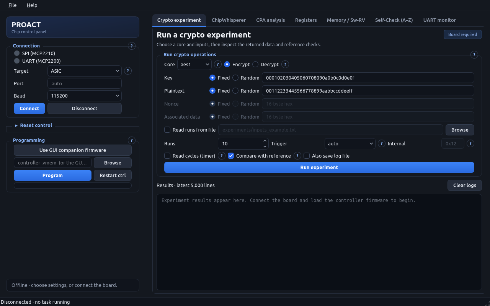

# PROACT

PROACT is an FPGA and 22 nm ASIC research platform with two Ibex processors,
AES1 (LUT S-box), AES2 (arithmetic S-box), ASCON, Xoodyak, configurable RNG,
Timer, UART and SPI peripherals. One processor serves host commands; the second,
Sw-RV, runs software workloads. This repository publishes platform documentation,
PCB material and the **1.1.0.dev1 host-software update**: the GUI, CLI, Python
library, setup tools and offline tests.

The public release does **not** include the complete RTL, firmware sources,
generated VMEM images, FPGA bitstream or reference capture datasets. Obtain
matching controller/Sw-RV images and the FPGA bitstream separately before using
the hardware workflows. Historical platform documents may describe those
separate design artifacts; see the [documentation index](docs/README.md).


Project website: [project-proact.nl](https://project-proact.nl/).

## Start with the software

Follow [installation](INSTALL.md) to create a repository-local environment, then
run these commands from the repository root:

```bash
./run_cli.sh doctor
./run_gui.sh
./tools/run_tests.sh
```

`doctor` reports Python packages and available files without opening or
enumerating devices. The GUI opens disconnected. The test suite uses fake
devices, temporary files and offscreen Qt.



The [illustrated practical guide](docs/ILLUSTRATED_GUIDE.md) explains the control
and measurement paths, ASIC/FPGA clocks, sample timing, capture workflow and
saved-file recovery with five diagrams and actual offline GUI views. The capture
page now offers **Review setup…** and distinguishes disconnected, working and
incomplete states. Reviewing settings does not access devices.
The [release report](reports/HOST_SOFTWARE_RELEASE.md) records integrated
validation, visual checks and the remaining limitations.

## What changed

| Area | Improvement | Where to inspect |
|---|---|---|
| GUI | One visible foreground job, elapsed status, responsive disconnect/close, bounded and batched logs, readable page guidance and smaller-window layouts | [GUI guide](docs/wiki/GUI-Guide.md) |
| CLI | `doctor --json`, early argument/file validation, reliable resource cleanup and interrupt exit status | [Current command reference](docs/CLI_REFERENCE.md) |
| Storage | Atomic checkpoints, owned input buffers, preserved row lengths, consistent container detection, optional streaming `.tracepack` files | [Storage guide](docs/STORAGE.md) |
| Libraries | Firmware validation before reset, line-specific parser errors, exact authentication-tag length checking, lazy heavy imports | [Migration notes](docs/MIGRATION.md) |
| Setup | Create or reuse a dedicated environment without deleting it or uninstalling global packages | [Installation](INSTALL.md) |
| Verification | Offline regressions, GUI renders, link checks and documented limitations | [Release report](reports/HOST_SOFTWARE_RELEASE.md) |

## Choose a workflow

- **Plan instrument settings offline:** [frequency/UART/trigger setup wizard and progress demo](Acquisition/README.md). Live acquisition integration is pending.
- **First use:** [start here](docs/START_HERE.md).
- **Learn with pictures:** [illustrated GUI/CLI guide](docs/ILLUSTRATED_GUIDE.md).
- **Script the board:** [Python API](Software/Python/README.md) and [CLI reference](docs/CLI_REFERENCE.md).
- **Understand a changed behavior:** [migration notes](docs/MIGRATION.md).
- **Save large datasets:** [storage formats and checkpoint semantics](docs/STORAGE.md).
- **Develop or verify changes:** [test guide](tests/README.md) and [maintenance workflow](skills/proact-host-maintenance/SKILL.md).
- **Understand the code:** [architecture and module map](docs/ARCHITECTURE.md).
- **Look up chip behavior:** [hardware overview](docs/wiki/Hardware-Overview.md), [address map](docs/address_map.md) and [hardware access rules](docs/hardware_hazards.md).
- **Inspect the evaluation board:** [PCB documentation](PCB/README.md).

The retained PDF manual and historical wiki pages describe the wider platform and earlier software revisions. The guides linked above govern this update. Offline host-software verification does not establish new CPA/TVLA results, a reduced trace count, a lower-noise board or successful operation of a particular connected device.

## License

PROACT-authored host software and documentation use Apache-2.0; see
[LICENSE](LICENSE). Retained third-party notices and hardware-component licensing
context are in [THIRD_PARTY_NOTICES.md](THIRD_PARTY_NOTICES.md).
