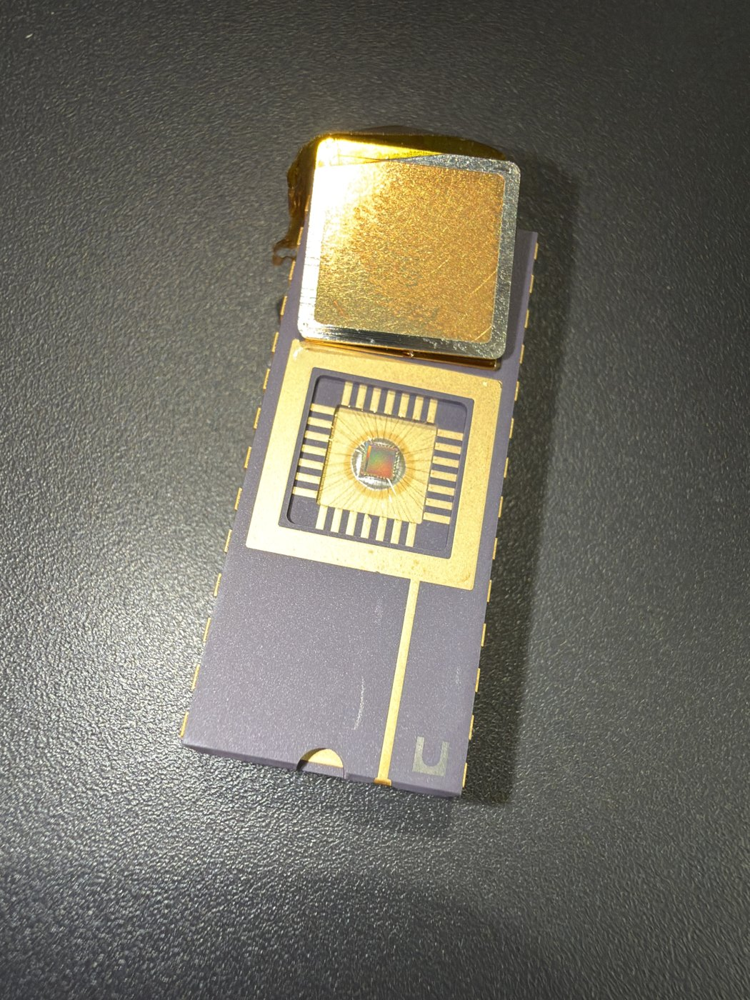

<p align="center">
  
</p>

<p align="center">


</p>

<p align="center">
<b><a href="docs/manual/proact_manual.pdf">📕&nbsp;PDF&nbsp;manual</a></b>&nbsp;·
<b><a href="https://github.com/abolfazlsajadi/PROACT_Design/wiki">📖&nbsp;Wiki</a></b>&nbsp;·
<b><a href="examples/">📓&nbsp;Tutorial&nbsp;notebook</a></b>&nbsp;·
<b><a href="docs/wiki/GUI-Guide.md">🖥️&nbsp;GUI</a></b>&nbsp;·
<b><a href="docs/wiki/CLI.md">⌨️&nbsp;CLI</a></b>&nbsp;·
<b><a href="Software/Python/README.md">🐍&nbsp;Python&nbsp;API</a></b>
</p>


> ### 📢 Staged release — more files coming soon
>
> This repository is being opened up in stages. **Public today:** the complete
> [documentation](docs/) and the [evaluation-board design](PCB/) — schematic,
> layout, board reference and photographs.
>
> The design and software sources (`ASIC/`, `FPGA/`, `Software/`, `examples/`,
> `datasets/`, `tests/`) are listed below and **will be published soon**; those
> directories currently hold a short placeholder note instead of their contents.
>
> Project page: <https://project-proact.nl/>

---

## What PROACT is

**PROACT is a dual-core RISC-V system-on-chip built to be attacked.** It places four
cryptographic engines — two hardware AES-128 cores and the lightweight authenticated
ciphers ASCON and Xoodyak — plus a second RISC-V core running *software* AES on one bus
behind a hardware capture trigger, so that the power a chip draws while it encrypts can be
recorded and analysed to measure how much of the secret key each implementation leaks.
The design was taped out on **GlobalFoundries 22FDX** in November 2025, and the *same RTL*
builds a **ChipWhisperer CW305** bitstream, so the same experiment runs on silicon or on
FPGA.

This repository is the **software platform** that makes the chip usable: the on-chip
firmware, a Python host library, a command-line tool, a graphical application, reference
power-trace datasets and the complete documentation. Knowledge of the hardware internals
is **not** required to operate it.

PROACT — *Physical Attack Resistance Of Cryptographic algorithms and circuits with reduced
Time to market* — is a research programme funded by the Dutch Research Council (**NWO**,
€1.8 M) and led by **Prof. Nele Mentens**; see [project-proact.nl](https://project-proact.nl/).

---

## Status: what works today

Everything below was measured, not estimated. The hardware column is a **CW305 FPGA build
driven by a ChipWhisperer Husky on Linux**, last validated **2026-08-07**.

| Area | State | Evidence |
|---|---|---|
| **CW305 FPGA bring-up** | Working end to end | A–Z self-check from the GUI: **16 pass / 0 fail / 0 skip**, including a real Husky trace capture |
| **All four crypto cores** | Match their reference vectors on-chip | `aes1`, `aes2` (encrypt KAT + hardware decrypt round-trip), `ascon`, `xoodyak` (encrypt KAT vs the reference vectors) |
| **Software AES on the 2nd core** | Matches the reference | `swrv` step of the A–Z check |
| **AES-128 KAT** | `69c4e0d86a7b0430d8cdb78070b4c55a` | the FIPS-197 vector, reproduced on the chip |
| **Trace capture** | Working | a fresh 40-trace campaign returned shape `(40, 33938)` — every row full length, every row valid |
| **Offline CPA** | **16/16 key bytes** on `aes1`, `aes2` *and* `swrv` | the reference datasets in [`datasets/`](datasets/) — **no board needed** |
| **Host test suite** | **1258 passed, 1 skipped, ~5 s** | `tools/run_tests.sh`; the skip is `h5py` not installed |
| **Bitstream** | `PROACT_top.bit`, part `7a100tftg256`, built 2026-08-07 | includes the corrected 50 MHz timing constraint |
| **Fabricated ASIC** | **Not tested yet** | the A–Z self-check is the intended screening procedure for it |
| **Windows / macOS** | **Not tested** | developed and validated on Linux only |

See [Verification status](#verification-status) for the full, itemised picture and the
open issues.

---

## Quick start

All commands are run **from the repository root**.

### 1. Install (once)

```bash
bash tools/setup_env.sh              # builds a dedicated venv at ~/.proact-venv
sudo bash tools/install_udev.sh      # Linux only: USB permissions -- then REPLUG the devices
```

`setup_env.sh` creates `~/.proact-venv` inheriting the system's heavy packages
(`chipwhisperer`, `PyQt6`, `hid`, `mcp2210`, `pyserial`), installs `proact_host` into it,
and verifies every import. Override the location with `PROACT_VENV=/path`.

> [!IMPORTANT]
> Always launch through **`./run_cli.sh`** / **`./run_gui.sh`**. They select the correct
> interpreter — a bare `python3` is frequently a pyenv shim that lacks PyQt6, hid,
> mcp2210 or chipwhisperer. And never run them under **`sudo`**: device access comes from
> the udev rules above, and running as root breaks the ChipWhisperer install (it lives
> under the invoking user's `~/.local`).

### 2. No board? Everything here still runs

A large part of this repository runs on a bare laptop with nothing plugged in — and it is
the fastest way to confirm the checkout is sound.

```bash
./tools/run_tests.sh                 # 1258 passed, 1 skipped, ~5 s -- no board, no network
./run_cli.sh info                    # address map, trigger bit, input clock
./run_cli.sh test                    # host protocol + AES reference + software ASCON/Xoodyak
```

Then run a **real side-channel attack** on the power traces shipped in
[`datasets/`](datasets/) — 6.8 MB of traces captured on the CW305, sized just above the
measured minimum for a full key:

```bash
./run_cli.sh cpa --core aes1         # -> RECOVERED 16/16 key bytes
./run_cli.sh cpa --core aes2         # -> RECOVERED 16/16 key bytes
./run_cli.sh cpa --core swrv         # -> RECOVERED 16/16 key bytes
```

With no `--capture` argument the CLI picks the matching reference file automatically. Add
`--plot out.png` for the correlation figure, or `--filter 1` to disable the low-pass and
watch `aes1` fall from 16/16 to 11/16. The standalone scripts
[`examples/cpa_lastround.py`](examples/) and
[`examples/cpa_swrv.py`](examples/) do the same in pure NumPy, readable
end to end, with no ChipWhisperer analyzer involved.

### 3. Build the firmware

Needs a bare-metal RV32 toolchain (`riscv32-unknown-elf-gcc`) and `srec_cat` on `PATH`:

```bash
make -C Software/Controller          # -> main.vmem            (the on-chip command server)
make -C Software/SW_RV               # -> sw_rv_imem.vmem + sw_rv_dmem.vmem (software AES)
```

Pass a different prefix with `make -C Software/Controller RISCV=/opt/riscv/bin/riscv32-unknown-elf-`.
Both also build from the CLI (`./run_cli.sh build-controller`, `build-target`).

### 4. Bring up the bench

Bench topology: **UART over MCP2200** (115200) · **SPI code loader over MCP2210** · core
clock **50 MHz** · **ChipWhisperer Husky** for the clock and the scope. `B_RST_N` is an
on-board button; the controller / global / SPI resets are driven from the MCP2210.

The order below matters, and the GUI performs all of it:

```bash
./run_gui.sh
```

1. **Sidebar → Connection**, Target = *FPGA (CW305)*, then **Connect**. On FPGA this
   uploads `PROACT_top.bit` to the CW305 **first** and brings up its 50 MHz PLL. The upload
   is forced, so a board left holding another bitstream is overwritten; if it still
   misbehaves, power-cycle the CW305.
2. **Sidebar → Programming**, press *Use GUI companion firmware* (selects
   `Software/Controller/main.vmem`), then **Program**. This streams the firmware over SPI
   and then listens on the UART for the boot banner.
3. **Self-Check (A–Z)** page → *Run Full Self-Check (A–Z)*. Expect
   **16 pass / 0 fail / 0 skip**.

Steps 2 and 3 are also available from the CLI, once the CW305 already holds the bitstream:

```bash
./run_cli.sh devices                                              # confirm MCP2200 + MCP2210 + Husky
./run_cli.sh program --vmem Software/Controller/main.vmem         # SPI load + boot-banner check
./run_cli.sh selfcheck --capture --platform fpga                  # 16 pass / 0 fail / 0 skip
./run_cli.sh selfcheck                                            # no scope: 14 pass / 0 fail / 1 skip
```

`capture` and `selfcheck` both take `--bitstream PROACT_top.bit` to (re-)upload the CW305
configuration before they run — but a fresh bitstream leaves the controller's instruction
memory empty, so always `program` the firmware again afterwards.

> [!WARNING]
> The SPI code loader is **write-only** (there is no MISO), so a bare `programmed 100%`
> only means bytes were shifted out — **not** that the chip is alive. The controller
> firmware prints `PROACT controller ready.` on boot, and that banner is the only cheap
> positive proof it is running. `./run_cli.sh program` and the GUI listen for it before
> pulsing the reset and report the result; if it does not appear on FPGA, the bitstream is
> almost certainly missing or stale.

### 5. Capture and attack your own traces

```bash
./run_cli.sh run --core aes1 --compare --timer                    # one encryption, checked vs the reference
./run_cli.sh capture --core aes1 --traces 6000 --platform fpga --output experiments/aes1
./run_cli.sh cpa --capture experiments/aes1.npz --core aes1
```

`capture` sizes `--samples` to the measured trigger window and applies the per-core ADC
gain automatically. The GUI's *ChipWhisperer* and *CPA analysis* pages do the same.

---

## What the platform demonstrates

A single command captures power traces on the ChipWhisperer and runs a Correlation Power
Analysis. The figures below are **real results measured on the CW305** in this repository:
for the correct key byte (red) the correlation spikes far above every one of the 255 wrong
guesses (grey), at the exact sample where each core leaks.

<p align="center">
  
</p>

Each core needs a different leakage model, point of interest and trace count — and **all
three give up the full AES-128 key**:

<p align="center">
  
</p>

| | AES1 (hardware) | AES2 (hardware) | Sw-RV (software AES) |
|---|---|---|---|
| Model | last round (ciphertext) | last round (ciphertext) | first round (plaintext) |
| Leak point | sample ~61 | sample ~63 | 16 slots, ~94 samples apart |
| Peak ρ | 0.107 | 0.102 | **0.402** |
| **Traces for the full key** | **~3 600–4 000** | **~4 700–5 300** | **~1 300** |

The hardware cores finish a round in about one clock edge, so their leakage is a single
sharp but weak spike; the software AES spends ~24 cycles per state byte, so it leaks
almost four times as strongly, smeared across the window — which is why it needs the
widest filter and yet the fewest traces. Full walk-through on the
[ChipWhisperer](docs/wiki/ChipWhisperer.md) page.

---

## The fabricated chip

<table align="center">
<tr>
<td width="42%" align="center">
  
  <br><em>The PROACT die and its bond wires</em>
</td>
<td width="29%" align="center">
  
  <br><em>Ceramic package, lid opened</em>
</td>
<td width="29%" align="center">
  
  <br><em>Top view of the cavity</em>
</td>
</tr>
</table>

The chips are supplied in an open-cavity ceramic package so the die stays reachable for
side-channel measurement and optical inspection. The RTL that produced this silicon is
kept as read-only reference under [`ASIC/`](ASIC/README.md), and the Vivado flow in
[`FPGA/`](FPGA/README.md) reuses the *same* `PROACT.source_list.tcl` to build the CW305
bitstream, so the two targets cannot diverge.

<p align="center">
  
  <br>
  <em>System architecture: two <a href="https://ibex-core.readthedocs.io/en/latest/index.html">lowRISC Ibex</a> cores share a lightweight interconnect with four crypto cores, a timer, an RNG and the memories. A <b>controller</b> core serves commands from the host over UART and drives the crypto cores; a second <b>Sw-RV target</b> core runs software AES for comparison. Each block's bus base address is shown.</em>
</p>

---

## Typical tasks

| Task | Interface | Example |
|---|---|---|
| Inspect the chip address map | CLI | `./run_cli.sh info` |
| List connected USB adapters | CLI | `./run_cli.sh devices` |
| Build the on-chip firmware | Make | `make -C Software/Controller` |
| Load firmware onto the chip | CLI / GUI | `./run_cli.sh program --vmem Software/Controller/main.vmem` |
| Run one AES encryption and check it | CLI | `./run_cli.sh run --core aes1 --compare --timer` |
| Capture 1000 power traces | CLI / GUI | `./run_cli.sh capture --core aes1 --traces 1000 --output experiments/aes1` |
| Recover a key from a capture | CLI / GUI | `./run_cli.sh cpa --core aes1 --capture experiments/aes1.npz` |
| Operate the platform graphically | GUI | `./run_gui.sh` |
| Run the full A–Z chip check | GUI / CLI / Python | GUI **Self-Check (A–Z)** page, `./run_cli.sh selfcheck`, or `proact_host.fullcheck.run_full_check()` |
| Read and decode the status register | CLI | `./run_cli.sh status --watch 1` |
| Decrypt an AEAD result on the host | CLI | `./run_cli.sh decrypt-soft --cipher ascon --key … --nonce … --ct … --tag …` |
| Apply a safe reset preset | CLI | `./run_cli.sh reset --mode run` |
| Read or write any bus address | CLI | `./run_cli.sh peek --addr 0x20000000 --count 4` |
| Run the offline regression suite | Shell | `./tools/run_tests.sh` |
| Learn the libraries step by step | Notebook | [`examples/PROACT_Tutorial.ipynb`](examples/) |
| Write a custom experiment in Python | Library | see [`Software/Python/README.md`](Software/Python/README.md) |

Every subcommand takes `--help`, and `./run_cli.sh --help` lists all of them.

---

## The graphical application

`./run_gui.sh` opens a control application covering the full workflow, **one page per
step**: *Crypto experiment* · *ChipWhisperer* · *CPA analysis* · *Registers* ·
*Memory / Sw-RV* · *Self-Check (A–Z)* · *UART monitor*. Connection, reset control and
programming live in the sidebar. No page scrolls at 1280×720 or above — a guarantee
enforced by `tools/check_gui_layout.py`.

<p align="center">
  
  <br>
  <em>The crypto-experiment page: select a core, set key/plaintext (fixed or random), run, and compare against the reference.</em>
</p>

---

## Repository layout

Each directory carries its own README with the full detail.

| Directory | Contents | README |
|---|---|---|
| **`Software/Controller/`** | Firmware for the main on-chip processor (the command server the host talks to) | [read](Software/Controller/README.md) |
| **`Software/SW_RV/`** | Firmware for the second on-chip processor (software AES, for comparison) | [read](Software/SW_RV/README.md) |
| **`Software/common/`** | Shared C code used by both firmwares, plus the generated register map | [read](Software/common/README.md) |
| **`Software/Python/`** | The `proact_host` host library, the `proact` CLI, measurement scripts | [read](Software/Python/README.md) |
| **`Software/GUI/`** | The graphical control application | [read](Software/GUI/README.md) |
| **`datasets/`** | Reference CW305 power traces, so the CPA attacks reproduce with no board | [read](datasets/README.md) |
| **`examples/`** | Tutorial notebook plus the two standalone CPA scripts | [read](examples/README.md) |
| **`tests/`** | Offline regression suite for the host library (1258 passing, no hardware) | [read](tests/README.md) |
| **`tools/`** | `setup_env.sh`, `install_udev.sh`, `run_tests.sh`, RTL/register cross-checks, figure and screenshot generators | — |
| **`docs/`** | Address map, hardware guide, wiki sources and the PDF manual | [read](docs/README.md) |
| **`config/hardware.json`** | Single source of truth for every address and register bit | — |
| **`ASIC/`** | The fabricated chip's RTL (read-only reference) and the full-chip testbench | [read](ASIC/README.md) |
| **`FPGA/`** | Vivado scripts that build the CW305 bitstream from the same RTL | [read](FPGA/README.md) |
| **`PCB/`** | The carrier board for the chip | [read](PCB/README.md) |
| **`PROACT_top.bit`** | Pre-built CW305 bitstream, so the host tools work without a Vivado run | — |
| **Online wiki** | The same wiki pages, browsable on GitHub | [open](https://github.com/abolfazlsajadi/PROACT_Design/wiki) |

---

## Four operating characteristics

The library handles all of these automatically; they are documented because they explain
several aspects of the platform's behaviour.

1. **One address map, generated once.** `config/hardware.json` is the single source of
   truth. Running `python3 scripts/gen_hardware.py` regenerates the C header and the Python
   module from it, so the firmware, the tools and the documentation cannot disagree. A
   generated file is never edited by hand.
2. **The capture trigger is control-register bit 30** (`0x40000000`), not bit 31. The GUI
   and library set it automatically; it matters only when registers are accessed by hand.
3. **The chip is fabricated and frozen.** The RTL under `ASIC/rtl/` is read-only reference;
   the host and firmware are written to match the silicon.
4. **AEAD uses hardware encryption with host-side software decryption.** By design, the
   ASCON and Xoodyak cores implement only the encryption datapath — the operation that
   side-channel capture measures — and encrypt bit-exactly against the reference vectors.
   Decryption and tag verification run on the host in `proact_host.aead_soft`. AES1 and
   AES2 encrypt *and* decrypt entirely in hardware.

<p align="center">
  
  <br>
  <em>AEAD round trip: the cores produce ciphertext and tag; <code>aead_soft.py</code> (pure-Python, bit-exact ASCON-128 v1.2 / Xoodyak v2) decrypts and verifies the tag on the host, returning <code>None</code> on an invalid tag.</em>
</p>

---

## Verification status

**Offline, on any PC.** The register map is cross-checked against the frozen RTL —
`tools/verify_regs_vs_rtl.py` reports *checks passed: 34*, `proact_regs.h` agrees — the AES
driver sequence is verified in RTL simulation, both firmwares build cleanly, and the host
library carries a regression suite of **1258 passing tests** that runs in about five
seconds with no board, no cables and no network (`./tools/run_tests.sh`; a single test is
skipped when `h5py` is absent). The suite anchors AES-128 to FIPS-197 and NIST SP 800-38A
vectors and ASCON/Xoodyak to the on-chip KAT vectors. `tools/verify_all.sh` runs the whole
offline gate in one go: both firmware builds (0 warnings), the `proact_regs.h`-vs-RTL
cross-check, an iverilog AES known-answer simulation and the host-protocol checks.

**On hardware — the CW305 FPGA build only, on Linux, 2026-08-07.** The unified A–Z
self-check (`proact_host.fullcheck.run_full_check()`, one button in the GUI) passes
completely: **16 pass / 0 fail / 0 skip** from the GUI with a Husky attached, and **14 pass
/ 0 fail / 1 skip** from `./run_cli.sh selfcheck` without a scope (the skipped step is the
trace capture). The 16 steps are the UART link and baud integrity, the scope clock lock,
AES1 and AES2 encrypt-KAT and decrypt round-trip, the on-chip ASCON and Xoodyak encrypt
KATs against the reference vectors, their host-side software decrypt round-trips
(including bad-tag rejection), the trigger-window timer, a control-register write, the
masking PRNG seed, the Sw-RV software AES, and a live trace capture checked for being
non-flat. Separately, a fresh 40-trace capture produced a `(40, 33938)` array with every
row full length and valid, and offline CPA on the shipped datasets recovers 16/16 key
bytes for `aes1`, `aes2` and `swrv`.

### Open issues and caveats

- **The fabricated ASIC has not been tested.** Everything above is the FPGA build. The
  same A–Z self-check, over the same UART, is the intended screening procedure for the
  silicon.
- **Windows and macOS are untested.** Development and validation are Linux-only.
- **ASCON and Xoodyak hardware is encrypt-only.** Decryption and tag verification happen
  on the host in `proact_host.aead_soft`. This is a design decision, not a defect — see
  characteristic 4 above and `docs/hardware_hazards.md` R10.
- **Two firmware bugs are known and not yet fixed** (they need a firmware release and a
  re-flash), both in `Software/Controller/main.c`:
  - a Sw-RV mailbox timeout still sends a result frame, so the host can receive the
    *previous* block's output instead of an error;
  - `CMD_LDI` / `CMD_LDD` clamp an over-large word count but do not drain the remaining
    stream, which desynchronises the link.
- **`selfcheck.py` is legacy**, superseded by `fullcheck.py`; new code should call
  `proact_host.fullcheck.run_full_check()`.
- **There is no CI.** The regression suite is run by hand via `./tools/run_tests.sh`.

---

## Where to go next

| If you want to… | Go to |
|---|---|
| Read one complete, illustrated guide | **[`docs/manual/proact_manual.pdf`](docs/manual/proact_manual.pdf)** — the recommended starting point |
| Work through the platform hands-on | [`examples/PROACT_Tutorial.ipynb`](examples/) — every cell that needs hardware skips itself when no board is present |
| Get from a bare checkout to a running bench | [INSTALL.md](docs/), then [`docs/bringup_guide.md`](docs/bringup_guide.md) |
| Understand the side-channel results | [`docs/wiki/ChipWhisperer.md`](docs/wiki/ChipWhisperer.md) |
| Script your own experiments | [`Software/Python/README.md`](Software/Python/README.md) |
| Look up an address or a register bit | [`docs/address_map.md`](docs/address_map.md) (generated from `config/hardware.json`) |
| Know what the hardware will and will not tolerate | [`docs/hardware_hazards.md`](docs/hardware_hazards.md) |
| Fix a bench problem | [`docs/wiki/Troubleshooting.md`](docs/wiki/Troubleshooting.md) |
| See what changed and when | [CHANGELOG.md](CHANGELOG.md) |

Browse the same wiki pages online at
[github.com/abolfazlsajadi/PROACT_Design/wiki](https://github.com/abolfazlsajadi/PROACT_Design/wiki)
(sources in [`docs/wiki/`](docs/wiki/)).

---

## License

The PROACT-authored code (SoC integration, firmware, host software, GUI, documentation) is
Apache-2.0 — see [LICENSE](LICENSE).

The bundled third-party hardware cores (Ibex, the two AES cores, ASCON, Xoodyak, the ARM
UART) retain their own licenses — see [THIRD_PARTY_NOTICES.md](THIRD_PARTY_NOTICES.md).
ASCON is GPL-3.0; redistribution of the combined `ASIC/rtl/` tree or a bitstream must
honour every component's terms.

> [!NOTE]
> The foundry SRAM memory models under `ASIC/rtl/mems/` are licensed under NDA and are
> **not** included in this repository. Only the project-designed wrapper modules are
> distributed; the FPGA build does not require the foundry models. See
> [`ASIC/README.md`](ASIC/README.md).
