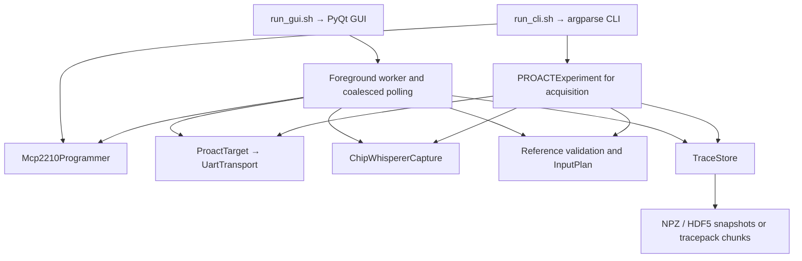

# Software map

The GUI and CLI are two entry points into the same host library. They share protocol and storage primitives; the GUI has its own asynchronous experiment loop, while CLI acquisition uses `PROACTExperiment`. Keeping that distinction visible makes it easier to locate a bug and test the correct caller.

## Where to make a change

| Responsibility | Source | Verification |
|---|---|---|
| Windows, forms, progress, errors and log display | `Software/GUI/proact_gui.py` | `test_gui_workflows.py`; offscreen layout checker |
| Command parsing, exit codes and command dispatch | `Software/Python/proact_host/cli.py` | `test_cli_parser.py`, `test_cli_updates.py` |
| UART lifetime, transaction lock, commands and response frames | `transport.py` | `test_transport.py`, `test_review_regressions.py` |
| MCP2210 programming and resource lifetime | `programmer.py`, `vmem.py` | `test_programmer.py`, `test_vmem.py`, `test_host_boundaries.py` |
| CLI experiment lifecycle and failure handling | `experiment.py` | `test_experiment_errors.py` with fake devices |
| Scope settings and acquisition primitive | `capture.py` | Existing behavior retained; no live validation in this update |
| Fixed/random/file inputs | `inputs.py` | `test_inputs.py`, input boundary regressions |
| Software reference output and authentication checks | `validation.py`, `aead_soft.py` | Reference vectors and malformed-output/tag tests |
| Dataset ownership, persistence and recovery | `storage.py` | Storage round trips, interrupted writes and chunk integrity tests |
| Package/file discovery without device access | `diagnostics.py` | CLI doctor and launcher tests |
| Python selection and installation | `tools/python_env.sh`, `tools/setup_env.py` | Workspace-tool tests and recorded fresh install |

The module names in the middle rows are relative to `Software/Python/proact_host/`. Tests live under `tests/`. Host command definitions and register meanings are preserved. The matching complete RTL and firmware sources belong to the separate design package; they are not included in this public host release.

## Thread and resource ownership

The Qt thread reads form state, validates it and updates widgets. One foreground worker owns a board workflow. Passive polling is coalesced and stops starting new work while a foreground job runs. UART request/reply transactions share a lock so a monitor cannot consume another command's reply. Disconnect waits for that lock in a worker rather than freezing Qt.

Close the owner of a resource: `UartTransport.close()`, `Mcp2210Programmer.close()` or `ChipWhispererCapture.disconnect()`. A failed UART open releases its advisory lock; a failed preparation closes already-created handles. The GUI reports worker failures and restores controls. It does not forcibly terminate an in-flight hardware operation; backend timeouts still matter.

## Data ownership and checkpoints

`TraceStore.append()` converts and copies a complete record before accepting it, so callers may reuse buffers afterward. Snapshot formats keep all rows in memory and replace a complete file. Tracepack commits immutable chunks, then publishes a small manifest. Readers use that committed boundary rather than files they happen to find in the directory.

Display logs and saved records are different. The GUI retains a recent display history; optional experiment text logging streams to a file. Dataset validity, expected output and waveform lengths belong to the storage record. See [storage semantics](STORAGE.md) before choosing a format for a long run.

## Evidence boundary

Offline tests establish host behavior with temporary files, fake devices and offscreen Qt. They cannot establish analog bandwidth, trigger timing, clock/voltage accuracy, FPGA/ASIC equivalence or the number of traces an analysis needs. Those measurements belong to separate board investigations. See the [release report](../reports/HOST_SOFTWARE_RELEASE.md) for integrated software evidence.
