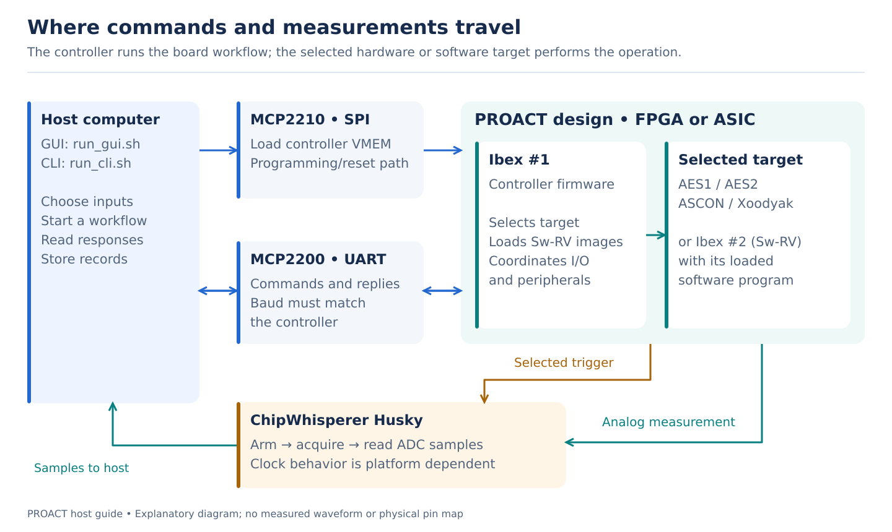
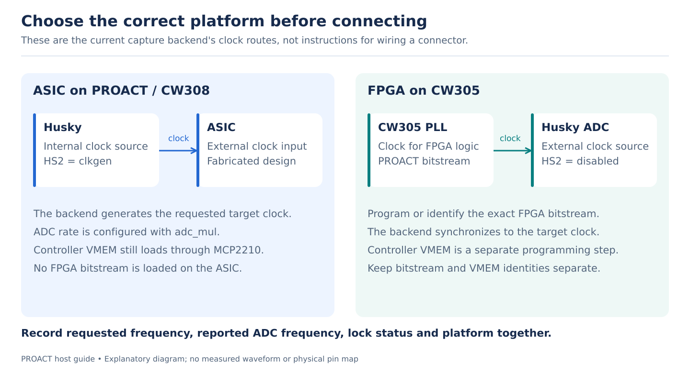
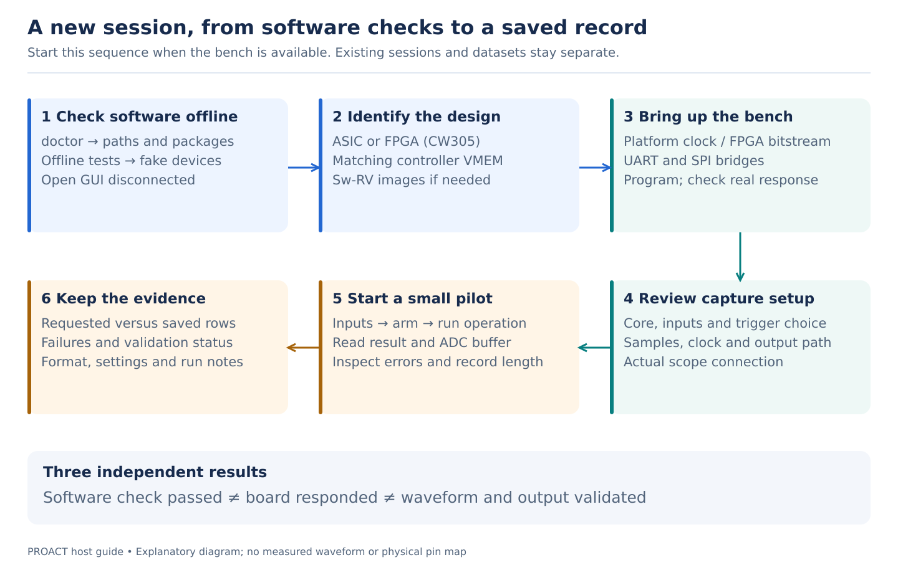
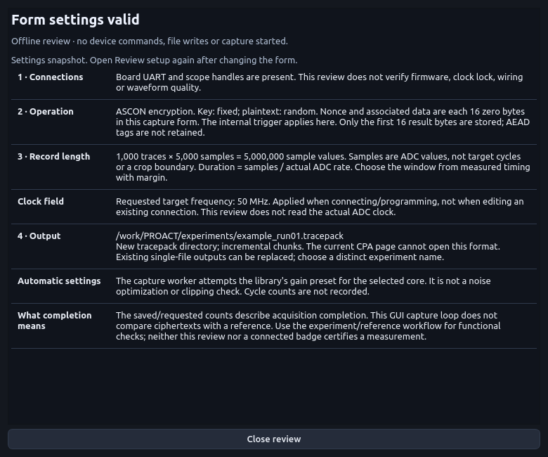
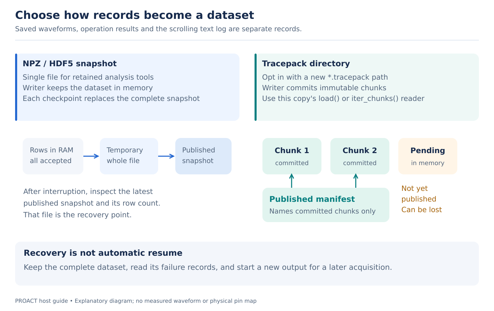

# PROACT GUI and CLI: an illustrated practical guide

This guide explains the PROACT host-software release. Use it when preparing a **new session**. The diagrams show relationships and sample arithmetic. They contain no measured traces or connector pin assignments. GUI pictures are labelled offline renders.

Its entry points are the repository's `run_gui.sh` and `run_cli.sh`. Historical standalone campaign scripts have separate orchestration and storage behavior. The public release requires matching firmware images and an FPGA bitstream obtained separately; it does not include complete design/firmware sources or reference capture datasets.

## 1. Understand the four jobs



*Figure 1. Logical paths. A command reply, a trigger and an analog measurement carry different information.*

- **Host GUI or CLI:** chooses the workload, sends commands and saves records. The GUI has its own worker loop; CLI capture uses `PROACTExperiment`. They share libraries but are not identical workflows.
- **Controller Ibex:** runs the controller firmware and coordinates peripherals and target operations. Loading its VMEM over SPI is different from sending an operation over UART.
- **Selected target:** AES1, AES2, ASCON or Xoodyak hardware, or a program loaded onto the second Ibex, **Sw-RV**. Selecting `swrv` alone does not identify which software image is resident; record the image and its version.
- **Husky:** acquires the analog signal when the selected trigger arrives. Its clock role depends on the platform. The trigger marks a configured event or interval; it is not itself a power waveform.

The ordinary GUI uses **MCP2210/MCP2200** for SPI/UART. Its alternative Husky transport option is disabled because that backend is not implemented. For the peripheral and memory map, use the [hardware overview](wiki/Hardware-Overview.md) and [address map](address_map.md); for the host module map, use [ARCHITECTURE.md](ARCHITECTURE.md).

## 2. Choose ASIC or FPGA before connecting



*Figure 2. Clock behavior implemented by the host capture backend. Consult the verified board documentation for physical connections.*

| Setup decision | ASIC on PROACT / CW308 | FPGA on CW305 |
|---|---|---|
| GUI target / CLI platform | `ASIC` / `asic` | `FPGA (CW305)` / `fpga` |
| Clock route in this backend | Husky generates the target clock on HS2 | CW305 PLL supplies the target clock; Husky uses the external reference |
| Husky HS2 setting | `clkgen` | `disabled` |
| Design file | Fabricated design; no FPGA bitstream | Matching PROACT `.bit` file, or an explicitly identified already-programmed design |
| Controller program | Matching controller VMEM, loaded separately over MCP2210 | Matching controller VMEM, loaded separately over MCP2210 |
| Sw-RV program | Its own instruction/data images when using the software target | Its own instruction/data images when using the software target |

The code defaults to a requested 50 MHz target clock and ADC multiplier 4. Those are **software starting settings**, not a measured frequency or a promise that every board works there. Inspect the reported clock source, ADC frequency and lock state. A connection indicator means a resource opened; it does not prove the clock reached the chip or that an operation succeeded. See [`capture.py`](../Software/Python/proact_host/capture.py), especially `connect()`, `program_fpga()`, `set_clock()` and `clock_status()`.

## 3. Turn sample settings into time

![A conceptual record shows indices 0 through 15. Python slice [4:12] keeps indices 4 through 11, eight samples. At 200 MS/s each sample interval is 5 ns; a 50 MHz target cycle is 20 ns.](images/illustrated-03-time-and-crop.svg)

*Figure 3. Arithmetic illustration, not an acquired waveform. No AES operation boundary is asserted by this example.*

**Samples** means ADC values **per trace**. **Traces** means records acquired from repeated operations. Increasing one does not increase the other.

| Quantity | Meaning | Arithmetic example |
|---|---|---|
| ADC rate, `fₛ` | Samples acquired per second | 200 MS/s |
| Sample interval | `1 / fₛ` | 5 ns |
| Target cycle | `1 / f_target` | 20 ns at 50 MHz |
| Samples per target cycle | `fₛ / f_target` | 4 |
| Nominal record duration | `N / fₛ` | 5,000 samples / 200 MS/s = 25 µs |
| First-to-last sample spacing | `(N − 1) / fₛ` | 4,999 intervals = 24.995 µs |
| Python slice `[a:b]` | Keep indices `a` through `b − 1`; the interval is `[a,b)` | `[4:12]` keeps 8 samples |

For a crop, retain its offset into the original record. Cropped position `j` corresponds to original index `a + j`, with time `t₀ + (a + j) / fₛ`. Here `t₀` is the time of the first original sample relative to the chosen reference. Trigger configuration, acquisition offset and actual timing determine that reference; a zero displayed index alone does not establish the first AES cycle.

**Cropping selects an interval. Alignment shifts or resamples individual records.** A crop cannot recover a portion that was never acquired. Saving a derived crop separately preserves the original evidence. An exact operation window needs measured timing for the specific firmware, trigger mode, platform and clock settings; a universal sample range is not supplied by this guide.

The common scope backend requests acquisition offset 0 and a rising-edge trigger on `tio4`. That is a software setting, not a newly verified physical wire. The current GUI uses its entered Samples value. CLI capture can first run a throw-away operation and read the on-chip Timer to try to grow its record length. That auto-sizing is best effort and requires a working, enabled Timer path. **For a setup with Timer held in reset, do not invoke the default Timer-dependent sizing step.** `capture --help` documents `--no-auto-samples`; choose an independently established record length in that configuration. This follows the current [`experiment.py`](../Software/Python/proact_host/experiment.py) behavior and the [bus access rules](hardware_hazards.md), not a recommendation to alter an ongoing bench session.

## 4. Work through a new session



*Figure 4. A practical sequence. Programming, board commands and the GUI Self-Check are live operations.*

1. **Check the software offline.** From the repository root, run the commands below after [installation](../INSTALL.md). `doctor` reports software paths and packages without enumerating devices. The offline test suite uses fakes; the GUI **Self-Check (A–Z)** communicates with hardware and is a different operation.

   ```bash
   ./run_cli.sh doctor --json
   ./run_cli.sh program --help
   ./run_cli.sh capture --help
   ./tools/run_tests.sh
   ./run_gui.sh
   ```

2. **Identify the platform and images.** Choose ASIC or FPGA, the intended controller VMEM, and Sw-RV instruction/data images if applicable. Supply these images separately; the public host checkout does not contain firmware sources or generated VMEMs. For FPGA, establish the matching bitstream and PLL clock; for ASIC, establish the intended external clock. The same GUI labels do not make different builds equivalent.
3. **Connect and program when the bench is available.** In the sidebar, select the target, UART port and matching baud. Connect opens the UART/SPI bridges. Programming transfers the controller image through SPI; check the subsequent controller response separately. On FPGA, the GUI also uses its configured scope/bitstream workflow. See the [current GUI guide](wiki/GUI-Guide.md), [installation guide](../INSTALL.md) and [hardware access rules](hardware_hazards.md).
4. **Review the scope and capture settings.** In **ChipWhisperer**, confirm the platform and scope connection, clock display, core, key/plaintext input modes, Samples and a new output path. **Review setup…** explains the current form without device access. Enter fixed blocks as exactly 16 bytes, or 32 hexadecimal digits. For Sw-RV, verify the instruction/data images and data base. The current capture path encrypts; ASCON/Xoodyak use fixed zero nonce and associated data there. **Internal trig** applies only to ASCON/Xoodyak and is disabled for the other cores. The separate **Crypto experiment** page provides its own input controls.
5. **Use a small pilot before a long new acquisition.** The acquisition order is inputs → arm scope → run operation/read response → read ADC buffer → save the record. Confirm the expected saved count, complete record lengths, relevant output checks and the actual acquisition settings. This guide does not claim that a particular pilot count establishes a statistical result.
6. **Keep the run record.** Save the dataset together with platform/build identity, requested and reported clock settings, trigger configuration, actual waveform lengths, gain, input modes, failure log and any later processing choices. Current GUI capture metadata is limited; maintain separate run notes for settings it does not store. The GUI's scrolling log and a 100% progress indicator cannot substitute for these records.

The current capture code applies per-core gain defaults. They are starting values from the existing implementation, not a universal noise optimum. The scope's accepted settings and acquired records determine whether a setup is usable. This documentation update neither changes gain nor starts a capture.

## 5. Read the capture screen


*Figure 5. Actual GUI, rendered offline at 1280×800 with no devices. No successful connection or acquired data is simulated in this view.*

Read the page in three parts: **sidebar connection**, **scope/clock setup**, then **capture form**. The connection summary reports local handles and form state. It does not test firmware, physical wiring or waveform quality. The target frequency field is applied when connecting/programming; editing the number does not change an existing connection. The Samples field is ADC values per record, and the output field selects the storage destination.



*Figure 6. Actual Review setup dialog, rendered with fake connected handles and ASCON settings for demonstration. It starts no acquisition and verifies no hardware. This is a form snapshot, not a live instrument reading.*

**Review setup…** is available while the application is working. It shows a copyable snapshot of the form; reopen it after editing settings. A missing connection, invalid field or incomplete capture has its own summary state. **Connected** means the necessary handles are present, and **Working** means a job is running. Read saved/requested counts and errors before treating a finished job as a complete dataset.

## 6. Choose storage before starting



*Figure 7. Publication boundaries. Abstract boxes represent records, not measured data.*

| Choose | When it fits | What to retain |
|---|---|---|
| `.npz` | A retained analysis tool expects a single NumPy file | The complete file and run notes |
| `.h5` / `.hdf5` | A retained tool expects HDF5 and `h5py` is available | The complete file and run notes |
| A new `.tracepack` directory | You want incremental chunk storage through the host reader API | The entire directory, including its manifest and chunks |

Tracepack is an opt-in directory format; the existing GUI analysis page and older analysis file pickers have not been migrated to it. Use the host library's [`load()` or `iter_chunks()`](../Software/Python/proact_host/storage.py). `load()` materializes the entire dataset; `iter_chunks()` holds one waveform chunk plus its descriptor index. NPZ/HDF5 snapshot writers keep the dataset in memory.

For compatibility, an explicit `.h5` path without `h5py` can contain NPZ. The reader checks the real container; inspect `metadata.storage_format` rather than assuming the suffix proves it. See [STORAGE.md](STORAGE.md) for the full format contract.

## 7. Read a partial result honestly

**Requested count, saved count and validated count are different.** A run may attempt every operation and save fewer records because some acquisitions failed. CLI capture reports a nonzero exit status when its saved count differs from the request. The updated GUI closes the completed loop's store, reports an incomplete capture when `done != requested`, and shows **Needs attention**. Read the saved count and failure log even if progress reached 100%. For an earlier exception, inspect the most recent published checkpoint rather than assuming all attempts were saved.

The two current capture workflows also retain different output evidence:

| Workflow | Current output/validation behavior |
|---|---|
| CLI `PROACTExperiment` | Stores AES output blocks or full AEAD payloads; calls its AES/AEAD software validation helpers. The saved `valid` flag does not itself certify analog quality. |
| GUI ChipWhisperer capture | Stores `payload[:16]`; does not call those reference-validation helpers in this loop. AEAD tags are not retained by that slice. Missing validation must not be interpreted as a pass. |
| Functional run without scope | An empty waveform means no waveform was acquired. It is not a zero-voltage measurement. |

In new schema-2 files, `trace_lengths` and the other length arrays describe the actual row fields. Storage can pad short waveform rows to the common array width and mark them invalid. Padding is a storage representation, not acquired samples. The storage flag uses `-1` for unspecified validation, `0` for invalid and `1` for valid; older files may lack these fields entirely.

After interruption, keep the original output intact. Inspect its latest committed checkpoint, row lengths and `failures`. For tracepack, readers follow the published manifest and ignore orphan chunks. Pending memory rows can be lost. This recovery behavior does not implement automatic acquisition resume, concurrent writers or a guarantee against sudden power loss. Start a later acquisition in a new output path. If an API append accepted a row but its automatic flush failed, retry `flush()` rather than appending that row again.

The activity display keeps a bounded recent history. **Also save log file** belongs to the separate Crypto experiment workflow and streams that experiment's text log; it is not a general waveform archive. CSV log export contains retained rows, including any visible discard count. See [GUI-Guide.md](wiki/GUI-Guide.md) and [STORAGE.md](STORAGE.md).

## Implementation references

This guide follows the current host software. Historical measurement claims in retained manuals require their own experimental evidence. Main references are [`proact_gui.py`](../Software/GUI/proact_gui.py), [`cli.py`](../Software/Python/proact_host/cli.py), [`experiment.py`](../Software/Python/proact_host/experiment.py), [`capture.py`](../Software/Python/proact_host/capture.py), [`storage.py`](../Software/Python/proact_host/storage.py), [ARCHITECTURE.md](ARCHITECTURE.md) and [MIGRATION.md](MIGRATION.md). Integrated source and visual checks are documented in the [release report](../reports/HOST_SOFTWARE_RELEASE.md); the five diagram sources are under `docs/images/illustrated-*.svg`.
