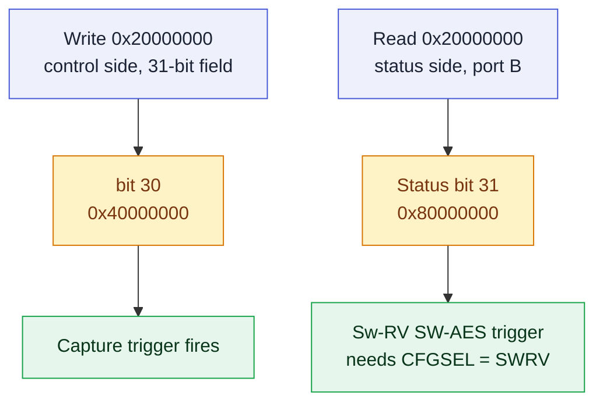

# Address & Register Map

This page is the **canonical, verified address map** of the fabricated PROACT SoC. All addresses required to interface with the chip are listed below.

> [!NOTE]
> **How this map is produced.** All values come from a single machine-readable file, [`config/hardware.json`](../blob/main/config/hardware.json), which is derived from the **frozen, fabricated ASIC RTL** (`ASIC/rtl/PROACTPKG/config_defs.svh`, `SCreg/s_c_REG_pkg.sv` + `s_c_REG.sv`) and verified against the signoff netlist `PROACT_signoff.v` (tapeout 2025-11-14). A generator (`scripts/gen_hardware.py`) emits the C header, the Python module, and these docs from that one file, so the **C header, Python module, GUI, and documentation never diverge**. The map was cross-checked field-by-field against the RTL (**34 checks**) and against the passing **gate-level signoff simulation**.
>
> **Verification status:** these numbers are **RTL-verified and gate-sim-verified**, and the map has now been exercised end-to-end **on the real CW305 FPGA**: the unified A–Z self-check (`proact_host/fullcheck.py`) passes 100% — UART, AES1/AES2 encrypt + decrypt, ASCON/Xoodyak on-chip encrypt KAT, timer, control register, PRNG, and Sw-RV. **The fabricated ASIC is bench-verified** against this same map — firmware load, UART, AES1/AES2 and Sw-RV known-answer vectors on silicon, and Husky-locked trace capture (the same self-check screens further chips unchanged). The ASIC and FPGA share this map **byte-for-byte** — there is no address divergence between them.

> [!IMPORTANT]
> **The map is fixed.** Addresses, bit positions, and widths are properties of the fabricated silicon, so the host software and firmware are written to match this map; a single generated source keeps all consumers in agreement.

---

## 1. Bus devices

Each device decodes when `(address & mask) == base`. Every peripheral window is 1 KB.

| idx | Device | Base | Mask | Region | Notes |
|----:|--------|------|------|--------|-------|
| 0 | RAM | `0x02000000` | `0xFE000000` | 32 MB | Controller data RAM (128 KB physical) |
| 1 | RII_IMEM | `0x04000000` | `0xFE000000` | 32 MB | Sw-RV **instruction** memory write port (controller loads target code here) |
| 2 | RII_DMEM | `0x08000000` | `0xF8000000` | 128 MB | Sw-RV **data** memory; the controller↔target **mailbox** lives here |
| 3 | S_C_REG | `0x20000000` | `0xFFFFFC00` | 1 KB | **WRITE = control, READ = status** (same address) |
| 4 | UART | `0x10000000` | `0xFFFFFC00` | 1 KB | AHBUART |
| 5 | TIMER | `0x40000000` | `0xFFFFFC00` | 1 KB | 32-bit trigger-window counter |
| 6 | RNG | `0x80000000` | `0xFFFFFC00` | 1 KB | Write = seed. **Read routed only to Sw-RV**, not the controller |
| 7 | AES1 | `0x10001000` | `0xFFFFFC00` | 1 KB | AES-128 hardware core |
| 8 | AES2 | `0x10002000` | `0xFFFFFC00` | 1 KB | AES-128 hardware core (2nd) |
| 9 | XOODYAK | `0x10003000` | `0xFFFFFC00` | 1 KB | Xoodyak AEAD core |
| 10 | ASCON | `0x10005000` | `0xFFFFFC00` | 1 KB | ASCON AEAD core |
| 11 | **`Co_re` (reserved)** | `0x10007000` | `0xFFFFFC00` | 1 KB | A reserved decoder slot with no core behind it; the drivers never address it. |

> [!CAUTION]
> `0x10004000` and `0x10006000` are **unmapped** and return a clean bus decode error. The reserved `Co_re` slot at `0x10007000` is decoded but unpopulated; the drivers never address it. Details on the **[Hardware Hazards](Hardware-Hazards)** page.

---

## 2. Control register — `0x20000000` (WRITE side)

> [!CAUTION]
> **The control register is a 31-bit control field.** It carries 31 control signals, so the capture **trigger is bit 30 (`0x40000000`)** — the top control bit. (The read-side status register at the same address is a full 32 bits; see §3.)


*The 31-bit control register: per-core `ENABLE` / `START` / `DEC` bits, the `CFGSEL` trigger-source mux at [22:20], and the capture trigger at bit 30.*

| Bit | Field | | Bit | Field |
|----:|-------|---|----:|-------|
| 0 | `ENABLE_TARGET` (releases Sw-RV from reset) | | 8 | `START_XOODYAK` |
| 1 | `ENABLE_AES1` | | 9 | `DEC_XOODYAK` |
| 2 | `START_AES1` | | 10 | `ENABLE_ASCON` |
| 3 | `DEC_AES1` (1 = decrypt) | | 11 | `START_ASCON` |
| 4 | `ENABLE_AES2` | | 12 | `DEC_ASCON` |
| 5 | `START_AES2` | | 13 | `ENABLE_RNG` |
| 6 | `DEC_AES2` | | 14 | `ENABLE_TIMER` |
| 7 | `ENABLE_XOODYAK` | | 15 | `RESET_UART` (active-high) |
| 29 | `TRIGGERPC` (`0x20000000`) | | 30 | `TRIGGER` (`0x40000000`) — the capture trigger |

> [!WARNING]
> `DEC_AES1` / `DEC_AES2` select hardware decryption. For the AEAD cores, decryption is performed on the host (`proact_host/aead_soft.py`) — see §5 and [Hardware Overview](Hardware-Overview).

**`CFGSEL` field — bits [22:20]** (trigger-source mux; firmware normally leaves this `000`):

| Value | Bits | Trigger source |
|------:|:----:|----------------|
| 0 | `000` | SOFTWARE (control-register trigger) |
| 1 | `001` | ASCON |
| 2 | `010` | AES1 |
| 3 | `011` | AES2 |
| 4 | `100` | XOODYAK |
| 5 | `101` | SWRV |

**Firing the trigger (C):**

```c
#define S_C_REG       0x20000000u
#define CTRL_TRIGGER  (1u << 30)     /* 0x40000000 — bit30, NOT bit31 */

*(volatile uint32_t *)S_C_REG = CTRL_TRIGGER;   /* correct */
/* *(volatile uint32_t *)S_C_REG = 0x80000000u; // WRONG: dropped by HW */
```

---

## 3. Status register — `0x20000000` (READ side)

> [!NOTE]
> The status register is a full 32-bit register. Bits [31:17] are written by the Sw-RV target via its port B; **status bit 31 (`TARGET_DONE`) is the live "target done" handshake** the controller polls. It is a separate register from the 31-bit control field on the write side; the two bit-31 positions are unrelated.


*The full 32-bit status register: per-core `DONE` / `TRIGGER` / `ACTIVE` flags, `UART_RVALID` at bit 0, and the real `TARGET_DONE` handshake at bit 31 written by the Sw-RV via port B.*

| Bit | Field | | Bit | Field |
|----:|-------|---|----:|-------|
| 0 | `UART_RVALID` | | 9 | `DONE_ASCON` |
| 1 | `TRIGGER_IN` | | 10 | `READY_ASCON` |
| 2 | `DONE_AES1` | | 11 | `TRIGGER_ASCON` |
| 3 | `TRIGGER_AES1` | | 12 | `TEST_I` (spare_io handshake) |
| 4 | `DONE_AES2` | | 13 | `AES1_ACTIVE` |
| 5 | `TRIGGER_AES2` | | 14 | `AES2_ACTIVE` |
| 6 | `DONE_XOODYAK` | | 15 | `XOODYAK_ACTIVE` |
| 7 | `READY_XOODYAK` | | 16 | `ASCON_ACTIVE` |
| 8 | `TRIGGER_XOODYAK` | | 31 | `TARGET_DONE` (written by Sw-RV) |

Bits [30:17] are reserved and are written by the Sw-RV target via port B.

**Polling target-done (C):**

```c
#define STATUS_TARGET_DONE  (1u << 31)   /* status side, this bit IS real */

while (!(*(volatile uint32_t *)S_C_REG & STATUS_TARGET_DONE)) { /* wait */ }
```

---

## 4. AES1 / AES2 core registers (offset from base)

AES1 = `0x10001000`, AES2 = `0x10002000`. Both cores are AES-128 and use the same layout.

> [!CAUTION]
> A core acknowledges the bus while its enable bit is set (`ENABLE_AES1` / `ENABLE_AES2`) — that bit also gates the core's reset, which holds an unused core idle by design. The drivers therefore enable a core before accessing its registers and operate one core at a time; `DONE` is meaningful while `START` is held high.

| Offset | Register | Offset | Register | Offset | Register |
|-------:|----------|-------:|----------|-------:|----------|
| `0x00` | START (write bit0) | `0x08` | KEY0 `[127:96]` | `0x28` | RESULT0 `[127:96]` |
| `0x04` | DONE (read = `~busy`) | `0x0C` | KEY1 `[95:64]` | `0x2C` | RESULT1 `[95:64]` |
| | | `0x10` | KEY2 `[63:32]` | `0x30` | RESULT2 `[63:32]` |
| | | `0x14` | KEY3 `[31:0]` | `0x34` | RESULT3 `[31:0]` |
| | | `0x18` | DATA0 `[127:96]` | | |
| | | `0x1C` | DATA1 `[95:64]` | | |
| | | `0x20` | DATA2 `[63:32]` | | |
| | | `0x24` | DATA3 `[31:0]` | | |

Decrypt is selected via the `DEC_AES1` / `DEC_AES2` **control-register** bits, not a core offset.

---

## 5. ASCON / Xoodyak core registers (offset from base)

ASCON = `0x10005000`, Xoodyak = `0x10003000`. Both AEAD cores share this layout. The 128-bit KEY and NPUB are shifted in as **4 × 32-bit writes** to the same offset.

| Offset | Register | Direction | Notes |
|-------:|----------|-----------|-------|
| `0x00` | LEN | write | Length word — see below |
| `0x04` | KEY | write | 32-bit ×4 → 128-bit |
| `0x08` | NPUB | write | 32-bit ×4 → 128-bit (nonce) |
| `0x0C` | AD | write | pushes to AD FIFO |
| `0x10` | PT | write | pushes to PT FIFO |
| `0x14` | CT | read | pops from CT FIFO |
| `0x18` | TAG | read | pops from TAG FIFO |

**The `LEN` word (`0x00`)** packs three byte-length fields:

| Bits | Field |
|:----:|-------|
| `[7:0]` | `ad_len` — associated-data length (bytes) |
| `[15:8]` | `pt_len` — plaintext length (bytes) |
| `[23:16]` | `triggercfg` — trigger-config byte (see the **Hardware Hazards** page) |

> [!NOTE]
> When these cores are enabled, reads **always** acknowledge even if the CT/TAG FIFO is empty (they return stale data), so AEAD read-back is straightforward.

> [!WARNING]
> **These registers drive the AEAD encryption datapath** — the operation measured during side-channel capture. The on-chip KAT matches the reference vectors on both cores. Decryption and tag verification run on the host with `proact_host/aead_soft.py` (`ascon128_decrypt` / `xoodyak_decrypt`), bit-exact against the silicon's own CT+TAG, so the workflow is **hardware encrypt → software decrypt + tag verify**. See [Hardware Overview](Hardware-Overview) for the rationale.

---

## 6. UART / Timer / RNG

### UART — `0x10000000`

| Offset | Write | Read |
|-------:|-------|------|
| `0x00` | TX byte | RX byte (`RXTX`) |
| `0x04` | Baud divisor (`HWDATA[21:0]`, reset default **27**) | — |
| any offset ≠ `0x00` | — | status word `{6'b0, tx_full(bit1), rx_empty(bit0)}` |

- Status bits: `rx_empty` = bit 0, `tx_full` = bit 1.
- TX FIFO = **512 bytes**, RX FIFO = **32 bytes**.
- The UART acknowledges writes at `+0x00` (TX) and `+0x04` (baud), and reads when RX is non-empty (`UART_RVALID` / `~rx_empty`); the 512-byte TX FIFO has no backpressure, so paced output keeps it from overflowing. The driver's `uart_getchar()` and paced `putchar` implement this contract — see **[Hardware Hazards](Hardware-Hazards)**.

### Timer — `0x40000000`

A single 32-bit counter (readable at any offset in the window). Reset-gated by the `ENABLE_TIMER` control bit. **It counts only while `trigger_Out` is high** — it measures the trigger/crypto window, it is *not* a free-running timer. Reads always ack.

### RNG — `0x80000000`

Write = 32-bit seed, reset-gated by the `ENABLE_RNG` control bit. **The controller cannot read random data here** — the LFSR output is routed only to the Sw-RV target at its data-side port. Reads from the controller return no useful data.

---

## 7. Sw-RV software-AES trigger path

The Sw-RV target has its **own** trigger path that does **not** use control-register bit 30. The Sw-RV writes **status bit 31** (`0x80000000`) at address `0x20000000` via its port B; with `CFGSEL = SWRV (101)` this becomes the capture trigger.

| | Control-side trigger | Sw-RV status-side trigger |
|---|---|---|
| Address | `0x20000000` (WRITE) | `0x20000000` (STATUS, port B) |
| Bit / value | bit 30 = `0x40000000` | bit 31 = `0x80000000` |
| Top bit | bit 30 is the top control bit | bit 31 is a full status bit |



> [!NOTE]
> **Two separate registers.** The control (write) side is a 31-bit field, so its capture trigger is bit 30; the status (read) side is a full 32-bit register, and the Sw-RV raises its own trigger on status bit 31. Same address, different registers — select the register that matches the trigger path in use.

---

## 8. Quick reference

| Constant | Value |
|----------|-------|
| Core clock | ~50 MHz (confirmed on the CW305 bench; divisor 27 -> 115200 baud) |
| Control/Status base | `0x20000000` |
| Capture trigger | control bit 30 (`0x40000000`) |
| Target-done poll | status bit 31 (`0x80000000`) |
| Sw-RV SW-AES trigger | status bit 31 via port B (with `CFGSEL=SWRV`) |
| UART baud divisor (default) | 27 |
| Reserved slot | `0x10007000` (`Co_re`, unpopulated) |

**Conventions established by this map** (implemented by the supplied drivers — details on the **[Hardware Hazards](Hardware-Hazards)** page):
- Enable a crypto core before touching its registers, and use one core at a time.
- Address only mapped devices; write UART `0x00`/`0x04`; read the UART when RX is non-empty.
- The capture trigger on the control side is **bit 30**.
- AEAD decryption runs on the host (`aead_soft.py`); the AEAD driver's done-wait is bounded.

*Related pages: **[Hardware Hazards](Hardware-Hazards)** (the access contract and `triggercfg`), **[Bring-up Guide](../docs/bringup_guide.md)** (program → run → capture flow).*
