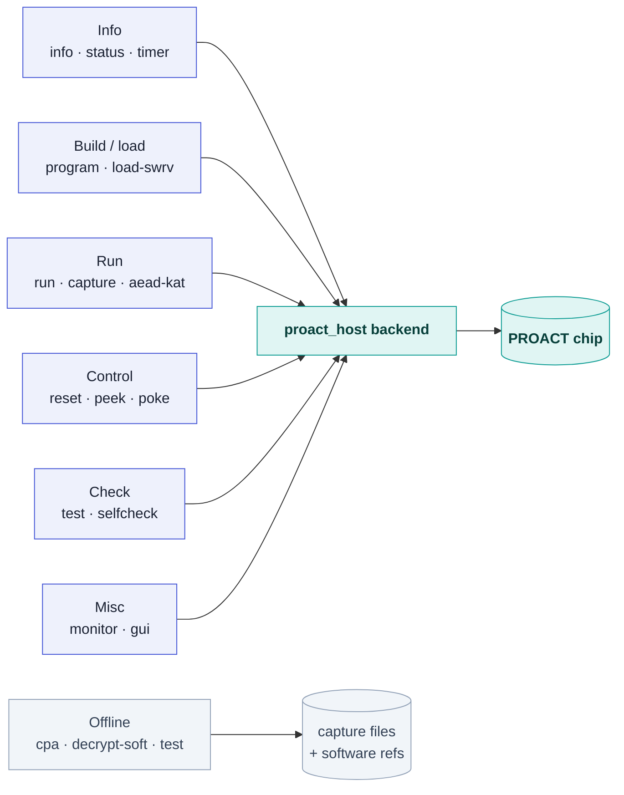

# CLI — the `proact` command line

`proact` is the command-line interface of the PROACT platform. It uses the **exact
same `proact_host` backend as the GUI**, so every operation available in the GUI can
also be scripted — programming firmware, running and validating cryptographic
operations, capturing traces, running the offline CPA attack, performing raw bus
accesses, resetting the chip, and running the complete A–Z self-check.

On the bench, always launch the CLI through the repository wrapper:

```bash
./run_cli.sh <command> [options]
```

> [!WARNING]
> **Rationale for the wrapper (and for avoiding `sudo`):** `run_cli.sh` selects the
> correct interpreter — `$PROACT_VENV`, else the dedicated `~/.proact-venv` (built by
> `bash tools/setup_env.sh`), else the repo's `.venv`, else the first system Python
> that can `import hid, serial.tools.list_ports` — then puts `Software/Python` on
> `PYTHONPATH` and execs `python -m proact_host.cli`. A bare `python3` under pyenv is
> often a different interpreter missing those packages. **Do not use `sudo`:** device
> access is granted by the udev rules (`sudo bash tools/install_udev.sh` once, then
> replug), and running as root breaks the user-local ChipWhisperer install. If
> `proact-host` is pip-installed, the same tool is on `PATH` as `proact <command>`
> (the `[project.scripts]` entry point → `proact_host.cli:main`).

> [!NOTE]
> The wrapper does **not** `cd` anywhere, so relative paths you pass (`--vmem`,
> `--output`, `--capture`, `--bitstream`) resolve against your *current* directory.
> Paths the CLI resolves itself — the Sw-RV `.vmem` files for `selfcheck`, the CPA
> scripts, the shipped reference datasets — are anchored to the repository root.

## Global options

| Option | Meaning |
|---|---|
| `--port PORT` | Serial port for the UART (default: auto-detect the MCP2200, VID `0x04D8` / PID `0x00DF`). |
| `--no-color` | Disable colored output. |
| `-h`, `--help` | Help for `proact` or any subcommand (`proact run --help`). |

Output is **colored automatically when writing to a terminal** and plain otherwise;
`NO_COLOR` set to anything, `TERM=dumb`, a redirected stdout, or `--no-color` all
force plain output — use any of them for logs and CI.

## Command overview

There are **24 subcommands**, in six groups:

| Group | Commands |
|---|---|
| **Info** (5) | `info` · `devices` · `status` · `timer` · `version` |
| **Build / load** (4) | `build-controller` · `build-target` · `program` · `load-swrv` |
| **Run** (6) | `run` · `capture` · `cpa` · `aead-kat` · `decrypt-soft` · `seed` |
| **Control** (4) | `reset` · `restart` · `peek` · `poke` |
| **Check** (3) | `test` · `selfcheck` · `selftest` |
| **Misc** (2) | `monitor` · `gui` |

Several never touch the bench at all — `info`, `version`, `test`, `cpa`,
`decrypt-soft` and the two `build-*` commands run with nothing plugged in, and
`devices` only enumerates USB. Everything else routes through the **single**
`proact_host` backend, which drives the real chip; consequently, the CLI, GUI, and
notebook always behave identically:



---

## Info commands

### `info` — version, address map, key facts (no hardware)
```bash
./run_cli.sh info
```
```
== proact-host ==
  version        1.0.0
  repo           /path/to/PROACT
  input clock    50.0 MHz (config.py)

== address map (config/hardware.json -> regs.py) ==
  AES1           0x10001000
  AES2           0x10002000
  XOODYAK        0x10003000
  ASCON          0x10005000
  UART           0x10000000
  TIMER          0x40000000
  RNG            0x80000000
  SCREG          0x20000000
  RII_IMEM       0x04000000
  RII_DMEM       0x08000000

== facts every user needs ==
  • capture trigger = control bit30 (0x40000000) -- NOT bit31
  • ASCON/Xoodyak hardware is ENCRYPT-only; decrypt in software (`proact decrypt-soft`, proact_host.aead_soft)
  • never launch with sudo; use ./run_cli.sh / ./run_gui.sh
  docs           docs/manual/proact_manual.pdf | examples/PROACT_Tutorial.ipynb
  wiki           https://github.com/abolfazlsajadi/PROACT_Design/wiki
```
The clock comes from `config.INPUT_CLOCK_HZ`, which `config.py` reads out of
`config/hardware.json`; the addresses come from the generated `regs.py`.

### `devices` — list bench USB devices (no chip needed)
Enumerates only the Microchip VID/PID pairs — MCP2210 (`04D8:00DE`, SPI loader) and
MCP2200 (`04D8:00DF`, UART) — then lists every serial port pyserial can see and
reports whether `chipwhisperer` is importable. A missing `hid` or `pyserial` is
reported as a line, not a crash.
```bash
./run_cli.sh devices
```

### `status` — read + decode the status register
Reads `SCREG_BASE` (`0x20000000`) through the controller and prints the raw value
plus the names of the set bits (from the `STAT_*` constants in `regs.py`).
`--watch SECS` (a float) repeats the read until Ctrl-C, which makes it possible to
observe a core asserting `DONE`.
```bash
./run_cli.sh status
./run_cli.sh status --watch 1        # refresh every second (Ctrl-C to stop)
./run_cli.sh status --watch 0.2      # 5 Hz
```
```
status = 0x00001000   TEST_I
```

### `timer` — read the trigger-window cycle counter
```bash
./run_cli.sh timer
```
Prints the cycle count and the equivalent time at `config.INPUT_CLOCK_HZ`
(50 MHz on this bench).

### `version`
Prints only the `proact_host` version string — currently `1.0.0` — with no
decoration, for scripts.

---

## Build / load commands

### `build-controller` / `build-target` — build firmware
Thin wrappers over `make -C Software/{Controller,SW_RV} all`; the CLI exits with
make's own exit status. `--riscv PREFIX` is passed through as `RISCV=PREFIX`.
```bash
./run_cli.sh build-controller             # -> Software/Controller/main.vmem
./run_cli.sh build-target                 # -> Software/SW_RV/sw_rv_{imem,dmem}.vmem
./run_cli.sh build-controller --riscv riscv32-unknown-elf-
```

### `program` — load controller firmware over SPI
Streams a `.vmem` into the controller over the MCP2210 (the required reset
choreography is performed automatically), then — this is the important part —
opens the UART, reboots the controller with the port already listening, and waits
for the firmware's boot banner `PROACT controller ready.`

| Option | Default | Meaning |
|---|---|---|
| `--vmem FILE` | *(required)* | the firmware image to stream |
| `--serial SN` | first match | pick a specific MCP2210 by serial number |

```bash
./run_cli.sh program --vmem Software/Controller/main.vmem
./run_cli.sh program --vmem main.vmem --serial 0001003222   # pick an MCP2210 by serial
```
```
  100%
  ✔ programmed Software/Controller/main.vmem; controller booted (announced itself over UART)
```
> [!IMPORTANT]
> The SPI code loader is **write-only** (no MISO), so a bare "100%" only means bytes
> were shifted out. The banner check is the only cheap *positive* proof the chip is
> alive. If the banner does not arrive, the command still succeeds (the SPI stream
> did complete) but prints a warning on stderr pointing at the two usual causes: on
> FPGA the bitstream was not uploaded first, or the MCP2200 UART is not connected.

### `load-swrv` — load + boot a program on the Sw-RV target
Loads instruction then data memory (`CMD_LDI` holds the target in reset while its
memories are written), selects `swrv` so the release edge boots the freshly-loaded
code, then runs one software-AES block through the mailbox and prints the result.

| Option | Default | Meaning |
|---|---|---|
| `--imem FILE` | *(required)* | instruction-memory `.vmem` |
| `--dmem FILE` | *(required)* | data-memory `.vmem` (loaded at `SWRV_DMEM_LOAD_BASE`, `0x08100000`) |
| `--key` | 16 zero bytes | 16-byte key (hex) |
| `--pt` | 16 zero bytes | 16-byte input (hex) |

```bash
./run_cli.sh load-swrv --imem Software/SW_RV/sw_rv_imem.vmem \
                       --dmem Software/SW_RV/sw_rv_dmem.vmem
```

---

## Run commands

### `run` — run crypto operations and print results
The primary execution command. It selects a core, sets inputs, runs one or many
operations, and can validate and time each one.

| Option | Default | Meaning |
|---|---|---|
| `--core` | *(required)* | `aes1` · `aes2` · `ascon` · `xoodyak` · `swrv` |
| `--key` | `000102…0f` | 16-byte key (exactly 32 hex chars) |
| `--pt` | `101112…1f` | 16-byte input (exactly 32 hex chars) |
| `--nonce` / `--ad` | zeros | AEAD nonce / associated data, 16 bytes each |
| `--decrypt` | off | decrypt (AES1/AES2/Sw-RV; for AEAD, decrypt on the host — see note) |
| `--runs N` | `1` | repeat N times |
| `--random` | off | fresh random plaintext each run (`secrets.token_bytes`) |
| `--compare` | off | check the output against the software reference |
| `--timer` | off | read the trigger-window cycle count per run |
| `--trig` | `auto` | trigger-source mux `cfg_sel`: `auto`/`software`/`aes1`/`aes2`/`ascon`/`xoodyak`/`swrv` |
| `--inttrig` | `0x12` | AEAD in-core trigger phase (7-bit; accepts `0x…`/decimal) |
| `--json` | off | machine-readable output instead of the per-run lines |

```bash
# one AES-1 encryption, validated and timed
./run_cli.sh run --core aes1 --compare --timer

# 100 random-plaintext AES-2 runs, validate every one (nonzero exit if any fail)
./run_cli.sh run --core aes2 --runs 100 --random --compare

# an ASCON encryption with a specific key (CT + tag printed)
./run_cli.sh run --core ascon --key 00112233445566778899aabbccddeeff
```
Example output (`--compare --timer --runs 2 --random`):
```
    0 pt=a7d78090145bc97276dc53f680bc9d79 -> 43aa26f9611de9d71a1d985bc80cf3cf  PASS  cyc=238
    1 pt=2609c1224b914d26e07052e668d27b83 -> 51d155de297ce4cbdc742a5df574d7ef  PASS  cyc=357
```
For AEAD cores the result line shows `ct=… tag=…` (the 32-byte frame split 16/16).
`--json` prints one object per run with the keys `run`, `pt`, `mode`, `out`, plus
`ct`/`tag` for AEAD, `pass` with `--compare`, and `cycles` with `--timer`.

`--compare` uses `validation.validate_aes` for `aes1`/`aes2`/`swrv` (the pure-Python
AES-128 reference) and `validation.validate_aead` for `ascon`/`xoodyak` (the
`aead_soft` software cipher). `validate_aead` returns `False` for `--decrypt`,
because the hardware cannot decrypt.

> [!NOTE]
> For `ascon`/`xoodyak`, decryption runs on the host — use
> [`decrypt-soft`](#decrypt-soft--software-aead-decrypt--tag-verify). Asking for
> `--decrypt` on an AEAD core prints a warning first and then still runs (the
> hardware decrypt times out and returns zeros); `--decrypt` really applies to
> `aes1`/`aes2`/`swrv`.

### `capture` — capture power traces
Runs the crypto op while a ChipWhisperer records the trigger window, and stores
traces + inputs + outputs + metadata through `PROACTExperiment`.

| Option | Default | Meaning |
|---|---|---|
| `--core` | *(required)* | `aes1` · `aes2` · `ascon` · `xoodyak` · `swrv` |
| `--traces N` | `100` | number of traces (see the sizing note below) |
| `--output PATH` | `results/run` | extension added automatically: `.h5` with `h5py`, else `.npz` |
| `--platform` | `asic` | `asic` (Husky drives the clock on HS2) or `fpga` (CW305 PLL) |
| `--key` | `000102…0f` | 16-byte key, fixed for the whole campaign |
| `--samples N` | `5000` | samples per trace; **grown automatically** to cover the measured trigger window unless `--no-auto-samples` |
| `--clock MHZ` | `50.0` | target clock |
| `--bitstream FILE` | none | upload this CW305 bitstream first (`fpga` only) |
| `--gain DB` | per-core | ADC gain in dB — `capture.RECOMMENDED_GAIN`: 10 dB for the hardware cores, 20 dB for `swrv` |
| `--gain-mode` | `low` | ADC gain mode (`low`/`high`) |
| `--no-auto-samples` | off | do not grow `--samples` to the measured trigger window |
| `--fixed` | off | constant input instead of a fresh random one per run |
| `--no-scope` | off | functional only — runs and stores results with empty traces |

```bash
./run_cli.sh capture --core aes1 --traces 6000 --platform fpga --output experiments/aes1
```
**Trace-count sizing** (from `--help`, bench-measured for the *full* key with the CPA
scripts' default low-pass filter): aes1 ≈ 4800, aes2 ≈ 5300, swrv ≈ 1300 — and
11500 / 6600 / not-reached with the filter disabled. Capture ~1.5× for margin.

Too few samples silently truncates the trigger window and the leakage past the cut
is unrecoverable at *any* trace count, which is why the sample count is grown
automatically by default. See [ChipWhisperer](ChipWhisperer) for loading and
plotting the output; the stored `traces` + `output` arrays are the direct input to
the **last-round CPA** analysis presented there.

### `cpa` — run the CPA attack on a capture (offline, no board)
Spawns the matching attack script in `examples/` on a stored capture. With no
`--capture` it falls back to the shipped reference dataset for that core, so the
whole attack reproduces on a laptop.

| Option | Default | Meaning |
|---|---|---|
| `--core` | `aes1` | `aes1`/`aes2` → `examples/cpa_lastround.py` (last-round ciphertext model); `swrv` → `examples/cpa_swrv.py` (first-round S-box model) |
| `--capture FILE` | `datasets/<core>_reference.npz` | a `.npz`/`.h5` capture |
| `--filter K` | script default (`auto`; `16` for swrv) | moving-average width; `1` disables it |
| `--window LO:HI` | `auto` | restrict the sample window |
| `--plot PNG` | none | save the correlation figure |

```bash
./run_cli.sh cpa --core aes1                      # -> RECOVERED 16/16 key bytes
./run_cli.sh cpa --core swrv --plot swrv_cpa.png
./run_cli.sh cpa --core aes1 --capture experiments/aes1.npz --filter 1
```
The command exits with the attack script's own status; a missing capture file
prints `capture not found: …` and exits 1.

### `aead-kat` — on-chip ASCON + Xoodyak known-answer test
Issues `CMD_AEADKAT` (`0x1A`); the firmware runs the reference vectors on both AEAD
cores on-chip and compares CT+tag. Exits nonzero if either fails.
```bash
./run_cli.sh aead-kat
```
```
  ✔ ASCON   on-chip encrypt KAT PASS
  ✔ Xoodyak on-chip encrypt KAT PASS
```

### `decrypt-soft` — software AEAD decrypt + tag verify
The supported method for decrypting ASCON/Xoodyak output (see the note above).
Implemented in pure Python (`proact_host.aead_soft`), validated against the same
reference vectors the silicon reproduces. **No hardware needed.**

| Option | Default | Meaning |
|---|---|---|
| `--cipher` | `ascon` | `ascon` or `xoodyak` |
| `--selftest` | off | validate both ciphers against the silicon's vectors and exit |
| `--key` / `--nonce` / `--tag` | none | 16 bytes each (32 hex chars) |
| `--ct` | none | ciphertext hex, any length |
| `--ad` | none | associated data hex, any length |

```bash
# validate both ciphers against the silicon's own vectors (no hardware)
./run_cli.sh decrypt-soft --selftest

# decrypt a real ciphertext+tag and verify
./run_cli.sh decrypt-soft --cipher ascon \
    --key <32hex> --nonce <32hex> --ct <hex> --tag <32hex> [--ad <hex>]
```
```
== software ASCON/Xoodyak self-test vs the silicon's vectors ==
  ✔ ascon_encrypt: PASS
  ✔ ascon_decrypt: PASS
  ✔ ascon_reject_bad_tag: PASS
  ✔ xoodyak_encrypt: PASS
  ✔ xoodyak_decrypt: PASS
  ✔ xoodyak_reject_bad_tag: PASS
```
On a wrong tag it prints `TAG MISMATCH -- no plaintext released` and exits 1.
Omitting any of `--key`/`--nonce`/`--ct`/`--tag` without `--selftest` exits **2**.

### `seed` — seed the masking PRNG
`--value` is required and accepts `0x…`, decimal or octal.
```bash
./run_cli.sh seed --value 0xACE1ACE1
```

---

## Control commands

### `reset` — apply a reset preset and/or show line states
Talks to the MCP2210 GPIO (not the UART). Every preset drives all four reset lines
to a safe, deterministic state, in an order that never asserts `global` under a
running CPU (see [GUI Guide → Reset control](GUI-Guide) for the full semantics).
With no `--mode`, only the current line states are read back.
```bash
./run_cli.sh reset                 # show controller/global/spi/spi_select states
./run_cli.sh reset --mode run      # return the chip to the verified running state
./run_cli.sh reset --mode global   # hold Sw-RV+crypto (CPU held first, so it's safe)
```
Modes: `run` · `controller` · `global` · `spi` · `reset_all`. Readback prints
`active` (released), `held`, or `?` when the pin could not be read.

### `restart` — reboot the controller
Restores the proven run state (`spi` low, `spi_select` low, `global` high) and
pulses the controller reset. `--serial SN` pins a specific MCP2210.
```bash
./run_cli.sh restart
```

### `peek` / `poke` — raw bus access
Read or write any bus address through the controller (`CMD_PEEK` `0x19` /
`CMD_POKE` `0x18`), one 32-bit word at a time with a stride of 4.

| Option | Default | Meaning |
|---|---|---|
| `--addr` | *(required)* | address; `0x…`, decimal or octal |
| `--count N` | `1` | (`peek`) consecutive words to read |
| `--data W [W …]` | *(required)* | (`poke`) one or more 32-bit words |

```bash
./run_cli.sh peek --addr 0x20000000 --count 4      # read 4 words from the status reg area
./run_cli.sh poke --addr 0x08100000 --data 0xdeadbeef 0x01234567
```
> [!IMPORTANT]
> `--addr` and `--data` are parsed with `int(s, 0)`, so **hex needs the `0x` prefix**:
> `--data deadbeef` is rejected as an invalid literal.

> [!WARNING]
> Reads are safe on mapped addresses; **writing to CPU RAM can hang the chip**,
> and there is no bus watchdog. `0x10007000` (`CORE_BASE_DO_NOT_USE`) has no
> hardware instance at all — touching it hangs the CPU. Use the Sw-RV loader, not
> raw `poke` writes, to load a program.

---

## Check commands

### `test` — offline host-side self-checks (no hardware)
Feeds a mock transport into `ProactTarget` and asserts the emitted byte stream is
exactly `CMD_AES1`, `CMD_KEY`, then the 16 key bytes; asserts the word packing
round-trips; runs the FIPS-197 known-answer vector through the software AES
reference (`69c4e0d86a7b0430d8cdb78070b4c55a`); and runs `aead_soft.selftest()`.
```bash
./run_cli.sh test
```
```
  ✔ host protocol + AES reference + software ASCON/Xoodyak: OK
```
This is a smoke test, not the regression suite — for that see
[Testing](Testing) and `tools/run_tests.sh`.

### `selfcheck` — the unified A–Z self-check
The CLI interface to `proact_host.fullcheck.run_full_check` (same engine as the
GUI's *Self-Check (A–Z)* tab). Runs every on-chip subsystem, prints one PASS/FAIL/SKIP
line per step, and **exits nonzero if anything fails** — suitable for scripted chip
screening.

| Option | Default | Meaning |
|---|---|---|
| `--capture` | off | connect a ChipWhisperer, lock the clock and capture one real trace |
| `--platform` | `fpga` | `asic` or `fpga` |
| `--clock MHZ` | `50.0` | target clock |
| `--samples N` | `5000` | samples for the capture step |
| `--bitstream FILE` | none | upload this CW305 bitstream first — **only honoured together with `--capture`** and `--platform fpga` |
| `--no-swrv` | off | skip the Sw-RV step |
| `--log FILE` | none | also write a plain-text report |

```bash
./run_cli.sh selfcheck                                  # link, cores, timer, PRNG, Sw-RV…
./run_cli.sh selfcheck --capture                        # also lock the clock + capture a trace
./run_cli.sh selfcheck --capture --bitstream FPGA/PROACT_top.bit --log run.txt
```
The Sw-RV step is loaded automatically from `Software/SW_RV/sw_rv_imem.vmem` and
`sw_rv_dmem.vmem`; if those are not built the CLI says so and the step SKIPs.

Real results on the CW305 FPGA build (2026-08-07):

```
  [PASS] uart_link              controller answered; status=0x…
  …
  ALL PASS ✔   16 pass / 0 fail / 0 skip      # with --capture and a Husky attached
  ALL PASS ✔   14 pass / 0 fail / 1 skip      # without a scope (capture_trace SKIPs)
```
See [Testing](Testing) for the full step list and what each step does and does not
prove.

### `selftest` — on-chip debug self-test
Enables the firmware's verbose debug output, triggers `CMD_TEST`, waits two seconds
and prints whatever the UART produced. Purely informational — it has no pass/fail
verdict of its own, so read the log; use `selfcheck` when you want a verdict.

---

## Misc

### `monitor` — dump raw UART output (noise-safe)
```bash
./run_cli.sh monitor --secs 10       # default 5.0 s, Ctrl-C to stop early
```
Non-printable bytes are shown as `\xNN` and a parallel hex column is printed, so a
binary `0xA5` result frame or line noise can never crash or desync the monitor.

### `gui` — launch the GUI
Runs `Software/GUI/proact_gui.py` with the same interpreter and exits with its
status.
```bash
./run_cli.sh gui
```

---

## Exit status & error reporting

**Exit status.** `main()` takes whatever the handler returns as the exit status
(`None`/`0` = success), and handlers that verify something call `sys.exit`
directly. A `SystemExit` from a handler is never intercepted.

| Command | Nonzero when |
|---|---|
| `run --compare` | any run mismatched the software reference |
| `aead-kat` | either on-chip AEAD KAT failed |
| `decrypt-soft` | tag mismatch, a failed `--selftest` (1), or missing arguments (2) |
| `selfcheck` | any step reported FAIL (SKIP does not fail the run) |
| `cpa` | the attack script failed, or the capture file does not exist (1) |
| `build-controller` / `build-target` | make's own exit status |
| `gui` | the GUI process's exit status |

**Friendly bench diagnostics.** Anything that reaches the bench fails with
`OSError` (including `TimeoutError` and `serial.SerialException`), `RuntimeError`
(no MCP2200/MCP2210, port already locked by another PROACT process, scope not
connected) or `ImportError` (a driver package is missing). Those are *bench*
conditions, not host bugs, so the CLI prints a one-line `error:` plus actionable
hints — the same wording the GUI uses — and exits 1 instead of dumping a traceback:

```
error: the controller did not answer (no frame marker)
  -> is the firmware loaded?  ./run_cli.sh program --vmem Software/Controller/main.vmem
  -> on FPGA, upload the bitstream first (see docs/bringup_guide.md)
  (PROACT_DEBUG=1 for the full traceback)
```

| Symptom in the message | Hint you get |
|---|---|
| `frame` (no/short reply frame) | load the firmware; on FPGA upload the bitstream first |
| `no device` / `not found` / `no cw` / `returned none` | check USB, and on Linux run `sudo bash tools/install_udev.sh` |
| `permission` / `denied` / `errno 13` / `unable to open` | on Linux, `sudo bash tools/install_udev.sh` then replug; otherwise another program holds the device |
| `ImportError` naming chipwhisperer | `pip install chipwhisperer` |
| any other `ImportError` | `bash tools/setup_env.sh` |

Every other exception — `ValueError`, `KeyError`, `AssertionError`, … — is a real
host-side defect and **keeps its traceback**, so a bug is never disguised as a bad
cable. Setting `PROACT_DEBUG=1` (any value other than empty or `0`) restores the
traceback for bench errors too:

```bash
PROACT_DEBUG=1 ./run_cli.sh status
```

All of this behaviour is pinned by `tests/test_cli_parser.py`.

---

## Recipes

Working command lines for the common jobs, all through `./run_cli.sh` on Linux.
The board-free ones run anywhere; the rest assume the bench described in
[Getting Started](Getting-Started).

**Nothing plugged in — check the host install works**
```bash
./run_cli.sh version && ./run_cli.sh test && ./run_cli.sh decrypt-soft --selftest
./run_cli.sh info                       # address map + the three facts that bite
```

**Reproduce the CPA attack with no board**
```bash
./run_cli.sh cpa --core aes1            # shipped dataset -> RECOVERED 16/16 key bytes
./run_cli.sh cpa --core aes2
./run_cli.sh cpa --core swrv --plot swrv_cpa.png
```

**Cold FPGA bring-up, in the order that actually works**
```bash
# 1. is the bench there at all?
./run_cli.sh devices

# 2. upload PROACT_top.bit to the CW305. The GUI's ChipWhisperer tab is the
#    comfortable way; from the CLI, --bitstream uploads the bitstream before the
#    UART is even opened -- so expect the checks themselves to FAIL here, because
#    a freshly reconfigured FPGA has no controller firmware yet.
./run_cli.sh selfcheck --capture --bitstream FPGA/PROACT_top.bit

# 3. load the firmware. This is the step that proves the chip is alive: it waits
#    for "PROACT controller ready." on the UART.
./run_cli.sh program --vmem Software/Controller/main.vmem

# 4. now the real verdict -- no --bitstream, or you wipe the firmware again.
./run_cli.sh selfcheck --capture --log selfcheck.txt
```
Reconfiguring the FPGA wipes the controller memory, so `program` always comes
*after* the bitstream, and never the other way round.

**Screen a chip and act on the verdict**
```bash
./run_cli.sh selfcheck --capture --log selfcheck.txt \
  && echo "chip OK" || echo "chip FAILED -- see selfcheck.txt"
```

**Prove a core against the reference, 100 random inputs**
```bash
./run_cli.sh run --core aes1 --runs 100 --random --compare --timer
./run_cli.sh run --core aes2 --runs 100 --random --compare
./run_cli.sh aead-kat
```

**Count failures from a scripted run**
```bash
./run_cli.sh --no-color run --core aes1 --runs 50 --random --compare --timer --json \
  | jq '[.[] | select(.pass==false)] | length'
```

**Capture a CPA-sized campaign on the CW305 and attack it**
```bash
./run_cli.sh capture --core aes1 --traces 7000 --platform fpga --output experiments/aes1
./run_cli.sh cpa --core aes1 --capture experiments/aes1.npz --plot aes1_cpa.png
```
(`--samples` and the ADC gain are chosen for you; `experiments/aes1` gains a `.h5`
or `.npz` extension depending on whether `h5py` is installed.)

**Software AES on the second core**
```bash
./run_cli.sh build-target
./run_cli.sh load-swrv --imem Software/SW_RV/sw_rv_imem.vmem \
                       --dmem Software/SW_RV/sw_rv_dmem.vmem
./run_cli.sh run --core swrv --compare --timer
```

**Watch the chip while something else drives it**
```bash
./run_cli.sh status --watch 0.5      # decoded status register
./run_cli.sh monitor --secs 30       # raw UART, noise-safe
```
Note the UART is locked per port (`/tmp/proact_uart_*.lock`), so only one PROACT
process can hold it at a time — close the GUI before running a UART command.

**Recover from a wedged chip**
```bash
./run_cli.sh reset                   # what state are the four lines in?
./run_cli.sh reset --mode run        # back to the verified running state
./run_cli.sh restart                 # or just reboot the controller
```

---

## The thesis measurements: `measure.py`

Alongside `proact`, `Software/Python/measure.py` runs the two thesis measurements —
streamed-load timing (`load`) and hardware-vs-software AES timing (`aes`) — using
the same backend. It has no wrapper script, so call the venv's Python directly:

```bash
~/.proact-venv/bin/python Software/Python/measure.py --help
~/.proact-venv/bin/python Software/Python/measure.py load --imem Software/Controller/main.vmem
~/.proact-venv/bin/python Software/Python/measure.py aes --n 200
```

## See also

- [Python API](Python-API) — the library on which every command is built.
- [GUI Guide](GUI-Guide) — the graphical equivalent.
- [ChipWhisperer](ChipWhisperer) — capturing and analyzing traces.
- [Testing](Testing) — the offline suite and the self-check in depth.
- [Troubleshooting](Troubleshooting) — when a command reports a bench error.
