# ChipWhisperer Capture & CPA

This page documents the acquisition of side-channel power traces from PROACT with a ChipWhisperer scope and their subsequent use to recover the AES key. It covers scope setup, the capture order (dictated by the on-chip trigger), trigger-source selection, trace storage, the fixed/random/CPA/TVLA acquisitions, and a complete, reproducible **last-round CPA** on real traces captured in this repository.

> [!NOTE]
> **Verification status.** The capture path is bench-verified on the **CW305 FPGA build**: the unified A–Z self-check (`proact_host/fullcheck.py`, GUI *Self-Check (A–Z)* tab) passes 100% on the board, including scope clock lock and a real trace capture. The CPA below recovers **all 16** AES-1 key bytes from the 4800-trace reference capture shipped in `datasets/` (11 of 16 with `--filter 1`, i.e. filtering disabled). The host protocol and AES reference are unit-tested; the AES driver sequence is RTL-simulated; the Husky-as-transport path (`husky_spi()`) remains a stub.

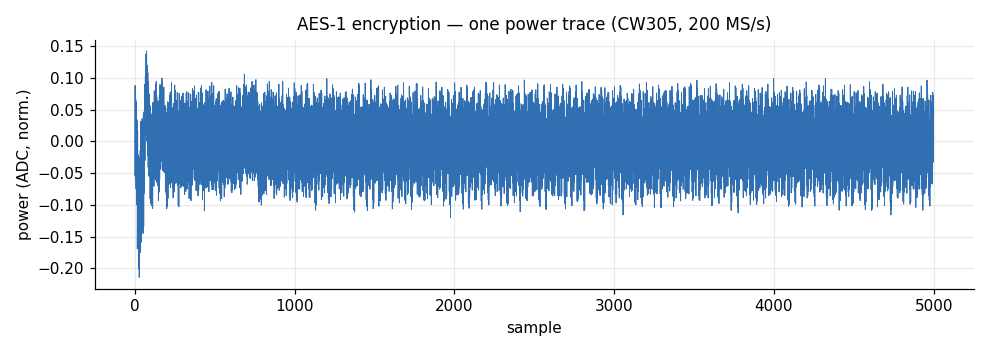

*A real AES-1 encryption trace: 5000 samples at 200 MS/s (the Husky ADC locked to the CW305's 50 MHz target clock ×4), captured over the `trigger_Out` window. This is the raw material for CPA/TVLA analysis.*

### Capture from the CLI

The fastest route to a dataset is the [CLI](CLI):

```bash
./run_cli.sh capture --core aes1 --traces 5000 --platform fpga --output experiments/aes1
```

Then load and plot in Python (the store is `.npz`, or `.h5` if `h5py` is installed):

```python
import numpy as np, matplotlib.pyplot as plt
d = np.load("experiments/aes1.npz")          # keys: traces, plaintext, key, output
plt.plot(d["traces"][0], linewidth=0.6)
plt.title("AES-1 — trace 0"); plt.xlabel("sample"); plt.ylabel("power")
plt.show()
```

---

## 1. Requirements

| Piece | Detail |
|---|---|
| Scope | ChipWhisperer **Husky** — imported lazily as `chipwhisperer`, so the module imports even without it installed |
| Target link | MCP2200 USB-UART (controller command protocol) — auto-detected |
| Target board | ASIC on CW308 (`platform="asic"`, Husky generates the clock on HS2) or the CW305 FPGA (`platform="fpga"`, CW305 runs the PROACT bitstream and its PLL provides the clock). Same software, one platform flag. |
| Host deps | `pip install -r Software/Python/requirements.txt` (adds `chipwhisperer` for capture) |
| Launching | `./run_gui.sh` / `./run_cli.sh`, **never with sudo** (sudo can't see the user-installed `chipwhisperer`). Device permissions: one-time `sudo bash tools/install_udev.sh`, then replug — see [Troubleshooting](Troubleshooting) §3. |
| Bench constants | confirm `Software/Python/proact_host/config.py` (MCP serials, input clock, GPIO pins) matches the board |

The Husky is wired both as the **scope** and, optionally, as an alternative SPI/UART transport to PROACT (Husky **GPIO3** is SPI chip-select). That transport path (`husky_spi()`) raises `NotImplementedError` today — capture uses the MCP2200 UART for control.

---

## 2. Scope setup (`default_setup` + manual fallback)

`ChipWhispererCapture.connect()` first calls the stock `scope.default_setup()`, then **overrides the settings that matter for PROACT** — so the manual values are always applied even when `default_setup()` is skipped:

```python
from proact_host.capture import ChipWhispererCapture
cap = ChipWhispererCapture(samples=5000, adc_mul=4, clock_hz=50_000_000).connect()          # ASIC
cap = ChipWhispererCapture(samples=5000).connect(platform="fpga", bitstream="PROACT_top.bit")  # CW305
```

Known-crash fallback: some Husky/Trace firmware throws a clock error inside `default_setup()`. The code swallows **only** that clock-related exception and re-raises anything else, then continues with the manual configuration:

```python
try:
    self.scope.default_setup()
except Exception as e:                 # known Husky/Trace default_setup bug
    if "clock" not in str(e):
        raise
```

Settings applied manually after `default_setup()`:

| Setting | Value | Meaning |
|---|---|---|
| `scope.adc.samples` | `5000` (default) | trace length |
| `scope.adc.offset` | `0` | capture starts at the trigger |
| `scope.adc.basic_mode` | `"rising_edge"` | trigger on the rising edge |
| `scope.trigger.triggers` | `"tio4"` | chip `trigger_Out` pin feeds tio4 |
| `scope.io.tio1 / tio2` | `high_z` (default) | the **MCP2200 owns the UART** — the Husky must not drive these lines. Pass `uart_via_husky=True` to route serial through the CW instead |
| `scope.gain` | **low mode, 10 dB** (default) | ADC gain — kept modest on purpose (see the tip); override with `ChipWhispererCapture(gain_db=...)` |

> [!TIP]
> **The default gain is deliberately modest so the traces are attackable.** The last AES round leaks in the **first ~100 samples** (see the CPA section). At high gain those samples **clip** at the ADC rail (±0.5) and the leakage is destroyed. `ChipWhispererCapture` therefore sets **low mode / 10 dB** by default — the 5000-trace capture below has `clip% = 0.00`. If the signal is weak, raise it with `ChipWhispererCapture(gain_db=15)`; if a CPA fails to converge, check for clipping in the leading samples first.

### Clocking, ASIC (HS2)

On `platform="asic"`, `set_clock()` generates the target clock on **HS2** from the Husky's internal oscillator and samples at `adc_mul ×` that rate:

| Field | Default | Note |
|---|---|---|
| `clock.clkgen_src` | `"system"` | internal oscillator |
| `clock.clkgen_freq` | `50_000_000` (50 MHz) | target clock on HS2 |
| `clock.adc_mul` | `4` | ADC samples at 4 × clkgen (≈200 MS/s at 50 MHz) |
| `io.hs2` | `"clkgen"` | route the generated clock to HS2 |

### Clocking, FPGA (CW305 PLL)

On `platform="fpga"` the CW305 provides its own clock, so **HS2 is disabled**. `connect(platform="fpga", bitstream="PROACT_top.bit")` programs the CW305 (VCCINT 1.0 V, PLL1 output 1 at the target frequency) and syncs the Husky ADC to the **external** target clock (`clkgen_src = "extclk"`). If the board is already programmed, omit `bitstream`. `cap.clock_status()` returns `platform`, `target_clock_MHz`, `adc_freq_MHz`, `hs2`, a `clock_source` string, and `locked` — **check `locked` before trusting a capture.**

---

## 3. The capture order (this matches the PROACT trigger)

The order is **not arbitrary** — it follows the verified PROACT trigger sequence. The scope must be **armed before the operation runs**, because the chip asserts `trigger_Out` *during* the crypto op; the ADC then captures autonomously and `get_last_trace()` pulls the buffered samples afterward.

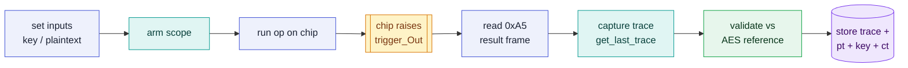

This is exactly what `PROACTExperiment.capture()` does per trace:

```python
self.chip.set_plaintext(pt)              # 1. configure inputs
self.scope.scope.arm()                   # 2. arm the scope
mode, payload = self.chip.run_and_read() # 3. run op + 4. read 0xA5 result frame
trace = self.scope.capture()             # 5. pull the trace (get_last_trace)
valid = validate_aes(self.key, pt, out)  # 6. validate against AES reference
self.store.append(trace, pt, key, out, expected, valid)  # 7. store
```

Notes:
- `run_and_read()` sends the `RDY` command (`0x05`) and reads back one `0xA5 <mode> <len> <payload>` binary frame, skipping any ASCII debug bytes.
- `capture(timeout=5.0)` raises `TimeoutError("scope capture timed out (no trigger?)")` — the usual cause is the trigger source not being routed (§4) or the scope armed too late.
- Any exception in a single iteration is logged via `store.record_failure(i, reason)` and the loop continues, so one bad trace does not abort a long run.
- With `--no-scope` (or no ChipWhisperer present), the functional run still executes and stores outputs with an **empty** trace.

---

## 4. Trigger source selection

The scope arms on `tio4`, which carries the chip's `trigger_Out` pin. On-chip, `trigger_Out` is the OR of the software trigger and all per-core triggers, passed through a **`cfg_sel` mux** (control bits **[22:20]**). Selecting the wrong source is the most common reason a capture times out.

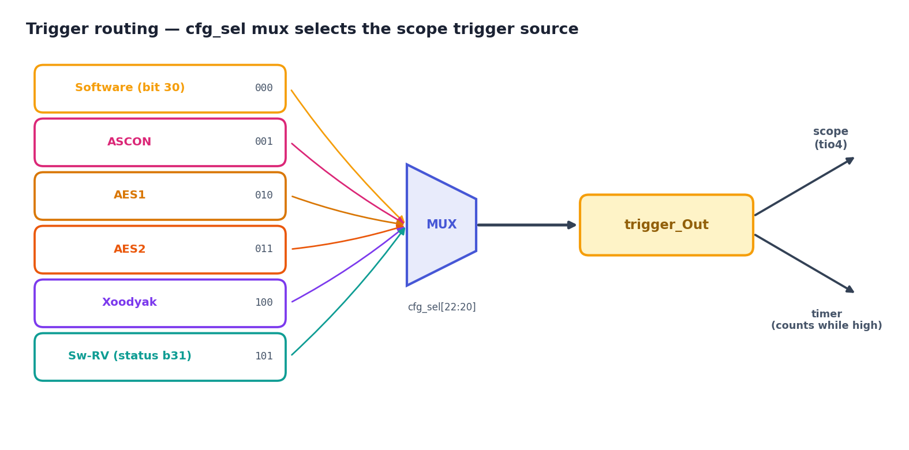

| `cfg_sel` | Source | Host name |
|---|---|---|
| `000` | control-register software trigger (**bit 30**, `0x40000000`) | `"software"` |
| `001` | ASCON core trigger | `"ascon"` |
| `010` | AES1 core trigger | `"aes1"` |
| `011` | AES2 core trigger | `"aes2"` |
| `100` | Xoodyak core trigger | `"xoodyak"` |
| `101` | Sw-RV target trigger (**status bit 31**) | `"swrv"` |

The controller firmware sets `cfg_sel` automatically to follow the selected core (`set_trigger_source()`), so a normal `select("aes1")` run routes AES1's trigger with no extra step. To override: `tgt.set_cfgsel("aes1")` (`None` = auto).

> [!NOTE]
> **Two trigger paths.** Hardware cores (AES1/AES2/ASCON/Xoodyak) trigger via their own per-core trigger, or via the **control-register capture trigger = bit 30 (`0x40000000`)** (the control side is a 31-bit field). The **Sw-RV software-AES** trigger is **status-register bit 31** (the read side is a full 32-bit register), selected by `cfg_sel = 101`. See [Address & Register Map](Address-and-Register-Map).

### AEAD phase selection (ASCON / Xoodyak only)

For the AEAD cores, the trigger can also bracket a chosen *phase*, via the 7-bit `triggercfg` field packed into `LEN[23:16]` (host: `set_trigger_cfg(cfg)`, command `TRIG` `0x0F`). Rise state selects key / nonce / AD / PT; mode bit selects whether it falls at *done* or at a named state (e.g. `0x12` = rise at nonce, fall on done). This only affects ASCON and Xoodyak.

> [!NOTE]
> **Capture the AEAD cores on encrypt.** ASCON and Xoodyak implement the encryption datapath — which is what side-channel capture measures — so that is the operation triggered and recorded. Decrypt + tag verify run offline in software (`proact_host/aead_soft.py`); see [Hardware Overview](Hardware-Overview). AES1/AES2 capture works for both encrypt and decrypt.

---

## 5. Trace storage + metadata

Storage is `TraceStore` (`storage.py`). Primary format is **HDF5** (`.h5`, gzip-compressed traces); it falls back to NumPy **`.npz`** automatically if `h5py` is not installed.

| Dataset | Contents |
|---|---|
| `traces` | float32, one row per capture |
| `plaintext` | uint8, 16 bytes/run |
| `key` | uint8, 16 bytes/run |
| `output` | uint8, chip output (ciphertext) |
| `valid` | int8 per run: `1` pass, `0` fail, `-1` unchecked |

Metadata (HDF5 `attrs`, or the `metadata` blob in `.npz`) includes `platform`, `target`, `traces_requested`, `decrypt`, `key`, `randomize`, `samples`, `created`, a `failures` log, `n_traces`, and a `trigger` string. `capture()` flushes every 50 traces, so a long run **survives interruption**. Read a run back with `from proact_host.storage import load; d = load("results/aes1.h5")`.

---

## 6. Experiment / acquisition types

All acquisitions are built from **a single input control** plus the trigger routing above. The host controls the plaintext per run:

| Type | Input control | How to run |
|---|---|---|
| **Fixed** | same 16-byte block every run (`fixed_input`, or default `bytes(range(16))`) | `--fixed` / GUI "Plaintext: fixed" |
| **Random** | fresh `secrets.token_bytes(16)` per run | default / `--fixed` off |

Built on those two:

- **CPA acquisition** (Correlation Power Analysis): many **random-plaintext** traces under a **fixed known key**. Use random input and a large `--traces` count — the stored `traces` + `plaintext` + `output` arrays are exactly what a CPA needs (see §7).
- **TVLA acquisition** (fixed-vs-random): two groups — one **fixed** input group and one **random** input group — compared with a Welch t-test offline.

The GUI exposes the same choices on its **ChipWhisperer** tab and calls the identical `PROACTExperiment` backend, so CLI, GUI and notebook captures produce the same files.

---

## 7. From traces to the key — last-round CPA

With a **fixed key** and **random plaintexts**, the chip's power consumption during the last AES round is faintly correlated with intermediate values that depend on the key. **Correlation Power Analysis (CPA)** tests every possible value of each key byte and keeps the one whose predicted leakage best matches the measured power.

The figures below are from a run on **5000 AES-1 traces captured on the CW305** with the anti-clipping gain from §2.

**Step 1 — look at the traces.** The AES operation is the burst of activity in the first ~100 samples; after that the core is idle.

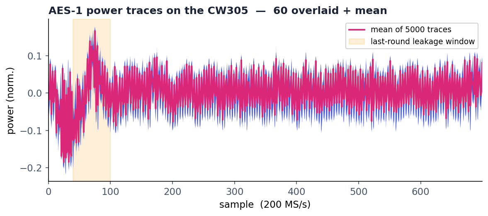

Stacking many traces as a heatmap shows the per-cycle structure repeats trace-to-trace — a good sign the captures are aligned (the CW305 hardware trigger gives sample-accurate alignment):

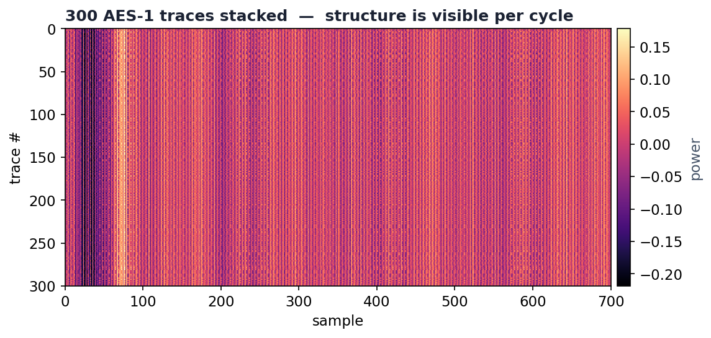

**Step 2 — the leakage model.** For AES-128 the last round has no MixColumns, so the ciphertext byte reveals the last-round state. The **last-round Hamming-distance model** predicts the power from the state transition into the ciphertext register:

$$\text{leakage} = \mathrm{HW}\big(\,\mathrm{invSBox}(ct_b \oplus k^{10}_b)\ \oplus\ ct_{\text{invShift}(b)}\,\big)$$

where `k10` is the round-10 key (run the AES key schedule backward to recover the actual key). For each key-byte guess, this prediction is correlated against every sample; the correct guess produces a sharp correlation peak.

**Step 3 — run the CPA.** A compact, dependency-light version (matches ChipWhisperer's `last_round_state_diff` model):

```python
import numpy as np
d = np.load("experiments/aes1.npz")
T  = d["traces"].astype(np.float64)          # (5000, 5000)
ct = d["output"]                             # ciphertexts (5000, 16)

SBOX = bytes.fromhex("637c777bf26b6f...")    # standard AES S-box (256 bytes)
INV_SBOX = bytearray(256)
for i, v in enumerate(SBOX): INV_SBOX[v] = i
INVSHIFT = [0,5,10,15,4,9,14,3,8,13,2,7,12,1,6,11]
HW = np.array([bin(i).count("1") for i in range(256)], float)

def recover_byte(b, window=slice(0, 120)):
    Tw = T[:, window]; Tc = Tw - Tw.mean(0)
    best, best_corr = 0, 0.0
    for g in range(256):                     # every guess for k10[b]
        st9 = np.array(INV_SBOX)[ct[:, b] ^ g]
        hyp = HW[st9 ^ ct[:, INVSHIFT[b]]]   # last-round HD model
        hc  = hyp - hyp.mean()
        corr = np.abs((hc @ Tc) / (np.sqrt((hc**2).sum()) *
                       np.sqrt((Tc**2).sum(0))))
        peak = corr.max()
        if peak > best_corr: best, best_corr = g, peak
    return best, best_corr

k10 = [recover_byte(b)[0] for b in range(16)]   # round-10 key bytes
```

The complete, runnable version (full S-box, key-schedule inversion, and a `--plot` option) ships as **[`examples/cpa_lastround.py`](https://github.com/abolfazlsajadi/PROACT_Design/blob/main/examples/cpa_lastround.py)**:

```bash
python examples/cpa_lastround.py experiments/aes1.npz --plot cpa.png
# -> RECOVERED 16/16 key bytes  (writes cpa.png)
```

**Step 4 — the correct key byte stands out.** For key byte 1, the correct guess (red) spikes at the leakage sample while all 255 wrong guesses (grey) stay in the noise:

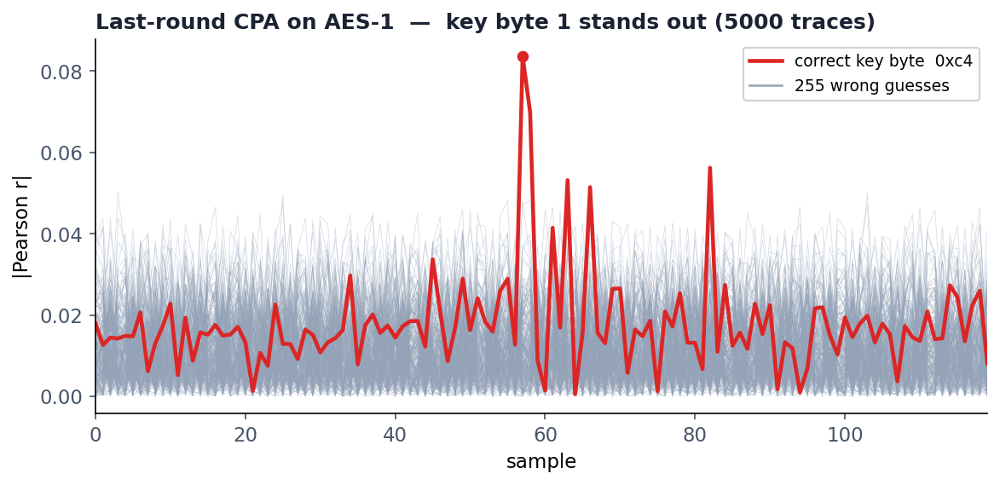

The leakage is remarkably localized — almost all bytes peak at **sample 57**, a single clock edge in the last round:

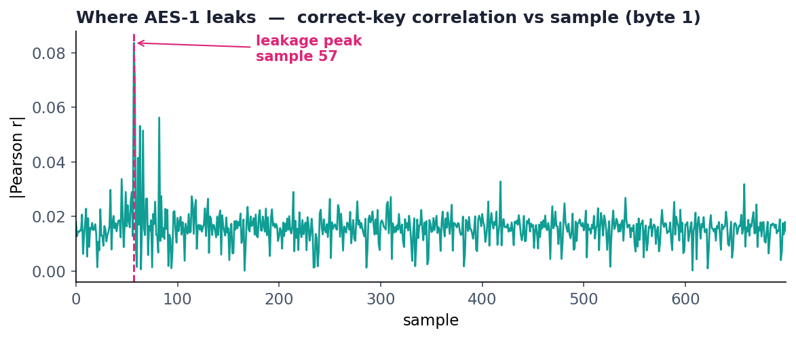

**Step 5 — more traces, more certainty.** The correct key's correlation separates from the best wrong guess as traces accumulate, and the number of recovered bytes climbs with the trace count:

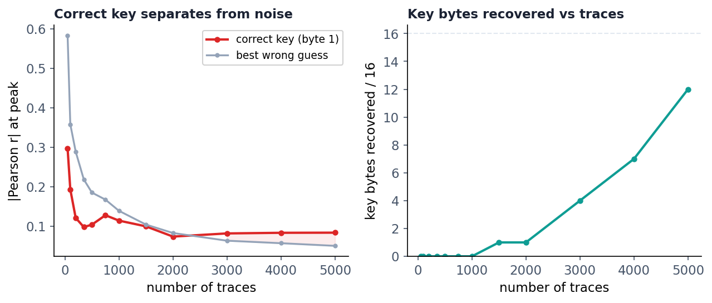

**Result.** On this 5000-trace capture the attack recovers **all 16** round-10 key bytes with the default low-pass filter. Without filtering the same traces yield only **12 of 16** — the four remaining bytes are lower-SNR, and raising the correlation (see the filtering section above) recovers them without capturing anything extra:

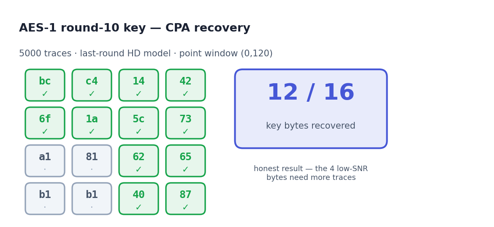

*The figure shows the unfiltered baseline (12/16); with `--filter 4` the same capture yields 16/16.*

> [!TIP]
> **ChipWhisperer's built-in analyzer.** ChipWhisperer ships an `analyzer` with the same model — `cwa.cpa(project, cwa.leakage_models.last_round_state_diff)` — plus partial-guessing-entropy tooling. The numpy version above is provided to show exactly what the attack computes. Either way, the inputs are the same three arrays PROACT stores: `traces`, `plaintext`/`output`, and the known `key`.

The on-chip **timer** counts only while `trigger_Out` is high, so `tgt.get_timer()` after a run reports the trigger-window cycle count for the captured region.

### Getting the full key: window and trace count

Two things decide whether CPA recovers **all 16** bytes. Both are common reasons an
otherwise-good capture "does not break":

1. **Correlate over the leakage window, not the whole trace.** The last round leaks
   in a *narrow* slice (here, around **sample 57**); the rest of the capture is idle
   and only adds noise. Correlating over the whole trace buries the signal — on one
   10 000-trace CW305 capture the **full window recovered 6/16** bytes while the
   **focused window recovered 15/16**. `examples/cpa_lastround.py` now defaults to
   `--window auto`, which finds that slice from the data (it prints e.g.
   `auto window: leakage peak at sample 57 -> correlating over (49,65)`); pass an
   explicit `--window lo:hi` only to override it.
2. **Capture enough traces.** On this unprotected but low-leakage FPGA AES, ~5 000
   traces recover most bytes and **~10 000–20 000 recover all 16**. Missing a byte or
   two at a low count is expected statistical variance, not a bug — capture more.

> [!NOTE]
> **Both AES cores, one attack.** AES1 (`0x10001000`) and AES2 (`0x10002000`) are the
> same AES-128 datapath, so the identical last-round model and the same script work on
> both — capture with `--core aes2` and run `cpa_lastround.py` unchanged. **ASCON and
> Xoodyak** are AEAD: the host capture path is identical (they additionally take a
> nonce/AD and select an internal trigger point — see §4), but their first-order leakage
> model is *not* the AES last round, so this AES script does not apply to them; attack
> them with an ASCON/Xoodyak-specific model instead.

> [!IMPORTANT]
> **Linux: stop ModemManager from eating the UART.** The MCP2200 re-enumerates as a new
> `/dev/ttyACM*` every time the controller is programmed. If ModemManager is running it
> probes that fresh port with AT commands for ~15–20 s, swallowing the controller's
> replies, so a capture started right after programming reads back nothing
> (`TimeoutError: no frame marker`). The repository udev rules now tag these devices with
> `ID_MM_DEVICE_IGNORE`; reinstall them (`sudo bash tools/install_udev.sh`, then replug)
> or, as a one-off, `sudo systemctl stop ModemManager`.

### Side-by-side: the three attackable cores

All three cores fall to CPA, but each needs a **different leakage model, a different
point of interest, a different filter width and a different number of traces**. Everything
below was measured on the CW305 with the reference captures in
[`datasets/`](https://github.com/abolfazlsajadi/PROACT_Design/tree/main/datasets), so it
reproduces offline without a board.

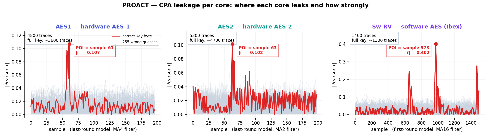

| | **AES1** | **AES2** | **Sw-RV** |
|---|---|---|---|
| Implementation | hardware AES-128 | hardware AES-128 | **software** AES (Ibex core) |
| Leakage model | last round, ciphertext-based `HW(invSBox(ct⊕k₁₀) ⊕ ct')` | same | first round, plaintext-based `HW(SBox(pt⊕k))` |
| Key recovered | round-10 key (invert the key schedule) | round-10 key | **the real key directly** |
| Trigger window | whole encryption | whole encryption | **378 cycles**, fenced to the 1st S-box |
| Point of interest | **sample ~61** | **sample ~63** | spread over **16 slots**, ~94 samples apart |
| Peak correlation ρ | 0.107 | 0.102 | **0.402** (strongest of the three) |
| Best filter width | **MA 8** | **MA 2** | **MA 16** |
| Traces, unfiltered | ~11 500 | ~6 500 | 15/16 even at 6 000 |
| **Traces, filtered** | **~3 600–4 000** | **~4 700–5 300** | **~1 300** |
| Script | `cpa_lastround.py` | `cpa_lastround.py` | `cpa_swrv.py` |

Two things stand out. The **hardware** cores compute a round in about one clock edge, so
their leakage is a single sharp spike at a fixed sample — easy to locate, but weak. The
**software** AES spends ~24 cycles per state byte, so its leakage is far stronger
(ρ = 0.40) but smeared across the window, one slot per key byte — which is why it needs
the widest filter and yet the fewest traces.

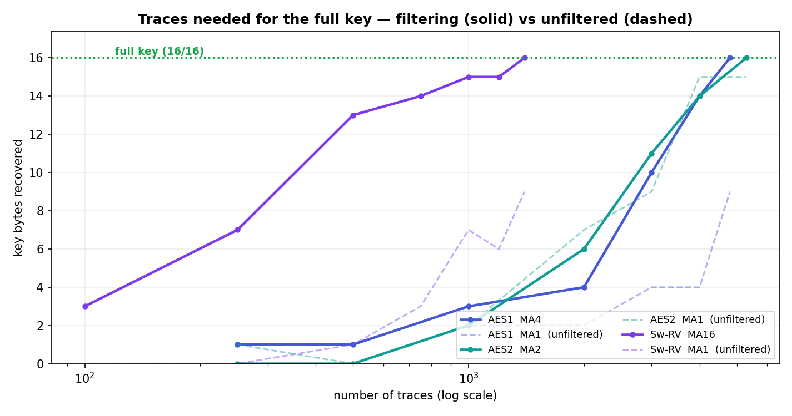

*Solid = filtered, dashed = unfiltered. Sw-RV (purple) reaches the full key with an order
of magnitude fewer traces than the hardware cores.*

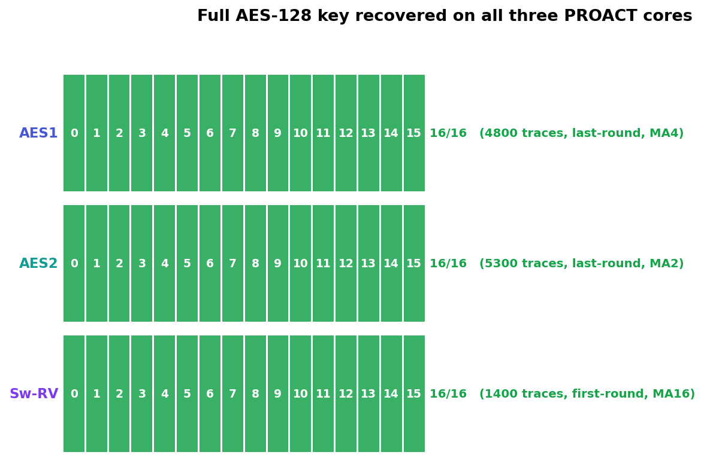

### How many traces are needed — and why filtering changes the answer

The traces required for a **full 16/16 key** are not a property of the cipher alone; they
follow from the **leakage correlation ρ** measured against the **correlation noise floor**.
Taking the maximum correlation over an `S`-sample window, that floor is approximately

$$\text{floor}(n, S) \;\approx\; \sqrt{\tfrac{2\ln S}{n}}$$

A key byte is recovered only once its ρ rises above that floor, and since the floor falls
as `1/√n`, the traces needed scale as roughly **1/ρ²**. Doubling ρ therefore cuts the trace
count by about **four times** — which is why filtering matters more than capturing more.

**Low-pass filtering** is what raises ρ. The leakage of one operation is smeared across
roughly as many samples as the operation takes, while every other sample in the window
contributes noise; averaging over about the leak width recovers that energy. The catch is
that the filter must match the **leak width**: too narrow leaves noise in, too wide smears
neighbouring intermediates together and the gain is lost.

Traces for the full key at each filter width, measured on the CW305 (★ = best):

| Filter width K | 1 (off) | 2 | 4 | 8 | 12 | 16 |
|---|---|---|---|---|---|---|
| **AES1** | ~11 500 | ~5 700 | ~4 000 | ★ **~3 600** | ~5 800 | ~5 500 |
| **AES2** | ~6 500 | ★ **~4 700** | ~5 800 | ~6 400 | ~7 100 | ~7 000 |
| **Sw-RV** | 15/16 only | — | — | — | — | ★ **1 312** |

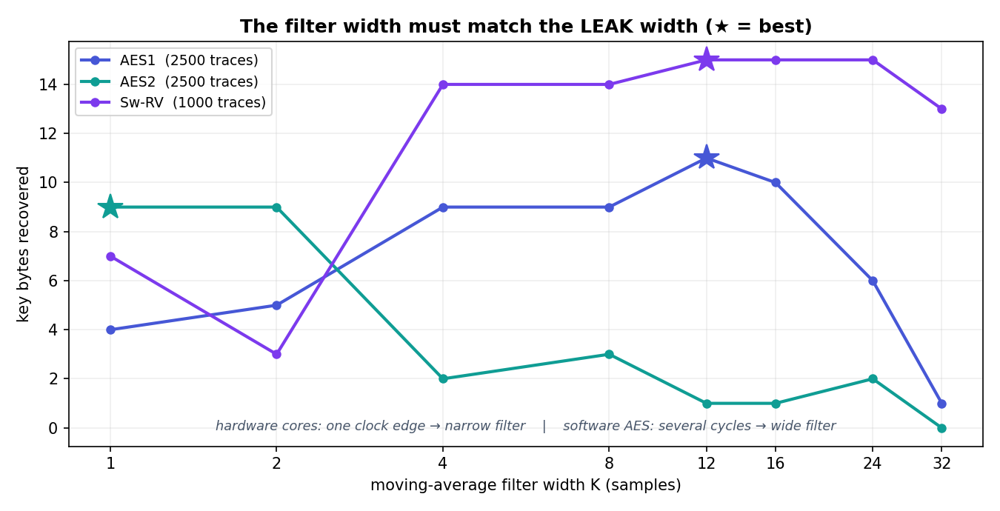

Reading it: the optimum tracks **how long the leaking operation takes**. The hardware
cores finish a round in about one clock edge, so a narrow filter is right and a wide one
*hurts* — MA 16 drops AES2 to 12/16 at 5 000 traces, from 16/16 at MA 2. The software AES spends several cycles
per state byte, so a wide filter roughly **doubles ρ (0.10 → 0.22)** and takes it from
*unrecoverable at 6 000 traces* to a full key at ~1 300.

Because the optimum differs per core, `cpa_lastround.py` **chooses the width from the data**
(`--filter auto`, the default): for each candidate it measures how far the best key guess
stands out from the other 255 (a scale-free z-score), and keeps the width that maximises it.
No key is needed, so this stays an attack rather than a calibration against a known answer.

```bash
python examples/cpa_lastround.py datasets/aes1_reference.npz     # auto -> MA4,  16/16
python examples/cpa_lastround.py datasets/aes2_reference.npz     # auto -> MA2,  16/16
python examples/cpa_swrv.py      datasets/swrv_reference.npz     # MA16,         16/16
python examples/cpa_lastround.py datasets/aes1_reference.npz --filter 1   # off -> 12/16
```

> [!TIP]
> If an attack stalls, **compare ρ against the floor above before capturing more traces**.
> Raising ρ (filter width, gain, a tighter trigger window) is usually far cheaper than the
> ~4× more traces needed to compensate for half the correlation.

### Sw-RV: attacking the software AES

The **Sw-RV** target is the second Ibex running **byte-oriented software AES-128**
(tiny-AES-c) — the reference against which the hardware AES cores are benchmarked.
Because it computes AES in software, the exploitable leakage is the **first-round S-box
output**, `HW(SBox(pt[b] ^ key[b]))`: a **plaintext-based, round-0** model that recovers
the real key directly. This is *not* the last-round ciphertext model used for the hardware
cores, so `cpa_lastround.py` does not apply to Sw-RV — use the dedicated
`examples/cpa_swrv.py` instead.

Capture and analyse exactly as for a hardware core, but with `--core swrv` (which routes
the Sw-RV trigger, status bit 31, via `cfg_sel = 101` — §4). Capturing Sw-RV first loads
its program image onto the target core; the CLI and GUI do this automatically when the
core is `swrv`:

```bash
./run_cli.sh capture --core swrv --traces 3000 --platform fpga --output experiments/swrv
python examples/cpa_swrv.py experiments/swrv.npz --plot swrv.png
```

Because software AES is byte-serial, each key byte leaks at its own sample across the
first-round window, so `cpa_swrv.py` correlates over the whole fenced span (each byte finds
its own peak) rather than one narrow window.

**Bench-measured on the CW305** (50 MHz target, `adc_mul = 4` → 200 MS/s):

| Quantity | Measured | How to get it |
|---|---|---|
| Trigger window (first SubBytes) | **378 target cycles** | on-chip timer (`get_timer()`) |
| Samples to cover it exactly | **1512** | `cycles × adc_mul` |
| Per-byte leak spacing | ~94 samples | 16 bytes, byte-serial |
| ADC full scale used @ low/20 dB | **86%**, 0% clipping | `trace_quality()` |
| Leakage strength (S-box model) | **ρ ≈ 0.10** | correlation at the known key |

Set `samples` to the measured window so the trace holds *only* the first S-box —
the CLI does this automatically (see the auto-sizing note above).

> [!IMPORTANT]
> **Trace count follows from ρ, not from luck.** The maximum correlation over an
> S-sample window has a noise floor of roughly `sqrt(2·ln(S)/n)`; a key byte is
> recovered only once its ρ clears that floor. For S = 1512: n = 250 → 0.24,
> n = 500 → 0.17, n = 1000 → 0.12, n = 1500 → 0.10. So a setup with ρ ≈ 0.25
> recovers the full key in ~250 traces, while ρ ≈ 0.10 needs a few thousand. If a
> capture needs far more traces than expected, **compare its ρ against this table**
> rather than simply capturing more.

> [!TIP]
> **Low-pass filtering is the single biggest win here — it cut the traces needed by ~10×.**
> The Sw-RV S-box leak is spread over several clock cycles (load → table lookup → store of
> one state byte), and at `adc_mul = 4` most samples in that span carry noise rather than
> signal. Averaging over the leak width recovers that energy: **ρ 0.10 → 0.22**, and the
> full key drops from *not recovered even at 6000 traces* to **16/16 at ~1300**.
> `cpa_swrv.py` applies a 16-sample moving average by default (`--filter K`, `--filter 1`
> to disable). Measured trace curve with the filter on:
>
> | traces | 250 | 500 | 750 | 1000 | **1312** | 6000 |
> |---|---|---|---|---|---|---|
> | key bytes | 7/16 | 13/16 | 14/16 | 15/16 | **16/16** | 16/16 |

Two settings that were measured and matter:

- **Gain:** low/**20 dB** is right for Sw-RV (86% of full scale, no clipping). low/10 dB
  wastes range at 26%; high/25 dB already clips 5.7% and high/33 dB clips 50%. Note that
  gain fixes ADC range usage but barely moves ρ — the noise here scales with the signal.
- **Sampling:** keep `adc_mul = 4`. Synchronous 1 sample/cycle measured *worse*
  (ρ ≈ 0.05 versus ≈ 0.10).
- **Model:** use the S-box model. `HW(pt^k)` has a higher raw ρ (~0.17) but is linear in
  the key, so wrong guesses score nearly as high and the attack stalls (10/16 at 2000
  traces) — the nonlinear S-box separates the correct key cleanly.

With the whole-encryption trigger instead of the first-S-box fence, the first-round
leakage is buried among the other nine rounds and CPA stalls at ~2/16.

> [!NOTE]
> **Why the byte-serial software leakage is recoverable.** Software AES is byte-serial, so
> each key byte's first-round S-box executes at a *different* sample. The Sw-RV target
> firmware fences the capture trigger tightly around **only the first-round `SubBytes`**
> (compile flag `SWRV_FENCE_FIRST_SBOX` in `Software/SW_RV/`), so the whole trace is that
> first S-box for all 16 bytes — a short, aligned window. Before this change the trigger
> bracketed the entire 10-round encryption and the first-round leakage was buried
> (CPA ~2/16); after it, CPA recovers the full key. `cpa_swrv.py` auto-detects the leakage
> window from the data, exactly like `cpa_lastround.py`.

The complete, runnable script ships as **[`examples/cpa_swrv.py`](https://github.com/abolfazlsajadi/PROACT_Design/blob/main/examples/cpa_swrv.py)**.

---

## 8. Quick reference

```python
from proact_host.experiment import PROACTExperiment
exp = PROACTExperiment(platform="fpga", target="aes1", traces=5000,
                       output="results/aes1", randomize=True, samples=5000)
exp.prepare()   # opens UART + scope, selects core, sets key, opens storage
exp.capture()   # configure→arm→run→read→capture→validate→store, ×5000
exp.save()      # flush + close, prints the saved path
exp.close()     # disconnect scope + UART
```

Rules that apply during capture (see [Hardware Hazards](Hardware-Hazards)):
- The capture trigger for the control-register path is **bit 30 (`0x40000000`)**, never bit 31.
- Enable a crypto core before touching it; **one core at a time** (a disabled core, `Co_re` at `0x10007000`, or an idle UART read each hang the CPU).
- Verify `clock_status()["locked"]` before trusting a trace; a `TimeoutError` on capture almost always means the trigger source (`cfg_sel`) is not routed to the running core.
- For CPA, keep the ADC out of clipping in the leading samples (§2) — that is where the last round leaks.
