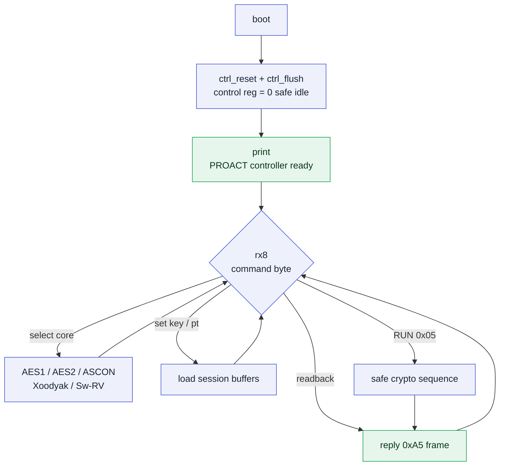
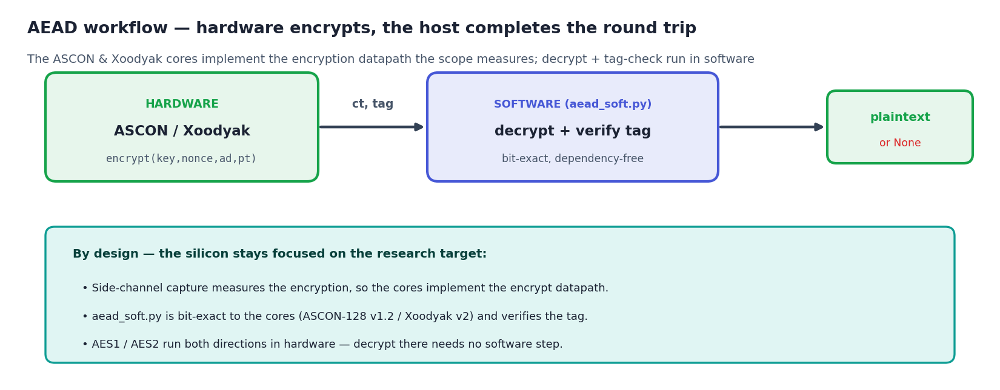

# Controller Firmware

The **controller** is one of PROACT's two [Ibex](https://ibex-core.readthedocs.io/en/latest/index.html) RISC-V cores (RV32IMC; see the official [Ibex docs](https://ibex-core.readthedocs.io/en/latest/index.html) for the CPU internals). It acts as the central command processor of the board, mediating between the host PC (over UART) and all the hardware crypto cores. Its firmware is a small, freestanding C program (no OS, no standard library) that boots, prints `PROACT controller ready.`, and then enters an infinite loop, reading one-byte commands from the UART and acting on them.

All of this targets the frozen, fabricated silicon. The firmware never changes hardware behavior — it only drives the hardware along the **safe sequences** that the silicon requires (see [hardware_hazards.md](hardware_hazards.md)). Source lives in `Software/Controller/`.

> [!NOTE]
> **Status note.** This protocol has been exercised on the real CW305 FPGA build — the unified A-Z self-check (`Software/Python/proact_host/fullcheck.py`, `run_full_check()`) passes in full against it, including the on-chip AEAD encrypt KAT. The fabricated ASIC has not been screened yet; the same self-check serves as the screening tool. Testing labels used below carry the following precise meanings: **RTL-simulated** (iverilog), **unit-tested** (host protocol / AES reference), or **hardware** (real CW305 run).

---

## 1. Firmware overview

`main.c` is a **command server**. After a one-time reset of the control register, it runs an infinite loop:

1. Block on the UART until a command byte arrives (`rx8()`).
2. Dispatch on that byte (see the [command table](#4-uart-command-protocol-0x010x1a)).
3. For a *run* command, drive the currently selected crypto core through its safe hardware sequence and — if binary read-back is enabled — send the result back as a framed binary packet.

It maintains session state between commands: the selected core, the key/plaintext/nonce/AD buffers, encrypt-vs-decrypt, the in-core trigger config, and whether to echo results.

```
main()
  ├─ ctrl_reset(); ctrl_flush();       // control register = 0 (safe idle)
  ├─ puts("PROACT controller ready.\n")
  └─ for(;;)  { cmd = rx8(); switch(cmd){ ... } }   // command loop
```

The same command server as a diagram — a single boot phase followed by the perpetual dispatch loop:



The loop **never calls the legacy `sim_halt()`** (a write to UART `+0x08` would hang the CPU indefinitely, hazard H4). Firmware that needs to stop should use `proact_idle_forever()` from the shared library instead.

---

## 2. Driver modules

The command server itself is deliberately thin. The device-specific work is performed by per-subsystem driver modules, each of which encodes the safe hardware sequence for its device so that `main.c` does not need to implement the hazard rules directly.

| Module | Files | Responsibility |
|---|---|---|
| **ctrl** | `proact_ctrl.c/.h` | WRITE side of the control register `0x20000000`. Keeps a software *shadow*, mutates it with `CTRL_*` bit macros, flushes with `ctrl_flush()` (which masks to the 31-bit control field, H5). |
| **status** | `proact_status.c/.h` | READ side of the same address `0x20000000`. `status_read()`, `status_wait(mask)` — status reads always ack, so spin-waiting here can never hang the bus. |
| **aes** | `proact_aes.c/.h` | The two hardware AES-128 cores (AES1 `0x10001000`, AES2 `0x10002000`). `aes_run()` performs the full reset→setup→load→start→wait→read→reset ECB sequence. |
| **aead** | `proact_aead.c/.h` | One unified driver for **both** AEAD cores (ASCON `0x10005000`, Xoodyak `0x10003000`) — their register maps are byte-identical. `aead_run()` handles key/nonce shift-in, AD/PT FIFOs, the `LEN` word, and CT/TAG read-back. AEAD **decryption runs on the host** — see the AEAD note in §4. |
| **aead_kat** | `proact_aead_kat.c/.h` | On-chip known-answer **encrypt** test for ASCON + Xoodyak using the hardware design team's exact reference vectors (variable-length AD/PT) and expected CT+TAG. Driven by `CMD_AEADKAT` (`0x1A`); each core is bounded-waited, so a stuck core reports fail instead of wedging the command server. |
| **swrv** | `proact_swrv.c/.h` | The Sw-RV *target* core: load its Imem/Dmem, release it from reset (`CTRL_ENABLE_TARGET`), and run software-AES blocks through the shared data-RAM mailbox. |
| **experiments** | `proact_experiments.c/.h` | Power-on / on-demand self-tests: AES1+AES2 known-answer + decrypt, and ASCON/Xoodyak encrypt→decrypt round-trip. The AEAD decrypt half of that round-trip **runs on the host by design** (§4) — use `CMD_AEADKAT` for the AEAD hardware-encrypt check. |

All device access goes through the shared library `Software/common/` (`dev_read`/`dev_write`, and the **paced** `putchar`/`puts`/`put_hex` plus the safe `uart_getchar`). The register names (`PROACT_*_BASE`, `CTRL_*`, `STAT_*`, `AES_*`, `AEAD_*`) come from `proact_regs.h`, which is **generated** from `config/hardware.json` — never hand-edited.

### C function reference

Every public firmware function, by module. Each driver encodes the safe hardware
sequence for its device, so callers do not interact with the hazard rules directly.

**`proact_common.h` — bus + paced UART**
| Function | Purpose |
|---|---|
| `uint32_t dev_read(uint32_t addr)` | 32-bit bus read (always ack on mapped addrs). |
| `void dev_write(uint32_t addr, uint32_t val)` | 32-bit bus write. |
| `void putchar/puts/put_hex(...)` | Paced UART output (waits for `tx` space; can't overrun). |
| `int uart_getchar(void)` | Blocking UART read (checks `rx_valid` first — never hangs the bus). |

**`proact_ctrl.h` — control register (write side, `0x20000000`)**
| Function | Purpose |
|---|---|
| `void ctrl_set(uint32_t bits)` / `ctrl_clr(uint32_t bits)` | Set/clear bits in the software shadow. |
| `void ctrl_flush(void)` | Write the shadow to hardware (masks to the 31-bit control field, H5). |
| `void ctrl_flush_debug(int debug)` | Flush and optionally print the value. |
| `void ctrl_reset(void)` | Zero the control register. |
| `ctrl_trigger_on()/off()` (inline) | Raise/lower the capture trigger (control **bit 30**). |

**`proact_status.h` — status register (read side)**
| Function | Purpose |
|---|---|
| `uint32_t status_read(void)` | Read `0x20000000`. |
| `int status_test(uint32_t mask)` | True if all `mask` bits are set. |
| `void status_wait(uint32_t mask)` | Spin until `mask` is set (status reads always ack). |
| `int status_wait_timeout(uint32_t mask, uint32_t spins)` | **Bounded** wait — returns 0 on timeout so a dead core can't wedge the server. |

**`proact_aes.h` — the two AES-128 cores**
| Function | Purpose |
|---|---|
| `void aes_run(proact_aes_core_t core, const uint32_t key[4], const uint32_t in[4], uint32_t out[4], int decrypt, uint32_t triggercfg)` | Full ECB block: reset → enable → load key/input → start → bounded-wait done → read result. |
| `void aes_reset(proact_aes_core_t core)` | Clean-reset one core (`PROACT_AES1`/`PROACT_AES2`). |

**`proact_aead.h` — ASCON + Xoodyak (one driver; AEAD decrypt in software)**
| Function | Purpose |
|---|---|
| `void aead_run(core, key[4], nonce[4], ad, pt, ct, tag, ad_len, pt_len, decrypt, triggercfg, verbose)` | One AEAD op: key/nonce shift-in, AD/PT FIFOs, `LEN` word, start, read CT+tag. Runs AEAD **encrypt** on-chip; decrypt is done on the host with `aead_soft` (the `decrypt=1` path is bounded, so it never spins). |
| `void aead_reset(proact_aead_core_t core)` | Clean wrapper reset (safe order). |

**`proact_aead_kat.h` / `proact_swrv.h` / `proact_experiments.h`**
| Function | Purpose |
|---|---|
| `int aead_kat_run(void)` | On-chip ASCON+Xoodyak reference-vector KAT; returns a 2-bit mask (bit0 Xoodyak, bit1 ASCON). |
| `void swrv_enable/disable(void)` | Release / hold the Sw-RV target (gates its reset). |
| `void swrv_load_imem_word/dmem_word(off, word)` | Write one word of target instruction/data memory (target held in reset by `CMD_LDI`). |
| `int swrv_aes_block(key[4], in[4], out[4], decrypt, timeout)` | Run one software-AES block on the target via the mailbox (bounded). |
| `void swrv_select_trigger(void)` | Route the target's trigger (status bit 31) to the scope pin. |
| `int aes_experiments/ascon_experiments/xoodyak_experiments/run_all_experiments(uint32_t debug)` | Power-on / on-demand self-tests. |

### Worked example — a custom experiment in C

Add a case to `main.c` (or a new module) that encrypts with AES-1, brackets the
operation with the capture trigger, and reports the cycle count:

```c
#include "proact_aes.h"
#include "proact_ctrl.h"
#include "proact_status.h"
#include "proact_regs.h"

uint32_t key[4] = {0xABCDEF01, 0x12345678, 0xDEADBEEF, 0x87654321};
uint32_t pt [4] = {0x12345678, 0xABCDEF01, 0x87654321, 0xDEADBEEF};
uint32_t ct [4];

ctrl_trigger_on();                       /* raise the scope trigger (bit 30)     */
aes_run(PROACT_AES1, key, pt, ct,        /* full ECB encrypt, bounded-wait done  */
        /*decrypt=*/0, AEAD_TRIG_DEFAULT);
ctrl_trigger_off();                      /* lower the trigger                    */

uint32_t cycles = dev_read(PROACT_TIMER_BASE);   /* trigger-window cycle count   */
put_hex(ct[0]); putchar('\n');
```

Adding a host command follows a **three-step procedure** (used by `CMD_AEADKAT` itself): pick a
free command byte and constant; add a `case` in `main.c` that parses its payload
and calls the new code; reply with `send_frame(MODE_x, payload, len)` and add a
one-line method to `ProactTarget` on the host. See [Python API](Python-API) for the
host side.

> The controller is a [lowRISC Ibex](https://ibex-core.readthedocs.io/en/latest/index.html)
> RV32IMC core — see the official Ibex docs for the CPU, CSRs and boot behavior.

---

## 3. The binary result frame (`0xA5`)

When binary read-back is enabled (command `0x03`), every *run* emits one frame **after** the operation (and the read-back commands `0x10`, `0x16`, `0x19`, `0x1A` reply with a frame too):

```
0xA5  <mode:1B>  <len:1B>  <payload: len bytes>
```

- `0xA5` is the sync marker. Because it is `> 0x7F`, it can never collide with ASCII debug text, so the host can always resynchronize on it even when debug printing (`0x04`) is on.
- `len` is the payload length in **bytes** (= number of 32-bit words × 4).
- Payload words are sent **big-endian**.

| `mode` | Meaning | `len` | Payload |
|---:|---|---:|---|
| `0x00` | AES1 result | `0x10` | 16-byte ciphertext/plaintext |
| `0x01` | AES2 result | `0x10` | 16-byte result |
| `0x02` | Xoodyak result | `0x20` | 16-byte CT + 16-byte TAG |
| `0x03` | ASCON result | `0x20` | 16-byte CT + 16-byte TAG |
| `0x04` | Sw-RV software-AES result | `0x10` | 16-byte result |
| `0xF1` | Timer read (`0x10` cmd) | `0x04` | 32-bit trigger-window count |
| `0xF2` | Status read (`0x16` cmd) | `0x04` | 32-bit status register |
| `0xF3` | Peek result (`0x19` cmd) | `0x04` | 32-bit word read at the requested address |
| `0xF4` | AEAD KAT result (`0x1A` cmd) | `0x04` | 32-bit pass mask: bit 0 = Xoodyak, bit 1 = ASCON (`0x3` = both pass) |

All transmit bytes go through the self-pacing `putchar`/`tx_raw` path, which keeps output within the 512-byte TX FIFO (hazard H4).

---

## 4. UART command protocol (`0x01`–`0x1A`)

The host drives the controller by sending single command bytes, some followed by a fixed number of data bytes. Multi-byte values (keys, words, addresses) are **big-endian**. Hosts implementing only `0x01`–`0x0C` remain fully compatible — the newer opcodes are additive.

| Byte | Name | Extra bytes | Action |
|---:|---|---|---|
| `0x01` | KEY | 16 | Load the 128-bit key |
| `0x02` | PT | 16 | Load the 128-bit plaintext (or ciphertext when decrypting) |
| `0x03` | SB | — | Turn **binary send-back on** (emit an `0xA5` frame after each run) |
| `0x04` | DBG | — | Turn ASCII debug prints on |
| `0x05` | RDY | — | **Run** the selected core once |
| `0x06` | AES2 | — | Select hardware AES2 |
| `0x07` | XOO | — | Select Xoodyak |
| `0x08` | ASC | — | Select ASCON |
| `0x09` | AES1 | — | Select hardware AES1 |
| `0x0A` | ARM | — | Toggle: wait for external `trigger_in` (status bit 1) before each run |
| `0x0B` | NONCE | 16 | Load the 128-bit nonce (AEAD) |
| `0x0C` | AD | 16 | Load 16 bytes of associated data (AEAD) |
| `0x0D` | DEC | 1 | `0` = encrypt, non-zero = decrypt |
| `0x0E` | SEED | 4 | Seed the RNG (write-only — the controller **cannot read** the RNG, hazard H7) |
| `0x0F` | TRIG | 1 | In-core AEAD trigger-phase select, `triggercfg` (masked to 7 bits) |
| `0x10` | TIME | — | Report the trigger-window timer count (frame `0xF1`, or ASCII if send-back off) |
| `0x11` | TEST | — | Run all self-tests (`run_all_experiments`; the AEAD encrypt→decrypt half reports FAIL on silicon — expected, see the decrypt note below) |
| `0x12` | LDI | 4 + N×4 | Load Sw-RV **Imem**: 32-bit `count`, then `count` words. Holds the target in reset while loading, so a following SWRV boots the fresh code |
| `0x13` | LDD | 4 + 4 + N×4 | Load Sw-RV **Dmem**: 32-bit `count`, 32-bit absolute `base`, then words |
| `0x14` | SWRV | — | Select software-AES on the Sw-RV target (releases it from reset and routes its trigger) |
| `0x15` | CFGSEL | 1 | Set the trigger-source mux; `0xFF` = auto (follow the selected core) |
| `0x16` | RDSTAT | — | Read the status register (frame `0xF2`, or ASCII if send-back off) |
| `0x17` | WRCTRL | 4 | Write a raw 32-bit control value (bit 31 masked so the shadow and the chip agree) |
| `0x18` | POKE | 4 + 4 | Raw bus **write**: 32-bit address, then 32-bit value — intended for bring-up debugging; allows the host to replay an exact hardware sequence without a firmware rebuild |
| `0x19` | PEEK | 4 | Raw bus **read**: 32-bit address (frame `0xF3`, or ASCII if send-back off) |
| `0x1A` | AEADKAT | — | Run the on-chip ASCON + Xoodyak known-answer **encrypt** test (frame `0xF4`; host API `ProactTarget.aead_kat()` → `(xoodyak_ok, ascon_ok)` — both PASS on hardware) |

Unknown bytes are ignored (with a `bad cmd` note only when debug is on).

### Example: one AES1 encryption

Host sends (spaces for clarity only):

```
09                                     select AES1
01  000102030405060708090a0b0c0d0e0f   load key
02  00112233445566778899aabbccddeeff   load plaintext
0D  00                                 encrypt
03                                     enable binary send-back
05                                     RUN
```

Device replies with one frame:

```
A5 00 10  <16-byte ciphertext>
```

For an AEAD core (`0x07`/`0x08`), additionally send `0x0B` NONCE and `0x0C` AD before `0x05`; the reply is `A5 <02|03> 20 <16B CT><16B TAG>`.

> [!WARNING]
> **AEAD decryption runs on the host — by design.** The ASCON and Xoodyak cores implement the **encryption** datapath, which is what side-channel capture measures (rationale on [Hardware Overview](Hardware-Overview)). Decryption and tag verification run on the host with `Software/Python/proact_host/aead_soft.py`, a bit-exact ASCON-128 / Xoodyak-v2 implementation validated against the silicon's own CT+TAG, so the working flow is *hardware encrypt → software decrypt + tag verify*. On the firmware side the only implication is that `aead_run()`'s `decrypt=1` path is bounded (`status_wait_timeout`), so a stray on-chip decrypt attempt returns promptly instead of spinning. AES1/AES2 do both directions in hardware.



*Hardware encrypts and emits CT+TAG; decrypt and tag verify happen on the host in `aead_soft.py` — the AEAD cores implement the encryption datapath.*

---

## 5. Building the firmware

Build with `make` inside `Software/Controller/` (the register header must already be generated by `scripts/gen_hardware.py`):

```bash
make -C Software/Controller     # -> main.vmem (one combined image; + .elf, .bin, .dis)
```

Toolchain and flags come from the `Makefile`: a `riscv32-unknown-elf-` GCC, `-march=rv32im -mabi=ilp32 -mcmodel=medany`, freestanding (`-nostdlib -nostartfiles`), linked with `common/link_controller.ld` and `common/crt0.S`. Override the toolchain prefix if the installed toolchain differs:

```bash
make -C Software/Controller RISCV=/path/to/riscv32-unknown-elf-
```

### Rationale for the single combined `.vmem` image

The controller's **instruction** memory (base `0x00100000`) and its **data RAM** (base `0x02100000`) are **separate, non-adjacent** regions, and the Imem is not data-readable. The build emits **one** combined, absolute-addressed image — the SPI code loader routes each word by its address (`data_addr_spi[23]`: 0 → Imem, 1 → data RAM), so `.text` and `.data`/`.rodata` can share a single vmem:

| Image | Contents | Loads into |
|---|---|---|
| `main.vmem` | `.text` (with vectors) **and** `.rodata` + `.data` | Imem at `0x00100000` and data RAM at `0x02100000` |

`srec_cat` places `.text` at offset `0x00100000` and the data at `0x02100000` and emits records **only where there is data** (the 32 MB gap therefore adds nothing to the image size — no ~87 MB zero-fill). Each word is byte-swapped (`srec_cat ... -byte-swap 4`) for the SPI code loader. `.bss` is zeroed at boot by `crt0`, so it is not in the image at all. `main.dis` is a disassembly for debugging.

(The Sw-RV target is built the same way in `Software/SW_RV/` and produces its own `sw_rv_imem.vmem` + `sw_rv_dmem.vmem`.)

---

## 6. The safe crypto sequence

The drivers encapsulate the bus access contract: a core must be enabled before it is accessed and cleared down in order (H1/H3), and the control register must be addressed as the 31-bit field it is (H5). The firmware enforces the following rules:

- **Enable before touch.** A core only acks the bus while its `ENABLE_*` bit is set. Setting the enable bit is always flushed *before* any read/write of that core's registers.
- **One core at a time.** Treat the per-core enables as mutually exclusive.
- **Clear-down in the safe order.** De-assert `START`/`DEC` *while still enabled*, flush, then drop `ENABLE`. (Dropping enable first strands the start state, and AES `DONE` is only valid while `START` is held high.)
- **Reset between runs.** A clean enable toggle clears wrapper state — this prevents the previously observed "second experiment hangs" failure mode.
- **Trigger is control bit 30** (`CTRL_TRIGGER`, `0x40000000`), never bit 31.
- **One shadow, one writer** for the control register (H9).

`aes_run()` implements exactly this for a hardware AES-128 ECB block:

```
reset(core)                     // safe-order clean state
enable + mode (dec?), flush     // BEFORE touching AES regs
write KEY0..3, DATA0..3
set START (held high), flush
status_wait(DONE_AESx)          // status reads always ack -> cannot hang
read RESULT0..3
reset(core)                     // clean shutdown, safe order
```

`aead_run()` (ASCON/Xoodyak) follows the same skeleton, with the AEAD-specific middle: key and nonce are shifted in MSW-first (4 writes each), AD and PT go into their FIFOs, the `LEN` word packs `{triggercfg[23:16], pt_len[15:8], ad_len[7:0]}` in **byte** lengths, `START` is a short pulse (set→clear), then CT and TAG are read back. In-core trigger phase is chosen with the `AEAD_TRIG(...)` macros (default `0x12` = rise at nonce, fall on done). `aead_run()` runs AEAD **encrypt** on-chip; decrypt is done on the host with `aead_soft` (the `decrypt=1` path is bounded — see the §4 note).

For **Sw-RV** software-AES, the order at the protocol level is: load code (`0x12` LDI, `0x13` LDD), then `0x14` SWRV (which releases the target from reset so it boots from `0x00100000` and routes its trigger, status bit 31, to the scope), then load key/plaintext and `0x05` RUN. The controller and target communicate only through the shared data-RAM mailbox with one command word and one done-poll per block.

### Verification status

| Layer | Status |
|---|---|
| `proact_regs.h` vs frozen RTL | RTL cross-checked, 34/34 constants agree (`tools/verify_regs_vs_rtl.py`) |
| AES driver register sequence | RTL-simulated — reproduces the known-answer ciphertext against the real `aes_core` (iverilog) |
| Controller firmware build | Builds clean (0 warnings), one combined vmem image |
| Host protocol + AES reference | Unit-tested (byte-stream + FIPS-197 vector) |
| AEAD encrypt (ASCON/Xoodyak) | **Hardware** — on-chip KAT (`CMD_AEADKAT`) passes on the real CW305: CT+TAG match the reference vectors |
| On the real CW305 FPGA build | **Passes** — the unified A-Z self-check (`fullcheck.py`, `run_full_check()`) completes with every check passing: UART link + baud, AES1/AES2 encrypt KAT + decrypt round-trip, ASCON/Xoodyak on-chip encrypt KAT + software decrypt round-trip, timer, control write, PRNG, Sw-RV software AES, scope capture |
| On the fabricated ASIC | Not yet screened — the same A-Z self-check is the chip-screening tool |

---

## See also

- [Address & Register Map](address_map.md) — canonical bases, control/status bits, core offsets
- [Hardware Hazards](hardware_hazards.md) — the silicon traps H1–H9 the drivers work around
- [Bring-up Guide](bringup_guide.md) — program → run → capture flow
- `examples/PROACT_Tutorial.ipynb` — runnable, section-by-section tutorial of the Python and C libraries: connect + program, register access, AES1/AES2 encrypt/decrypt, AEAD hardware encrypt + software decrypt, PRNG, Sw-RV loading, ChipWhisperer capture, and the full A-Z self-check
