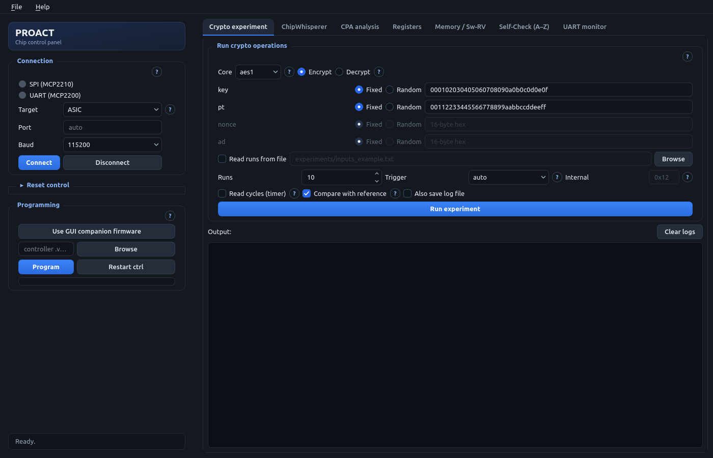
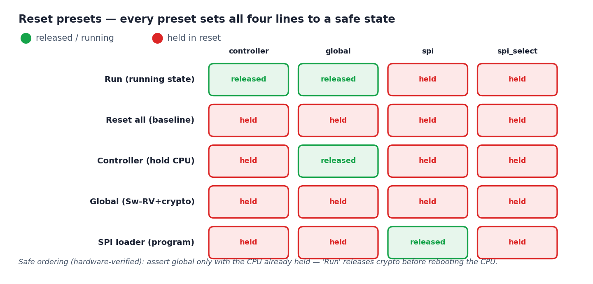
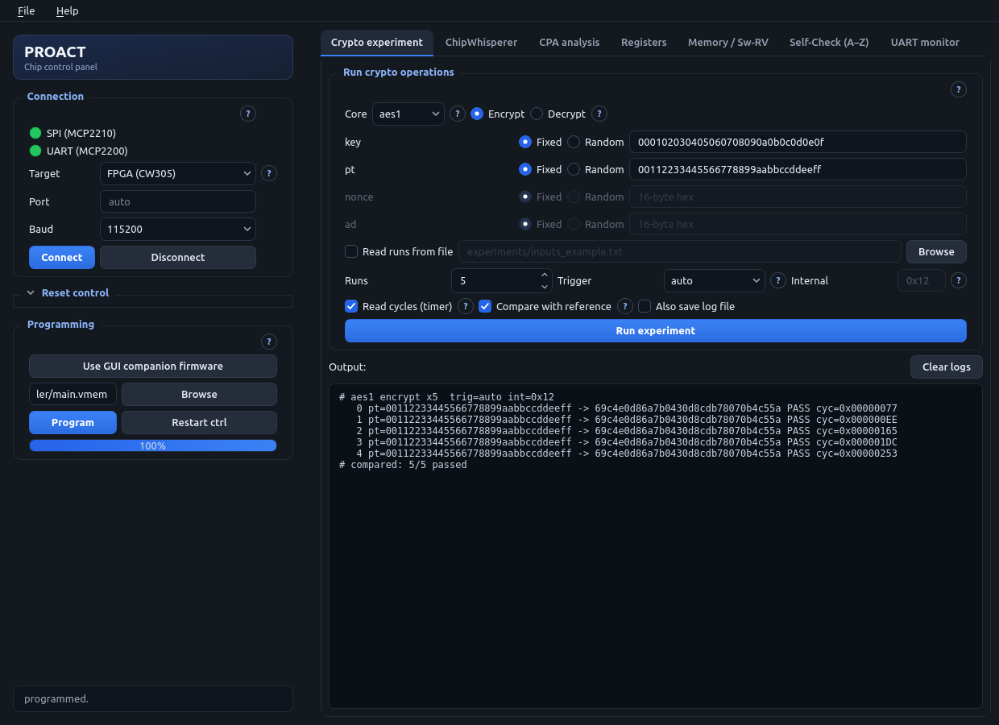
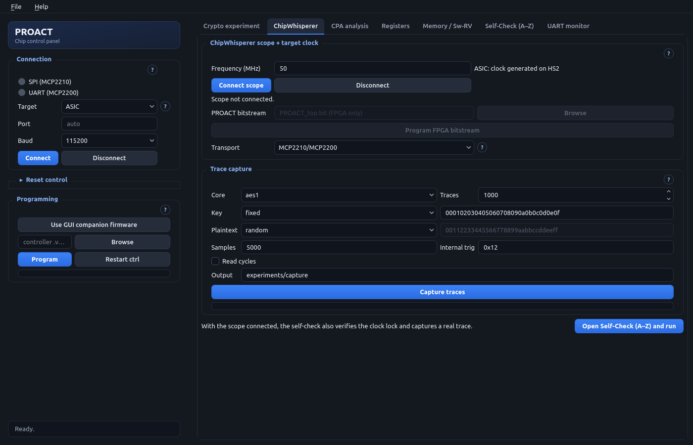
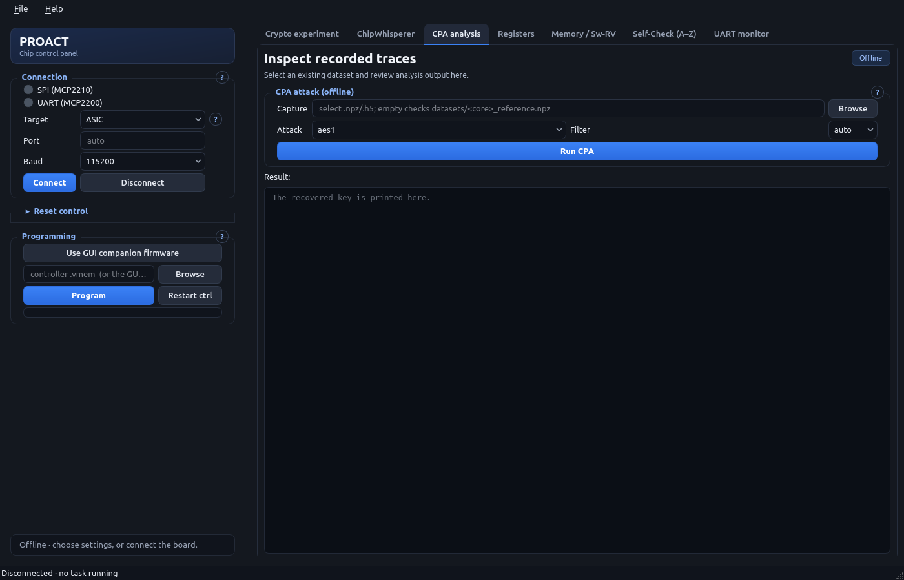
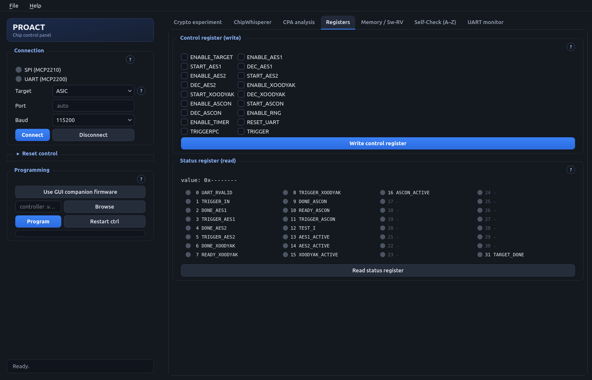
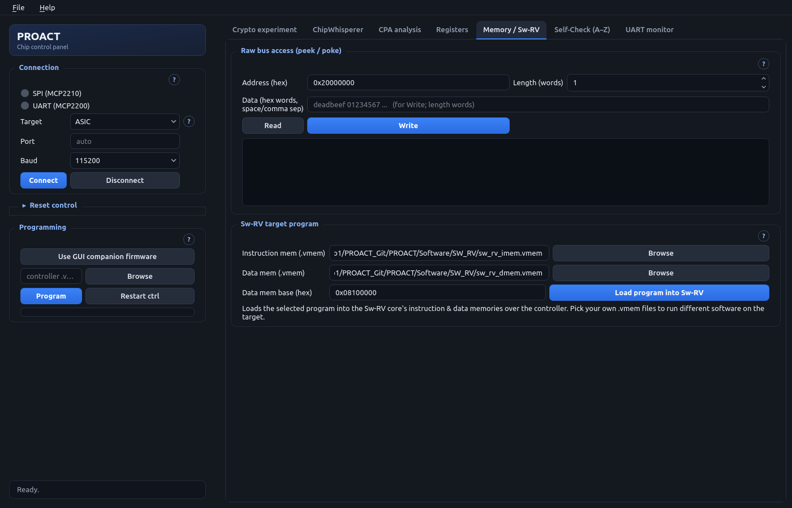
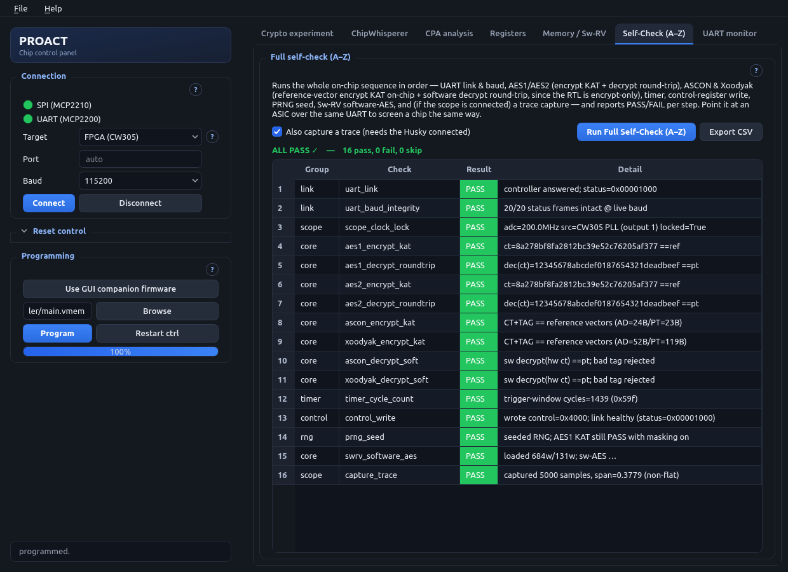
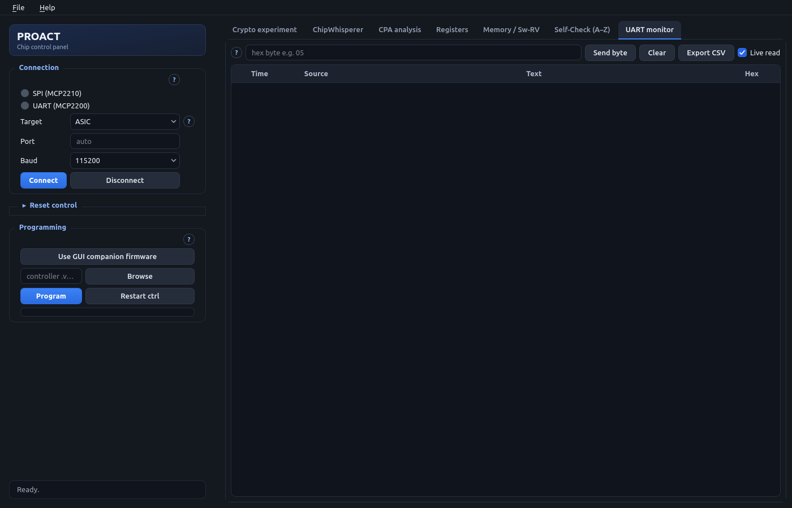

# GUI Guide

The PROACT GUI (`Software/GUI/proact_gui.py`) is a PyQt6 control panel for the
bench. It is a thin front-end: every button drives the same `proact_host` Python
backend that the CLI and notebooks use, so there is no separate GUI-only serial,
SPI, or capture code to keep in sync.

This page describes each panel for new users. It does **not** replace the
[Bring-up Guide](../bringup_guide.md) or the hazard rules in
[hardware_hazards.md](../hardware_hazards.md) — consult those documents as well.

> [!NOTE]
> **Status note (2026-08-07):** the workflow this page describes has been driven
> from the GUI on real hardware — the PROACT FPGA build on a real CW305 board
> with a ChipWhisperer Husky (the sole exception, the Husky-routing transport
> option, still needs bench verification and is flagged where it appears). In
> that run: **Connect** uploaded `PROACT_top.bit`
> and brought up the CW305 PLL (output 1) at 50.0 MHz, locked; **Program**
> streamed `Software/Controller/main.vmem` over SPI to 100% and restarted the
> controller; **Read status register** returned `0x00001000`; five `aes1`
> encryptions all produced `69c4e0d86a7b0430d8cdb78070b4c55a` — the FIPS-197
> AES-128 known-answer vector for key `000102…0f` / plaintext `00112233…ff` —
> for `compared: 5/5 passed`; and the full **Self-Check (A–Z)** reported **ALL
> PASS — 16 pass, 0 fail, 0 skip**, including a real Husky trace capture (5000
> samples, non-flat) and the Sw-RV software-AES step. The fabricated ASIC is the
> same design; the same self-check is the intended chip-screening procedure for
> it. **The fabricated ASIC has since been screened with this same GUI and passes:
> 16 pass / 0 fail / 0 skip**, including the ChipWhisperer clock lock and a real trace
> capture on silicon. Sustained unattended capture campaigns also run from the CLI.
> The original 16/16 above is the CW305 FPGA build, on Linux.



## Launch

```
# once: build the dedicated Python environment (~/.proact-venv)
bash tools/setup_env.sh

# once: install the USB permission (udev) rules, then REPLUG the USB devices
sudo bash tools/install_udev.sh

# every time
./run_gui.sh
```

Always launch via `./run_gui.sh` (and the CLI via `./run_cli.sh`): the script
picks the right interpreter — the dedicated `~/.proact-venv`, or a system
Python that has the packages — which avoids the common pyenv pitfall where a bare
`python3` resolves to a different version missing PyQt6/hid/mcp2210/chipwhisperer.

> [!WARNING]
> **Never run the GUI or CLI with `sudo`.** Device permissions come from the
> udev rules above (one-time install, then replug). Running as root
> *breaks* ChipWhisperer, which is installed under the user's `~/.local` for
> the user's Python.

The window opens with a fixed **sidebar** on the left (the PROACT header, then
Connection, Reset control, Programming) and a **tabbed center** on the right —
**seven pages, one per workflow step**: Crypto experiment, ChipWhisperer, CPA
analysis, Registers, Memory / Sw-RV, Self-Check (A–Z), UART monitor. Each page
carries the panels of a single step, so no page has to be scrolled on a normal
desktop window.

In the sidebar, **Connection** and **Programming** are always visible. **Reset
control** sits between them as a **collapsible panel that starts collapsed** —
it is a bring-up tool rather than a per-run control, so it stays folded away
until needed. Click its header (or the chevron next to the title) to expand it,
and click again to fold it back.

The interface uses a dark theme throughout: each panel is a rounded card with
its title on the border, the **blue buttons** are the primary action of each
panel, and the **status chip** at the bottom of the sidebar shows the most
recent status message. Every panel has a small **`?` help button**; click it
for a short reminder pulled from the built-in help text. The window opens
centred on the screen at `min(1500, screen width − 60) × min(1000, screen
height − 60)` logical pixels, so it fits HiDPI and small displays, and it can
be resized freely.

---

## Sidebar

### Connection panel

Auto-detects and opens both USB bridges: the **MCP2210** (SPI code loader) and the
**MCP2200** (UART link to the controller).

| Field | Meaning |
|---|---|
| **SPI (MCP2210)** LED | SPI bridge state (see LED colours below) |
| **UART (MCP2200)** LED | UART bridge state |
| **Target** | `ASIC` (Husky generates the clock on HS2) or `FPGA (CW305)` (the CW305's own PLL clocks the design; upload the PROACT bitstream from the ChipWhisperer tab). Both are then programmed over SPI and driven over UART identically |
| **Port** | Leave blank to auto-detect the MCP2200; type a device name to override |
| **Baud** | `115200` (default), `38400`, `19200`, or `9600` |
| **Connect / Disconnect** | Open / close both links |

**Connection LED colours** (SPI and UART):

| Colour | Meaning |
|---|---|
| 🟢 Green | Link opened OK |
| 🔴 Red | Error opening the link (details go to the UART monitor log) |
| ⚪ Gray | Not connected / disconnected |

If the UART opens but the SPI does not (or vice-versa), the link that opened
remains available — programming needs SPI, experiments need UART.

### Reset control

This panel is **collapsed by default** — click the *Reset control* header (or its
chevron) to expand it. Collapsing is purely visual: the reset lines keep their
state and the once-per-second read-back poll keeps running whether the panel is
folded or open.

Two mechanisms control the MCP2210 GPIO reset lines. **Every preset sets all four
lines to a complete, deterministic, safe state** — the result never depends on
what a previous click left behind.

**Presets** — pick one radio button and click **Apply preset**:

| Preset (radio label) | What it does |
|---|---|
| **Run (return to running)** | The one verified running state: CPU + crypto active, SPI loader held, CS idle. Recovers the chip from any other preset (default at startup) |
| **Reset all (baseline, all held)** | Everything held low — the pre-programming baseline |
| **Controller reset (hold CPU)** | Hold only the controller CPU; crypto stays released |
| **Global reset (Sw-RV + crypto; CPU held too)** | Hold the Sw-RV target and crypto cores. The CPU is deliberately held as well — resetting the crypto under a running CPU wedges the bus beyond software recovery (hardware fact). Recover with **Run** |
| **SPI loader released (CPU+crypto held)** | Programming-style state: the SPI code-loader is released while everything else is held (the loader writes controller RAM directly, so it is never released under a running CPU) |



*Each preset drives all four MCP2210 reset lines to one complete, deterministic, safe state — the result never depends on what a previous click left behind.*

> [!CAUTION]
> **Why "Global reset" also holds the CPU:** if the crypto cores are put in
> reset while the controller keeps running, the controller's next crypto access
> gets no bus acknowledge and the chip wedges — only reprogramming the FPGA
> recovers it. The preset therefore holds the CPU first, and **Run** releases
> the crypto *before* rebooting the CPU. This ordering is hardware-verified.


**Per-line toggles** — under *Lines (checked = released / active)* each line has
its own checkbox: `controller` · `global` · `spi` · `spi_select`. The checkbox
state **mirrors the actual read-back pin** — it is seeded from the hardware on
Connect and re-synchronized every second, so it always agrees with the LED next to
it. Toggling `spi_select` drives that one GPIO directly; toggling the three
reset lines routes through the safe preset sequences above (so no toggle action
can wedge a running chip).

To the left of each toggle a **live indicator** shows the actual line state,
polled from the reset controller once per second:

| Colour | Line meaning |
|---|---|
| 🟢 Green | Active (released / running) |
| 🔴 Red | Held in reset |
| ⚪ Gray | Disconnected / unknown (SPI not connected) |

All MCP2210 access is serialized through one lock, and the indicator poll
skips a polling cycle when the bridge is busy (e.g. mid-programming) — so the
poll can never desync the device or collide with a button action.

### Programming

Streams a controller `.vmem` into the chip over SPI as 64-bit `{addr, data}`
frames, with the reset handshake handled automatically (hold reset → load → release).

1. Click **Use GUI companion firmware** to select the controller command-server
   image the GUI drives (`Software/Controller/main.vmem`), or put any other
   controller image path in the field / **Browse** to a `.vmem`. Build it first
   with `make -C Software/Controller`.
2. Click **Program**. The button disables while it runs, the progress bar fills
   as frames stream in, and a **popup confirms "Programming complete"** (or shows
   the error) when done.
3. **Restart ctrl** re-runs the controller (reset pulse) without reloading.

> [!NOTE]
> On FPGA the flow is: **Connect** (uploads the bitstream — a popup confirms it),
> then **Program** (loads the controller firmware). Uploading a fresh bitstream
> clears any previously loaded firmware, so always Program after a bitstream
> upload. The upload is now **forced**, so a bitstream already in the fabric no
> longer causes it to be skipped; if the CW305 was last used with a *different*
> bitstream, power-cycle the board before connecting (see
> [Troubleshooting](Troubleshooting) §8).

---

## Crypto experiment tab



*Five `aes1` encryptions on the CW305 FPGA build, all returning the FIPS-197
known-answer `69c4e0d86a7b0430d8cdb78070b4c55a` with `compared: 5/5 passed`.*

Runs one or many crypto operations on a selected core and prints the results.

**Core** selects the target: `aes1`, `aes2`, `ascon`, `xoodyak`, or `swrv`
(software-AES on the Sw-RV target). **Encrypt / Decrypt** picks the direction.

> [!NOTE]
> **AEAD decrypt runs on the host.** The ASCON and Xoodyak co-processors
> implement the encryption datapath (what capture measures), so the supported
> workflow is **hardware encrypt → software decrypt** with
> `proact_host/aead_soft.py` (bit-exact ASCON-128 / Xoodyak in Python, with tag
> verification). Selecting **Decrypt** on `ascon`/`xoodyak` therefore recovers
> nothing from the hardware: the attempt ends at the firmware's bounded timeout
> and returns zeros. AES1/AES2 encrypt *and* decrypt both work fully in
> hardware.

**Inputs** — one row per variable, each independently **Fixed** (type 16-byte hex)
or **Random** (a fresh value every run):

| Input | Applies to |
|---|---|
| **key** | all cores |
| **pt** (plaintext) | all cores |
| **nonce** | AEAD only (ASCON, Xoodyak) — greyed out for AES/Sw-RV |
| **ad** (associated data) | AEAD only — greyed out for AES/Sw-RV |

Tick **Read runs from file** and browse to a text file (e.g.
`experiments/inputs_example.txt`) to drive a whole list of runs instead of the
Fixed/Random fields.

**Options row:**

| Control | Meaning |
|---|---|
| **Runs** | Number of operations to perform (default 10) |
| **Trigger** | Trigger-source mux (`cfg_sel`): `auto` follows the selected core, or force `software` / `aes1` / `aes2` / `ascon` / `xoodyak` / `swrv` |
| **Internal** | AEAD in-core trigger phase (`triggercfg`, default `0x12`). Only ASCON/Xoodyak; masked to 7 bits |

**Checkboxes:**

- **Read cycles (timer)** — after each run, read the on-chip 32-bit timer. Note the
  timer counts *only while the trigger window is high*, so it measures the
  crypto/trigger window, not wall-clock time.
- **Compare with reference** (on by default) — for AES1/AES2/Sw-RV **encrypt**
  only, check each result against a software AES reference and print `PASS`/`FAIL`
  plus a `compared: n/n passed` summary. (AEAD is instead validated by the
  on-chip encrypt KAT plus the software decrypt round-trip — see the
  Self-Check (A–Z) tab.)
- **Also save log file** — append the output to `experiments/exp_<core>_<time>.log`.

Click **Run experiment**. Results stream into the **Output** box, one line per run,
e.g. `pt=… -> <result-hex> PASS cyc=0x…`.

> [!NOTE]
> **Two triggers, two registers.**
> The **capture trigger** is control-register **bit 30** (`0x40000000`) — the
> control side is a 31-bit field. The Sw-RV software-AES path uses **status bit
> 31** with `cfg_sel = swrv` on the full 32-bit read-side register — a separate,
> valid mechanism. See [Hardware Hazards](Hardware-Hazards) H5/H6.

---

## ChipWhisperer tab

Drives a ChipWhisperer **Husky** for side-channel capture.



**ChipWhisperer scope + target clock** box:

- **Frequency (MHz)** — the target clock (default **50** MHz). ASIC: generated on
  **HS2** from the Husky's internal oscillator. FPGA (CW305): HS2 is disabled and
  the CW305's own PLL provides the clock.
- **Connect scope / Disconnect** — open/close the scope. On connect the status line
  reports the measured clock / ADC frequencies and clock-lock state.
- **PROACT bitstream** + **Program FPGA bitstream** — FPGA (CW305) target only:
  browse to `PROACT_top.bit` and upload it to the CW305 before programming the
  controller firmware.
- **Transport** — which link communicates with the chip: the `MCP2210/MCP2200`
  bridges, or `Husky SPI/UART GPIO3 CS (bench-verify)` (a PCB option where the Husky's own
  SPI/UART reach the chip; GPIO3 selects SPI). The Husky-routing option still
  requires bench verification.

**Trace capture** box — set **Core**, number of **Traces** (default 1000), and:

- **Key** — `fixed` (use the hex box, default `000102…0f`) or `random` (a fresh
  random key per trace). The hex box holds the 16-byte key as 32 hex chars.
- **Plaintext** — `fixed` (use the hex box, default `001122…ff`) or `random`
  (fresh random plaintext per trace, the usual CPA setup). The box enables only
  in `fixed` mode.
- **Samples** per trace (5000), the AEAD **Internal trig** (`0x12`), optional
  **Read cycles**, and an **Output** path (`experiments/capture`).

Click **Capture traces**; the button disables, the capture progress bar fills,
the UART monitor logs progress, and a popup reports the final saved path. Each
trace records its key, plaintext and output alongside the samples. If no scope is
connected the run still exercises the crypto path but stores empty traces. For
full control of nonce/AD use the Crypto experiment tab or the CLI.

**Full self-check (A–Z)** — a **single** unified self-check covers everything; it
resides in the **Self-Check (A–Z) tab** (described below). This tab has no
self-check panel of its own: at the bottom of the page a **single compact row**
carries a one-line reminder — *"With the scope connected, the self-check also
verifies the clock lock and captures a real trace."* — next to the one button,
**Open Self-Check (A–Z) and run**, which jumps to that tab and runs the unified
check. The behaviour is unchanged; only the panel around the button is gone.

> [!NOTE]
> The **CPA attack (offline)** panel used to sit at the bottom of this tab. It
> now has a page of its own — see [CPA analysis tab](#cpa-analysis-tab) below.
> Nothing about it changed but its location.

---

## CPA analysis tab



**CPA attack (offline)** box — run the correlation power-analysis attack on a
capture file. It **needs no hardware**: with the Capture field left empty it
attacks the reference traces shipped in `datasets/`, so it doubles as a
no-board demo.

- **Capture** — leave empty to use the shipped reference dataset for the
  selected core (`datasets/<core>_reference.npz`), or Browse to your own
  `.npz`/`.h5` capture.
- **Attack** — the leakage model: `aes1`/`aes2` use the last-round ciphertext
  model, `swrv` the first-round S-box model (software AES).
- **Filter** — the moving-average low-pass width; `auto` (the default) picks it
  from the data. Measured best: AES1 8, AES2 2, Sw-RV 16.
- **Run CPA** — runs `examples/cpa_lastround.py` (or `cpa_swrv.py` for `swrv`)
  and prints the recovered key in the **Result** console below.

Because the page is dedicated to the attack, the read-only **Result** console
fills everything under the panel: the recovered key and the script's progress
output are visible without scrolling.

---

## Registers tab



This page holds the two register views and nothing else — raw bus access and the
Sw-RV program loader live on the [Memory / Sw-RV tab](#memory--sw-rv-tab).

**Control register (write)** — a bit editor with one checkbox per control (write-side)
bit, named from the single-source register map (`ENABLE_TARGET`, `ENABLE_AES1`,
`START_AES1`, `TRIGGERPC`, `TRIGGER`, …). Note that the control side is **31 bits**:
the capture **trigger is bit 30 (`0x40000000`)**, `triggerpc` is bit 29, and the
trigger-source `cfg_sel` lives in bits [22:20]. There is no functional bit 31 on the
write side.

**Status register (read)** — click **Read status register** to fetch a 32-bit value
from the chip. The value is shown as `0x????????` and a 32-cell grid — laid out as
**8 rows × 4 columns**, filling column by column, so bits 0–7 form the first
column, 8–15 the second, and so on — lights each set bit in green with its name
(`UART_RVALID`, `DONE_AES1`, `AES1_ACTIVE`, `TARGET_DONE`, …); unused bit positions
are shown dimmed. Unlike the write side, the status register is a **true 32-bit
register** and **bit 31 (`TARGET_DONE`) is live** — the Sw-RV target-done handshake.

---

## Memory / Sw-RV tab



The two bring-up / debug panels, on a page of their own so the register views stay
readable. Both moved here unchanged from the Registers tab.

**Raw bus access (peek / poke)** — read or write any bus address directly through
the controller (`CMD_PEEK` / `CMD_POKE`). Enter an **Address (hex)**, a **Length
(words)** to Read, or a list of hex **Data** words to Write, then click **Read**
or **Write**; results print below as `addr: value` lines. Words are 32-bit and
step by 4 bytes. This is a bring-up/debug tool — reads are safe on mapped
addresses. To load the Sw-RV target, use the loader below rather than raw pokes.

> [!WARNING]
> **Peek/poke can wedge the chip.** Reads are safe on mapped addresses, but
> **writing to CPU RAM (e.g. the controller's own data memory) can wedge the
> chip**, and there is no bus watchdog, so poke only known addresses.

**Sw-RV target program** — load a program into the second (Sw-RV) core: pick its
**instruction** and **data** `.vmem` images (defaults point at the repo's
`Software/SW_RV/` — build them with `make -C Software/SW_RV` — or Browse to a
custom image), set the **data-mem base** (`0x08100000`), and click **Load program into
Sw-RV**. The loader writes the instruction and data memories *while the target is
held in reset*, then releases it so the fresh program boots — so re-loading a
*different* program takes effect. A popup confirms the word counts.
Afterwards choose core **`swrv`** in the Crypto experiment tab to run the loaded
software on the target — this is the mechanism for measuring different software
implementations on the same silicon.

---

## Self-Check (A–Z) tab



*A real passing run (2026-08-07) on the CW305 FPGA build with a Husky attached:
both connection LEDs green, programming at 100%, and **ALL PASS ✓ — 16 pass, 0
fail, 0 skip**, ending with `capture_trace` on 5000 non-flat samples.*

The single, unified health check for the whole chip. It runs the same engine
(`proact_host/fullcheck.py`, `run_full_check()`) that scripts and notebooks
use, so the GUI, the command line, and an ASIC-screening script all apply
exactly the same steps and pass/fail criteria.

Click **Run Full Self-Check (A–Z)**. Each step is appended live to the table
(**Group / Check / Result / Detail**) — `PASS` green, `FAIL` red, `SKIP` amber —
and the bold summary line gives the verdict. **Export CSV** saves the table.
Tick **Also capture a trace** to end with a real armed capture (needs the
Husky connected).

Steps, in order:

| Group | Checks |
|---|---|
| link | UART link answers; 20/20 status frames intact at the live baud |
| scope | (scope connected) clock lock on the ADC |
| core | AES1 & AES2: encrypt KAT vs the software reference + on-chip decrypt round-trip |
| core | ASCON & Xoodyak: **on-chip encrypt KAT** (`CMD_AEADKAT` runs the reference vectors in firmware) |
| core | ASCON & Xoodyak: **software decrypt round-trip** — `aead_soft` decrypts the hardware CT+TAG back to the plaintext and must reject a corrupted tag (see the Crypto experiment tab) |
| timer | trigger-window cycle count is non-zero |
| control | control-register write path (link stays healthy) |
| rng | PRNG seeded; AES1 KAT still passes with masking on |
| core | Sw-RV software AES — the GUI includes this step automatically when the target images `Software/SW_RV/sw_rv_imem.vmem` + `sw_rv_dmem.vmem` exist (build them with `make -C Software/SW_RV`); without them the step reports `SKIP` |
| scope | (optional) one armed trace capture, checked non-flat |

A failed step never aborts the sweep, so a single failing core cannot mask the
health of the others. The full check passes 100% on the real CW305 board —
16 pass, 0 fail, 0 skip on 2026-08-07, the run shown above — and is the intended
screening procedure for fabricated ASIC chips: connect a chip over the same UART
and run the check. (The ASIC is bench-verified and driven from this GUI; the A–Z procedure is
validated on the FPGA build.)

---

## UART monitor tab



A raw view of everything arriving on the UART. It is **noise-tolerant**: any
non-printable byte is displayed as `\xNN` rather than being dropped or crashing the
view — useful during bring-up when the link is noisy.

| Control | Action |
|---|---|
| **Live read** (on by default) | Continuously poll and append incoming bytes |
| **hex byte** field + **Send byte** | Transmit a single raw byte (two hex digits, e.g. `05`) |
| **Clear** | Empty the table |
| **Export CSV** | Save the log to a `.csv` file |

The log table has four columns — **Time**, **Source**, **Text**, **Hex** — and
**Export CSV** (also under **File → Export log CSV**) writes exactly those columns,
so captured sessions can be opened in a spreadsheet or diffed later.

---

## Quick reference: LED colours

| Panel | 🟢 Green | 🔴 Red | ⚪ Gray |
|---|---|---|---|
| Connection (SPI / UART) | link OK | link error | not connected |
| Reset-line indicators | line active / released | line held in reset | disconnected / unknown |
| Status-register bits | bit set (1) | — | bit clear (0) |

## Further reading

- A runnable, section-by-section tour of everything on this page from Python
  (connect + program, register access, AES encrypt/decrypt, AEAD hardware
  encrypt + software decrypt, PRNG, Sw-RV, capture, the A–Z self-check):
  `examples/PROACT_Tutorial.ipynb`.
- Register/address details: [address_map.md](../address_map.md) and
  `config/hardware.json` (the single source of truth).
- The access conventions every panel enforces automatically (the reserved
  `Co_re` slot at `0x10007000` is left alone, the UART is read when RX is ready,
  one crypto core enabled at a time): [Hardware Hazards](Hardware-Hazards).
- The same operations from the command line and in scripts:
  [bringup_guide.md](../bringup_guide.md).
- How the software is verified, and the A–Z engine in detail:
  [Testing.md](Testing.md).
