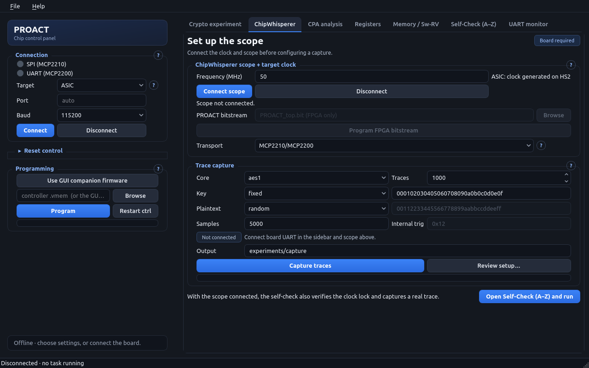

# GUI guide

This guide describes the GUI in PROACT host software 1.1.0.dev1.
It uses the shared `proact_host` backend, with GUI-specific orchestration for
its workflows. Its updated lifecycle and layout have been tested offline with
fake devices; this update does not establish new live-board or capture results.


For explanatory pictures of connections, clocks, samples, workflow and saved
files, use the [illustrated practical guide](../ILLUSTRATED_GUIDE.md).

## Open the correct workspace

From the repository root, run:

```bash
./run_gui.sh
```

The launcher prefers the repository's `.venv`; `PROACT_VENV` can explicitly choose a
different environment. Opening the window does not connect or enumerate devices.
See [INSTALL.md](../../INSTALL.md) for environment setup. Hardware bring-up details
remain in the [bring-up guide](../bringup_guide.md) and
[hardware hazards](../hardware_hazards.md).

## Find your way around

The left sidebar contains **Connection**, **Reset control** and **Programming**.
The seven tabs organize each workflow. Page headings explain the task; badges
identify board-dependent pages and offline analysis. The small **?** next to a
panel heading opens its help.

The bottom status bar shows the current task and elapsed time; experiments also
show completed attempts against the planned count. While a task is
running, configuration and action controls pause so another action cannot reset,
reprogram or disconnect the board in the middle of it. You can still switch
tabs, scroll, select/copy output and open help. The readiness status means the
worker returned; read the page output and log for the operation's actual result.

Unexpected worker failures appear in the sidebar status and UART log. Existing
workflow-specific failures also remain in their page output or log. No task is
silently terminated when you try to close the window: during a task, the window
stays open and asks you to wait. Closing an idle connected window closes UART,
SPI and scope resources asynchronously. This does **not** turn off board power.

Default pages fit the tested **1280×720, 1280×800, 1366×768, 1600×900 and
1920×1040** sizes. Expanded reset controls can scroll on short screens. Different
font settings or display scaling can require scrolling; every page remains in a
scroll area.

## Sidebar: connection and programming

| Control | Meaning |
|---|---|
| Target | ASIC or FPGA (CW305); affects scope/clock and bitstream setup |
| Port | Blank requests MCP2200 auto-detection when you click Connect; a typed port overrides it |
| Baud | Select the UART baud rate that matches the controller |
| Connect | Opens the MCP2200 UART and MCP2210 SPI bridges; the FPGA path also uses the configured bitstream/scope workflow |
| Disconnect | Closes the board communication resources in a worker; waiting for a lock does not block the window |
| Use GUI companion firmware | Selects the expected local path `Software/Controller/main.vmem`; the public host release does not supply that image |
| Program | Streams the selected controller VMEM using the existing reset/programming sequence |
| Restart ctrl | Restarts the controller without loading a new image |

Green connection indicators mean the link opened, red means an opening error,
and gray means disconnected. They do not independently certify a functioning
chip. If only one bridge opens, its corresponding functions may still be used.
Relative firmware and experiment-input file paths resolve against the repository root. Supply matching controller/Sw-RV images and the FPGA bitstream separately, then select those files explicitly; a filename default does not prove an image is installed.

**Reset control** starts collapsed. Its presets and individual reset-line toggles
retain the existing reset sequencing. The indicators represent the latest
available read-back; polling pauses during foreground work and cannot accumulate
multiple polling workers. Read the hardware hazards before using low-level reset
or memory controls on a powered chip.

## Crypto experiment

Select **Core**, Encrypt/Decrypt, and each fixed or random input. **Key** and
**Plaintext** apply to every supported target. **Nonce** and **Associated data**
are enabled for ASCON and Xoodyak. Inputs used by the fixed-block hardware command
path must be 16 bytes; validation now reports an invalid field before starting
an operation. AES-only runs ignore the inactive AEAD input fields.

**Read runs from file** replaces manual inputs with the file's rows. Choosing
this mode without a path is an error, rather than silently using manual values.
Relative paths are relative to the repository root. See
[the example input file](../../experiments/inputs_example.txt) for the format.

**Runs**, trigger settings, optional timer reading and reference comparison keep
the existing workflow semantics. In particular, the ASCON/Xoodyak hardware is
encryption-only: Decrypt is disabled for those cores and selecting either core
returns the direction to Encrypt. The update adds no hardware decryption path. Their
reference self-check uses the existing host-side decryption implementation.

The results view retains the newest **5,000 lines**. To retain the full record,
select **Also save log file** before starting. The GUI streams the complete log,
including communication failures and the final response/error count, to a unique
`experiments/exp_<core>_<timestamp>.log` in the repository. If setup fails after the file
opens, the partial log is closed and contains the failure reason. **Clear logs**
clears the display, not saved files.

## ChipWhisperer



The scope panel retains the target frequency, FPGA bitstream and connection
controls. ASIC clock generation uses the existing Husky HS2 path; FPGA uses the
existing CW305 clock/programming path. Disconnect the scope before changing its
connection settings. The status line reports the backend's clock/lock values.

Only **MCP2210/MCP2200** is supported by this GUI's transport implementation.
The alternative Husky SPI/UART item is disabled: it previously appeared
selectable even though Connect ignored it. The capture **Cycle logging
unavailable** checkbox is also disabled because it previously had no effect.
These changes expose existing limitations rather than introducing new routes.

Capture now requires a connected scope. For functional operations without
waveforms, use **Crypto experiment**. Fixed key/plaintext must contain exactly
16 bytes; inactive fixed fields are ignored in random mode. Samples must be a
positive integer. For ASCON/Xoodyak the internal trigger must be an integer from
0 to 127; that field is disabled and ignored for AES1, AES2 and Sw-RV.
Invalid values produce an error instead of silently substituting defaults or
masking extra bits. If the scope rejects the sample setting, the run stops
before issuing target commands.

Clock entry points reject non-finite or nonpositive MHz values. If a newly
allocated scope fails during connection setup, the GUI closes that partial
resource. These checks do not certify that a requested frequency is a valid
physical operating point.

**Output** accepts a new directory such as `experiments/run_01.tracepack` for
incremental chunks, or `.npz`/`.h5` single-file snapshots. Relative outputs resolve
inside this workspace. Existing tracepack directories cannot be reused. External
readers need explicit support for the format; this update does not add tracepack
support to the CPA page. See the storage documentation before selecting a format.

**Review setup…** opens a copyable, nonmodal explanation of the current form
without device commands, file writes or random-input generation. It explains
the output format, record length, clock-field behavior, automatic gain preset
and core-specific settings. It is a snapshot: reopen the review after edits.
The review remains available during a task.

The capture state distinguishes **Not connected**, **Check settings**,
**Connected**, **Working** and **Needs attention**. Connected describes local
handles and valid fields; it does not certify firmware or waveform quality.
Capture and scope-connection failures now reach the task status. An incomplete
capture reports saved/requested counts and its output path, even when all
attempts have finished. Its 100% progress display does not mean every attempt
produced a saved trace.

Capture timing/order and CPA algorithms remain unchanged, and no measurement
campaign was performed. No field promises a minimum recovery count: platform,
settings, data quality and analysis protocol determine how a dataset can be
interpreted.

The bottom shortcut opens the self-check tab **and starts its check**; it is not
just a navigation link.

## Recorded-trace analysis

This page retains the existing dataset/model/filter fields and script launcher.
It does not need a connected board. The update changes its visual guidance and
shared task lifecycle, not its analysis algorithms or output format. A selected
filter is an analysis choice and does not guarantee an improvement. This
software update did not execute an analysis campaign or validate recovery claims.

## Registers and memory

The **Registers** page displays the existing named control bits and status-bit
view. A written control value and a read status value are different registers;
use the [address map](../address_map.md) for their definitions. The status value
is a read-back, not a continuously refreshed certification.

The **Memory / Sw-RV** page provides mapped-bus read/write operations and
the software-core program loader. Addresses must be 4-byte aligned u32 values;
read/write spans cannot wrap past the 32-bit address space. Data words outside
the u32 range are rejected, not truncated. The same base/span checks apply to
Sw-RV data-memory loading. Use the loader's instruction VMEM, data VMEM and
data-base fields to load software images. Raw bus accesses have the hardware's
existing acknowledgement constraints; an unmapped or held-in-reset peripheral
can leave the controller waiting. This GUI lifecycle update does not add a bus
watchdog or alter those constraints.

## Self-check

The self-check page uses the existing shared check engine. Rows arrive as each
check finishes; **PASS**, **FAIL** and **SKIP** retain their established meaning.
Scope-dependent tests and Sw-RV firmware availability affect the checks included.
**Export CSV** writes the displayed table in UTF-8; export failures are reported
in the window rather than escaping a Qt callback. Table cells are read-only so
accidental typing cannot alter the displayed evidence before export.

Historical hardware screenshots elsewhere in the retained documentation belong
to earlier runs. The screenshots linked here are deliberately disconnected
renders, with no fabricated pass/fail results.

## UART and activity log

The table combines UART messages and application activity. Hover over a truncated
cell to read its complete text. **Live read** polls
incoming bytes only when the port is available; non-text data keeps the existing
hexadecimal representation. The table is read-only and retains the newest
**5,000 messages**. Its footer reports discarded history. A bounded queue is
painted in batches; if that queue fills, its oldest messages are also discarded
and counted. This is a responsive live display, not a lossless session archive.

When you scroll up to inspect an older message, newly arriving rows no longer
force the view to the bottom. Return to the bottom to follow incoming messages.
**Clear** clears both displayed and pending messages. **Export CSV**, including
the File-menu action, flushes queued messages and writes the currently retained
rows; it cannot recover rows already discarded. Experiment log files are the
separate complete-record option for experiments.

## Verification and developer notes

Run the offline checks from the repository root:

```bash
./tools/run_tests.sh tests/test_gui_workflows.py -W error
PYTHONPATH=Software/Python .venv/bin/python tools/check_gui_layout.py
PYTHONPATH=Software/Python .venv/bin/python tools/gen_gui_screenshots.py reports/gui_local --size 1400x900 --size 1280x800
```

The screenshots stop both timers and invoke no hardware or analysis actions.
See the [release report](../../reports/HOST_SOFTWARE_RELEASE.md) for integrated
regression coverage, visual checks and limits of this verification.
