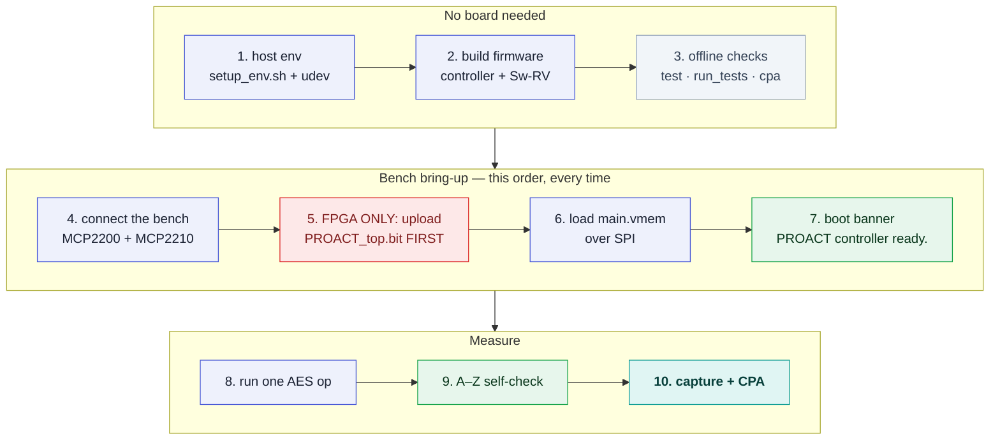

# Getting Started

PROACT is a fabricated lightweight-cryptography RISC-V SoC built around dual Ibex cores — a *controller* core and a *Sw-RV target* core — together with the AES1, AES2, ASCON and Xoodyak crypto cores. The design runs on the taped-out ASIC (GlobalFoundries 22FDX) and on the CW305 FPGA. This page is the path from a bare machine to a working measurement: install the host tools, build the firmware, bring the bench up **in the one order that works**, run one AES operation, and save one experiment. There is also a complete no-hardware path, so the platform can be learned before a board is available.


*The taped-out PROACT SoC: the dual Ibex cores (controller + Sw-RV target) sit beside the AES1, AES2, ASCON and Xoodyak crypto cores, all sharing one bus, the control/status registers and the trigger fabric.*

> [!NOTE]
> **Verification status.** The chip is **fabricated and frozen** — the host and firmware are written to match the silicon. Every hardware-in-the-loop step below is bench-verified on the **CW305 FPGA build** (2026-08-07, Linux): the A–Z self-check reports **16 pass / 0 fail / 0 skip**, including a real ChipWhisperer Husky trace capture. The **fabricated ASIC is screened and passing**: the same A–Z self-check, run from the GUI on a die in the CW308 target board, reports **16 pass / 0 fail / 0 skip**, including the ChipWhisperer clock lock and a real trace capture on silicon. Sustained unattended capture campaigns also run from the CLI. **Windows and macOS have not been tested.**

---

## 0. Prerequisites — what you actually need

| You want to… | You need | Notes |
|---|---|---|
| Read the docs, run the offline tests, analyze a separately supplied capture | **Python ≥ 3.9** and the packages in `requirements.txt` | No board or toolchain. CPA needs a local capture file; this public checkout contains no trace dataset. See the [no-hardware path](#the-no-hardware-path). |
| Talk to a chip at all | Matching controller and Sw-RV **firmware images** | Obtain the VMEM files separately, or build them with a bare-metal RV32 toolchain (`riscv32-unknown-elf-gcc` + `srec_cat`) in the companion design checkout. This public checkout contains neither the images nor their build sources. |
| Drive the bench | An **MCP2200** (UART, `04D8:00DF`) and an **MCP2210** (SPI loader, `04D8:00DE`), and on Linux the udev rules | See step 1. |
| Capture power traces | **ChipWhisperer 6** (`pip install chipwhisperer`) + a **Husky**, and a **CW305** for the FPGA target | The CW305 also supplies the 50 MHz target clock from its own PLL. |
| Run on the CW305 | A matching `PROACT_top.bit`, supplied separately | Select its path explicitly. Rebuilding requires the companion FPGA/design package and Vivado; this public checkout contains neither the bitstream nor its build sources. |
| Store captures as HDF5 | `h5py` (optional) | Without it, captures are written as `.npz` instead — nothing else changes. |

Everything below was run on **Linux**. Windows and macOS are untested.

## Key design characteristics

Several design choices shape how PROACT is used. The drivers already handle all of them; the points below provide orientation, each linked to its detailed page.

1. **Capture trigger = control bit 30 (`0x40000000`).** The control register is a 31-bit control field, so the trigger is bit 30. (The read-side status register is a full 32 bits, and its bit 31 is the Sw-RV "target-done" signal — a separate register.) → [Address & Register Map](Address-and-Register-Map)
2. **A lightweight bus.** PROACT uses the minimal lowRISC *simple-system* interconnect, so the firmware issues only valid (acknowledged) accesses — the drivers enforce this, so use them rather than hand-written raw register accesses. → [Hardware Hazards](Hardware-Hazards)
3. **One register map.** `config/hardware.json` is the single source of truth; it generates the C header, the Python `regs` module, and the docs, so C / Python / GUI / docs can never disagree. Edit the JSON and regenerate — never a generated copy.
4. **AEAD = hardware encrypt + software decrypt.** ASCON and Xoodyak implement the encryption datapath (what capture measures); decrypt and tag-check run on the host with `proact_host/aead_soft.py` (bit-exact ASCON-128 v1.2 / Xoodyak v2; `decrypt` returns `None` on a bad tag). AES1/AES2 do both directions in hardware. → [Hardware Overview](Hardware-Overview)

---

## The order matters

Bring-up has exactly one working order, and it was learned the hard way (see [Troubleshooting](Troubleshooting) §8 for what each shortcut costs):



> [!IMPORTANT]
> **On the FPGA, the bitstream comes before the firmware — always.** There is no PROACT design in the fabric until `PROACT_top.bit` is uploaded, so there is nothing for the SPI loader to load *into*. And because the SPI code loader has **no MISO line**, a firmware load into an empty fabric still reports "programmed 100%". Step 7 (the boot banner) is what turns "bytes were shifted out" into "the chip is running".

All commands are run from the repository root; paths are relative to it.

---

## 1. Install the host tools

Full detail is in **[INSTALL.md](../../INSTALL.md)**. The short form:

```bash
bash tools/setup_env.sh --with all      # one-time: creates/reuses this checkout's .venv
sudo bash tools/install_udev.sh         # Linux only: USB permissions — then REPLUG the devices
```

`setup_env.sh` creates or reuses this checkout's isolated `.venv`. Choose another dedicated path with `--venv /path/to/env` and select it later with `PROACT_VENV=/path/to/env`. The installer preserves existing environments and refuses the reserved legacy `~/.proact-venv`. `--with all` installs the GUI, HDF5 and pinned ChipWhisperer extras. `install_udev.sh` installs `udev/60-proact.rules` (MCP2200, MCP2210, ChipWhisperer) and adds you to the `dialout` group.

Then launch everything through the wrapper scripts:

```bash
./run_gui.sh                     # the GUI
./run_cli.sh info                # the CLI — prints the address map + trigger bit + input clock
```

> [!WARNING]
> **Never run the GUI or CLI with `sudo`.** Device access comes from the udev rules above. The wrappers prefer an explicit `PROACT_PYTHON`/`PROACT_VENV`, then the project `.venv`, before probing legacy or system interpreters. This avoids the pyenv pitfall where a bare `python3` resolves to a different interpreter missing PyQt6/hid/mcp2210/chipwhisperer. Running with sudo breaks user-local installations.

> [!TIP]
> Wherever `proact <subcommand>` appears below, use `./run_cli.sh <subcommand>`. Global options come *before* the subcommand: `./run_cli.sh --port /dev/ttyACM1 status`.

## 2. Obtain or build both firmwares

Two separate images are required: the **controller** firmware (drives the crypto cores + command server) and the **Sw-RV target** firmware (software AES on the target core). Neither the images nor their source trees are included in this public source checkout. Obtain matching images separately, or run the following commands from the companion design checkout before bench work.

```bash
make -C Software/Controller     # -> main.vmem (one combined text+data image)
make -C Software/SW_RV          # -> sw_rv_imem.vmem + sw_rv_dmem.vmem
```

The toolchain prefix defaults to `riscv32-unknown-elf-` (`RISCV ?=` in each Makefile). If yours lives elsewhere, pass the full prefix: `make -C Software/Controller RISCV=/opt/riscv/bin/riscv32-unknown-elf-`. Both firmwares **build clean (0 warnings)**.

| Firmware | Build dir | Outputs |
|---|---|---|
| Controller | `Software/Controller` | `main.vmem` (one combined image) |
| Sw-RV target | `Software/SW_RV` | `sw_rv_imem.vmem`, `sw_rv_dmem.vmem` |

(Builds can also be invoked through the CLI: `proact build-controller` and `proact build-target`, each accepting `--riscv <prefix>`.)

## 3. Offline checks (no hardware required)

<a id="the-no-hardware-path"></a>

These run entirely offline — no board, no network — and are a genuine first functional check of the host stack:

```bash
proact info          # address map, trigger = control bit30 (0x40000000)
proact devices       # lists any detected MCP2200 / MCP2210 + serial ports
proact test          # host protocol + AES reference + software ASCON/Xoodyak
```

`proact test` exercises the controller command framing, checks the AES reference against the FIPS-197 known-answer vector (key `000102…0f`, plaintext `00112233…ff` → ciphertext `69c4e0d86a7b0430d8cdb78070b4c55a`), and runs the software ASCON/Xoodyak self-test. It prints `host protocol + AES reference + software ASCON/Xoodyak: OK`.

Three more things are worth doing before a board exists — they are the fastest way to understand what the platform is *for*:

```bash
bash tools/run_tests.sh                 # public regression: 1,513 passed, 43 explicit skips
./run_cli.sh cpa --core aes1 --capture /path/to/aes1_reference.npz  # companion helper required
./run_cli.sh decrypt-soft --selftest    # software ASCON/Xoodyak vs the silicon's own vectors
```

`cpa` needs no board once its inputs are available locally. This public checkout
does not include trace datasets or the legacy `examples/cpa_*.py` helpers: obtain
both from the companion design package, then pass `--capture FILE` or place the
capture at `datasets/<core>_reference.npz`. In the GUI's *CPA analysis* page,
select the same local capture file. The public `Acquisition/` workflow packages
its own automatic analysis for new native captures.

| Item | Runs offline? | Requires hardware? |
|---|---|---|
| `proact info` / `devices` / `test` / `decrypt-soft --selftest` | Yes | No |
| Legacy `proact cpa` | Yes, after supplying a capture and companion example helper | No |
| `bash tools/run_tests.sh` (public result: 1,513 pass / 43 explicit skips) | Yes | No |
| `make -C …` firmware builds | Yes (needs the RV32 toolchain) | No |
| `proact program` / `run` / `capture` / `selfcheck`, GUI against the chip | — | Yes — **bench-verified on the real CW305 (A–Z self-check 16/16)** |

## 4. Connect the bench

PROACT uses two USB bridges (auto-detected — leave the port blank to auto-detect, or override with `--port`):

| Bridge | Role | USB VID:PID |
|---|---|---|
| **MCP2200** | UART — command / data protocol, 115200 baud | `04D8:00DF` |
| **MCP2210** | SPI — controller firmware loader, and the three host-driven reset lines | `04D8:00DE` |

`B_RST_N` on the board is a physical push-button; the controller / global / SPI resets all come from the MCP2210. The core clock is 50 MHz — on the CW305 from its own PLL, on the ASIC generated by the Husky on HS2.

Confirm the bench constants (MCP serials and input clock) in `Software/Python/proact_host/config.py`; `proact devices` prints the serials of whatever is attached. The standard interface-board reset feedback map is fixed from CAD and live validation. A differently wired board can pass an explicit `Mcp2210Pins(...)` override without changing the standard defaults.

## 5. FPGA only — upload the bitstream **first**

Skip this section on the ASIC. On the CW305 it is the first step that touches the board.

**GUI (recommended).** Set *Target* = **FPGA (CW305)** in the sidebar *Connection* panel, select the separately supplied bitstream in the *ChipWhisperer* tab, then press **Connect**. If that field is empty the GUI checks for `PROACT_top.bit` in the repository root and fails clearly when it is absent; the file is not bundled. The dialog that follows says which file is running and at what clock, and tells you to load the controller firmware next. The *ChipWhisperer* tab also has a standalone **Program FPGA bitstream** button.

**Python.** The upload lives in `ChipWhispererCapture`, and this is the way to do *only* the bitstream from a script:

```python
from proact_host.capture import ChipWhispererCapture
cap = ChipWhispererCapture(platform="fpga", clock_hz=50e6)
cap.connect(platform="fpga", bitstream="PROACT_top.bit")   # uploads, then brings up the PLL
print(cap.clock_status())
# keys: platform, target_clock_MHz (50.0), adc_freq_MHz (~200), pll_freq_MHz,
#       hs2, clock_source ('CW305 PLL (output 1)'), locked (True on a good board)
```

`connect()` disables HS2 (the CW305 supplies its own clock), uploads the bitstream, sets VCCINT to 1.0 V, enables PLL output 1 at 50 MHz, and locks the Husky ADC to that external clock at `adc_mul` × it (4 × 50 = 200 MHz).

**CLI.** There is no bitstream-only subcommand; the `--bitstream` flag rides along on the two commands that own a scope, so they re-flash the fabric in the same call:

```bash
./run_cli.sh capture   --core aes1 --platform fpga --bitstream PROACT_top.bit --traces 100 --output experiments/aes1
./run_cli.sh selfcheck --capture   --platform fpga --bitstream PROACT_top.bit
```

Note the ordering trap in that convenience: both of those commands also talk to the *controller firmware*, which a freshly configured FPGA does not yet have. Use them to re-flash a fabric whose firmware you will (re)load right afterwards — or, on a cold board, upload the bitstream with the Python snippet or the GUI, then do step 6.

> [!WARNING]
> **The upload is forced, and that is deliberate.** `program_fpga()` passes `force=True` to `cw.target(...)`, because `force=False` silently *skips* programming whenever the fabric already holds any configuration — and ChipWhisperer never raises on a DONE-pin failure. A CW305 left running someone else's bitstream then keeps running it while every call reports success. If the board was last used with a different bitstream, **power-cycle the CW305** (board power *and* USB) before connecting. Never probe the board with `cw.target(..., bsfile=None)`: with no bitstream given, ChipWhisperer loads *its own* AES demo bitstream, so the "read-only check" reconfigures the board. See [Troubleshooting](Troubleshooting) §8.

## 6. Load the controller firmware over SPI

Now — and only now — load the firmware. The SPI loader streams 64-bit `{addr, data}` frames into the controller memory while holding the resets, then releases the chip to run.

```bash
./run_cli.sh program --vmem Software/Controller/main.vmem
```

In the GUI: sidebar → *Programming* → **Use GUI companion firmware** (fills in `Software/Controller/main.vmem`) → **Program**.

The release sequence (in `programmer.py`) after the stream is: `spi_reset` LOW, `spi_select` LOW, `global_reset` HIGH (releases Sw-RV + crypto), then pulse `controller_reset` so the CPU boots with the crypto already out of reset.

## 7. Verify the boot banner — the one cheap proof

The controller prints `PROACT controller ready.` exactly once at boot, before it enters its command loop (`Software/Controller/main.c`). Because the SPI code loader is **write-only** (no MISO), the banner is the only inexpensive *positive* evidence that the bitstream is real, the firmware landed, and the CPU is executing.

Both tools now do this for you, automatically, by opening the UART *before* pulsing the reset (`Mcp2210Programmer.verify_running()`):

- **CLI** — a good load prints `programmed …; controller booted (announced itself over UART)`. A bad one prints `programmed … over SPI` plus a warning that the controller did not announce itself, and two hints.
- **GUI** — the *Programming complete* dialog says "announced itself — the chip is running", or *Programmed, but no response*.

To watch it by hand: open the GUI's *UART monitor* tab with **Live read** ticked, then press **Restart ctrl**. Opening the port *after* programming misses the banner entirely, and a live chip then looks exactly like a dead one.

## 8. Run one AES operation

### 8a. CLI

```bash
proact run --core aes1 \
    --key 000102030405060708090a0b0c0d0e0f \
    --pt  00112233445566778899aabbccddeeff \
    --compare --timer
```

It selects the core, loads the key and plaintext, runs, and prints one line per run — `<n> pt=<hex> -> <hex>`, plus `PASS`/`FAIL` with `--compare` and `cyc=<n>` with `--timer`. For the key/plaintext above the AES-128 encrypt result is `69c4e0d86a7b0430d8cdb78070b4c55a`; this is the FIPS-197 vector, it is what the on-chip cores return on the CW305, and it is what the A–Z self-check checks.

Useful flags:

| Flag | Meaning | Default |
|---|---|---|
| `--core` | `aes1`, `aes2`, `ascon`, `xoodyak`, `swrv` | (required) |
| `--key` | 16-byte key (32 hex chars) | `000102…0f` |
| `--pt` | 16-byte plaintext | `101112…1f` |
| `--decrypt` | decrypt instead of encrypt | off |
| `--nonce` / `--ad` | 16-byte nonce / associated data (AEAD cores only) | zeros |
| `--runs N` / `--random` | repeat N times / fresh random plaintext each run | 1 / off |
| `--compare` | check the result against the software reference | off |
| `--timer` | read the trigger-window cycle count per run | off |

> [!WARNING]
> **AEAD decrypt runs on the host.** `--decrypt` operates in hardware on `aes1`/`aes2`; for ASCON and Xoodyak the hardware is **encrypt-only**, and the CLI says so before it runs. Decrypt AEAD results with `proact_host.aead_soft` (`ascon128_decrypt` / `xoodyak_decrypt`; returns `None` on a bad tag; `words_to_bytes`/`bytes_to_words` convert to/from the register words), or from the shell with `proact decrypt-soft`. It is not constant-time — use it for validation and experiments, not production keys. The on-chip AEAD *encrypt* path is checked by the firmware KAT (`ProactTarget.aead_kat()` → `(xoodyak_ok, ascon_ok)`, or `proact aead-kat`), which passes on hardware.

### 8b. GUI

```bash
./run_gui.sh         # never with sudo — see the install note above
```

Then, in order:

1. **Connection** panel — pick the *Target* (ASIC or FPGA (CW305)), then **Connect**: it opens the MCP2210 (SPI) and MCP2200 (UART), and on FPGA uploads the bitstream. Two LEDs show the link state.
2. **Programming** — load `Software/Controller/main.vmem` over SPI, and read the dialog (step 7).
3. **Crypto experiment** page — pick the core (e.g. AES1), set each input to Fixed (type hex) or Random, choose encrypt/decrypt, optionally tick compare-with-reference, and click **Run experiment**. The result and, if enabled, the reference comparison and the trigger-window cycle count appear in the log.

The GUI has seven pages — *Crypto experiment*, *ChipWhisperer*, *CPA analysis*, *Registers*, *Memory / Sw-RV*, *Self-Check (A–Z)*, *UART monitor* — and every panel has a **(?)** help button. It is hardware-validated on the **CW305 FPGA build** (2026-08-07, A–Z self-check 16/16) and is also used to drive the **fabricated ASIC** on the CW308 board, including trace capture. Windows/macOS are untested.

## 9. Run the one unified self-check

There is **one** A–Z check for everything: `proact_host/fullcheck.py` (`run_full_check()`), surfaced in the GUI as the **Self-Check (A–Z)** page and on the command line as:

```bash
./run_cli.sh selfcheck                 # no scope: 14 pass / 0 fail / 1 skip (capture step skipped)
./run_cli.sh selfcheck --capture --platform fpga    # with a Husky: 16 pass / 0 fail / 0 skip
```

It runs UART link + baud integrity, AES1/AES2 encrypt KAT + decrypt round-trip, ASCON/Xoodyak on-chip encrypt KAT + software decrypt round-trip, the timer, a control write, the PRNG, Sw-RV software AES, and — with a scope connected — clock lock and a real trace capture. Each step reports PASS/FAIL/SKIP independently, so one failing core does not mask the rest. `--log FILE` writes a plain-text report; the exit status is non-zero if anything failed. The ChipWhisperer tab has no separate check of its own — its button jumps to this same page. The same procedure has also completed on the fabricated ASIC, as recorded in the verification status above.

## 10. Save one experiment

The `capture` command runs N operations and stores traces + inputs + outputs + metadata into a single self-describing file (HDF5 `.h5`, or `.npz` if `h5py` is absent):

```bash
proact capture --core aes1 --traces 100 --output experiments/aes1
```

Equivalent Python (the CLI and GUI share this exact backend):

```python
from proact_host.experiment import PROACTExperiment
with PROACTExperiment(platform="fpga", target="aes1", traces=1000,
                      output="experiments/aes1") as exp:
    exp.prepare()   # connect UART (+scope), select core, open storage
    exp.capture()   # per trace: set input -> arm -> run -> read -> validate -> store
    exp.save()      # -> prints "saved N traces -> experiments/aes1.h5"
```

Common `capture` options:

| Flag | Meaning |
|---|---|
| `--traces N` | number of operations to capture (default 100) |
| `--output PATH` | dataset path (`.h5`/`.npz` added automatically; default `results/run`) |
| `--platform` | `asic` (default) or `fpga` — same software either way |
| `--bitstream PATH` | FPGA: upload this bitstream before capturing |
| `--samples N` | ADC samples per trace; grown automatically to cover the whole trigger window unless `--no-auto-samples` |
| `--fixed` | fixed input instead of the default random-per-run |
| `--no-scope` | functional run only, no ChipWhisperer traces |

Each saved file holds `traces`, `plaintext`, `key`, `output`, per-trace `valid` flags, a failed-capture log, and metadata (target, platform, trigger settings, scope clock, timestamp). AES/Sw-RV encrypt results are validated against the software AES reference as they are stored. `prepare()` raises a clear error if the bench is not connected; without a ChipWhisperer, functional runs still execute and store outputs (with empty traces). A fresh 40-trace CW305 capture taken on 2026-08-07 came back as a `(40, 33938)` array with every row full length and every row valid.

Then attack it — `./run_cli.sh cpa --core aes1 --capture experiments/aes1.npz`. The full method is on the [ChipWhisperer](ChipWhisperer) page.

---

## Further reading

| Task | Reference |
|---|---|
| Learn the Python and C libraries hands-on | `examples/PROACT_Tutorial.ipynb` — runnable, section-by-section (connect + program, registers, AES, AEAD hw-encrypt + sw-decrypt, PRNG, Sw-RV, capture, A–Z self-check) |
| Understand the register/address map | [`docs/address_map.md`](../address_map.md) (generated from `config/hardware.json`) |
| Understand the bus access contract | [`docs/hardware_hazards.md`](../hardware_hazards.md) |
| See the full program → run → capture flow | [`docs/bringup_guide.md`](../bringup_guide.md) |
| Rebuild the CW305 bitstream | `FPGA/README.md` (Vivado 2022.2, part `xc7a100tftg256-1`) |
| Cross-check the software against the frozen RTL | `RTL_ROOT=/path/to/ASIC/rtl bash tools/verify_all.sh` |
| Debug a hang, a silent board, or a "successful" program that answers nothing | [Troubleshooting](Troubleshooting) |

**Operational rules for every session:** never access `0x10007000`, a disabled core, or an idle UART; enable a core before touching its registers and use one core at a time; assert the capture trigger with control **bit 30 (`0x40000000`)**, never bit 31; decrypt AEAD (ASCON/Xoodyak) in software with `aead_soft`, never on the hardware; on FPGA upload the bitstream before the firmware and confirm the boot banner; and launch through `./run_gui.sh` / `./run_cli.sh` — never with `sudo`.
