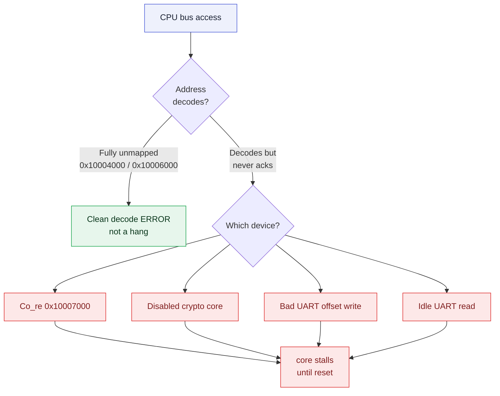
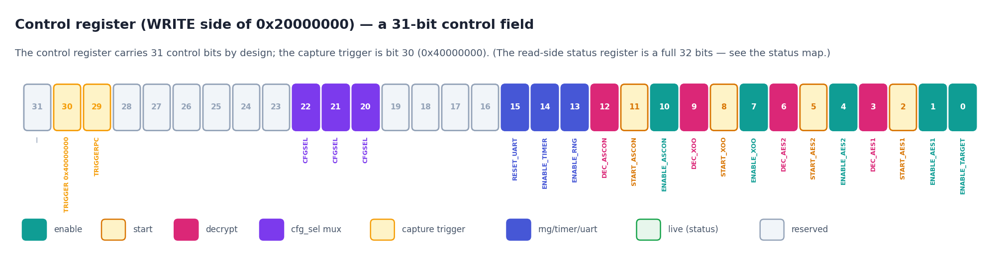

# Hardware Hazards

> [!NOTE]
> **This page is the bus access contract — the complete list of accesses to avoid and the safe sequences the drivers already use.** PROACT is built on the minimal lowRISC *simple-system* interconnect, so a small number of accesses require care; every driver in this repository already encodes the rules below, so ordinary use is unaffected. This page explains *why* the rules exist, so that they remain intact in any custom low-level sequence. (The behaviors are properties of the fabricated silicon, identical in the FPGA build.)

> [!NOTE]
> **Verification status.** Where a behavior is described as confirmed, it is **RTL-simulated** (the gate-level signoff simulation passes the canonical operation sequences), **unit-tested** (host protocol / AES reference vectors), or — for the driver sequences that encode these rules — **exercised on the real CW305 FPGA**: the unified A–Z self-check (`proact_host/fullcheck.py`) passes 100% on the bench. The fabricated ASIC has not yet been bench-tested; it shares the design byte-for-byte, so every rule below applies to it unchanged.

---

## The one principle: issue only valid accesses (H1)

Like most minimal RISC-V SoC buses, the lowRISC *simple-system* interconnect PROACT is built on has **no access watchdog** — a deliberate simplification for a small research chip. If the CPU reads or writes an address whose device never returns `rvalid`, the core waits for it (a stall that a reset clears). Every rule on this page is one form of the same single principle: **issue only accesses that will be acknowledged.** The drivers enforce this principle throughout.

An access to a **completely unmapped** address (for example `0x10004000` or `0x10006000`) is different — the bus returns a clean **decode-error** response, not a stall:

| Access | Result |
|---|---|
| Address decodes to a device that never acks | core stalls until reset |
| Address is fully unmapped (`0x10004000`, `0x10006000`) | Clean bus decode **error** |

**Every rule on this page is one branch of a single decision: whether the access is acknowledged.**



---

## Quick reference

| # | Hazard | Trigger | The software rule |
|---|--------|---------|-------------------|
| H2 | `Co_re` @ `0x10007000` | any read/write to `0x10007000`–`0x100073FF` | Reserved decoder slot, no core behind it — the drivers never address it |
| H3 | Disabled crypto core | touching a core's registers while its enable bit is 0 | Enable first, one core at a time, clear down in order |
| H4a | UART bad-offset write | writing UART at any offset ≠ `0x00`/`0x04` | Only write `+0x00` (TX) and `+0x04` (baud); never `sim_halt()` |
| H4b | UART idle read | reading `+0x00` when RX is empty | Check `rx_empty` in the status byte first |
| H4c | UART TX FIFO drop | writing TX faster than it drains (512 B FIFO) | Pace `putchar` ≥ 1 char-time between bytes |
| H5 | Control side is a 31-bit field | using `0x80000000` as the capture trigger | Capture trigger is **bit 30 (`0x40000000`)** |
| H6 | Timer only counts in-window | expecting wall-clock time | Timer measures the trigger window only |
| H7 | RNG unreadable by controller | reading the RNG from the controller | Controller can only **seed**; random data goes to the Sw-RV target |
| H8 | AEAD decrypt runs in software | waiting on a hardware AEAD decrypt to finish | Cores are encrypt-focused; the driver's done-wait is bounded, decrypt via **`aead_soft.py`** |

---

## H2 — `Co_re` @ `0x10007000` is a reserved decoder slot

Device 11 (`Co_re`) has a base/mask in the address decoder but no core behind it (0 instances in the signoff netlist) — a reserved slot. Because it decodes without a device to acknowledge, an access there does not complete (H1), so the drivers never address it.

> [!NOTE]
> **Rule: the `0x10007000`–`0x100073FF` window is reserved — the drivers never address it.** No device exists behind this window; the entry exists only in the address decoder.

---

## H3 — A crypto core does not ack while it is disabled

Each crypto wrapper (AES1, AES2, ASCON, Xoodyak) is held in reset while its enable bit is 0 (`rst_n = rst_Gsys_n & enable_<core>`) — a clean way to power-gate an unused core. A wrapper in reset **does not ack the bus**, so read or write its registers only after enabling it (H1).

Additional silicon behaviors that any custom sequence must account for:

- **`START` is *not* gated by enable.** Dropping enable while `START` is still 1 leaves the wrapper in a state that can no longer be cleared.
- **`DONE` is only valid while `START` is held high** (status *and* the core's own `+0x04`).
- The AES cores **have no reset input** — the only way to clear wrapper state between runs is a clean **enable toggle** in the safe order. (This is the software remedy for the known second-experiment hang.)

> [!CAUTION]
> **Rules (all four, in this order):**
>
> 1. **Set the core's enable bit *before* touching any of its registers.**
> 2. **Enable exactly one core at a time** — treat the enables as mutually exclusive.
> 3. **Clear down in order:** de-assert `START`/`DEC` *while still enabled*, then drop the enable. (Dropping enable first strands the start state.)
> 4. **Reset the core state between experiments** via a clean enable toggle.

The safe order — never drop enable with `START` still set, and toggle enable to clear state between runs (the remedy for the second-experiment hang):

```mermaid
flowchart LR
    A[Enable core]:::step --> B[Setup + load<br/>key / data]:::step
    B --> C[Assert START]:::trig
    C --> D[Wait DONE<br/>while START high]:::step
    D --> E[Read result]:::ok
    E --> F[De-assert START/DEC<br/>while still enabled]:::step
    F --> G[Drop enable]:::step
    G --> H[Toggle enable<br/>to reset state]:::soft
    classDef step fill:#eef1fc,stroke:#4657d6,color:#1b2233
    classDef ok fill:#e7f6ec,stroke:#16a34a,color:#08351a
    classDef warn fill:#fde8e8,stroke:#dc2626,color:#7f1d1d
    classDef trig fill:#fef3c7,stroke:#d97706,color:#78350f
    classDef star fill:#e0f5f3,stroke:#0f9d94,color:#08403b,font-weight:bold
    classDef soft fill:#f1f5f9,stroke:#94a3b8,color:#334155
```



The driver already implements the complete safe sequence — prefer it over hand-written register accesses:

```c
/* proact_aes.h: reset -> setup -> load -> start -> wait -> read -> reset,
 * all in the hazard-safe order. Use this instead of raw AES register access. */
aes_run(PROACT_AES1, key, plaintext, result, /*decrypt=*/0, /*verbose=*/0);
```

> [!IMPORTANT]
> **Shadow-register discipline (why step 3 matters).** Control-register writes are absolute — the hardware does no read-modify-write. Firmware keeps a single **shadow copy** and explicitly clears enable/start/dec bits after each op (`ctrl_set` / `ctrl_clr` / `ctrl_flush`). Bits left set persist and keep gating resets, trigger routing and the timer. **One shadow, one writer** — never mix two control-register APIs in the same binary.

---

## H4 — The UART has three access rules

All three live in the same peripheral (`AHBUART` @ `0x10000000`). Its register layout:

| Offset | Write | Read |
|--------|-------|------|
| `+0x00` | TX byte | RX byte (**only if RX non-empty**) |
| `+0x04` | baud divisor (`HWDATA[21:0]`, reset default 27) | — |
| any other offset | **hangs** (see H4a) | status byte `{6'b0, tx_full(b1), rx_empty(b0)}` |

FIFO sizes: **TX 512 B, RX 32 B.**

### H4a — Writes ack only at `+0x00` and `+0x04`

A write to **any other offset never acks → CPU hang.** Two historical instances are the legacy `sim_halt()` at `+0x08` and a faulty `set_uart_baudrate()` that wrote `+0x01`.

> [!CAUTION]
> **Rule: only ever write `+0x00` (TX) and `+0x04` (baud). Never call `sim_halt()`.** End firmware in an idle loop:

```c
for (;;) { /* wfi */ }   /* NOT sim_halt() — that writes +0x08 and hangs */
```

### H4b — Reading an idle UART hangs

A read acks only when RX is non-empty (`rvalid = ~rx_empty`). Read `+0x00` only after confirming a byte has arrived; a read of an empty RX won't ack (H1).

> [!CAUTION]
> **Rule: check the status byte first** (read any offset ≠ `0x00`, test `rx_empty`, bit 0) before reading `+0x00`. The driver's blocking read already does this, so it is hazard-safe:

```c
/* uart_getchar() polls rx_empty before touching +0x00, so it can never
 * hit the read-idle-UART hang. Prefer it over a raw dev_read of +0x00. */
uint8_t b = uart_getchar();
```

### H4c — The TX FIFO has no backpressure — pace output

The 512-byte TX FIFO does not stall the CPU when full — a write always completes, so output sent faster than the line drains overruns the FIFO. Paced printing keeps well within it. (This is a data-pacing point, not a stall.)

> [!TIP]
> **`putchar` paces itself** — at least one character-time between bytes (~4340 cycles @ 115200 baud with divisor 27; scale proportionally to the divisor if the baud rate is lowered). Use the paced helper:

```c
uart_tx_pace();   /* the driver's TX path calls this after every byte */
```

---

## H5 — Two registers at one address: a 31-bit control field, a 32-bit status

The **control** register (`0x20000000`, write side) is a **31-bit control field**; the **status** register (`0x20000000`, read side) is a **full 32-bit** register. They share an address but are different registers, so their bit-31s are unrelated:

| Register | Side | Bit 31 |
|---|---|---|
| Control | write | Not a control bit — the field is 31 bits, so the capture trigger is bit 30 |
| Status | read | `TARGET_DONE`, the live Sw-RV "target done" handshake the controller polls |

The write-side control fields:

| Control field | Bit(s) | Value |
|---|---|---|
| **Capture trigger** (`TRIGGER`) | **bit 30** | **`0x40000000`** |
| `TRIGGERPC` | bit 29 | `0x20000000` |
| `CFGSEL` (trigger-source mux) | bits [22:20] | `000`=software, `001`=ASCON, `010`=AES1, `011`=AES2, `100`=Xoodyak, `101`=Sw-RV |



*The write-side control register: a 31-bit field with the capture trigger on bit 30 (`0x40000000`).*

> [!NOTE]
> **Rule: assert the capture trigger with bit 30 (`0x40000000`).** The Sw-RV software-AES path uses **status bit 31** (`TARGET_DONE`, set by the target via its port B and, with `CFGSEL=101/SWRV`, used as its capture trigger source) — a separate, valid mechanism on the read-side register. Same address, different registers.

---

## H6 — The timer counts only during the trigger window

`trigger_Out` (the chip's scope-trigger pin) is the OR of the software trigger (control bit 30) and every per-core trigger, routed through the `CFGSEL` mux. The 32-bit timer (`0x40000000`, enabled by `ENABLE_TIMER`, control bit 14) **counts only while `trigger_Out` is high.** It measures the **trigger/crypto window**, not wall-clock time.

> [!TIP]
> **Rule: to time exactly one core,** enable only that core, keep the software trigger (bit 30) **low**, set `CFGSEL` to that core, and let the core's own trigger gate the count. The timer reads always ack, so reading the count can never bus-hang:

```c
uint32_t cycles = dev_read(PROACT_TIMER_BASE);  /* trigger-window count (H6) */
```

---

## H7 — The RNG is write-only from the controller

The controller can **seed** the RNG (write 32 bits to `0x80000000` with `ENABLE_RNG`, control bit 13, set) but it **cannot read** it — the controller's read path for the RNG is undriven. Random data is delivered **only to the Sw-RV target**, at the target's data-side address bit 30, and the LFSR advances on the *target's* read.

> [!WARNING]
> **Rule: from the controller, only seed the RNG; never read it back.** If the random value is required on the controller side, retrieve it through the Sw-RV data-memory **mailbox**, not by reading the RNG device.

```c
ctrl_set(CTRL_ENABLE_RNG);
ctrl_flush();
dev_write(PROACT_RNG_BASE, seed);   /* seed only — controller cannot read it back (H7) */
```

---

## H8 — AEAD decryption runs on the host

The ASCON and Xoodyak cores implement the **encryption** datapath — the operation
side-channel capture measures (see [Hardware Overview](Hardware-Overview) for the
design rationale). Decryption and tag verification run on the host with
`proact_host/aead_soft.py`, bit-exact to the cores. The only firmware-side
implication: never wait unbounded on a hardware AEAD *decrypt* to finish,
because that operation is performed in software. The driver already handles this —
`aead_run()` uses a bounded `status_wait_timeout(...)`, so a stray hardware
decrypt attempt simply expires and returns zeros rather than waiting.

> [!NOTE]
> **In practice:**
>
> - Use `aead_run()` for on-chip AEAD (its done-wait is bounded).
> - **Decrypt on the host:** `proact_host/aead_soft.py` (`ascon128_decrypt` / `xoodyak_decrypt`) is bit-exact against the silicon's own CT+TAG and returns `None` on a wrong tag. The workflow is **hardware encrypt → software decrypt + tag verify**.

This fits the side-channel use case exactly: capture targets **encrypt** (the
on-chip KAT with the reference vectors passes on both cores), and the software
decrypt closes the round trip. AES1/AES2 do both directions in hardware.

---

## Driver-level enforcement

Direct register access is rarely necessary — the repository's controller library encodes every rule above in its API. Code that stays within the API cannot trip these hazards:

| Rule | Driver that enforces it |
|---|---|
| Safe AES enable/start/clear-down order | `aes_run()` / `aes_reset()` (`proact_aes.h`) |
| Never read an idle UART | `uart_getchar()` polls `rx_empty` first |
| Never overflow the TX FIFO | paced `putchar` / `uart_tx_pace()` |
| Absolute control writes via one shadow | `ctrl_set` / `ctrl_clr` / `ctrl_flush` / `ctrl_reset` |
| Capture trigger on bit 30 | the control driver writes `0x40000000`, never `0x80000000` |
| Bounded AEAD done-wait (decrypt never completes) | `aead_run()` uses `status_wait_timeout()`; decrypt via `aead_soft.py` |

Before calling `dev_read`/`dev_write` on a raw address, consult this page — the access contract (issue only acknowledged accesses) is the one invariant a hand-written sequence must preserve, and the drivers already maintain it.
