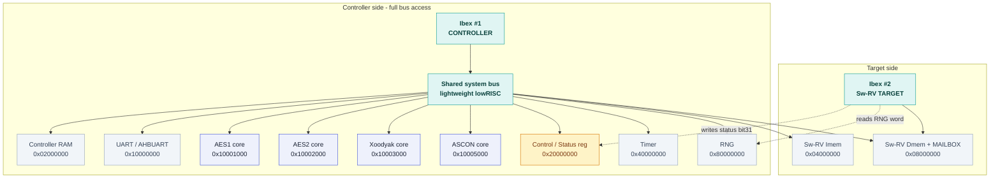

# Hardware Overview

This page maps the PROACT chip: the blocks it contains, how the two CPUs
communicate with each other and with the crypto cores, and the differences
between the fabricated ASIC and the FPGA build. Read this page first — the rest
of the wiki (GUI, ChipWhisperer, Troubleshooting) assumes familiarity with the
layout below.

> [!NOTE]
> **The chip is fabricated and frozen — with a single source of truth.**
> Everything here is a fixed property of the silicon (tape-out Nov 2025,
> GlobalFoundries 22FDX). The whole map comes from one machine-readable file,
> [`config/hardware.json`](../config/hardware.json), which generates the C header,
> the Python module, and these docs, so nothing can disagree. Software is
> developed *against* this map; where a behavior is fixed in gates, the host and
> firmware accommodate it.

---

  
  
  

*The fabricated PROACT chip: the die with its bond wires (left), and the open-cavity ceramic
package that leaves the die accessible for side-channel measurement (centre, right). Tape-out
November 2025 on GlobalFoundries 22FDX; the same RTL builds the CW305 FPGA bitstream.*

## 1. System overview — two RISC-V cores on one bus

PROACT is a **dual-Ibex** system. Two [lowRISC **Ibex**](https://ibex-core.readthedocs.io/en/latest/index.html) RISC-V cores (RV32IMC, small 2-stage in-order) sit on a shared
system bus together with four crypto co-processors and a small set of
peripherals:

- **Controller core (Ibex #1)** — runs the firmware that communicates with the
  host PC over UART, drives the hardware crypto cores, seeds the RNG, reads the
  timer, and loads/steers the second core. Host commands are handled by this
  CPU.
- **Sw-RV target core (Ibex #2)** — a second Ibex that runs a **software** AES.
  It allows a pure-software crypto implementation to be compared against the
  dedicated hardware cores under the same side-channel setup. It has *no* access
  to the UART, timer, or crypto cores — it only sees its own memory, the RNG
  (read), and the capture-trigger status bit. It communicates with the
  controller through a **shared-memory mailbox**.

*The dual-Ibex SoC: the controller core with full bus access to the four crypto cores and peripherals, and the Sw-RV target core with its own memory, the shared mailbox, and read-only RNG.*

The controller loads the target: it streams the Sw-RV's program into the
instruction-memory write port (`RII_IMEM`, `0x04000000`) and its data image into
the data-memory port (`RII_DMEM`, `0x08000000`), then releases it from reset. Per
the firmware, the target then boots and fetches its code from `0x00100000`.

> [!NOTE]
> **A lightweight bus, by design.** PROACT builds on the lowRISC *simple-system*
> interconnect, kept deliberately minimal for a small research SoC. Like that bus,
> it has no access watchdog, so the firmware's contract is to issue only valid
> (acknowledged) accesses — the drivers in this repository satisfy this contract,
> so ordinary use requires no special handling. The short list of accesses a
> hand-written sequence should avoid is on [Hardware Hazards](Hardware-Hazards).

---

## 2. Component table

All software-visible components, with their addresses. All addresses come
directly from `config/hardware.json` / [`docs/address_map.md`](address_map.md).
The *Reachable by* column indicates which core can access each component.

| Component | Address (base) | Size | Reachable by | Role |
|---|---|---|---|---|
| **Controller RAM** | `0x02000000` | 32 MB region (128 KB phys) | Controller | Controller code/data RAM. Also written by the SPI loader (port B, `addr[23]=1`). |
| **Sw-RV Imem** | `0x04000000` | 32 MB region | Controller (write) | Instruction-memory write port for the target; controller loads the target's program here. |
| **Sw-RV Dmem + mailbox** | `0x08000000` | 128 MB region (128 KB phys) | Controller **and** Sw-RV | The target's data RAM. Same absolute address on both sides → this is where the controller↔target **mailbox** lives. |
| **Control / Status register** | `0x20000000` | 1 KB | Controller (Sw-RV writes status bit31) | **WRITE = control, READ = status**, same address. See §4/§5. |
| **UART (AHBUART)** | `0x10000000` | 1 KB | Controller only | Serial link to the host PC. `+0x00` = TX/RX byte, `+0x04` = baud divisor. |
| **Timer** | `0x40000000` | 1 KB | Controller only | 32-bit counter — measures the **trigger window**, not wall-clock time (§5). |
| **RNG** | `0x80000000` | 1 KB | Controller (seed only) / Sw-RV (read) | LFSR PRNG. Controller **seeds** it (write); random data is delivered **only** to the Sw-RV (§5). |
| **AES1** | `0x10001000` | 1 KB | Controller | Hardware AES-128 core (encrypt + decrypt). |
| **AES2** | `0x10002000` | 1 KB | Controller | Second hardware AES-128 core. |
| **Xoodyak** | `0x10003000` | 1 KB | Controller | Hardware Xoodyak AEAD core (encrypt in HW, software decrypt — see §3). |
| **ASCON** | `0x10005000` | 1 KB | Controller | Hardware ASCON AEAD core (encrypt in HW, software decrypt — see §3). |
| **`Co_re` (reserved)** | `0x10007000` | 1 KB | — | A reserved decoder slot with no core behind it; the drivers never address it. |

`0x10004000` and `0x10006000` are **unmapped** → a clean bus decode-error.

Core clock is ~**50 MHz** (`clock_hz_default` in `hardware.json`; confirmed on
the CW305 bench — the A–Z self-check locks the 115200-baud link with divisor 27).

---

## 3. The four crypto cores

These accelerators are the targets for side-channel measurement and attack. The
component list is fixed by the silicon; no additional accelerator can be added.

| Core | Type | Base | Register style |
|---|---|---|---|
| **AES1**, **AES2** | AES-128 block cipher (enc + dec) | `0x10001000`, `0x10002000` | START/DONE + 4×32-bit KEY / DATA / RESULT |
| **Xoodyak** | Xoodyak AEAD (HW encrypt · SW decrypt) | `0x10003000` | LEN / KEY / NPUB / AD / PT / CT / TAG FIFO regs |
| **ASCON** | ASCON AEAD (HW encrypt · SW decrypt) | `0x10005000` | same AEAD register layout as Xoodyak |

**AES core registers** (offset from base): `+0x00` START (write bit0), `+0x04`
DONE (read = `~busy`), `+0x08…+0x14` KEY[127:96…31:0], `+0x18…+0x24`
DATA[127:96…31:0], `+0x28…+0x34` RESULT[127:96…31:0]. Encrypt vs decrypt is
selected by the core's DEC control bit. `DONE` is only valid while START is held
high.

**AEAD core registers** (ASCON / Xoodyak, offset from base): `+0x00` LEN,
`+0x04` KEY (4×32-bit → 128-bit), `+0x08` NPUB/nonce (4×32-bit), `+0x0C` AD
FIFO (write), `+0x10` PT FIFO (write), `+0x14` CT FIFO (read), `+0x18` TAG FIFO
(read). AEAD reads always acknowledge while the core is enabled, even if the
FIFO is empty (they return stale data — **no hang**, unlike the UART).

> [!NOTE]
> **The AEAD cores implement the encryption datapath — by design.** Side-channel
> capture measures *encryption*, so ASCON and Xoodyak provide a fast, correct
> hardware encrypt: the on-chip known-answer test matches the reference vectors on
> both cores. Decryption and tag verification run on the host with
> [`Software/Python/proact_host/aead_soft.py`](../Software/Python/proact_host/aead_soft.py)
> — a bit-exact, dependency-free ASCON-128 v1.2 / Xoodyak v2 implementation
> validated against the silicon's own CT+TAG — so the workflow is **hardware
> encrypt → software decrypt + tag verify**. AES1/AES2 run both directions in
> hardware. *(Implementation note: on decrypt an LWC core emits
> recovered plaintext as `HDR_PT`, which this encrypt-focused wrapper does not
> route back to the bus; the software path is the intended way to close the round
> trip, and it is what the A–Z self-check exercises.)*

Each crypto core is held in reset until its `ENABLE` bit is set — an area-free
method of gating a core that is not in use. The drivers therefore enable a
core before touching its registers, use one at a time, and clear `START`/`DEC`
before dropping the enable; the exact sequence is on
[Hardware Hazards](Hardware-Hazards).

---

## 4. Peripherals: UART, SPI loader, Timer, RNG

**UART (`0x10000000`)** — the controller's link to the host PC (a USB serial bridge,
MCP2200, on the bench). `+0x00` writes a TX byte / reads an RX byte; `+0x04`
writes the baud divisor (reset default `27`). Reading any offset ≠ `0x00`
returns a status byte with `rx_empty` (bit0) and `tx_full` (bit1). TX FIFO is
512 B, RX FIFO 32 B. Three simple access rules apply — writes ack at `0x00`/`0x04`,
reads ack when RX is non-empty, and the TX FIFO has no backpressure so output is
paced — all covered in [Hardware Hazards](Hardware-Hazards) H4. **The Sw-RV
target cannot reach the UART**, so the target never prints.

**SPI code loader** — a separate transport (MCP2210 USB-SPI on the bench) used to
**load code into memory before the CPU runs**. It streams 64-bit `{addr, data}`
frames into memory and drives the reset lines: hold reset → load → release to
run. `addr[23]` selects the instruction- vs data-memory write port. This is how
both the controller firmware and the Sw-RV program get onto the chip.

**Timer (`0x40000000`)** — a single 32-bit counter, enabled by the `ENABLE_TIMER`
control bit. It **counts only while `trigger_Out` is high** — it
measures the trigger/crypto window, not free-running wall-clock time (see §5 and
Hazards H6). Read it with the controller's `TIME` command (`get_timer()`).

**RNG (`0x80000000`)** — an LFSR PRNG, enabled by `ENABLE_RNG`. The **controller
can only seed it** (write a 32-bit seed); it **cannot read** random data back —
that read path is undriven on the controller side. Random words are routed
**only to the Sw-RV target** (its data-side `addr[30]`), and the LFSR advances on
the target's read. If the controller needs a result, it comes back through the
mailbox, not the RNG. See Hazards H7.

---

## 5. The trigger subsystem (and how the timer ties in)

Side-channel capture requires a precise pulse that marks the measurement
window — the `trigger_Out` chip pin that arms the scope. PROACT constructs this
signal as follows:

- Every crypto core emits its own trigger signal around its operation, and there
  is a **software** trigger driven from the control register.
- A **trigger-source mux**, `cfg_sel` = control bits **[22:20]**, selects which
  source drives `trigger_Out`:

  | `cfg_sel` | Trigger source |
  |---:|---|
  | `0` (`000`) | Software (control-register trigger) |
  | `1` | ASCON |
  | `2` | AES1 |
  | `3` | AES2 |
  | `4` | Xoodyak |
  | `5` | Sw-RV (software AES on the target) |

*The `cfg_sel` mux (control bits [22:20]) selects which of the six trigger sources drives `trigger_Out`; the controller firmware sets it to follow whichever core it runs.*

- `trigger_Out` is the OR of the software trigger and the per-core triggers,
  through that mux. The controller firmware sets `cfg_sel` to follow whichever
  core it is about to run, so the scope triggers on the intended operation.
- The **timer counts only while `trigger_Out` is high**, so reading the timer
  after a run yields the cycle count of exactly the captured window.

### Two trigger paths, two registers

The write and read sides of `0x20000000` are two different registers, and each
has its own trigger; the distinction determines which bit to use:

| | **Control-register trigger** | **Sw-RV / status trigger** |
|---|---|---|
| Register | Control **(write)** side of `0x20000000` | Status **(read)** side of `0x20000000` |
| Bit | **bit 30 (`0x40000000`)** | **bit 31** |
| Used by | Software trigger for the hardware cores | The Sw-RV target's software-AES capture window |
| Why this bit | The control register is a **31-bit control field**, so the capture trigger sits at bit 30. | The status register is a **full 32-bit** register; the target raises bit 31 via its status port (with `cfg_sel = 5`). |

*Write side of `0x20000000`: a 31-bit control field — the software capture trigger is **bit 30** (`0x40000000`).*

*Read side of `0x20000000`: a full 32-bit register where the Sw-RV target raises **bit 31** as its own capture trigger while `cfg_sel = 5`.*

In summary: for the **hardware cores**, the software capture trigger is control
**bit 30 (`0x40000000`)**. For the **Sw-RV target**, the
target raises **status bit 31** itself while the controller has selected
`cfg_sel = 5` (Sw-RV). These are two different registers and two different
bits. See [Hardware Hazards](Hardware-Hazards) H5/H6 for the full
detail.

---

## 6. Controller ↔ target mailbox

The two Ibex cores coordinate through a **shared-memory mailbox** in the Sw-RV's
data RAM. Both cores address the same words identically — the controller reaches
that RAM through bus device `RII_DMEM` (`0x08000000`), and the target reaches it
through its own data port — so the *same absolute address* names the *same word*
on both sides. All words are 4-byte aligned (the Sw-RV has no misaligned-access
support) and sit clear of the target's own `.data`/`.bss`/stack (at `0x08100000`).

| Mailbox word | Address | Written by | Meaning |
|---|---|---|---|
| `MBOX_KEY` | `0x08003F00` | Controller | 16-byte key (4 big-endian words) |
| `MBOX_IN` | `0x08003F10` | Controller | 16-byte input block |
| `MBOX_OUT` | `0x08003F40` | Sw-RV | 16-byte result block |
| `MBOX_CMD` | `0x08003F80` | Controller (target clears to 0) | `0` = idle, `1` = encrypt, `2` = decrypt |
| `MBOX_DONE` | `0x08003F84` | Sw-RV | set to `1` when `MBOX_OUT` is valid |

The handshake is deliberately lightweight — **one command word and one done word
per block**, no per-word acknowledgement:

1. Controller writes the key (if changed) and input block, then sets
   `MBOX_CMD` to encrypt/decrypt.
2. Target loads the key, reads the input, **raises the capture trigger**
   (status bit 31), runs software AES, **lowers the trigger**, writes the result
   to `MBOX_OUT`, sets `MBOX_DONE = 1`, and clears `MBOX_CMD` to idle.
3. Controller polls `MBOX_DONE`, reads the result, and may issue the next block.

Because these are plain data-RAM reads/writes, they always acknowledge the bus —
the mailbox itself cannot cause the no-timeout hang.

---

## 7. ASIC vs FPGA — same software, different silicon

PROACT exists as both a fabricated ASIC (on a CW308 board) and an FPGA build
(CW305 / PYNQ-Z2). The most important fact from a software perspective:

> [!NOTE]
> **The address/register map is identical, byte-for-byte, between ASIC and
> FPGA.** The same firmware and the same host code run on both — no address
> divergence. On the host side, `platform` (`"asic"` / `"fpga"`) is only recorded
> as experiment metadata; it does not change the register map or the protocol.

The genuine differences are physical and do **not** affect the register-level
software contract:

| Aspect | ASIC | FPGA |
|---|---|---|
| Memories | GF22FDX SRAM macros (NDA-licensed; not distributed with this repository) | inferred BRAM |
| Ibex register file | flip-flop-based | LUTRAM-based |
| Debug / pins | ASIC probe pins (`pc_out`, per-device probes) | LED routing + CW305 hooks, heartbeat counters |
| Clocking | `SYSCLK_P` via the pad ring | `SYSCLK_P` (~20 MHz external; core ~50 MHz, confirmed on the CW305 bench) |
| ASCON / Xoodyak sources | VHDL (LWC) cores | same |

Because the two share the same design snapshot, **every hazard on this wiki
applies equally to both** silicon and FPGA. One caution: flipping a build flag
in the FPGA tree does *not* reproduce the fabricated pinout — treat the frozen
`ASIC/rtl` snapshot as the chip, and use the FPGA tree only for FPGA bring-up.

---

## 8. Verification status

| Layer | Status |
|---|---|
| Register map vs frozen RTL | **RTL cross-checked** — constants agree with `ASIC/rtl` (`tools/verify_regs_vs_rtl.py`) |
| AES driver register sequence | **RTL-simulated** — reproduces the known-answer ciphertext against the real AES core (iverilog) |
| Controller + target firmware | **Builds clean**, produces the vmem images |
| Host protocol + AES reference | **Unit-tested** (byte-stream + FIPS-197 vector) |
| On the real FPGA (CW305) | **Verified** — the unified A–Z self-check (`proact_host/fullcheck.py`, `run_full_check()`) passes 100%: UART link + baud, AES1/AES2 encrypt KAT + decrypt round-trip, ASCON/Xoodyak on-chip encrypt KAT + software decrypt round-trip, timer, control write, PRNG, Sw-RV software AES, scope clock lock + trace capture |
| On the fabricated ASIC | **Not yet run** — the same A–Z self-check is designed to screen the ASIC over the same UART, unchanged |

Every claim on this page is traced to the frozen RTL, to RTL simulation, or —
for everything the A–Z self-check covers — to a run on the real CW305 board.

---

## Further reading

- [Address & Register Map](address_map.md) — every address, control/status bit, and core register.
- [Hardware Hazards](hardware_hazards.md) — the no-timeout traps and the software invariants that avoid them (read before writing firmware).
- [Bring-up Guide](bringup_guide.md) — program → run → capture, end to end.
- `examples/PROACT_Tutorial.ipynb` — runnable, section-by-section tour of the Python and C libraries: connect + program, register access, AES1/AES2 encrypt/decrypt, AEAD hardware encrypt + software decrypt, PRNG, Sw-RV loading, ChipWhisperer capture, and the full A–Z self-check.
