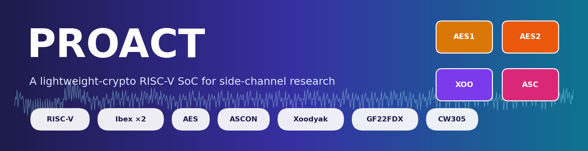
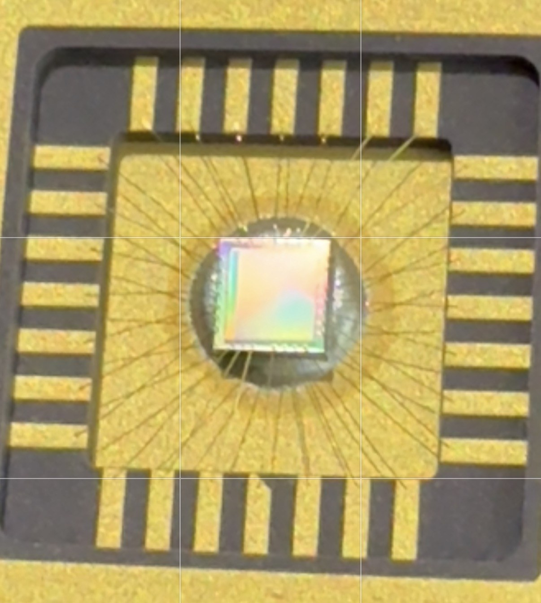
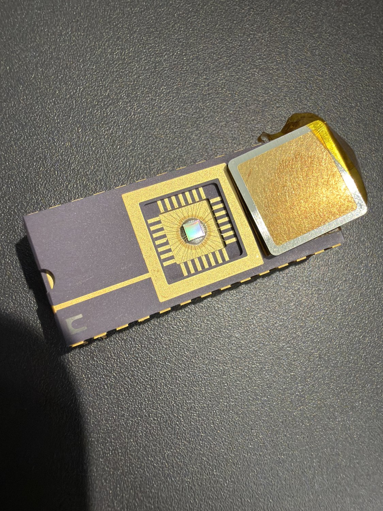
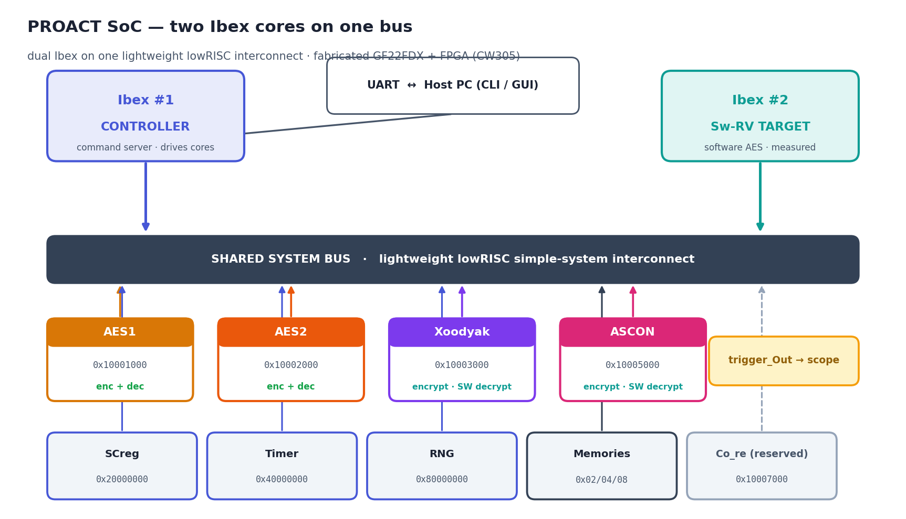
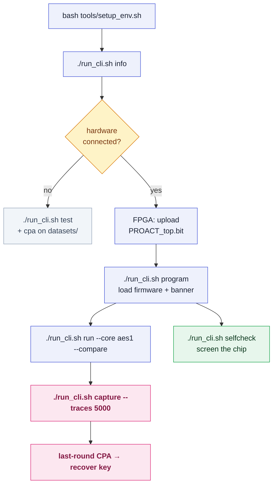

<p align="center">


</p>

<p align="center">
<b><a href="https://github.com/abolfazlsajadi/PROACT_Design">Repository</a></b> ·
<b><a href="https://github.com/abolfazlsajadi/PROACT_Design/blob/main/docs/manual/proact_manual.pdf">PDF manual</a></b> ·
<b><a href="https://github.com/abolfazlsajadi/PROACT_Design/blob/main/examples/PROACT_Tutorial.ipynb">Tutorial notebook</a></b> ·
<b><a href="GUI-Guide">GUI</a></b> ·
<b><a href="CLI">CLI</a></b> ·
<b><a href="Python-API">Python API</a></b>
</p>

---

## What PROACT is

**PROACT is a dual-core RISC-V system-on-chip built for side-channel research** — a
chip whose purpose is to let you *measure* how much a cryptographic implementation
leaks through its power consumption, and then attack it with those measurements.

Two [lowRISC **Ibex**](https://ibex-core.readthedocs.io/en/latest/index.html)
RV32IMC cores share one lightweight bus with four hardware crypto cores:

- the **controller** core runs a command server, serves the host over UART, and
  drives the crypto cores;
- the **Sw-RV target** core runs *software* AES-128, so a software implementation
  can be measured against the hardware engines under identical bench conditions;
- **AES1**, **AES2**, **ASCON** and **Xoodyak** are the hardware crypto cores,
  alongside a cycle timer that counts the trigger window, a masking PRNG, and a
  hardware capture trigger wired out to the scope.

The same RTL produced two targets: the **fabricated ASIC** (GlobalFoundries 22FDX,
tape-out November 2025) and the **CW305 FPGA** bitstream. The host software is
target-agnostic — the same commands, the same library, the same GUI.

**This wiki documents the software platform**: the firmware that runs on the chip,
the Python library / CLI / GUI that run on the host, and the bench procedures.
Familiarity with the RTL is *not* required to operate the chip.

## Status — what is proven, and what is not

| Area | Status |
|---|---|
| **CW305 FPGA build** | **Validated on hardware, 2026-08-07.** The GUI-driven A–Z self-check reports **16 pass / 0 fail / 0 skip**, including a real ChipWhisperer Husky trace capture. All four crypto cores match their references (aes1, aes2, ascon, xoodyak), as does `swrv` (software AES on the second core). |
| **Offline regression suite** | Green. `bash tools/run_tests.sh` → **1258 passed, 1 skipped** (an HDF5 test, skipped because `h5py` is absent) in about five seconds. No board, no network. |
| **Offline CPA** | `./run_cli.sh cpa --core aes1` recovers **16/16 key bytes** from the reference capture shipped in `datasets/`. |
| **Bitstream** | `PROACT_top.bit` at the repository root — part `7a100tftg256`, rebuilt 2026-08-07 with the corrected 50 MHz (20.000 ns) timing constraint. |
| **The fabricated ASIC** | ✅ **Screened and passing.** The A–Z self-check runs on a PROACT die in the CW308 target board from the GUI: **16 pass / 0 fail / 0 skip**, including ChipWhisperer clock lock and a real trace capture on silicon. Sustained unattended capture campaigns also run for hours from the CLI without failures. |
| **Windows / macOS** | ⚠ **Not tested.** Every hardware result above is Linux. |

**Known limitations, stated plainly:**

- **ASCON and Xoodyak are encrypt-only in hardware.** Decryption and tag
  verification run on the host in `proact_host/aead_soft.py`. This is by design —
  the encryption datapath is what a capture measures. AES1/AES2 do both
  directions in hardware.
- **Two controller-firmware bugs are known and *not* fixed** (they need a
  firmware release and a re-flash), both in `Software/Controller/main.c`: a Sw-RV
  mailbox timeout still transmits the file-scope `result[]` buffer, so the host
  can receive the *previous* block's output; and `CMD_LDI`/`CMD_LDD` clamp an
  over-long word count but do not drain the surplus words, which desynchronizes
  the command stream.
- **`proact_host/selfcheck.py` is legacy** — superseded by `fullcheck.py`, which
  is what the CLI and the GUI actually run.
- **There is no CI.** The suite above is run by hand.

## The fabricated chip

<p align="center">
  
  
</p>

*Left: the PROACT die and its bond wires. Right: the open-cavity ceramic package,
which keeps the die reachable for side-channel measurement and optical inspection.
Tape-out November 2025 on GlobalFoundries 22FDX.*

## Demonstrated result: CPA key recovery

Capturing power traces with a ChipWhisperer allows recovery of the secret key from
the power consumption alone — on **all three attackable cores**. For the correct
key byte (red) the correlation spikes far above every wrong guess (grey), at the
exact sample where each core leaks:


Each core needs a different leakage model, point of interest and trace count, and
each gives up the **full AES-128 key**. Bench-measured on the CW305 for all 16
bytes, with the low-pass filter the CPA scripts apply by default: **AES1 ~4800,
AES2 ~5300, Sw-RV ~1300** (11500 / 6600 / not reached, unfiltered) — the same
figures the `capture --traces` help and the GUI tooltip quote. The reference
captures are shipped in
[`datasets/`](https://github.com/abolfazlsajadi/PROACT_Design/tree/main/datasets),
so the attacks reproduce with **no board**:

```bash
./run_cli.sh cpa --core aes1     # -> RECOVERED 16/16 key bytes
```

The full walk-through is on the [**ChipWhisperer**](ChipWhisperer) page.

## The chip at a glance



> [!NOTE]
> **The design is fabricated and frozen — one clean source of truth.** The RTL is a read-only reference, and `config/hardware.json` generates the C header, the Python module, and these docs, so hardware, firmware, host code, and documentation can never disagree. Software is developed *against* the silicon; where a behavior is fixed in gates, the host and firmware simply accommodate it.

> [!NOTE]
> **What the A–Z self-check covers.** `proact_host/fullcheck.py` (also the GUI's *Self-Check (A–Z)* tab) runs one sequence end to end: UART link + baud integrity, AES1/AES2 encrypt KAT + decrypt round-trip, ASCON/Xoodyak on-chip encrypt KAT + software decrypt round-trip, the trigger-window timer, a control-register write, the PRNG, Sw-RV software AES, and — with a scope attached — ChipWhisperer clock lock and a real trace capture. Every step reports PASS/FAIL/SKIP independently, so one dead core never masks the rest. Without a scope the same run reports 14 pass / 1 skip; with the Husky attached, 16 pass. The register map is separately **RTL cross-checked** (34/34 constants agree with the frozen RTL).

## Where to go next

```mermaid
flowchart LR
    H([Home]):::hub
    subgraph START [Getting started]
      GS[Getting Started]:::doc
      TR[Troubleshooting]:::doc
    end
    subgraph HW [Hardware]
      HO[Hardware Overview]:::doc
      AR[Address & Register Map]:::doc
      HZ[Hardware Hazards]:::warn
    end
    subgraph SW [Software]
      CF[Controller Firmware]:::doc
      TS[Target Software]:::doc
      PY[Python API]:::doc
      CL[CLI]:::doc
      GU[GUI Guide]:::doc
    end
    subgraph BENCH [Bench & capture]
      CW[ChipWhisperer]:::star
      TE[Testing]:::doc
    end
    H --> START --> HW --> SW --> BENCH
    classDef hub fill:#4657d6,stroke:#312e81,color:#fff,font-weight:bold
    classDef doc fill:#eef1fc,stroke:#4657d6,color:#1b2233
    classDef warn fill:#fde8e8,stroke:#dc2626,color:#7f1d1d
    classDef star fill:#e0f5f3,stroke:#0f9d94,color:#08403b,font-weight:bold
```



**Start here**

| Page | Read it when… |
|---|---|
| [Getting Started](Getting-Started) | …it is your first day: install the host tools, build the firmware, bring the bench up in the one order that works, and take a first measurement. Also the no-hardware path. |
| [Troubleshooting](Troubleshooting) | …something does not answer, hangs, or "succeeds" without working. Symptom → cause → fix, including every trap that has actually cost time on this bench. |
| Tutorial notebook ([open](https://github.com/abolfazlsajadi/PROACT_Design/blob/main/examples/PROACT_Tutorial.ipynb)) | …you would rather learn the API by running it: a section-by-section tour of the whole platform. |

**Hardware**

| Page | Read it when… |
|---|---|
| [Hardware Overview](Hardware-Overview) | …you need the mental model: what is on the die, how the two CPUs talk to each other and to the crypto cores, and where ASIC and FPGA differ. Read this before the other hardware pages. |
| [Address and Register Map](Address-and-Register-Map) | …you are writing to a register and need the exact address, bit field, or offset. The canonical map, generated from `config/hardware.json`. |
| [Hardware Hazards](Hardware-Hazards) | …you are about to hand-write a low-level bus sequence, or the CPU froze. The complete list of accesses that never acknowledge (H1–H9) and the safe sequences the drivers already use. |

**Firmware (C, runs on the chip)**

| Page | Read it when… |
|---|---|
| [Controller Firmware](Controller-Firmware) | …you are changing what the chip does on a command, or need the exact UART command byte / frame layout. |
| [Target Software](Target-Software) | …you want to run *your own* software on the measured core, or need the Sw-RV mailbox and its status-bit-31 trigger. |

**Host software (runs on the PC)**

| Page | Read it when… |
|---|---|
| [CLI](CLI) | …you are scripting the bench or want one command for a job. Every `./run_cli.sh` subcommand, with examples. |
| [Python API](Python-API) | …you are writing your own experiment. The `proact_host` package function by function — the same backend the CLI and GUI use. |
| [GUI Guide](GUI-Guide) | …you prefer to drive the bench by hand, or you are demonstrating the chip. Tour of the seven pages and the sidebar. |

**Bench & capture**

| Page | Read it when… |
|---|---|
| [ChipWhisperer](ChipWhisperer) | …you are taking traces or mounting an attack. Scope setup, trigger selection, sample-count sizing, and a complete reproducible last-round CPA. |
| [Testing](Testing) | …you need to know how a claim in this wiki was verified, or you are about to screen a chip. |

## Design notes

PROACT is a lean SoC designed for a single purpose — clean side-channel
measurement. Several of its design choices are worth knowing up front. None of
them interfere with normal use (the drivers already accommodate them); they
explain why the platform is structured the way it is.

- **Capture trigger = control bit 30.** The control register is a 31-bit control field, so the capture trigger is bit 30 (`0x40000000`). The read-side status register is a full 32 bits, and *its* bit 31 is the live "target-done" signal — a separate register. → [Address & Register Map](Address-and-Register-Map)
- **AEAD = hardware encrypt + software round-trip.** ASCON and Xoodyak implement the encryption datapath, which is exactly what capture measures; decrypt and tag-check run on the host with `aead_soft.py` (bit-exact to the cores). AES1/AES2 do both directions in hardware. → [Hardware Overview](Hardware-Overview)
- **A lightweight bus.** PROACT builds on the lowRISC *simple-system* interconnect — deliberately minimal. The firmware's only obligation is to issue valid (acknowledged) accesses, which the supplied drivers already guarantee. → [Hardware Hazards](Hardware-Hazards)


## Typical workflows



1. **First bring-up (5 min, no chip):** `bash tools/setup_env.sh` → `./run_cli.sh info` → `./run_cli.sh test` → `./run_cli.sh cpa --core aes1`. See [Getting Started](Getting-Started).
2. **Run and validate a crypto op:** upload the bitstream (FPGA), program the firmware, then `./run_cli.sh run --core aes1 --compare --timer`. See [CLI](CLI) / [Python API](Python-API).
3. **Capture + attack:** `./run_cli.sh capture --core aes1 --traces 5000 --platform fpga --output experiments/aes1`, then run the last-round CPA. See [ChipWhisperer](ChipWhisperer).
4. **Screen a chip:** connect over UART and run the one unified check — `./run_cli.sh selfcheck` (or the GUI *Self-Check (A–Z)* tab). See [Testing](Testing).

## First steps

```bash
bash tools/setup_env.sh                  # one-time: dedicated ~/.proact-venv for the GUI/CLI
sudo bash tools/install_udev.sh          # one-time (Linux): USB permissions — then REPLUG the devices
make -C Software/Controller              # -> main.vmem (one combined text+data image)
make -C Software/SW_RV                   # -> sw_rv_imem.vmem + sw_rv_dmem.vmem
./run_cli.sh info                        # print the address map + config (no hardware needed)
./run_gui.sh                             # launch the GUI
```

> [!WARNING]
> **Never run the GUI or CLI with `sudo`.** Device access comes from the udev rules above, and the `./run_gui.sh` / `./run_cli.sh` wrappers pick the right Python (the dedicated `~/.proact-venv`, or a system Python that has the packages) — a bare `python3` under pyenv can be a different interpreter missing PyQt6/hid/mcp2210/chipwhisperer. Running with sudo *breaks* ChipWhisperer, which is installed under the user's `~/.local`.

New project members should read **[Getting Started](Getting-Started)** first, then
the **[Hardware Hazards](Hardware-Hazards)** page — the design notes above are the
summary, and that page is the full reference that keeps firmware from hanging.
Then work through the tutorial notebook.

## About the CPU

PROACT's two processors are **lowRISC Ibex** cores (RV32IMC, a small 2-stage
in-order design). To study the CPU itself — its pipeline, CSRs, and configuration
— see the official
[Ibex documentation](https://ibex-core.readthedocs.io/en/latest/index.html).
PROACT uses one Ibex as the *controller* (runs the command server this wiki
describes) and a second as the *Sw-RV target* (runs software crypto for
comparison against the hardware cores).
