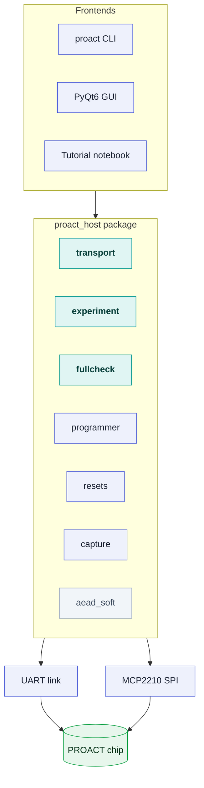

# Python API

The `proact_host` package is the host-side Python library that drives a PROACT chip from a PC: it opens the UART link, implements the controller command protocol, programs firmware over SPI, drives the reset lines, captures power traces with a ChipWhisperer, validates AES/AEAD results, and stores everything to disk. The `proact` command-line tool and the GUI are both thin wrappers over this package, so every operation they perform is also available from a few lines of Python. Current version: **`proact_host.__version__ == "1.0.0"`**.

> [!NOTE]
> **Status.** The library is hardware-verified on the **CW305 FPGA build** (2026-08-07): the unified A–Z self-check (`fullcheck.run_full_check`) reports **16 pass / 0 fail / 0 skip** with a ChipWhisperer Husky attached — UART link + baud, AES1/AES2 encrypt KAT + decrypt round-trip, ASCON/Xoodyak on-chip encrypt KAT, software AEAD decrypt round-trip, timer, control write, PRNG, Sw-RV software AES, plus clock lock and a real trace capture. Without a scope the same sweep is 14 pass / 0 fail / 1 skip. AEAD **decryption** runs on the host with `aead_soft` (see the AEAD section below). The **fabricated ASIC is bench-verified** with this same library — firmware load, UART, AES1/AES2 and Sw-RV known-answer vectors on silicon, Husky clock and trigger lock, and sustained trace capture. Windows/macOS are untested. The one remaining bench-verify stub is `capture.husky_spi()`.

For a runnable, section-by-section walkthrough of everything on this page, see the tutorial notebook `examples/PROACT_Tutorial.ipynb`.

The stack consists of one package with three interchangeable frontends on top and two physical links to the chip underneath:



## Package layout

| Module | Class / function | Description |
| --- | --- | --- |
| `transport` | `UartTransport`, `ProactTarget`, `block_to_words`, `words_to_block` | Raw serial link + the controller command protocol (one method per command) |
| `programmer` | `Mcp2210Programmer` | Streams a firmware `.vmem` into the controller over MCP2210 SPI, does the reset choreography, and confirms the boot banner |
| `resets` | `ResetController` | Sets/reads the four reset lines over MCP2210 GPIO |
| `capture` | `ChipWhispererCapture`, `recommended_samples`, `RECOMMENDED_GAIN` | Husky/CW305 clock generation, scope arm/capture, sample-count and gain sizing |
| `experiment` | `PROACTExperiment` | High-level orchestration: prepare → capture N traces → save |
| `storage` | `TraceStore`, `load` | HDF5 dataset (auto-fallback to `.npz`) |
| `validation` | `aes128_encrypt_block`, `validate_aes`, `validate_aead` | Pure-Python AES-128 reference + AES/AEAD result checks |
| `aead_soft` | `ascon128_encrypt/decrypt`, `xoodyak_encrypt/decrypt`, `selftest` | Bit-exact software ASCON-128 / Xoodyak — the host-side decrypt that completes the AEAD round trip |
| `fullcheck` | `run_full_check`, `summarize`, `report_text`, `CheckItem` | **The live** unified A–Z self-check (also behind the GUI's Self-Check (A–Z) tab; reusable for ASIC chip screening) |
| `selfcheck` | `run_self_check`, `CheckResult`, `report_text` | **Legacy** per-core check — superseded by `fullcheck`, see below |
| `monitor` | `MonitorDecoder`, `safe_text`, `hex_str`, `is_frame_start` | Robust UART-monitor decoding — never raises on binary frames or line noise |
| `inputs` | `Variable`, `InputPlan`, `parse_input_file`, `VARS` | Fixed/random per-run key/pt/nonce/ad generation |
| `regs` | (constants) | Address map + command bytes, generated from `config/hardware.json` — do not edit |
| `config` | (constants) | Bench constants: USB IDs, input clock, MCP serials, GPIO pin map |
| `vmem` | `parse_vmem`, `vmem_values` | Parser for the firmware Makefile `.vmem` files |

`import proact_host` eagerly imports only `config`, `regs`, `vmem`, `validation`, `storage` and the transport symbols (`UartTransport`, `ProactTarget`, `block_to_words`, `words_to_block`); every other module is a normal submodule you import by name (`from proact_host import aead_soft`). The hardware backends (`pyserial`, `hid`, `mcp2210`, `chipwhisperer`) are imported **lazily inside the methods that need them**, so `import proact_host` works for inspection and host-side tests on a machine with nothing plugged in.

## Install

From `Software/Python/` (installs the `proact` command too):

```bash
pip install -e .              # core: pyserial>=3.5, hidapi>=0.14, mcp2210-python>=0.1.4, numpy>=1.23
pip install -e ".[all]"       # + PyQt6>=6.5, h5py>=3.7, chipwhisperer==6.0.0
```

Optional extras are grouped: `[gui]`, `[hdf5]`, `[capture]`, or `[all]`. Requires Python ≥ 3.9. Without `h5py`, `TraceStore` transparently falls back to compressed `.npz`.

On the bench, prefer the repo-root launchers `./run_cli.sh` and `./run_gui.sh` (or a one-time `bash tools/setup_env.sh` to build the dedicated `~/.proact-venv`): these launchers select a Python interpreter that has the required packages installed, avoiding a known pyenv pitfall where a bare `python3` resolves to a different interpreter missing PyQt6/hid/mcp2210/chipwhisperer. **Never run with sudo** — device permissions come from the udev rules (one-time `sudo bash tools/install_udev.sh`, then replug the USB devices), and sudo breaks chipwhisperer, which is installed under the user's `~/.local`.

## High-level: `PROACTExperiment`

`PROACTExperiment` is the single entry point that ties the whole workflow together. It uses the verified PROACT capture order — configure inputs → arm scope → run op → wait done → read result → validate → store — repeated per trace.

```python
from proact_host.experiment import PROACTExperiment

with PROACTExperiment(platform="fpga", target="aes1", traces=1000,
                      output="results/aes1", capture=True, samples=5000) as exp:
    exp.prepare()      # open UART (+scope), select core, load key, open storage
    n = exp.capture()  # run N ops, capture a trace + result each, validate; returns the count stored
    exp.save()         # flush and close the dataset -> prints and returns the file path
```

Constructor options (all keyword, with defaults):

| Argument | Default | Meaning |
| --- | --- | --- |
| `platform` | `"asic"` | `"asic"` (Husky generates the clock on HS2) or `"fpga"` (CW305 PLL); also recorded in metadata |
| `target` | `"aes1"` | `aes1`, `aes2`, `ascon`, `xoodyak`, or `swrv` (lower-cased) |
| `traces` | `1` | Number of operations/traces to run |
| `output` | `"results/run"` | Output path (extension added automatically) |
| `key` | `bytes(range(16))` | 16-byte key, fixed for the campaign |
| `fixed_input` | `None` | If set, every run uses this 16-byte input |
| `randomize` | `True` | Random 16-byte input per run (forced off if `fixed_input` is set) |
| `decrypt` | `False` | Decrypt instead of encrypt (AES1/AES2/Sw-RV in hardware; for the AEAD cores, decrypt on the host with `aead_soft`) |
| `capture` | `True` | Attach a ChipWhisperer; if it can't connect, capture is disabled and functional runs still store outputs with an empty trace |
| `samples` | `5000` | Scope samples per trace (see `auto_samples`) |
| `port` | `None` | Serial port; `None` auto-detects the MCP2200 |
| `clock_hz` | `50e6` | Target clock, forwarded to the scope |
| `bitstream` | `None` | CW305 bitstream to upload first (used only when `platform="fpga"`) |
| `gain_db` | `None` | ADC gain in dB; `None` uses `capture.RECOMMENDED_GAIN[target]` (10 dB for the hardware cores, 20 dB for `swrv`) |
| `gain_mode` | `None` | ADC gain mode; `None` uses the recommendation (`"low"` for every core) |
| `auto_samples` | `True` | Before the campaign, run one throw-away op, read the trigger-window cycle count and grow `samples` to `cycles × adc_mul × 1.15` if that is larger |

`capture(save_every=50)` flushes to disk every 50 stored traces, so a long run survives an interruption, and returns how many traces were actually stored. A per-trace exception (a scope timeout, a short frame) is recorded with `TraceStore.record_failure(i, reason)` and the loop continues.

Graceful degradation: `prepare()` raises a clear error if the UART bench is not connected, but a missing ChipWhisperer only disables trace capture (it prints `[capture disabled: ...]` and stores traces as empty lists). For `aes1`/`aes2`/`swrv`, each result is checked against the software AES reference in **both** directions (`validate_aes(..., decrypt=self.decrypt)`); for `ascon`/`xoodyak` it is checked with `validate_aead`, which returns `False` for a decrypt run because the hardware is encrypt-only. The boolean lands in the `valid` array.

The equivalent CLI one-liner:

```bash
proact capture --core aes1 --traces 1000 --platform fpga --output results/aes1
```

## Low-level: `ProactTarget` over `UartTransport`

For direct control of the controller command protocol, use `ProactTarget` directly. It wraps a `UartTransport` and exposes one method per command; results come back as `0xA5 <mode> <len> <payload>` frames, and the reader skips any ASCII debug bytes before the `0xA5` marker.

```python
from proact_host.transport import ProactTarget, UartTransport

# port=None auto-detects the MCP2200 UART bridge (VID 0x04D8 / PID 0x00DF)
with UartTransport(port=None, baud=115200, timeout=2.0) as t:
    tgt = ProactTarget(t)
    tgt.enable_sendback()                    # ask firmware to return result frames
    tgt.select("aes1")                       # aes1|aes2|ascon|xoodyak|swrv
    tgt.set_key(bytes(range(16)))            # 16-byte key
    tgt.set_plaintext(bytes(range(16, 32)))  # 16-byte block
    tgt.set_decrypt(False)

    mode, payload = tgt.run_and_read()       # run(), then read one 0xA5 frame
    print(f"mode={mode} ciphertext={payload[:16].hex()}")

    cycles = tgt.get_timer()                 # trigger-window cycle count
    print(f"cycles={cycles}")
```

`UartTransport.open()` also takes a **cross-process lock** on `/tmp/proact_uart_<port>.lock`, so a second PROACT process (GUI *and* CLI at once) fails fast with a clear `RuntimeError` instead of interleaving bytes on the wire. Within a process, `UartTransport.lock` is a re-entrant transaction lock that `ProactTarget` holds across each command **and** its reply frame; a passive reader (the UART monitor) must use `read_available()`, which returns only the bytes already buffered and never blocks.

For an AEAD core, also set the nonce and associated data before running. The AEAD result frame is 32 bytes: ciphertext (16) followed by the tag (16):

```python
tgt.select("ascon")
tgt.set_key(key); tgt.set_nonce(bytes(16)); tgt.set_ad(bytes(16))
tgt.set_plaintext(pt)
mode, payload = tgt.run_and_read()
ct, tag = payload[:16], payload[16:32]
```

> [!NOTE]
> **AEAD decryption runs on the host.** For the ASCON/Xoodyak cores, decrypt and tag-verify are performed in software — see [`aead_soft`](#aead-hardware-encrypt-software-decrypt-aead_soft) below. AES1/AES2 support both directions in hardware.

### `ProactTarget` methods

| Method | Command | Notes |
| --- | --- | --- |
| `enable_sendback()` | `CMD_SB` `0x03` | Return `0xA5` result frames |
| `enable_debug()` | `CMD_DBG` `0x04` | Enable verbose ASCII debug output |
| `select(core)` | `aes1`=0x09, `aes2`=0x06, `xoodyak`=0x07, `ascon`=0x08, `swrv`=0x14 | Select the core to run (case-insensitive) |
| `set_key(key)` | `CMD_KEY` `0x01` | 16 bytes, sent as 4 big-endian words |
| `set_plaintext(pt)` | `CMD_PT` `0x02` | 16 bytes |
| `set_nonce(nonce)` | `CMD_NONCE` `0x0B` | 16 bytes (AEAD) |
| `set_ad(ad)` | `CMD_AD` `0x0C` | 16 bytes (AEAD) |
| `set_decrypt(on)` | `CMD_DEC` `0x0D` | `True`/`False` |
| `set_trigger_cfg(cfg)` | `CMD_TRIG` `0x0F` | `cfg & 0x7F` — AEAD in-core trigger phase |
| `set_cfgsel(source)` | `CMD_CFGSEL` `0x15` | Trigger-source mux: `None`→`0xFF` (auto), `software`→0, `ascon`→1, `aes1`→2, `aes2`→3, `xoodyak`→4, `swrv`→5 |
| `seed_rng(seed)` | `CMD_SEED` `0x0E` | 32-bit seed, big-endian |
| `toggle_arm()` | `CMD_ARM` `0x0A` | Toggle arm |
| `run()` | `CMD_RDY` `0x05` | Start the selected op |
| `read_frame()` | — | Read one `(mode, payload)` frame; `TimeoutError` on no/short frame, `RuntimeError` after 8192 junk bytes (wrong baud) |
| `run_and_read()` | — | `run()` then `read_frame()`, as one locked transaction |
| `get_timer()` | `CMD_TIME` `0x10` | Trigger-window counter |
| `self_test()` | `CMD_TEST` `0x11` | Trigger the on-chip self-test (no reply frame) |
| `load_target_imem(words)` | `CMD_LDI` `0x12` | Load Sw-RV instruction memory (holds the target in reset while loading) |
| `load_target_dmem(words, base)` | `CMD_LDD` `0x13` | Load Sw-RV data memory at `base` |
| `load_swrv_program(imem, dmem, dmem_base=0x08100000, boot_delay=0.2)` | — | Load a program into the Sw-RV target **and boot it** — the required sequence |
| `read_status()` | `CMD_RDSTAT` `0x16` | Read the real status register (`0x20000000`); returns the 32-bit value |
| `write_control(value)` | `CMD_WRCTRL` `0x17` | Write a raw 32-bit control value; the silicon's control register is a 31-bit field, so bit31 is truncated in hardware |
| `poke(addr, value)` | `CMD_POKE` `0x18` | Raw bus write |
| `peek(addr)` | `CMD_PEEK` `0x19` | Raw bus read: return the 32-bit word at `addr` |
| `poke_words(addr, words, stride=4)` / `peek_words(addr, count, stride=4)` | — | Convenience loops over consecutive word addresses |
| `aead_kat()` | `CMD_AEADKAT` `0x1A` | Run the on-chip ASCON + Xoodyak encrypt KAT; returns `(xoodyak_ok, ascon_ok)` |

`get_timer()` and `read_status()` refuse a short reply: a payload under 4 bytes raises `TimeoutError` rather than silently decoding as a plausible-looking `0`, because a truncated frame means the link is broken, not that the register reads zero.

`peek`/`poke` are the raw bus-access primitives (bring-up, debug, and pushing custom input data into the Sw-RV data memory). Reads are safe on mapped addresses; **writing to CPU RAM can wedge the chip** and the bus has no watchdog, so only poke addresses that are known to be mapped — and never `regs.CORE_BASE_DO_NOT_USE` (`0x10007000`), which has no hardware instance at all. To load a program into the Sw-RV target, use `load_swrv_program(imem, dmem, base)` (it loads instruction then data memory while the target is held in reset, then `select("swrv")` releases it so the fresh program boots) — not raw pokes.

Frame `mode` values (`regs.MODE_*`): `0`=AES1, `1`=AES2, `2`=Xoodyak, `3`=ASCON, `4`=Sw-RV, `241`=timer, `242`=status, `243`=peek, `244`=AEAD KAT. AES/Sw-RV payloads are 16 bytes; AEAD payloads are 32 bytes (CT then tag).

`aead_kat()` runs `proact_aead_kat.c` in the firmware: the hardware design team's exact reference vectors (ASCON: 24-byte AD / 23-byte PT; Xoodyak: 52-byte AD / 119-byte PT) are encrypted on-chip and the CT+tag compared word-for-word against the reference. Both pass on hardware. The result frame carries one word; bit 0 = Xoodyak OK, bit 1 = ASCON OK, unpacked into the `(xoodyak_ok, ascon_ok)` tuple.

Helper functions for byte/word conversion are exported at package top level:

```python
from proact_host import block_to_words, words_to_block
block_to_words(bytes(range(16)))   # -> 4 big-endian 32-bit words; ValueError if not 16 bytes
```

> [!CAUTION]
> The scope trigger comes from the crypto core itself (the capture trigger is **control-register bit30**, `regs.CTRL_TRIGGER` = `0x40000000`). The Sw-RV software-AES path uses **status bit31** (`regs.STAT_TARGET_DONE`) instead — a different, valid trigger. Select which core drives the scope trigger with `set_cfgsel(...)`; the two triggers must not be conflated.

## AEAD: hardware encrypt, software decrypt (`aead_soft`)


*Encryption runs on-chip (the operation measured during trace capture); decrypt and tag-verify run in the pure-Python `aead_soft` reference — proven to be the same cipher by the shared reference vectors.*

The AEAD cores implement hardware encryption with software decryption on the host — a deliberate design choice. `proact_host.aead_soft` provides that host-side decryption: a pure-Python, dependency-free, bit-exact implementation of both AEAD ciphers — **ASCON-128 v1.2** and **Xoodyak v2** (Cyclist over Xoodoo[12], the NIST LWC final-round version, with the nonce absorbed together with the key, exactly as the GMU core in silicon implements it). Both are validated against the same reference vectors the silicon reproduces (identical CT+tag), so software and hardware are provably the same cipher. The workflow:

```
hardware  encrypt(key, nonce, ad, pt)      -> ct, tag     (fast, on-chip)
software  decrypt(key, nonce, ad, ct, tag) -> pt or None  (aead_soft)
```

| Function | Signature | Returns |
| --- | --- | --- |
| `ascon128_encrypt` | `(key, nonce, ad, pt)` | `(ciphertext, 16-byte tag)` |
| `ascon128_decrypt` | `(key, nonce, ad, ct, tag)` | plaintext `bytes`, or `None` on a wrong tag |
| `xoodyak_encrypt` | `(key, nonce, ad, pt)` | `(ciphertext, 16-byte tag)` |
| `xoodyak_decrypt` | `(key, nonce, ad, ct, tag)` | plaintext `bytes`, or `None` on a wrong tag |
| `words_to_bytes` | `(words, nbytes)` | hardware FIFO word list → byte stream (big-endian words, truncated to `nbytes`) |
| `bytes_to_words` | `(data)` | byte stream → hardware FIFO words (zero-padded into the last word) |
| `selftest` | `()` | `{name: bool}` — six checks: encrypt, decrypt, and wrong-tag rejection for each cipher, against the silicon's reference vectors |

Keys and nonces are 16 bytes; `ad`/`pt`/`ct` are arbitrary-length `bytes`. On a tag mismatch decrypt returns `None` and releases no plaintext (the AEAD contract). The module-level `ASCON_VEC` / `XOODYAK_VEC` dicts hold the reference vectors — the same ones the on-chip KAT (`aead_kat()`) checks — with keys `key`, `nonce`, `ad`, `pt`, `ct`, `tag`.

`selftest()` is also what `proact test` and `proact decrypt-soft --selftest` run; all six checks pass:

```
ascon_encrypt · ascon_decrypt · ascon_reject_bad_tag ·
xoodyak_encrypt · xoodyak_decrypt · xoodyak_reject_bad_tag
```

End-to-end example — encrypt on-chip, decrypt + verify on the host:

```python
from proact_host import aead_soft

tgt.select("ascon")
tgt.set_key(key); tgt.set_nonce(nonce); tgt.set_ad(ad)
tgt.set_plaintext(pt)
mode, payload = tgt.run_and_read()
ct, tag = payload[:16], payload[16:32]

recovered = aead_soft.ascon128_decrypt(key, nonce, ad, ct, tag)
assert recovered == pt          # None would mean a wrong tag
```

The implementation is plain Python: suitable for validation, round-trip tests, and experiment post-processing; **not constant-time** and not intended for production key handling.

## Firmware loading: `Mcp2210Programmer`

Streams a firmware `.vmem` into the controller as 64-bit `{addr[31:0], data[31:0]}` frames (address in the upper word, MSB-first) over MCP2210 SPI, then runs the reset choreography so the controller boots.

```python
from proact_host.programmer import Mcp2210Programmer
from proact_host.transport import UartTransport

prog = Mcp2210Programmer(serial=None).open()      # auto-detects the MCP2210 (04D8:00DE)
prog.program("Software/Controller/main.vmem",
             progress=lambda pct: print(f"{pct}%"))

# The SPI slave is WRITE-ONLY, so program() alone cannot tell whether the chip
# is alive. Reboot with the UART already listening and wait for the banner:
with UartTransport().open() as uart:
    assert prog.verify_running(uart, timeout=3.0)  # b"PROACT controller ready."

prog.restart_controller()                          # reboot without reloading
```

`program()` holds all lines low, opens the SPI-load window, streams every `(addr, data)` word from the parsed `.vmem`, then releases to the proven run state: `spi_reset` LOW, `spi_select` LOW, `global_reset` HIGH (crypto released), and finally a `controller_reset` pulse so the CPU boots with the crypto already out of reset. `restart_controller()` re-applies exactly that end state. The GPIO pin map is `config.Mcp2210Pins`, reachable as `prog.pins`.

`verify_running(uart, timeout=3.0)` is the only cheap **positive** proof the load worked: it drains the port, reboots the controller, and watches for `Mcp2210Programmer.BOOT_BANNER` (`b"PROACT controller ready."`). `uart` is any object with `read_available()` (and optionally `reset_input_buffer()`); the transaction lock is taken if present, so it never collides with a monitor poll.

Internally the MCP handle is wrapped in a private `_LockedMcp` proxy that serializes every call through one re-entrant lock (exposed as `prog.lock`, shared with `ResetController.try_status()`) and retries once on a command/response desync — without it, the GUI's 1 s indicator poll racing a reset click desynchronizes the HID stream permanently.

## Reset control: `ResetController`

Wraps an already-opened `Mcp2210Programmer` to set and read the four reset lines. Polarity follows the verified GUI convention: **output `True` = released/active, `False` = held in reset**; readback reflects the actual reset net.

```python
from proact_host.resets import ResetController

rc = ResetController(prog)          # prog = an opened Mcp2210Programmer
rc.apply_mode("run")                # back to THE known-good running state
rc.release("controller")            # bring the controller out of reset
print(rc.status())                  # {'controller': True/False/None, 'global':..., ...}
print(rc.try_status())              # same, but None if the MCP is busy (UI pollers)
```

Lines: `controller` (CTRL_RV core), `global` (Sw-RV + crypto co-processors), `spi` (SPI code loader), `spi_select` (chip-select). A `None` in `status()` means that pin could not be read back.

`apply_mode(mode)` accepts `run`, `controller`, `global`, `spi`, `reset_all` (the older names `none` and `default_program` are still accepted as aliases for `run` and `reset_all`). Every mode drives **all four** lines, so the result never depends on what a previous call left behind.

> [!WARNING]
> **Safety rule, hardware-verified:** never assert `global` while the controller CPU is running — the CPU's next crypto access touches a core in reset, the bus never acks, and the chip wedges beyond software recovery (only an FPGA reprogram brings it back). Every mode that asserts `global` therefore holds the controller **first**, and `run` releases the crypto **before** rebooting the controller. The known-good running state is `controller=True, global=True, spi=False, spi_select=False` — the SPI loader must stay held in reset while the chip runs.

## Power capture: `ChipWhispererCapture`

Connects a ChipWhisperer-Husky and arms/captures traces; the scope trigger is configured on `tio4` (PROACT `trigger_Out`). It is platform-aware — the two targets share the same design but clock differently:

- **`platform="asic"`** — the fabricated chip needs an external clock, so the Husky *generates* the target clock on HS2 (clkgen, default 50 MHz).
- **`platform="fpga"`** — the CW305 runs the PROACT bitstream and clocks itself from its on-board PLL (output 1, 50 MHz); HS2 is disabled and the Husky ADC syncs to the external target clock at `adc_mul`× it. `connect(bitstream=...)` (or `program_fpga(...)`) uploads `PROACT_top.bit` first; `sync_adc_extclk()` re-syncs a board that is already up without re-flashing.

```python
from proact_host.capture import ChipWhispererCapture

scope = ChipWhispererCapture(samples=5000, adc_mul=4, clock_hz=50_000_000,
                             platform="fpga", gain_db=10.0, gain_mode="low"
                             ).connect(bitstream="PROACT_top.bit")
print(scope.clock_status())     # {'platform':..., 'target_clock_MHz':50.0, 'hs2':...,
                                #  'adc_freq_MHz':200.0, 'clock_source':..., 'locked':True}

scope.arm()                     # arm, then trigger the op between arm and capture
trace = scope.capture()         # numpy trace; raises TimeoutError if no trigger
scope.disconnect()
```

| Member | Notes |
| --- | --- |
| `connect(clock_hz=None, platform=None, bitstream=None, fpga_id="100t", force=True)` | `bitstream=None` attaches to an already-configured CW305 without touching the fabric. `force=True` matters: `cw.target(force=False)` skips the upload whenever the FPGA already holds *any* configuration, so a board left with another bitstream keeps running it while the call still reports success |
| `program_fpga(bitstream, fpga_id="100t", freq_hz=50e6, force=True)` | VCCINT 1.0 V, PLL1 output 1 at `freq_hz`, HS2 disabled, ADC locked to the external clock |
| `set_clock(hz)` | ASIC path: drive `hz` on HS2 from the Husky oscillator; warns if clkgen does not lock |
| `sync_adc_extclk(hz=None)` | FPGA path with no re-flash; returns the `adc_locked` flag |
| `clock_status()` | dict; **check `locked` before trusting a capture** |
| `arm()` / `capture(timeout=5.0)` / `disconnect()` / `is_connected` | `capture()` raises `TimeoutError` if no trigger arrived |
| `trace_quality(traces)` *(static)* | `{clip_percent, full_scale_percent, std}` — aim for ~70–90 % of full scale with `clip_percent == 0` |
| `husky_spi()` | **stub** — `NotImplementedError`, pending a bench check |

Module-level helpers: `recommended_samples(trigger_cycles, adc_mul=4, margin=1.15)` returns the sample count that covers a whole trigger window (setting fewer silently truncates the capture, and the leakage past the cut is unrecoverable at any trace count), and `RECOMMENDED_GAIN` maps each core to its `(mode, dB)` pair — `("low", 10.0)` for the hardware cores, `("low", 20.0)` for `swrv`. `PROACTExperiment` applies both automatically.

This path is hardware-verified: the A–Z self-check's clock-lock and trace-capture steps pass on the real CW305.

## Storage: `TraceStore` and `load`

Primary format is HDF5 (one self-describing file); automatic fallback to compressed `.npz` when `h5py` is absent. Supports incremental append so a long run survives interruption (`flush()` is safe to call repeatedly mid-run).

```python
from proact_host.storage import TraceStore, load

store = TraceStore("results/aes1", metadata={"target": "aes1", "platform": "fpga"})
store.append(trace, plaintext, key, output, expected=None, valid=True)
store.record_failure(3, "scope capture timed out")   # log a bad capture, keep going
print(store.count)               # traces appended so far
store.flush()                    # write to disk now
path = store.close()             # flush + return the final path

data = load(path)
print(data["traces"].shape, dict(data["metadata"]))
```

**Path.** A path already ending in `.h5` or `.npz` is kept verbatim; otherwise the extension is appended — `.h5` when `h5py` is importable, `.npz` otherwise. The container actually written follows `h5py` availability, so an explicit `.h5` on a machine without `h5py` holds npz bytes; `load()` probes with `h5py.is_hdf5` rather than trusting the extension.

### What a capture file contains

Every array is **index-aligned**: row *i* of `traces` belongs to row *i* of `plaintext` / `key` / `output` / `expected` / `valid`.

| Array | Shape | dtype | Meaning |
| --- | --- | --- | --- |
| `traces` | (n, samples) | `float32` | the power traces (gzip-compressed in HDF5) |
| `plaintext` | (n, 16) | `uint8` | the input block of each run |
| `key` | (n, 16) | `uint8` | the key used for each run |
| `output` | (n, 16) or (n, 32) | `uint8` | chip output — 16 bytes for AES/Sw-RV, 32 (CT‖tag) for AEAD |
| `expected` | (n, k) or (0, 0) | `uint8` | expected output, when the caller supplied one; `(0, 0)` when no append did |
| `expected_present` | (n,) | `int8` | **only written when some appends carried an `expected` and others did not** — 1 = this row has one |
| `valid` | (n,) | `int8` | **`-1` = not checked, `0` = fail, `1` = pass** |

**The `valid` flags are the analysis filter.** `validate_aes` / `validate_aead` produce them per run; `-1` means validation was not attempted (e.g. an AEAD decrypt run), not that the trace is good. A row whose capture came back short is also forced to `0` (see below). Analysis code that scores an attack should select on `valid == 1`.

**Ragged rows.** `_vstack` widens every array to the **longest** row and zero-pads the short ones, so one glitched capture can never truncate the whole campaign. When that happens the store also:

- forces those rows' `valid` to `0`,
- records `metadata["ragged_trace_rows"]` — the list of affected row indices,
- records `metadata["trace_samples"]` — the final (longest) sample count,
- prints a warning to stderr naming the count.

So `metadata.get("ragged_trace_rows")` is the definitive "which rows are padded" list; if the key is absent, every row was full length. In HDF5 it is stored as a JSON string (only `int`/`float`/`str` attributes are written verbatim), so decode it with `json.loads` when reading an `.h5`.

**Metadata.** `TraceStore` always sets `created` and `format` (`"hdf5"`/`"npz"`). `PROACTExperiment` additionally records `platform`, `target`, `traces_requested`, `decrypt`, `key` (hex), `randomize`, `samples`, `trigger`, and — when a scope is attached — `clock_hz`, `adc_mul`, `adc_freq_MHz`, `clkgen_locked`, so a time axis can be reconstructed later.

**`load(path)` differences between the two containers**, which matter to analysis code:

| | `.npz` | `.h5` |
| --- | --- | --- |
| `d["metadata"]` | parsed `dict` | `dict(f.attrs)`; non-scalar values are JSON strings |
| `d["failures"]` | parsed `list` of `{index, reason, time}` | **not a top-level key** — it is `json.loads(d["metadata"]["failures"])` |
| extra keys | — | `metadata["n_traces"]` |

> [!NOTE]
> The three reference captures shipped in [`datasets/`](https://github.com/abolfazlsajadi/PROACT_Design/tree/main/datasets) are *post-processed* for size: they hold only `traces` (`int16` — the Husky ADC is 12-bit, so this is lossless), `plaintext`, `output` and a single `(16,)` `key` row, since the whole campaign used one fixed key. They carry no `valid`, `expected`, `metadata` or `failures`, so `storage.load()` raises `KeyError: 'metadata is not a file in the archive'` on them — read them with `numpy.load` directly. The CPA example scripts have their own `load_capture()` that accepts both layouts; see `datasets/README.md`.

## Validation

A compact dependency-free AES-128 (ECB, single block) provides the expected-ciphertext check for the AES cores. This reference is anchored to external ground truth — FIPS-197, NIST SP 800-38A — by `tests/test_validation.py`, and re-checked by `proact test`.

```python
from proact_host.validation import aes128_encrypt_block, validate_aes, validate_aead

ct = aes128_encrypt_block(key=bytes.fromhex("000102030405060708090a0b0c0d0e0f"),
                          block=bytes.fromhex("00112233445566778899aabbccddeeff"))
# -> 69c4e0d86a7b0430d8cdb78070b4c55a

ok = validate_aes(key, plaintext, chip_output)                    # encrypt
ok = validate_aes(key, plaintext, chip_output, decrypt=True)      # re-encrypts the chip's output
ok = validate_aead("ascon", key, pt, ct_plus_tag, nonce=n, ad=a)  # vs aead_soft
```

`validate_aes` returns **`False`, never an exception**, for a truncated key or a short read-back — exactly the shapes a mid-frame timeout produces. `validate_aead(target, key, pt, chip_output, nonce=None, ad=None, decrypt=False)` re-encrypts with `aead_soft` and compares the full `ct + tag`; it returns `False` for an unknown target and `False` for `decrypt=True`, because the hardware AEAD is encrypt-only. Only an **omitted** `nonce`/`ad` defaults to 16 zero bytes — an explicit `b""` is a legal AEAD input that yields a different tag and is not coerced.

> [!NOTE]
> The docstring at the top of `validation.py` still describes an older design in which `validate_aead` returned `None` ("not checked"). The code no longer does that: since `aead_soft` landed, it returns a real boolean.

## Unified self-check: `fullcheck.run_full_check`

`run_full_check` is the single unified A–Z check — one shared sequence and pass/fail criteria for the CLI (`proact selfcheck`), the GUI's Self-Check (A–Z) tab, and batch ASIC chip screening.

```python
from proact_host.fullcheck import run_full_check, report_text, summarize, KEY, PT

items = run_full_check(target,               # a connected ProactTarget
                       scope=None,           # optional ChipWhispererCapture
                       clock_hz=50e6,
                       swrv_words=None,      # optional (imem, dmem, base) to test Sw-RV
                       do_capture=False,     # with a scope: capture one trace, check non-flat
                       on_item=None,         # callback per CheckItem, for live UIs
                       platform="fpga")
print(report_text(items))                    # per-step lines + PASS/FAIL/SKIP totals
passed, failed, skipped = summarize(items)
```

Steps, in order: UART link; UART baud integrity (20/20 status frames); optional scope clock lock; AES1 then AES2 encrypt KAT + decrypt round-trip; ASCON/Xoodyak **on-chip encrypt KAT** (one `aead_kat()` call covers both cores) plus `ascon_decrypt_soft`/`xoodyak_decrypt_soft` (software decrypt of the reference CT+tag, including a wrong-tag rejection check); timer cycle count; control-register write; PRNG seed (AES1 KAT still correct with masking on); Sw-RV software AES (`SKIP` unless `swrv_words` is given); optional trace capture (`SKIP` unless `do_capture=True` **and** a connected scope).

Each result is a `CheckItem(name, status, detail, category)` with status `PASS`/`FAIL`/`SKIP`, a `line()` renderer and an `as_row()` tuple for tables. **No step raises** — a step that errors is reported as FAIL with the exception type in `detail`, and the sweep continues, so a single failing core never masks the health of the others. `on_item` exceptions are swallowed for the same reason: a UI callback must not break the sweep.

The canonical vectors are module constants `KEY = abcdef01…87654321` and `PT = 12345678…deadbeef` — exactly the firmware self-test KAT.

Measured on the CW305 FPGA build on 2026-08-07: **16 pass / 0 fail / 0 skip** with a Husky attached and `do_capture=True`; **14 pass / 0 fail / 1 skip** with no scope. The fabricated ASIC is bench-verified over the same UART (firmware, on-silicon KATs, Husky clock/trigger, sustained trace capture); the same function is the intended screening procedure for further chips.

### Legacy: `selfcheck.run_self_check`

`proact_host/selfcheck.py` is the **older** check and is superseded by `fullcheck`. It predates `aead_soft` and the on-chip AEAD KAT, so it attempts a *hardware* AEAD decrypt round-trip, which is known to fail on this silicon (it labels the failure in the detail text). It returns `CheckResult(name, ok, detail, label)` objects — `ok` is `True`/`False`/`None` — carrying the verification labels described on the [Testing](Testing) page, and has its own `report_text()`. It is kept because `tools/verify_all.sh` imports its `KEY`/`PT` constants; new code should call `fullcheck.run_full_check`.

## Bench configuration overrides

Everything bench-specific lives in `proact_host.config` and can be overridden at runtime before opening a device:

```python
from proact_host import config
config.INPUT_CLOCK_HZ = 50_000_000     # affects UART baud-divisor math
config.MCP2210_SERIAL = "0001234567"   # pin a specific board (None = first match)
```

`INPUT_CLOCK_HZ` is read from `config/hardware.json` (`clock_hz_default`) so C, Python and the docs cannot disagree. USB IDs (`MCP2200`/`MCP2210` VID `0x04D8`, PID `0x00DF`/`0x00DE`), the `Mcp2210Pins` GPIO map, the MCP serials, and the helpers `divisor_for_baud(baud, clock_hz=None)` / `baud_for_divisor(divisor, clock_hz=None)` are all defined here. Two values depend on the physical bench and are marked as open questions in `config.py` — the MCP serial numbers and the controller/global reset **readback** pin assignment — confirm them on the bench before trusting derived values.

## Complete function index

Every public entry point in `proact_host`, grouped by module (each is described
in detail in its section above):

**`transport` — `ProactTarget`** (one method per controller command)
`enable_sendback` · `enable_debug` · `select(core)` · `set_key/set_plaintext/set_nonce/set_ad(bytes)` ·
`set_decrypt(bool)` · `set_trigger_cfg(cfg)` · `set_cfgsel(source)` · `seed_rng(seed)` · `toggle_arm` ·
`run()` · `read_frame()` · `run_and_read()` · `get_timer()` · `read_status()` · `write_control(value)` ·
`poke(addr,val)` · `peek(addr)` · `poke_words(addr,words)` · `peek_words(addr,n)` · `aead_kat()` ·
`self_test()` · `load_target_imem(words)` · `load_target_dmem(words,base)` · `load_swrv_program(imem,dmem,base)`.
Module helpers: `block_to_words` · `words_to_block`. Transport: `UartTransport(port,baud,timeout).open()/close()/read(n)/read_available()/write(b)` (+ context manager, `.lock`).

**`aead_soft`** `ascon128_encrypt/decrypt` · `xoodyak_encrypt/decrypt` · `words_to_bytes` · `bytes_to_words` · `selftest()` (and the `ASCON_VEC`/`XOODYAK_VEC` reference bundles).

**`programmer` — `Mcp2210Programmer`** `open()` · `program(vmem, progress)` · `restart_controller()` · `verify_running(uart, timeout)` · `BOOT_BANNER` · `pins` · `lock`.

**`resets` — `ResetController`** `apply_mode(mode)` · `set(name,released)` · `assert_reset/release(name)` · `get(name)` · `status()` · `try_status()`.

**`capture` — `ChipWhispererCapture`** `connect(...)` · `program_fpga(...)` · `set_clock(hz)` · `sync_adc_extclk(hz)` · `clock_status()` · `arm()` · `capture(timeout)` · `disconnect()` · `is_connected` · `trace_quality(traces)`. Module: `recommended_samples(cycles, adc_mul, margin)` · `RECOMMENDED_GAIN` · `DEFAULT_CLOCK_HZ` · `CW305_FPGA_IDS`.

**`experiment` — `PROACTExperiment`** `prepare()` · `capture(save_every=50)` · `save()` · `close()` (context-manager).

**`storage`** `TraceStore(path, metadata).append/record_failure/flush/close()`, `.count`, `.path` · `load(path)`.

**`validation`** `aes128_encrypt_block(key, block)` · `validate_aes(key, input_block, chip_output, decrypt=False)` · `validate_aead(target, key, pt, chip_output, nonce, ad, decrypt=False)`.

**`fullcheck`** `run_full_check(target, scope, clock_hz, swrv_words, do_capture, on_item, platform)` · `summarize(items)` · `report_text(items)` · `CheckItem` · `KEY` · `PT`.

**`selfcheck`** *(legacy)* `run_self_check(target, scope, clock_hz, logfile, swrv_loaded)` · `report_text(results)` · `CheckResult` · `KEY` · `PT`.

**`monitor`** `MonitorDecoder(idle_flush=20).feed(bytes)/flush()` · `safe_text` · `hex_str` · `is_frame_start`.

**`inputs`** `Variable(random, value, nbytes).next()` · `InputPlan(variables, n, runs)` · `parse_input_file(path)` · `VARS`.

**`vmem`** `parse_vmem(path)` → `[(word_address, value)]` · `vmem_values(path)` → `[value]`.

**`config` / `regs`** bench constants (`INPUT_CLOCK_HZ`, `Mcp2210Pins`, `divisor_for_baud`, `baud_for_divisor`) and the generated address map / command bytes (do not edit `regs`).

## Quick CLI cross-reference

Every operation above is also reachable from the `proact` command (launch it as
`./run_cli.sh <cmd>` on the bench), which shares this backend — see the full
**[CLI reference](CLI)** for all 24 subcommands and their options:

```bash
proact info                 # version + address map + trigger note (control bit30)
proact status --watch 1     # decoded status register, refreshed each second
proact run --core aes1 --compare --timer     # run + validate + time
proact aead-kat             # on-chip ASCON+Xoodyak reference-vector KAT
proact decrypt-soft --selftest               # software AEAD decrypt self-test
proact capture --core aes1 --traces 1000 --platform fpga --output results/aes1
proact cpa --core aes1      # offline CPA on the shipped reference dataset
proact selfcheck --capture  # the unified A-Z check (fullcheck.run_full_check)
proact reset --mode run     # safe reset presets; peek/poke for raw bus access
```

See [CLI](CLI) for the full option reference, [Testing](Testing) for the offline
regression suite that pins this API, and `examples/PROACT_Tutorial.ipynb` for a
runnable tour.
