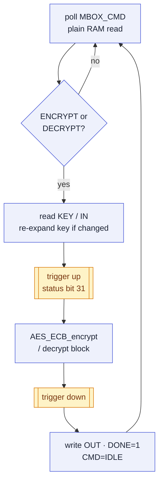
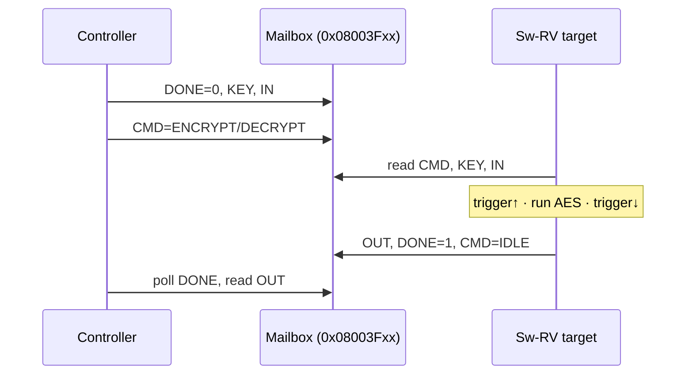
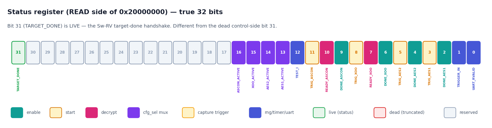

# Target Software (Sw-RV)

The **Sw-RV** is the second RISC-V (Ibex) core on the PROACT chip — the *target* whose power is measured. Where the controller core drives the UART, timer and the hardware crypto cores, the Sw-RV runs a **portable software AES-128** (tiny-AES-c). That software AES is the *reference* against which the hardware AES cores (AES1/AES2) are benchmarked: with the same key and plaintext, power traces and cycle counts can be compared against a known-good, non-accelerated implementation.

This page covers the Sw-RV firmware only: the AES workload, the communication mailbox, the status-bit-31 capture trigger, encrypt and decrypt operation, the two-image build, and the rationale for the core's deliberate isolation from the UART.

> [!NOTE]
> Source of truth for every address/bit below: `config/hardware.json`, `Software/common/proact_mailbox.h`, `Software/SW_RV/*`, and `Software/Controller/proact_swrv.c`.

---

## 1. Address space visible to the Sw-RV

The Sw-RV's data port is **bit-decoded** (not the usual base/mask decode the controller's bus uses). Only three destinations exist:

| Access pattern | Destination |
|---|---|
| `addr[29]` set **&** write (e.g. `0x20000000`) | write `status[31:17]` via the status register's port B (this is the capture trigger, see §4) |
| `addr[30]` set **&** read (e.g. `0x80000000`) | read one RNG (LFSR) word — RNG read data is routed *only* to the Sw-RV |
| anything else | the Sw-RV's own **128 KB data RAM** |

This constitutes the entire address space visible from the target. The Sw-RV has **no path to the UART, the timer, or the crypto cores** — those live on the controller's bus. All target functionality is realised through its data RAM (the mailbox) and the status-write port (the trigger).

---

## 2. The mailbox (shared data RAM)

The controller and the Sw-RV communicate through a small set of words that live in the **Sw-RV's data RAM**. The controller reaches that same RAM from the outside through bus device **`RII_DMEM` (base `0x08000000`)**, so the **same absolute address names the same word on both sides**. No copying or serial link is involved; the two cores read and write shared memory directly.

From `proact_mailbox.h`:

| Name | Address | Size | Meaning |
|---|---|---|---|
| `MBOX_KEY` | `0x08003F00` | 4 words | 128-bit AES key (big-endian words) |
| `MBOX_IN` | `0x08003F10` | 4 words | 128-bit input block |
| `MBOX_OUT` | `0x08003F40` | 4 words | 128-bit result block |
| `MBOX_CMD` | `0x08003F80` | 1 word | controller writes a command; target clears it to `IDLE` when done |
| `MBOX_DONE` | `0x08003F84` | 1 word | target sets `1` when `MBOX_OUT` is valid |

Command word values:

| `MBOX_CMD` | Value |
|---|---|
| `MBOX_CMD_IDLE` | `0` |
| `MBOX_CMD_ENCRYPT` | `1` |
| `MBOX_CMD_DECRYPT` | `2` |

Implementation notes:

- **All addresses are 4-byte aligned.** The Sw-RV has no misaligned-access support, so the mailbox words sit on word boundaries in the low scratch area, clear of the target's own `.data`/`.bss`/`.stack` (which start at `0x08100000`).
- **Byte order is big-endian per word:** `word = b0<<24 | b1<<16 | b2<<8 | b3`. Both sides use the exact same convention — see `mbox_read_block()` / `mbox_write_block()` in `sw_rv_target.c`. An incorrect byte order produces byte-swapped key and plaintext values.
- The handshake is **one command word + one done word per block** — there is no per-data-word acknowledgement (an earlier GUI acknowledged every word; this design does not).

---

## 3. The exchange protocol

### Target side (the complete `main` loop)

Simplified from `Software/SW_RV/main.c`:

```c
sw_rv_write(MBOX_CMD_ADDR, MBOX_CMD_IDLE);   /* clear stale command  */
sw_rv_write(MBOX_DONE_ADDR, 0u);             /* clear stale done flag */

for (;;) {
    uint32_t cmd = sw_rv_read(MBOX_CMD_ADDR);          /* poll (a plain RAM read) */
    if (cmd != MBOX_CMD_ENCRYPT && cmd != MBOX_CMD_DECRYPT)
        continue;

    /* reload the AES key only if it changed (saves a key expansion) */
    /* ... read MBOX_KEY, AES_init_ctx() if different ...            */
    mbox_read_block(MBOX_IN_ADDR, block);

    sw_rv_trigger(1);                                  /* raise capture trigger */
    if (cmd == MBOX_CMD_ENCRYPT) AES_ECB_encrypt(&ctx, block);
    else                         AES_ECB_decrypt(&ctx, block);
    sw_rv_trigger(0);                                  /* lower capture trigger */

    mbox_write_block(MBOX_OUT_ADDR, block);
    sw_rv_write(MBOX_DONE_ADDR, 1u);                   /* result is valid       */
    sw_rv_write(MBOX_CMD_ADDR, MBOX_CMD_IDLE);         /* ready for next block   */
}
```

The whole loop is a poll → run → publish cycle, with the trigger bracketing *only* the AES call:



Two efficiency details are relevant:

- The key is **only re-expanded when it actually changes** — the target keeps the last key words and skips `AES_init_ctx` if they match.
- The trigger is raised **immediately before** and lowered **immediately after** the AES call, so the measured window is just the cipher, not the mailbox bookkeeping.

### Controller side (per block)

From `Software/Controller/proact_swrv.c` (`swrv_aes_block`):

1. write `MBOX_DONE = 0`
2. publish the 16-byte key to `MBOX_KEY` and the 16-byte input to `MBOX_IN`
3. write `MBOX_CMD = ENCRYPT` or `DECRYPT` **last** (the target is waiting on it)
4. poll `MBOX_DONE` until it reads `1`, aborting after `SWRV_TIMEOUT = 2000000` poll iterations
5. read the 16-byte result from `MBOX_OUT`

Because both the target's poll and the controller's poll are **plain data-RAM reads**, neither side can hang on the bus the way a UART read can (an empty UART read stalls the CPU). An unresponsive target simply never sets `MBOX_DONE`, and the controller reports a timeout.



---

## 4. The capture trigger — STATUS bit 31 (not control bit 30)

This distinction is a frequent source of confusion and warrants careful attention.

There are **two different triggers** in this chip, and they must not be conflated:

> [!NOTE]
> **Two triggers, two registers.**
> - The **controller's** capture trigger is **CONTROL-register bit 30** (`0x40000000`) — the control register is a 31-bit control field, so bit 30 is the trigger.
> - The **Sw-RV's** software-AES trigger is **STATUS bit 31**, driven by a *status-side* write. The status register is a full 32-bit register, so bit 31 (`0x80000000`) is its own valid signal here. Same address, different registers.



*Status bit 31 (`TARGET_DONE`, internally `s_c_REG reserved[14]`) is the Sw-RV's capture trigger — a true 32-bit status-side register, distinct from the controller's 31-bit control-register bit 30.*

How the target raises it (`sw_rv_target.h`):

```c
#define SW_RV_STATUS_PORT 0x20000000u   /* addr[29] set -> status port B */
#define SW_RV_TRIGGER_BIT 0x80000000u   /* -> status bit31               */

static inline void sw_rv_trigger(int on) {
    sw_rv_write(SW_RV_STATUS_PORT, on ? SW_RV_TRIGGER_BIT : 0u);
}
```

Writing `0x80000000` to `0x20000000` routes `wdata[31:17]` into `status[31:17]`; bit 31 lands in **status bit 31** (`TARGET_DONE` in the status map, internally `s_c_REG reserved[14]`). `sw_rv_trigger(1)` sets it, `sw_rv_trigger(0)` clears it.

**One-time setup the controller must do** so that status bit 31 actually reaches the scope pin: select the Sw-RV as the trigger source, `cfg_sel = 101` (`CTRL_CFGSEL_SWRV`). This is done in `swrv_select_trigger()`, which also clears the controller's own bit-30 trigger. With `cfg_sel = 101`, `trigger_Out` follows status bit 31. When the host selects the target (controller command `CMD_SWRV = 0x14`), the controller runs `swrv_enable()` then `swrv_select_trigger()` automatically.

| Trigger | Register / bit | Written by | Valid width |
|---|---|---|---|
| Controller capture trigger | CONTROL bit 30 (`0x40000000`) | controller | 31-bit reg — bit 30 is the top usable bit |
| Sw-RV software-AES trigger | STATUS bit 31 (`0x80000000` to `0x20000000`) | Sw-RV target | true 32-bit status reg |

---

## 5. Encrypt and decrypt

The target supports **both directions**. The command word selects which:

- `MBOX_CMD_ENCRYPT` (`1`) → `AES_ECB_encrypt`
- `MBOX_CMD_DECRYPT` (`2`) → `AES_ECB_decrypt`

The key handling is identical for both — the same `AES_ctx` is used, so a decrypt block right after an encrypt block with the same key reuses the expanded key. From the host side, decrypt is requested with the controller's `DEC` command / the `--decrypt` path; the software reference used to validate results is ECB AES-128 in `Software/Python/proact_host/validation.py`.

---

## 6. Building the firmware — two images

The Sw-RV has **separate instruction and data memories**, so the build produces **two** memory-init files, not one.

Build the firmware with the host CLI (which invokes the Makefile):

```bash
proact build-target
# equivalent to:  make -C Software/SW_RV all
```

Toolchain and flags (`Software/SW_RV/Makefile`): `riscv32-unknown-elf-gcc`, `-march=rv32im -mabi=ilp32 -mcmodel=medany -O2 -nostdlib -nostartfiles -ffreestanding`. Sources: `crt0.S main.c sw_rv_target.c aes.c`.

Outputs:

| Image | Contents | Load base | Placement mechanism |
|---|---|---|---|
| `sw_rv_imem.vmem` | `.text` (code + vectors) | `0x00100000` | streamed into the target **instruction** memory |
| `sw_rv_dmem.vmem` | `.rodata` + `.data` | `0x08100000` | streamed into the target **data** RAM |

`.bss` is **not** in an image — `crt0.S` zeroes it at boot. The `.vmem` files are produced with `srec_cat ... -byte-swap 4` to match the memory's word order.

Memory layout (`Software/SW_RV/link.ld`):

| Region | Origin | Holds |
|---|---|---|
| `ram` (Imem) | `0x00100000` | `.text` |
| `rom` (Dmem) | `0x08100000` | `.rodata`, `.data`, `.bss` |
| `stack` | top of `0x081Exxxx` | 4 KB min stack |

Entry point is `_vectors_start + 0x80` (the reset vector). The core boots and fetches its code from **`0x00100000`**.

> [!NOTE]
> The `0x00100000` boot address is taken directly from the linker script and has been confirmed in practice on the real CW305 FPGA build (same frozen RTL as the ASIC) — the loaded target boots, answers the mailbox, and passes the software-AES step of the A-Z self-check. The same boot path is confirmed on the **fabricated ASIC**: the Sw-RV image loads over the mailbox and its software AES reproduces the known-answer vector on silicon.

### Getting the two images onto the chip

The Sw-RV cannot be programmed directly from the host — the **controller loads it**:

| Step | Controller command | What it writes |
|---|---|---|
| Load code | `CMD_LDI` (`0x12`) → `RII_IMEM` write port `0x04000000` | target instruction memory |
| Load data | `CMD_LDD` (`0x13`) → `RII_DMEM` `0x08000000` (absolute base) | target data RAM |
| Release | `CMD_SWRV` (`0x14`) → sets `CTRL_ENABLE_TARGET` (control bit 0) | takes the target out of reset; it boots from `0x00100000` |

On the host these map to `load_target_imem()` / `load_target_dmem()` in `proact_host/transport.py`. A runnable walk-through of this load-and-run flow (and the rest of the Python API) is `examples/PROACT_Tutorial.ipynb`.

---

## 7. Why the Sw-RV cannot use the UART

This restriction is a deliberate design decision:

- The UART, timer, and crypto cores sit on the **controller's** bus. The Sw-RV's bit-decoded data port (see §1) only reaches its own data RAM, the RNG read word, and the status-write port. **There is no address it can issue that lands on the UART.** So the target **never prints**.
- All target ↔ host communication therefore goes through the **mailbox** (data words) and the **trigger bit** (measurement window). That is the entire interface.
- Because the target cannot report errors over a serial link, its fault handling is defensive: on any exception, `crt0.S` vectors to `simple_exc_handler()`, which parks the core in a `wfi` loop. The core stops writing `MBOX_DONE`, and the controller's poll times out (`SWRV_TIMEOUT`) — that timeout is how a target crash surfaces to the operator.

A beneficial side effect: keeping the target off the UART means its measured power window is *just* the AES computation, with no serial traffic contaminating the trace.

---

## 8. Verification status

In the table below, "hardware" denotes the real CW305 FPGA build (identical frozen RTL to the ASIC); the fabricated ASIC is separately bench-verified on the CW308 board (firmware, UART, on-silicon KATs, Husky clock/trigger, trace capture).

| Item | Status |
|---|---|
| The software AES-128 itself | **unit-tested** against a reference vector on the host (`validation.py` / `proact test`) |
| End-to-end selection / mailbox / trigger flow | **passes on hardware** — the `swrv_software_aes` step of the unified A-Z self-check (`proact_host/fullcheck.py`, `run_full_check()`) loads both images over `LDI`/`LDD`, runs a block through the mailbox, and matches the software reference on the real CW305 |
| Running on the CW305 FPGA | **passes** — the full A-Z self-check is 100% green on the real board |
| Running on the fabricated ASIC | **not yet run** — the same A-Z self-check is the chip-screening tool |

The unified A-Z self-check (`fullcheck.py`, `run_full_check()`) drives AES1, AES2 and **swrv** with the same key/plaintext and checks each result against the software reference; the Sw-RV step runs when the two target images are supplied (`swrv_words=(imem, dmem, base)`) and is reported `SKIP` otherwise. This check passes 100% on the real CW305 and doubles as the ASIC chip-screening procedure.

The hardware is **frozen and fabricated**. Everything above is software talking to a fixed map — if a discrepancy arises, the fix is always in firmware or host code, never in the RTL, addresses, or bit assignments.
