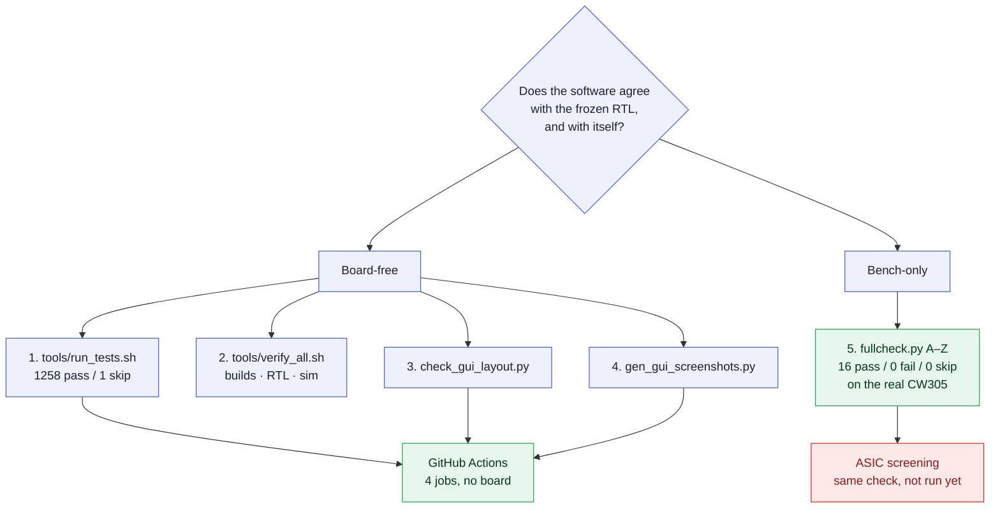
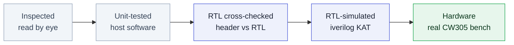

# Testing & Verification

This page describes how PROACT is actually tested today: which tool performs each check, how to run it, and — just as important — **what each check does not prove**. Read the status note below first.

> [!IMPORTANT]
> **Hardware status (2026-08-07)**
> The unified A–Z self-check **runs on real hardware and passes**: the PROACT FPGA build on a real CW305 board, driven over the real MCP2210/MCP2200 bench links. The GUI-driven run reported **16 pass / 0 fail / 0 skip**, including a ChipWhisperer Husky clock lock and a real trace capture; the same check from the CLI with no scope attached is **14 pass / 0 fail / 1 skip** (the capture step SKIPs). The **fabricated ASIC has not been screened** — the same A–Z check is the screening procedure for it. **Windows and macOS are untested.** Every other "PASS" on this page comes from software builds, an RTL simulator, or host-side offline checks; the labels further down identify the level of each result.

The chip is fabricated and frozen: the RTL tree under `ASIC/rtl/` is read-only and serves as the single source of truth. Verification never changes the RTL to match the software — it asks whether the software agrees with the frozen RTL, and whether the software agrees with itself.

## The five checks, at a glance

| # | Check | Entry point | Needs | In CI? |
|---|---|---|---|---|
| 1 | **Offline regression suite** — the host library's contract, pinned test by test | `tools/run_tests.sh` | Python + `pytest` + `numpy` | yes |
| 2 | **Offline gate** — firmware builds, header-vs-RTL, AES RTL simulation | `tools/verify_all.sh` | RISC-V GCC, `iverilog`, the RTL tree | no |
| 3 | **GUI layout guard** — no page may need scrolling | `tools/check_gui_layout.py` | PyQt6 (offscreen) | yes |
| 4 | **Screenshot generator** — the published GUI images regenerate | `tools/gen_gui_screenshots.py` | PyQt6 (offscreen) | yes |
| 5 | **A–Z self-check** — the one on-hardware test | `proact selfcheck` / GUI *Self-Check (A–Z)* / `fullcheck.run_full_check` | the bench (+ Husky) | **never** |

Check 5 cannot run in CI — it needs a board. See [Continuous integration](#continuous-integration) below.



---

## 1. The offline regression suite — `tools/run_tests.sh`

The host library in `Software/Python/proact_host/` has a full pytest suite under `tests/`. It is a **regression net, not a bench check**: it opens no serial port, no USB HID device, no ChipWhisperer, no network — so it is safe to run while another engineer owns the hardware.

```bash
./tools/run_tests.sh                                    # everything
./tools/run_tests.sh -k aead                            # one area
./tools/run_tests.sh -x -vv                             # stop at first failure, verbose
./tools/run_tests.sh tests/test_transport.py::test_write_key_frame
```

Current result on this repo:

```
1258 passed, 1 skipped in 4.7s
SKIPPED [1] tests/test_storage.py: could not import 'h5py'
```

The single skip is the HDF5 `TraceStore` path, guarded by `importorskip` — `h5py` is an optional extra and is not in the project venv. There are **no xfails left**: the two product bugs the suite originally pinned as `xfail` (the ASCON block-aligned pad bug and the missing `CMD_POKE`/`CMD_PEEK`/`CMD_AEADKAT` entries in `config/hardware.json`) have both been fixed, and the tests now assert the corrected behaviour.

`tools/run_tests.sh` picks the interpreter exactly like `run_cli.sh` does — `$PROACT_VENV`, else `~/.proact-venv`, else the repo's `.venv`, else a system `python3` that can import `pytest` **and** `proact_host` — then `cd`s to the repo root and runs `pytest tests`, passing `"$@"` through. Only `pytest` and `numpy` are required.

Configuration lives in **`pytest.ini` at the repository root**, deliberately not in `Software/Python/pyproject.toml`: that file sits one directory *below* `tests/`, so pytest would only find it when invoked from inside `Software/Python`, and its `testpaths` would resolve to the wrong directory. The settings are `testpaths = tests`, `addopts = -q -ra --strict-markers --strict-config --tb=short`, `xfail_strict = true`, and `pythonpath = Software/Python` (which `tests/conftest.py` also does, so a bare `pytest` works from a clean checkout with nothing installed).

### What it covers

| Module | Tests | What is pinned |
| --- | ---: | --- |
| `test_aead_soft.py` | 494 | ASCON-128 v1.2 and Xoodyak v2 (Cyclist over Xoodoo[12]) against the on-chip KAT vectors: permutation/state-level properties, round-trips, tag rejection. This is the project's only decrypt path — the RTL is encrypt-only. |
| `test_validation.py` | 184 | The PASS/FAIL verdict engine. AES-128 anchored to **external** ground truth (FIPS-197 App. B/C.1, NIST SP 800-38A F.1.1, the App. A.1 key schedule), plus `validate_aes` / `validate_aead` behaviour on good, wrong and malformed chip output. |
| `test_regs_map.py` | 157 | `config/hardware.json` → `regs.py` / `Software/common/proact_regs.h` stay in sync, and both stay in sync with the command bytes and frame ids in `Software/Controller/main.c`. The C header is compared *semantically* by evaluating its `#define`s, because the committed copy carries a hand-added comment block. |
| `test_transport.py` | 142 | The exact byte stream sent to the silicon and the `0xA5` reply-frame parser, driven through an in-memory fake link. A wrong command byte or payload width produces garbage traces, never an exception — so it has to be asserted. |
| `test_cli_parser.py` | 128 | Argument parsing, defaults, required options, the offline subcommands (`version`, `info`, `test`, `decrypt-soft --selftest`), handler exit-status propagation, and the friendly bench-error diagnostics (a board timeout prints a hint, not a traceback; `PROACT_DEBUG=1` restores it). |
| `test_monitor.py` | 49 | The UART monitor's contract — never raise on bad bytes, never desync permanently — checked exhaustively over all 256 byte values and across mixed ASCII/binary framing. |
| `test_inputs.py` | 42 | The capture-input generator: FIXED variables are byte-identical every run, RANDOM variables actually vary. Both fail *silently* if they regress and would quietly invalidate an entire dataset. Plus `parse_input_file`'s user-facing error strings. |
| `test_storage.py` | 33 | `TraceStore` append/flush/`load` round-trips: shapes, dtypes, bytes, ragged-row handling, and survival of an interrupted campaign. `.npz` unconditionally; the HDF5 path via `importorskip`. |
| `test_vmem.py` | 24 | `parse_vmem` address bookkeeping (`@` re-basing, one word per data line) and `Mcp2210Programmer._frame`'s MSB-first 64-bit `{addr, data}` packing — a fencepost here writes firmware to the wrong memory. |
| `test_programmer.py` | 6 | The pure, device-free parts of the SPI loader. |

### What it does **not** prove

Nothing here touches the bench, so nothing here proves the chip works. Explicitly out of scope:

- `UartTransport.open()` / `_detect_port()` — device-bound. `ProactTarget` is tested against an in-memory fake instead, which is complete because the class only ever calls `transport.write(bytes)` and `transport.read(n)`.
- `programmer.py`'s `open()` / `program()` / `restart_controller()` / `verify_running()`; `capture.py` (needs a scope); `resets.py`; `selfcheck.py`; `fullcheck.py`; `experiment.py` end-to-end; and every CLI subcommand that reaches the board.
- The GUI's behaviour, the RTL, and the C firmware themselves — only their *contract with the host* (the register map, the command framing) is checked.

`test_cli_parser.py` enforces that boundary rather than trusting it: an autouse `_offline_guard` fixture neuters `cli._target` (the single door to the UART) and `subprocess.call`, and a `no_dispatch` fixture replaces every `cmd_*` handler with a raiser, so a test that accidentally reaches dispatch fails loudly instead of poking the bench.

Those areas belong to check 5 (`proact selfcheck` / `tools/full_selftest.py`) on real hardware.

---

## 2. The offline gate — `tools/verify_all.sh`

Everything that can be checked against the frozen RTL without a board is consolidated into a single gate script:

```bash
RTL_ROOT=/path/to/ASIC/rtl bash tools/verify_all.sh
```

Two environment variables control it:

| Variable | Meaning | Default |
|---|---|---|
| `RTL_ROOT` (or `PROACT_RTL`) | Path to the frozen `ASIC/rtl` tree | `<repo>/ASIC/rtl` |
| `RISCV` | RISC-V toolchain prefix passed to `make` | `riscv32-unknown-elf-` (lowRISC) |

The script prints a section per step and ends with either `ALL CHECKS PASSED` (exit code 0) or `SOME CHECKS FAILED` (non-zero exit). It runs five steps:

| # | Step | What it does | Tool |
|---|---|---|---|
| 1 | Build controller firmware | `make -C Software/Controller clean all`; honours make's real exit code and fails on any `warning:` | riscv32 GCC |
| 2 | Build Sw-RV target firmware | `make -C Software/SW_RV clean all`, same rule | riscv32 GCC |
| 3 | Header-vs-RTL cross-check | Parses the RTL and asserts every address/offset/bit in `proact_regs.h` matches (34 checks) | `tools/verify_regs_vs_rtl.py` |
| 4 | AES known-answer simulation | Drives the **real AES RTL** with the driver's exact register sequence and checks the ciphertext | `tools/run_aes_sim.sh` → iverilog |
| 5 | Host protocol self-check | Builds a command byte stream with a mock transport, asserts the framing, and runs a FIPS-197 KAT on the software AES reference | inline Python |

Steps 1–2 need the RISC-V toolchain; step 4 needs `iverilog` (≥ 11); steps 3 and 5 need only Python 3. A step whose required tool is unavailable is skipped, but the aggregate result becomes failed if any executed step reports a mismatch.

### Step 3 — Header vs frozen RTL (34 automated checks)

`tools/verify_regs_vs_rtl.py --rtl-root <ASIC/rtl>` verifies that the generated C header `Software/common/proact_regs.h` cannot drift from the silicon. It does **not** rely on any hand-written map: the RTL text is re-parsed on every run and compared.

| RTL source parsed | Constants checked | Count |
|---|---|---|
| `PROACTPKG/config_defs.svh` | 11 bus device base addresses (RAM, RII imem/dmem, SCREG, UART, TIMER, RNG, AES1, AES2, Xoodyak, ASCON) | 11 |
| `AES1/AES_fifo_interface.sv` | AES `START`, `DONE`, `KEY0`, `DATA0`, `RESULT0` offsets | 5 |
| `ASCON/ASCON_fifo_interface.sv` | AEAD `LEN`, `KEY`, `NPUB`, `AD`, `PT`, `CT`, `TAG` offsets | 7 |
| `SCreg/s_c_REG_pkg.sv` | control enable/start/dec/reset bit positions | 10 |
| (derived from the 31-bit cast) | **`CTRL_TRIGGER` == bit 30** | 1 |
| **Total** | | **34** |

The final check is the most significant: the control register is a 31-bit control field, so the capture trigger is **control-register bit 30 (`0x40000000`)**, and this test hard-asserts the header uses bit 30. Any mismatch prints `header=… rtl=…` and exits non-zero. Current result: **`checks passed: 34` — `proact_regs.h AGREES with ASIC/rtl`**.

> [!NOTE]
> This is a separate register from the *Sw-RV software-AES trigger*, which is **status-register bit 31** — a full 32-bit signal on the READ side of the same address. The control side is a 31-bit field; the status side is a full 32 bits. "Trigger = bit 30" concerns the WRITE/control side.

### Step 4 — AES known-answer RTL simulation

`tools/run_aes_sim.sh` compiles the testbench `FPGA/sim/tb_aes_seq.sv` together with the **actual frozen AES core** from `ASIC/rtl/AES1/` (`AES_fifo_interface.sv`, `aes_core.v`, `aes_ks.v`, `aes_sbox_lut.v`) using `iverilog -g2012`, then runs it and greps for `PASS`/`FAIL`.

The testbench drives `AES_fifo_interface` with the **exact register sequence the C driver performs** — reset (enable low), raise enable *before* touching registers, load KEY then DATA, hold `start`, wait for `done`, read `RESULT` while still enabled — and checks two things:

1. **No deadlock.** `done_o` must assert within a 2000-cycle guard, or it prints `FAIL: … (DEADLOCK)`. This exercises the enable-before-access hazard rule directly against the RTL.
2. **Correct ciphertext.** The result must equal the known-answer ciphertext (same vector as `proact_experiments.c`):

```
key = abcdef01 12345678 deadbeef 87654321
pt  = 12345678 abcdef01 87654321 deadbeef
ct  = 8a278bf8 fa2812bc 39e52c76 205af377   (expected)
```

A pass here means the driver's offsets and ordering are correct **against the real gates, in simulation**. It is **not** a silicon test — virtual time, no analogue behaviour, no clock tree.

### Step 5 — Host protocol self-check

An inline Python block feeds a **mock transport** (no serial port, no hardware) into `ProactTarget`, issues `select('aes1')`, `set_key(...)`, `run()`, and asserts the emitted byte stream is exactly `CMD_AES1`, then `CMD_KEY`, then the 16 key bytes — and that the word packing round-trips (`words_to_block(block_to_words(k)) == k`). It then asserts the pure-Python AES-128 reference in `validation.py` reproduces a FIPS-197 known-answer vector, and that the canonical demo KEY/PT (imported from `proact_host.selfcheck`) are 16 bytes. It prints `host protocol + FIPS-197 AES reference: OK`.

(The vector it uses is NIST SP 800-38A F.1.1: key `2b7e1516…`, plaintext `6bc1bee2…` → `3ad77bb4…`.) This is the same idea as `proact test`, which uses the FIPS-197 App. C.1 vector (`000102…0f` / `00112233…ff` → `69c4e0d86a7b0430d8cdb78070b4c55a`) and additionally runs `aead_soft.selftest()`, printing `host protocol + AES reference + software ASCON/Xoodyak: OK`. Both are smoke tests; check 1 is the thorough version.

---

## 3. The GUI layout guard — `tools/check_gui_layout.py`

The GUI is a bench instrument: a page that silently needs scrolling hides a control the operator is looking for. This script constructs the real `MainWindow` **offscreen** (`QT_QPA_PLATFORM=offscreen`, no hardware, no board polling) and measures, at four window sizes, how many pixels each page, the sidebar, and the tab bar overflow their viewport.

```bash
python3 tools/check_gui_layout.py            # the four standard sizes
python3 tools/check_gui_layout.py 1280 800   # one specific size
```

Sizes checked: **1280×720, 1366×768, 1600×900, 1920×1040**. The horizontal tab-bar measurement matters as much as the vertical one — if the seven tabs need more width than the bar has, Qt hides some behind scroll arrows and whole pages become unreachable.

Exit status is 1 if anything overflows at any size, so it doubles as a regression guard. Current result:

```
PASS: every page fits without scrolling at all 4 sizes (1280x720 .. 1920x1040)
```

**What it does not prove:** that the GUI *works*. It measures geometry only — no widget is clicked, no signal is fired, no chip is touched. A page can fit perfectly and still be wired to the wrong handler.

## 4. The screenshot generator — `tools/gen_gui_screenshots.py`

Regenerates the GUI images used by the wiki and the PDF manual, again offscreen and disconnected — exactly the state the published screenshots show, so no board or scope is needed.

```bash
~/.proact-venv/bin/python tools/gen_gui_screenshots.py            # -> docs/images/
~/.proact-venv/bin/python tools/gen_gui_screenshots.py /tmp/shots # -> somewhere else
```

It renders the window at 1400×900 and saves one PNG per page. Pages are matched **by tab title, not index**, so reordering a tab cannot silently shuffle the published images — and the `TABS` map is exhaustive: a tab that exists in the GUI but not in the map makes the script exit 1 with `undocumented tab(s) … -- add them to TABS and to the GUI documentation`. That turns it into a second, cheap guard: **the GUI cannot grow an undocumented page.** The seven expected titles are *Crypto experiment*, *ChipWhisperer*, *CPA analysis*, *Registers*, *Memory / Sw-RV*, *Self-Check (A–Z)*, *UART monitor*.

**What it does not prove:** anything about behaviour or about the *content* of the images — a screenshot of a broken panel saves just as happily as one of a working panel.

---

## 5. The hardware test engine — `fullcheck.py` (the A–Z self-check)

There is **one** on-hardware test: `proact_host/fullcheck.py`, entry point `run_full_check(target, scope=None, clock_hz=50e6, swrv_words=None, do_capture=False, on_item=None, platform="fpga")`. The CLI's `proact selfcheck`, the GUI's *Self-Check (A–Z)* tab, notebooks, and any batch ASIC-screening script all call this same function, so every UI applies the identical steps and pass/fail criteria. (The GUI's ChipWhisperer tab has no separate "overall self-check" — its button switches to the Self-Check (A–Z) tab and runs this.)

```bash
./run_cli.sh selfcheck                 # link, cores, timer, PRNG, Sw-RV…
./run_cli.sh selfcheck --capture       # + scope clock lock and a real trace
./run_cli.sh selfcheck --capture --log selfcheck.txt
```

Each step yields a `CheckItem(name, status, detail, category)` with status `PASS` / `FAIL` / `SKIP`. No step raises an exception: a step that errors (including a UART timeout from a dead core) is reported as `FAIL` and the sweep continues, so one dead core never hides the health of the others. Steps, in order:

| Step | Category | What it proves |
|---|---|---|
| `uart_link` | link | the controller answers a status read |
| `uart_baud_integrity` | link | 20/20 status frames intact at the live baud |
| `scope_clock_lock` | scope | *(only emitted with a connected scope)* the ADC is locked to the target clock |
| `aes1_encrypt_kat` / `aes2_encrypt_kat` | core | on-chip AES ciphertext equals the software AES reference |
| `aes1_decrypt_roundtrip` / `aes2_decrypt_roundtrip` | core | on-chip `dec(ct) == pt` — AES1/AES2 decrypt fully works in hardware |
| `ascon_encrypt_kat` / `xoodyak_encrypt_kat` | core | **on-chip AEAD encrypt KAT**: firmware `proact_aead_kat.c` (host command `CMD_AEADKAT` `0x1A`; Python `ProactTarget.aead_kat()`) runs the reference vectors on both cores in one call and checks CT+TAG (ASCON: AD=24 B/PT=23 B; Xoodyak: AD=52 B/PT=119 B) |
| `ascon_decrypt_soft` / `xoodyak_decrypt_soft` | core | **software decrypt round-trip**: `aead_soft` decrypts the reference CT+TAG back to the plaintext *and* rejects a corrupted tag (returns `None`) |
| `timer_cycle_count` | timer | the trigger-window cycle count is non-zero after an AES run |
| `control_write` | control | the control-register write path works and the link stays healthy |
| `prng_seed` | rng | the RNG accepts a seed and the AES1 KAT still passes with masking on |
| `swrv_software_aes` | core | software AES on the Sw-RV target matches the reference (`SKIP` unless `swrv_words=(imem, dmem, base)` is supplied — the CLI supplies it automatically from `Software/SW_RV/*.vmem` when those are built) |
| `capture_trace` | scope | *(optional)* one armed Husky capture returns a non-flat trace (`SKIP` unless `do_capture=True` **and** a scope is connected) |

**Result (2026-08-07, CW305 FPGA build):** **16 pass / 0 fail / 0 skip** from the GUI with a Husky attached, and **14 pass / 0 fail / 1 skip** from the CLI with no scope (`capture_trace` SKIPs; `scope_clock_lock` is not emitted at all). Because it only needs the UART — plus optionally the scope — it also serves as the **ASIC chip-screening procedure**: connect a fabricated chip over the same UART and run the same check. The tutorial notebook `examples/PROACT_Tutorial.ipynb` ends with a runnable A–Z section.

**What it does not prove:** it is a functional screen, not a characterization. It says nothing about timing margin, power, temperature, yield, long-run stability, or side-channel resistance — and passing on the CW305 says nothing about any particular fabricated die.

`tools/full_selftest.py` is a longer-form bench script around the same ideas (offline section + on-chip section + optional Husky capture, with a written log); `proact selfcheck` is the supported entry point.

### Why AEAD decrypt is tested in software

The ASCON and Xoodyak co-processors implement the **encryption** datapath — the operation side-channel capture measures — so decryption and tag verification run on the host (rationale on [Hardware Overview](Hardware-Overview)). That is exactly what the self-check exercises: `proact_host/aead_soft.py` implements ASCON-128 v1.2 and Xoodyak v2 (NIST LWC final round — nonce absorbed together with the key, matching the GMU cores in silicon) bit-exactly in dependency-free Python, validated against the exact reference vectors the silicon reproduces (same CT+TAG). Its `selftest()` re-verifies the module in six checks. The supported and tested workflow is **hardware encrypt → software decrypt + tag verify** — exactly what the `*_decrypt_soft` steps do. `aead_soft` is not constant-time: it is for validation and experiments, not production key handling.

---

## Continuous integration

`.github/workflows/ci.yml` runs on pushes to `main`, on pull requests, and on demand. **Everything in it is board-free** — the on-hardware A–Z self-check cannot run in CI and stays a manual bench step. Four jobs:

| Job | What it runs |
|---|---|
| **python** | The offline suite on Python 3.9 and 3.12, plus `flake8 --select=F` (real errors, not style) over `Software/Python` and `tests`. The hardware packages (`hid`, `mcp2210`, `chipwhisperer`) are deliberately **not** installed, which also proves `proact_host`'s hardware imports stay lazy. |
| **gui** | Constructs the GUI offscreen, renders all seven pages and asserts the count is 7, runs `tools/check_gui_layout.py` (must report 0 px overflow), and regenerates the screenshots into a temp directory. |
| **config** | Re-runs `scripts/gen_hardware.py` and fails on any diff in `Software/Python/proact_host/regs.py` — the generated map cannot drift from `config/hardware.json`. |
| **scripts** | `bash -n` over `run_gui.sh`, `run_cli.sh` and `tools/*.sh`. |

Every one of those commands also passes locally on this checkout (on the one bench interpreter, not the full 3.9/3.12 matrix). What CI cannot tell you: whether the chip works. No job in it has ever touched a PROACT board, and none ever will.

---

## Verification labels — what each level proves

Every result in this project is tagged with a label so that a report cannot overstate what was proven. The levels form a ladder — each rung proves strictly more than the one before it:



| Label | Meaning | Involves the chip? |
|---|---|---|
| **Inspected** | A human read the code/RTL and confirmed it by eye; no automated test. | No |
| **Unit-tested** | An automated host-side software test exercises it (protocol byte stream, AES reference vs FIPS-197, …). No RTL, no chip. | No |
| **RTL cross-checked** | Machine comparison of the header against the parsed frozen RTL (gate step 3). | No (static) |
| **RTL-simulated** | Driven against the actual frozen RTL in a simulator (iverilog KAT, gate step 4). Real gates, virtual time. | No (simulated) |
| **Hardware** | Executed on the real bench (CW305 FPGA build + Husky) and passed. | **Yes** |

Only a `hardware` label means a real run happened. The full A–Z self-check reached this level on the CW305 on 2026-08-07; the fabricated ASIC has not yet been screened. Label an ASIC result `hardware` only after its own A–Z run passes.

`proact_host/selfcheck.py` is the legacy module that attached these labels to individual `CheckResult` objects. It is superseded by `fullcheck.py`, which reports plain PASS/FAIL/SKIP; the labels live on here, as documentation.

---

## Current test status

| Layer | Status |
|---|---|
| Host library (`proact_host`) | **Unit-tested** — 1258 pass / 1 skip / 0 fail offline, in ~5 s |
| `proact_regs.h` vs frozen RTL | **RTL cross-checked** — 34/34 constants agree (`verify_regs_vs_rtl.py`) |
| AES driver register sequence | **RTL-simulated** + **hardware** — KAT + decrypt round-trip pass on-chip |
| AEAD (ASCON/Xoodyak) encrypt | **Hardware** — on-chip encrypt KAT (`CMD_AEADKAT`) passes on both cores |
| AEAD decrypt | **Runs on the host** by design — `aead_soft` round-trip + bad-tag rejection pass |
| Controller + target firmware | **Builds clean** (0 warnings) and **runs on hardware** — drives every A–Z step |
| GUI | **Constructs headless**, all 7 pages render, 0 px layout overflow at four sizes, and it is used live on the bench |
| CW305 FPGA + ChipWhisperer | **Hardware** — A–Z self-check 16 pass / 0 fail / 0 skip (clock lock + trace capture included) |
| Offline CPA | **Reproducible with no board** — the shipped `datasets/` captures recover 16/16 key bytes (`proact cpa --core aes1`) |
| Fabricated ASIC | **Not yet screened** — reuse the same A–Z check over its UART |

---

## What is deliberately *not* verified yet

- **The fabricated ASIC.** Only the CW305 FPGA build of the same design has been on the bench. Screening a chip consists of running the same A–Z check over its UART.
- **Windows and macOS.** All of the above was run on Linux. Nothing is known to be broken elsewhere; nothing has been tried.
- **AEAD hardware decrypt.** By design, AEAD decryption runs on the host, so this path is permanently covered by hardware-encrypt → software-decrypt.
- **The Husky-as-SPI transport** — `capture.husky_spi()` is a deliberate `NotImplementedError` pending a bench check.
- **Two known controller-firmware defects**, filed but not fixed (they need a firmware release and a re-flash, so the shipped `main.vmem` still has them):
  - `Software/Controller/main.c`, `MODE_SWRV`: when `swrv_aes_block()` hits `SWRV_TIMEOUT`, the frame is sent anyway from the unchanged `result` buffer — the host receives the **previous** block's output and cannot tell it is stale.
  - `Software/Controller/main.c`, `CMD_LDI` / `CMD_LDD`: an over-large word count is clamped to `0x8000` but the surplus words are **not drained** from the stream, so the remaining bytes are interpreted as commands and the protocol desyncs.
- **Anything about side-channel resistance.** The platform is built to *measure* leakage, and the CPA results demonstrate that it leaks; no countermeasure claim is made or tested.

Once a fabricated ASIC is available for screening, the register map, trigger (control bit 30), reset/run sequence, and every A–Z step will already have passed on the identical design on the CW305 — a screening run that fails therefore indicates a fault in **that chip**, not in the software.

## See also

- [CLI](CLI) — `proact selfcheck`, `proact test`, `proact cpa` and their exit codes.
- [Python API](Python-API) — `fullcheck.run_full_check` and the storage format the tests pin.
- [GUI Guide](GUI-Guide) — the Self-Check (A–Z) tab.
- [Troubleshooting](Troubleshooting) — what a failing step usually means on the bench.
