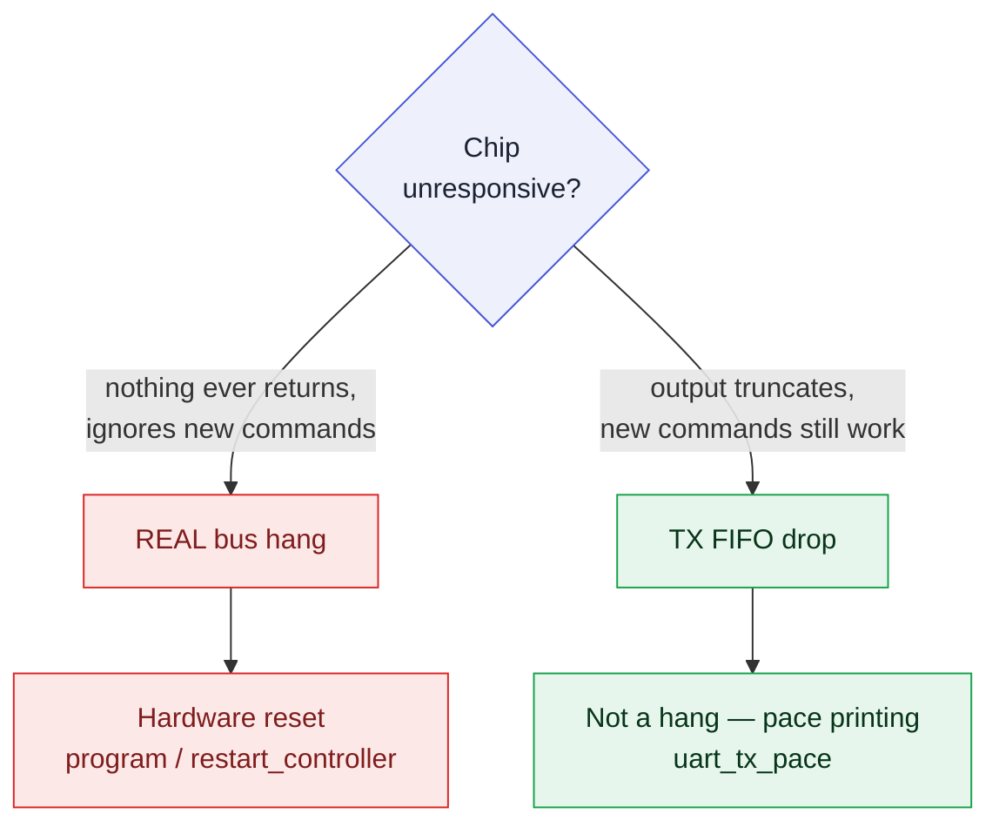

# Troubleshooting

This page collects the problems most commonly encountered when bringing up PROACT, each as a **symptom → cause → fix** table. All entries are grounded in the frozen hardware behavior (`docs/hardware_hazards.md`, `config/hardware.json`) and the host tools (`Software/Python/proact_host/`).

> [!NOTE]
> **Verification status.** The hardware-in-the-loop path is bench-verified: the unified A–Z self-check (GUI *Self-Check (A–Z)* tab, engine `proact_host/fullcheck.py` `run_full_check()`) passes 100% on the real CW305 FPGA build — **16 pass, 0 fail, 0 skip** in the GUI-driven run of **2026-08-07**, including ChipWhisperer clock lock and a real trace capture. The firmware **builds clean**, the register map is **RTL cross-checked**, the AES driver sequence is **RTL-simulated** (iverilog known-answer test), and the host protocol is **unit-tested**. The same A–Z check is the screening procedure for fabricated ASIC chips, and the **fabricated ASIC passes it: 16 pass / 0 fail / 0 skip** from the GUI on a die in the CW308 board, including clock lock and a real on-silicon trace capture. Sustained unattended capture campaigns also run from the CLI. Everything here was observed on **Linux**; Windows and macOS are untested.

## Find your symptom

| What you are seeing | Go to |
|---|---|
| The chip is frozen: no UART output, no reply, resending does nothing | [§1 CPU appears frozen](#1-cpu-appears-frozen-no-uart-output-no-response-to-commands) |
| Output stops mid-message but new commands still work | [§1, last row](#1-cpu-appears-frozen-no-uart-output-no-response-to-commands) |
| `No MCP2200/MCP2210 found`, or a permission error although `lsusb` sees it | [§2 No MCP device found](#2-no-mcp-device-found) |
| `TimeoutError: no frame marker` right after programming, port keeps moving | [§2, ModemManager](#2-no-mcp-device-found) |
| `ModuleNotFoundError: PyQt6` / `chipwhisperer is not installed` although it is | [§3 sudo, pyenv, MCP2210 desync](#3-launch-problems-sudo-pyenv-and-mcp2210-desync) |
| Garbled characters, or a baud change hangs the CPU | [§4 Wrong baud](#4-wrong-baud--garbled-uart-characters) |
| Scope never arms, or the timer always reads 0 | [§5 Capture trigger not firing](#5-capture-trigger-not-firing-scope-never-arms--timer-stays-0) |
| On-chip ASCON/Xoodyak decrypt returns zeros | [§6 AEAD decrypt](#6-aead-ascon--xoodyak-decrypt-on-chip-returns-all-zeros) |
| `riscv32-unknown-elf-gcc: command not found`, `srec_cat: not found` | [§7 Firmware build errors](#7-firmware-build-errors) |
| **Everything reported success and the board still answers nothing** | [§8 FPGA target (CW305)](#8-fpga-target-cw305-programmed-successfully-but-nothing-answers) |

---

## Background: how a "hang" behaves on PROACT

> [!CAUTION]
> The lowRISC bus (`bus.sv`) has **no timeout**. If the CPU issues a read or write to a device that never returns `rvalid`, the core stalls **permanently** — it does not recover on its own, and no error is printed. **Only a hardware reset brings it back.**

Two consequences follow from this:

1. Most reported freezes correspond to a small set of known-hazard accesses (Section 1). They are all *software-avoidable* — the drivers in this repository already avoid them.
2. Recovering a hung chip requires driving the reset lines; resending a command is not sufficient:
   - **GUI:** sidebar → *Reset control* (collapsed by default — click the title to expand) → select the *Run (return to running)* preset → **Apply preset**. Or, in the *Programming* panel, press **Restart ctrl**.
   - **CLI:** `./run_cli.sh restart`, or `./run_cli.sh reset --mode run` (presets: `run`, `controller`, `global`, `spi`, `reset_all`).
   - **Host code:** `Mcp2210Programmer().restart_controller()`, or simply re-run `program(...)`.
   - Re-programming holds the controller in reset, reloads, and releases it to run.
   - Every one of these **reboots the CPU, which clears send-back** — see §8. The GUI and CLI re-assert it for you; your own Python must call `target.enable_sendback()` afterwards.

Note the important non-hang case: an access to a **completely unmapped** address such as `0x10004000` or `0x10006000` returns a clean bus **decode error**, *not* a hang. A true permanent freeze therefore narrows the suspect list to the cases below.

---

## 1. CPU appears frozen (no UART output, no response to commands)

| Symptom | Cause | Fix |
|---|---|---|
| Freeze the instant firmware touches address `0x10007000`–`0x100073FF` | **`Co_re` (device 11) is mapped but has no hardware instance** (0 instances in the netlist). It never acks → permanent stall (hazard H2). | **Never read or write `0x10007000`.** There is no register there. Remove any access to it; the map contains no 12th device. |
| Freeze right after selecting/using a crypto core, before it produces a result | **Core was accessed while disabled.** Each wrapper is held in reset while its enable bit is 0 (`rst_n = rst_Gsys_n & enable_<core>`) and will not ack (H3). | **Set the core's enable bit *before* touching any of its registers, and enable one core at a time.** The controller drivers do this; any custom register sequence must enable first. On clear-down, de-assert START/DEC *while still enabled*, then drop enable. |
| Freeze when the firmware tries to read the UART for input | **Reading an idle UART.** Reads ack only when RX is non-empty (`rvalid = ~rx_empty`); reading an empty UART hangs (H4.2). | Always check the status byte first (read any offset ≠ `0x00` → bit0 = `rx_empty`) before reading `+0x00`. The safe helper `uart_getchar()` already polls `rx_empty` and cannot hit this hang. |
| Freeze during printing or at end of firmware | **Write to a bad UART offset.** Writes ack **only** at `+0x00` (TX) and `+0x04` (baud). The legacy `sim_halt()` at `+0x08` and a buggy `set_uart_baudrate()` at `+0x01` never ack (H4.1). | **Never call `sim_halt()`.** End firmware with an idle loop (`while(1) wfi;`). Only ever write UART `+0x00` or `+0x04`. |
| Chip **appears** frozen — output *stops* mid-message, but the chip is actually still running | **TX FIFO (512 B) has no backpressure.** A write always completes, so output sent faster than the line drains overruns the FIFO and those prints are lost (H4.3). | This is not a hang: the chip continues to run; the prints are simply lost. **Pace `putchar`** — ≥ 1 char-time between bytes (~4340 cycles @ 115200 with divisor 27; scale with the divisor if the baud is lowered). The paced `putchar`/`uart_tx_pace()` in this repository already does this. Reduce debug verbosity if needed. |

**Distinguishing a real hang from dropped TX:** send a command that should produce a distinct effect (e.g. `proact run --core aes1 …` and look for the `0xA5` result frame). If *nothing at all* ever comes back and the chip ignores new commands, it is a real bus stall → hardware reset. If output merely truncates but new commands still work, it is the FIFO-drop case → pace the printing.



---

## 2. "No MCP device found"

The host auto-detects the two USB bridges by VID/PID: **MCP2200 (UART)** = `04D8:00DF`, **MCP2210 (SPI loader)** = `04D8:00DE`. Failures raise `No MCP2200 UART device found` (transport) or `No MCP2210 SPI device found` (programmer).

| Symptom | Cause | Fix |
|---|---|---|
| `proact devices` prints `no MCP2200/MCP2210 found` | Bridge not plugged in / not powered, or a different cable. | Check the USB connection and power, then re-run `proact devices`. It also lists serial ports, which confirms whether the OS sees the device. |
| Device is listed by `lsusb` but Python cannot open it (permission error) | **udev rules not installed** (Linux only) — the MCPs are USB-HID and need non-root access. | **Linux:** `sudo bash tools/install_udev.sh` once, then **replug**. **macOS/Windows:** check if another program is using the device, and replug. Do **not** work around it with `sudo` — that breaks the tools (see §3). |
| Two boards attached, or the wrong one is selected | Auto-detect takes the **first** matching VID/PID device. | Pin the board by serial in `Software/Python/proact_host/config.py`: set `MCP2210_SERIAL = "…"` and/or `MCP2200_SERIAL = "…"`. Leaving them `None` keeps auto-detect. Use `proact devices` to read each device's serial. |
| Import error (`hid unavailable` / `pyserial unavailable`) | Host dependencies not installed in the active environment. | `pip install -r requirements.txt` inside the virtual environment (see INSTALL.md §2). `hidapi`, `pyserial`, and `mcp2210` are imported lazily, so the modules import fine without hardware — the error appears only when a device is actually opened. |

> The exact bench serial numbers are a known open bench-constant (they disagree across old scripts). If the serials are unknown, leave the `*_SERIAL` fields `None` and rely on auto-detect.

| Controller gives **`TimeoutError: no frame marker`** right after programming, and the MCP2200 keeps moving to a new `/dev/ttyACM*` | **Linux ModemManager.** The MCP2200 re-enumerates every time the controller is (re)programmed; if ModemManager is running it probes the fresh `ttyACM` with AT commands for ~15–20 s, swallowing the controller's replies. The port *opens* but reads back nothing. | Reinstall the udev rules (`sudo bash tools/install_udev.sh`, then replug) — they now tag the MCP2200 and NewAE serial devices with `ID_MM_DEVICE_IGNORE`. One-off without reinstalling: `sudo systemctl stop ModemManager`. Then re-detect the port (it changed) and reopen. |

---

## 3. Launch problems: sudo, pyenv, and MCP2210 desync

Launch with the wrapper scripts — `./run_gui.sh` / `./run_cli.sh` — as the **normal (non-root) user, never with sudo**. They pick the dedicated `~/.proact-venv` (override with `PROACT_VENV`), or fall back to a system Python that has the required packages. Device access comes from the udev rules (§2), not from root.

| Symptom | Cause | Fix |
|---|---|---|
| `RuntimeError: chipwhisperer is not installed: pip install chipwhisperer` — although the package *is* installed and the tools work without `sudo` | **Running with `sudo`.** `chipwhisperer` is installed under the *user's* `~/.local` (Python 3.10); root's Python cannot see it, so `sudo` actually **breaks** the tools. | Never launch with `sudo`. Run `./run_gui.sh` / `./run_cli.sh` as the normal user. If `sudo` was used to work around a Linux device permission error, the correct fix is the udev script: `sudo bash tools/install_udev.sh` once, then **replug** (§2). |
| `ModuleNotFoundError: No module named 'PyQt6'` (or `hid`, `mcp2210`, `serial`) from a bare `python3` | **pyenv mismatch:** the `python3` shim points at a different interpreter than the one the packages were installed into. | Use `./run_gui.sh` / `./run_cli.sh` — they prefer `~/.proact-venv` and otherwise probe for a Python that imports all the dependencies. First-time setup: `bash tools/setup_env.sh`. |
| `Mcp2210CommandResponseDesyncException` on SPI-load / reset operations | The MCP2210 HID endpoint needs strict command/response pairing; **interleaved commands desynchronize it** and every later call fails. Historically the GUI's 1 s reset-indicator poll could overlap a button action and trigger exactly this. | Fixed in current code: all MCP2210 access is serialized through a lock proxy (`_LockedMcp` in `programmer.py`) with a one-shot desync retry, and the indicator poll is skipped when the MCP is busy (`ResetController.try_status()`). Update to the current code if an older version is in use. If it *still* appears, **two processes are sharing the device** (e.g. a second GUI, or `proact program` next to a running GUI) — the lock only serializes within one process. Close the other process and re-open (or replug) the MCP2210. |

---

## 4. Wrong baud / garbled UART characters

Baud on this chip is `input_clock / (16 × divisor)`. The **reset-default divisor is 27**, and the input clock is ~**50 MHz** (`INPUT_CLOCK_HZ` in `config.py`, from `hardware.json`; divisor 27 -> 115200 baud implies ~50 MHz — bench-confirm). The host defaults to **115200** baud (`UartTransport`), and the GUI offers `115200 / 38400 / 19200 / 9600`.

| Symptom | Cause | Fix |
|---|---|---|
| Received bytes are garbage / framing errors | Host baud ≠ chip baud, or the assumed input clock is wrong so the divisor math is off. | Set the true clock once in `config.py` (`INPUT_CLOCK_HZ`). Use `divisor_for_baud(baud)` / `baud_for_divisor(divisor)` to verify that the values are consistent. Match the host `UartTransport(baud=…)` / GUI *Baud* box to what the firmware programmed. |
| Baud change makes the CPU **hang** instead of changing rate | Baud divisor was written to the **wrong UART offset** (`+0x01`). Only `+0x04` is the baud register; `+0x01` never acks (H4.1). | Write the divisor to UART `+0x04` only. Remove any `set_uart_baudrate()` that targets `+0x01`; keep the `+0x04` variant. |
| After lowering baud, prints start dropping / truncating | Lower baud = longer char-time, so the fixed TX-pacing delay is now too short and the 512 B FIFO overflows (H4.3). | Increase the firmware TX-pacing count (`UART_TX_PACING_ITERS`) proportionally to the divisor when the link is slowed down. |

---

## 5. Capture trigger not firing (scope never arms / timer stays 0)

Two **distinct, both-valid** trigger paths exist; they must not be conflated.

| Symptom | Cause | Fix |
|---|---|---|
| Trigger never asserts even though firmware "sets the trigger bit" | **Wrong bit.** The control register is a **31-bit control field**, so the capture trigger is bit 30, not bit 31 (H5). | Assert the software trigger with **bit 30 = `0x40000000`**. (`triggerpc` = bit 29 = `0x20000000`.) The repository firmware and `regs.CTRL_TRIGGER` already use bit 30. |
| Scope triggers on the wrong core, or not at all, when running a specific core | **`cfg_sel` (control bits [22:20]) is not pointing at the running core.** `trigger_Out` is the selected source through this mux. | Set `cfg_sel` to the running core: `000`=software, `001`=ASCON, `010`=AES1, `011`=AES2, `100`=Xoodyak, `101`=Sw-RV. The controller's `set_trigger_source()` does this automatically per selected core; from the host use `set_cfgsel(...)` / `select(...)`. |
| Software-AES on the **Sw-RV target** does not trigger the scope | This path uses its own trigger: the target raises **status bit 31** (`TARGET_DONE` / Sw-RV trigger source), routed via `cfg_sel = 101 (SWRV)`. This is a separate register from the control-side trigger. | Select the Sw-RV core (controller does `swrv_enable()` + `swrv_select_trigger()`, i.e. `cfg_sel=101`). Confirm that the target firmware is actually loaded and running so it can raise the handshake. Status bit 31 is on the full 32-bit **read** side — the control side is the 31-bit field with its trigger on bit 30. |
| `run` seems to do nothing / hangs waiting | **ARM mode is on** and `trigger_in` (status bit 1) is not wired on this bench, so the firmware spins waiting for the scope. | ARM (`0x0A`) is a toggle and opt-in. Turn it off if `trigger_in` is not connected. (Status reads always ack, so this waits — it does not bus-hang.) |
| Timer (`TIME` command) always reads **0** | The timer **counts only while `trigger_Out` is high** — it measures the trigger window, not wall-clock — and it must be enabled. | Set `ENABLE_TIMER` (control bit 14) and ensure that a trigger actually fires during the operation (correct `cfg_sel` + bit 30, or the core's own trigger). If `trigger_Out` never went high, the count is legitimately 0. |

---

## 6. AEAD (ASCON / Xoodyak) decrypt on-chip returns all zeros

This is the intended behavior — **AEAD decryption runs on the host by design**, not on the chip. The ASCON and Xoodyak cores implement the encryption datapath (the operation side-channel capture measures; rationale on [Hardware Overview](Hardware-Overview)), so the supported flow is **hardware encrypt → software decrypt + tag verify** with `proact_host/aead_soft.py`. The firmware's `decrypt=1` path is bounded, so an on-chip decrypt attempt returns promptly (zeros) rather than running. AES1/AES2 do both directions in hardware.

**Fix:** decrypt AEAD results with `aead_soft` (`ascon128_decrypt` / `xoodyak_decrypt`), or run `proact decrypt-soft`.

The software decryption side uses `Software/Python/proact_host/aead_soft.py` — a pure-Python, dependency-free, bit-exact ASCON-128 v1.2 and Xoodyak v2 (NIST LWC final round, nonce absorbed with the key — matching the silicon), validated against the exact reference vectors the silicon reproduces. `ascon128_decrypt` / `xoodyak_decrypt` return `None` on a wrong tag (the AEAD contract). Not constant-time — intended for validation and experiments, not production keys.

To check the on-chip AEAD *encrypt* side, run the on-chip KAT: `ProactTarget.aead_kat()` (command `CMD_AEADKAT`, `0x1A`) returns `(xoodyak_ok, ascon_ok)` — both PASS on hardware. The A–Z self-check runs this KAT plus the `ascon_decrypt_soft` / `xoodyak_decrypt_soft` software round-trip steps.

---

## 7. Firmware build errors

Firmware is bare-metal RV32 built with `riscv32-unknown-elf-gcc` + `srec_cat`. Each build emits **two** vmem images (imem + dmem).

| Symptom | Cause | Fix |
|---|---|---|
| `riscv32-unknown-elf-gcc: command not found` | RISC-V toolchain not on `PATH`. | Install a bare-metal RV32 GCC (e.g. the lowRISC build) and put it on `PATH`, **or** pass the prefix to make: `make -C Software/Controller RISCV=riscv32-unknown-elf-`. No local paths are hard-coded — the prefix comes from the `RISCV` variable. |
| `srec_cat: not found` during the vmem step | `srec_cat` (SRecord) missing. | Install SRecord so the `.elf → .vmem` conversion step can run. |
| Build succeeds but the image looks wrong / linker complains about addresses | Expected outputs are a single combined `main.vmem` (controller — code + data in one absolute-addressed image) and `sw_rv_imem.vmem` + `sw_rv_dmem.vmem` (target; the target dmem loads at base `0x08100000`). | Build with `make -C Software/Controller` and `make -C Software/SW_RV`; load the controller `main.vmem` and both target images. From the CLI: `proact build-controller` / `proact build-target` (add `--riscv <prefix>` if needed). |

To confirm that a build matches the frozen hardware, run `RTL_ROOT=/path/to/ASIC/rtl bash tools/verify_all.sh` — it rebuilds both firmwares, cross-checks `proact_regs.h` against the RTL, runs the AES known-answer simulation, and the host protocol checks.

---

## 8. FPGA target (CW305): "programmed" successfully, but nothing answers

This is the section that cost the most bench time, so read it before you start swapping cables. **Every success message on the SPI/programming path can be produced with the FPGA completely disconnected**, so "it programmed fine" is not evidence of anything. All four entries below were found on this bench; the code has since been fixed for the first, second and fourth, but a stale board state or your own script can still reproduce them.

| Symptom | Cause | Fix |
|---|---|---|
| **Program reports 100% / "programmed."**, but every command afterwards fails with **`TimeoutError: no frame marker`** — and no error is printed anywhere | **The SPI code loader is write-only.** `Mcp2210Programmer.program()` calls `spi_exchange()` per 64-bit word and never reads anything back (there is no MISO on this path), so it reaches 100% even if MOSI/SCK go nowhere. "Programmed" means *bytes were shifted out*, not *the chip is alive*. | **Use the boot banner** (see below). `./run_cli.sh program` and the GUI's **Program** now do this automatically via `Mcp2210Programmer.verify_running()`: they open the UART, reboot the controller, and wait for `PROACT controller ready.`. A good load prints *"controller booted (announced itself over UART)"*; a bad one warns explicitly. If the banner never arrives, suspect the physical link (UART on CW305 pins `B12`/`A13`, SPI on `B15`/`C16`/`D13`) or an empty fabric — not the host software. |
| The bitstream upload **and** the firmware Program both report success, but nothing answers | **The FPGA upload was silently skipped.** `cw.target(..., force=False)` does *not* reprogram a fabric that already holds **any** configuration (`if self.fpga.isFPGAProgrammed() == False or force:`), and ChipWhisperer passes `exceptOnDoneFailure=False`, so a DONE-pin failure never raises. A CW305 left running a previous bitstream — the stock ChipWhisperer AES demo, for example — kept running it while the call reported success. No PROACT design was there to answer. | `program_fpga()` takes `force` **defaulting to `True`** (`proact_host/capture.py`), so the upload always happens. If the board was last used with a *different* bitstream, **power-cycle the CW305** — board power *and* USB — so the FPGA comes up unconfigured, then Connect → Program again. That is what finally cleared it here: after the power cycle the demo's `fpga_buildtime` register stopped answering, proving PROACT was actually in the fabric. |
| You "just checked what is on the board" with `cw.target(scope, cw.targets.CW305, fpga_id='100t')` — and afterwards the board is running ChipWhisperer's AES demo, with whatever was there before gone | **`bsfile=None` is not a read-only probe — it *programs*.** In `CW305._con()` the guard is `if self.fpga.isFPGAProgrammed() == False or force:`, and inside it, when `bsfile is None` but `fpga_id` is given, ChipWhisperer loads *its own* bundled `AES_<fpga_id>.bit` (the CW305 default `target_name` is `'AES'`). So on a freshly power-cycled — i.e. unconfigured — board, or with `force=True`, the "identity check" flashes the demo and destroys the state you were trying to inspect. It also cost real debugging time here, because the demo then answers plausibly. | **Never use `cw.target(..., bsfile=None)` as a probe on this bench.** To attach to an already-configured CW305 *without* touching the fabric, use `ChipWhispererCapture.connect(platform="fpga", bitstream=None)` — that path deliberately skips `cw.target()` altogether and only re-syncs the Husky ADC to the external target clock (`sync_adc_extclk()`). To (re)program, always pass a real path: `connect(platform="fpga", bitstream="PROACT_top.bit")`. |
| On a **freshly programmed** chip, *Read status register* (or any framed command) times out with `no frame marker`, even though the link was fine a moment earlier | **Send-back (frame) mode is CPU state, and every controller reboot clears it** — and programming reboots the controller, as do **Restart ctrl**, `restart_controller()`, and any reset preset that releases the CPU. With send-back off, `CMD_RDSTAT` answers in plain ASCII (`STATUS=0x…`) and `read_frame()` waits forever for the `0xA5` marker. | Fixed: the GUI re-asserts it (`_ensure_sendback()`) on Connect, after **Program**, and after **Restart ctrl**; the CLI enables it per invocation in `_target()`, and `fullcheck`/`PROACTExperiment` do the same on entry. In your own Python, call `target.enable_sendback()` after **every** controller reboot — the byte is idempotent, so re-sending it is always safe. |

**The cheapest positive proof that the firmware is running: listen for the boot banner.** The controller prints `PROACT controller ready.` exactly once at boot, before it enters the command loop (`Software/Controller/main.c`). Open the UART **first** — the GUI *UART monitor* tab with *Live read* ticked, or a host read loop — and **only then** pulse the controller reset (*Reset control* → *Run* preset → **Apply preset**, the **Restart ctrl** button, `./run_cli.sh restart`, or `restart_controller()`). Seeing the banner proves in one step that the bitstream is a real PROACT build, that the SPI load landed, and that the CPU is executing. Opening the port *after* programming misses it: the banner has already been sent, and a live chip then looks identical to a dead one — which is exactly how the failures above stayed hidden.

> [!TIP]
> **The order that works, every time:** upload `PROACT_top.bit` → load `Software/Controller/main.vmem` over SPI → confirm the boot banner → then everything else. On the FPGA there is nothing to load firmware *into* until the bitstream is in the fabric. See [Getting Started](Getting-Started).

> [!WARNING]
> **Beware of "evidence" that is not evidence.** Two readings looked like proof that the design was alive, and neither was. (a) The Husky's frequency counter with `clkgen_src="extclk"` reporting ~50 MHz and `locked=True` is measuring the **CW305's own PLL** on the 20-pin header — that PLL runs whether or not the FPGA is configured or out of reset. (b) A clean reset-line read-back proves nothing either: `programmer._setup()` configures MCP2210 GPIO 3/6/7/0 as *inputs* and 5/2/4/1 as *outputs* (`config.Mcp2210Pins`), and the reset lines are FPGA **inputs**, so those read-back pins can only be following the MCP2210's own outputs through the interface board — a perfect read-back is consistent with the CW305 being unplugged. The boot banner is the one cheap signal that requires the CPU to actually be executing.

---

## 9. Quick diagnostic commands

Work down this list — the first four need no board at all, so they separate "my host stack is broken" from "the bench is broken":

```bash
./run_cli.sh info       # address map + input clock + confirms trigger = bit30 (0x40000000)
./run_cli.sh test       # host protocol + AES reference + software ASCON/Xoodyak (no hardware)
bash tools/run_tests.sh # the full offline regression suite (1258 pass / 1 skip, ~5 s)
./run_cli.sh cpa --core aes1     # end-to-end CPA on datasets/ -> RECOVERED 16/16 key bytes
./run_cli.sh devices    # list detected MCP2200/MCP2210 + serial ports (+ their serials)
./run_cli.sh monitor --secs 5    # dump whatever the chip is actually sending (noise-safe)
bash tools/verify_all.sh         # the offline gate: builds + regs-vs-RTL + KATs
```

If `info`/`test`/`run_tests.sh` fail, the problem is the host environment (§3), not the board. If they pass and `devices` finds nothing, it is USB/permissions (§2). If `devices` is fine and the chip is still silent, go to §8 and get the boot banner.

(`./run_cli.sh <cmd>` is `proact <cmd>` with the correct Python interpreter — see §3.) With a board attached, run the single unified A–Z check: `./run_cli.sh selfcheck` (add `--capture --platform fpga` for the scope steps), the GUI's *Self-Check (A–Z)* tab, or `proact_host.fullcheck.run_full_check()` from Python (`~/.proact-venv/bin/python`). It reports 14 pass / 1 skip without a scope and 16 pass with one; it passes 100% on the CW305 bench and doubles as the ASIC chip-screening procedure.

`proact info` explicitly prints `trigger  control bit30 = 0x40000000 (NOT bit31)` — a fast sanity check of the trigger-bit convention.

---

## Summary: the four rules that prevent most freezes

> [!CAUTION]
> - **Address only mapped, enabled devices**, and read the UART only when RX is ready — the drivers already enforce this (the reserved `0x10007000` slot, a disabled core, or an idle-UART read will not acknowledge, so a raw access there stalls the core until reset).
> - **Enable a core before touching its registers; one core at a time.**
> - The capture trigger is control **bit 30 (`0x40000000`)**, never bit 31. (Status **read**-side bit 31 is a *different*, live signal — the Sw-RV "target done".)
> - **Do not lower UART baud** without raising the firmware's TX-pacing count, or fast prints will be lost.

See [docs/hardware_hazards.md](../hardware_hazards.md) for the full list and [docs/address_map.md](../address_map.md) for the canonical register map.
