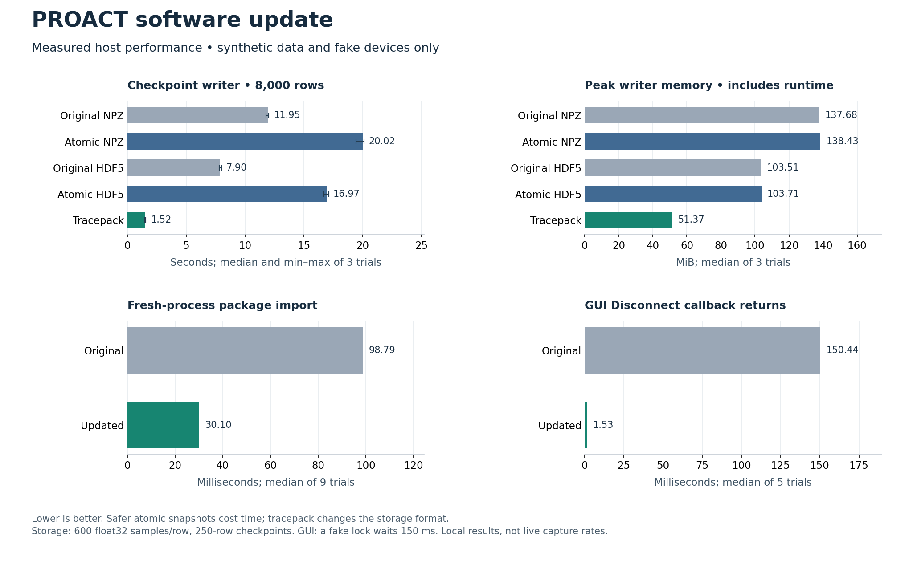

# Host software release — 10 September 2026

The 1.1.0.dev1 GUI, CLI, Python library and documentation update has been integrated into the full local PROACT checkout and prepared independently on the public repository history. No board, serial port, USB instrument or capture process was accessed during the 10 September integration work.

## What changed and why

- **GUI:** a single foreground job state, batched bounded logs, responsive disconnect/close and explicit failure status. Seven pages fit common desktop windows. The capture form has an offline setup-review dialog and clearer descriptions of settings and saved data.
- **CLI:** invalid arguments and firmware files fail before opening hardware; interruptions and incomplete work have meaningful exit status; UART/programmer handles are closed on error. Empty SwRV data images remain valid while empty instruction images and malformed files are rejected.
- **Storage library:** inputs are owned instead of borrowed; variable payload lengths and format metadata are preserved; legacy snapshots are published atomically; optional tracepack chunks bound waveform buffering. See [format limitations](../docs/STORAGE.md).
- **Libraries and setup:** clearer parsing errors, exact AEAD tag-length checks, lazy imports and dedicated environments. Setup preserves existing environments and does not implicitly modify the shared bench installation.
- **Documentation:** installation, architecture, migration, illustrated workflows, generated CLI help and maintenance instructions match the host release. Required firmware, bitstreams and captured datasets are explicitly separate artifacts.

## Verification of this integration

This table records the 10 September integration snapshot. The current checkout
results after later terminal and dependency fixes are in the 11 September
[offline re-verification addendum](#offline-re-verification-addendum--11-september-2026)
below.

| Check | Result |
|---|---|
| Full local design checkout, offline host suite | 1,537 passed; 1 skipped |
| Public host-only checkout, offline host suite | 1,495 passed; 43 skipped |
| Public-only skip difference | 41 firmware/header cross-checks and 1 generated-VMEM fixture are absent; all host checks remain enabled |
| Common skip | HDF5 is installed, so the test specific to its absence is skipped; explicit fallback regressions also use mocks |
| Qt layout | Seven pages at five sizes: 35 page/size checks passed, plus sidebar/tab-bar checks |
| GUI illustrations | Re-rendered with fake/disconnected handles and a generic example path; no connected-device claim |
| CLI help and diagnostics | 25-command reference regenerated without dispatch; doctor located the checked-out public source without enumerating devices |
| Offline acquisition UI and installer | 73 passed; responsive 80-column display, read-only checks and no-driver guards |
| Targeted compatibility review | Empty-DMEM and parser/cleanup regression set: 181 passed |
| Public portability review | 157 register checks in the full tree; 116 passed and 41 explicit skips in a host-only fixture; 9 benchmark admission checks passed |

Both complete host suites used warnings as errors, Python 3.10.12, NumPy 1.26.4, HDF5 bindings 3.16.0 and PyQt6 6.11.0. The existing development interpreter was used read-only while each checkout supplied its own source through PYTHONPATH. No packages were installed into the bench environment. The initial full-suite attempt had a missing parent directory for the test scratch area; it did not constitute an implementation failure. The corrected run above passed.

The offline UI suite used an existing interpreter read-only with Click 8.1.7, Rich 15.0.0 and Questionary 2.1.1. Its two real-symlink checks ran on a symlink-capable temporary filesystem; those checks explicitly skip when the chosen scratch volume cannot create symlinks. No UI dependencies were installed into the bench environment.

The GitHub workflow additionally targets Python 3.9 and 3.12. Local execution here does not establish a completed remote CI run on those versions.

## Live ASIC board addendum — 11 September 2026

The connected ASIC bench was checked after the offline integration. At a requested
50 MHz target clock, ADC x4 (reported 200 MS/s), TIO4 rising-edge trigger and
25.09 dB gain, bounded captures returned exact public reference outputs with clean
saved ADC/FIFO/status evidence. Device serial numbers are intentionally omitted.

| Target | Preparation + retained rows | Retained samples | Trigger count |
|---|---:|---:|---:|
| AES1 | 26 + 20 | 596 | 477 |
| AES2 | 26 + 20 | 616 | 493 |
| Xoodyak | 6 + 10 | 276 | 221 |
| Ascon | 6 + 10 | 386 | 309 |
| Sw-RV software AES | 6 + 10 | 946 | 757 |
| Sw-RV masked software AES | 6 + 10 | 946 | 757 |

The controller functional sweep passed 14 steps with zero failures; its built-in capture step was intentionally skipped because the six strict captures were run separately. It covered UART framing, AES1/AES2 encrypt and decrypt, Ascon/Xoodyak hardware KATs and software tag rejection, timer/control/RNG commands, and Sw-RV software AES. Independent offline validation passed both 20-row AES artifacts and 1,005 checks over the four other artifacts with zero failures.

The check found and fixed two shared MCP2210 host defects. The old feedback labels read SPI select GPIO3 as controller reset, controller GPIO6 as global reset, and X1 debug GPIO7 as SPI select. CAD and live readback establish the correct GPIO0/3/6/8 map. The installed `mcp2210-python` 1.0.4 SDK also initializes its cached output bitmask to zero; immediate per-pin setup could therefore assert all resets during a status-only open. Setup now batches changes, seeds output values from the live levels, defines GPIO7 as input, performs one explicit setup flush, and clears the SDK's stale output-dirty flag so later status polls issue no SET commands. A live continuity test enabled UART frame mode once, opened the corrected shared programmer, observed controller/global active and SPI/select held, then received the same exact `A5 F2 04 00 00 00 00` status frame without re-enabling frame mode. This proves that the corrected open did not restart the controller on the tested standard board and SDK.

After these fixes, 1,536 of 1,541 offline tests passed and five HDF5 tests skipped
because `h5py` was absent from that bench environment; the focused GPIO/programmer
set passed 166/166. Detailed bench artifacts remain outside this public repository.

These short runs validate current function, trigger stability and saved capture integrity. They do not measure CPA or TVLA convergence, establish minimum attack traces, calibrate clock accuracy, authenticate Sw-RV memory contents by readback, prove masked-implementation security, validate an external oscilloscope, or explain the previously observed multi-million-trace ASIC CPA result.

## Offline re-verification addendum — 11 September 2026

After the terminal refresh and dependency hardening, the full host suite passed
1,555 tests with one mutually exclusive no-HDF5 test skipped and no failures. The
then-current Acquisition suite passed 188 tests; a 21-case PTY matrix plus strict
ASCII mode passed 229 assertions. An isolated firmware/RTL gate rebuilt both firmware
targets, passed 34 register-map checks, reproduced the AES KAT at 13 cycles and passed
the host protocol/FIPS AES check. All seven GUI pages fit five standard window sizes.
No hardware was accessed for this addendum.

The complete run used a dedicated environment satisfying every declared core version.
Current host and Acquisition manifests require `hidapi>=0.14`. Create a dedicated
environment with `bash tools/setup_env.sh --venv /path/to/new-proact-env --with all
--with dev`, then select it with `PROACT_VENV=/path/to/new-proact-env`.

## Historical development timings

The following figure and its input JSON preserve earlier synthetic/fake-resource measurements. They were **not rerun as release performance measurements**. The development baseline is separately retained and is not part of the public repository history. Later correctness fixes mean these figures must not be described as exact current-release speedups.

The saved [startup](startup_benchmark.json), [storage](storage_benchmark.json) and [GUI](gui_responsiveness.json) measurements retain conditions and individual trials; machine paths have been removed. Basic import, GUI callback latency and checkpoint writing measure different operations. Atomic legacy snapshots can be slower. The GUI experiment uses a fake lock held for 150 ms; it does not measure device disconnect latency. Benchmark runners now require an explicit locally available `--baseline COMMIT` instead of silently selecting an unrelated root commit.

## Acquisition folder scope

The [Acquisition folder](../Acquisition/README.md) now contains the complete source-only
capture framework for Husky and an allowlisted Keysight/Tektronix backend, plus native
resumable storage, HDF5/CSV export, warm-up, balanced TVLA, automatic target-specific
CPA, and paired raw/aligned scope analysis. The wizard starts with frequency (50 MHz
default), derives the compatible UART rate, exposes trigger and record-window controls,
and reports progress, ETA, retries and checkpoints.

Built firmware, capture datasets, local runtime copies and device provenance are not
published. They must be supplied separately for live use. The acquisition protocol has
prior bounded ASIC/Husky evidence, while this exact source-only public composition is
verified offline. The Keysight/Tektronix implementation is covered by strict protocol
simulation only; physical oscilloscope acceptance remains outstanding. None of these
software checks demonstrates lower ASIC CPA trace requirements.

## Public source verification — 14 September 2026

The final public checkout passed **1,513 host tests** with **43 explicit skips** for
firmware/design fixtures excluded from the public repository. The source-only
Acquisition suite passed **257 tests** with warnings treated as errors, including the
strict Keysight/Tektronix simulators, storage/export integrity, raw-versus-aligned
analysis, clean-clone path resolution and all six packaged analysis models. The
flag-mode matrix passed **235/235 cases** (189 accepted configurations and 46 required
rejections). POSIX shell syntax passed, and the read-only installer check accepted a
composed environment satisfying every declared dependency, including `hidapi>=0.14`.

These checks used fake devices, protocol simulators and temporary files. They did not
open UART, HID, Husky, VISA, a board or an oscilloscope.

## Evidence limits

This release establishes offline behavior of the integrated public source and preserves
the bounded historical ASIC/Husky evidence above. It does not prove lower measurement
noise, reduced ASIC recovery trace counts, a PCB improvement, physical scope
compatibility, or new CPA/TVLA/ML results. Existing captures and research evidence were
not modified or reprocessed. Full private design history, firmware images and datasets
were not transferred into the public release.
